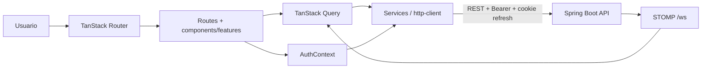

# LISource · Reto 3 · Frontend

[](https://react.dev/) [](https://www.typescriptlang.org/) [](.github/workflows/frontend-ci.yml) [](https://lisource-1021805193.vercel.app)

Interfaz web responsive de LISource para consultar equipos del LIS, reservarlos sin solapamiento y administrar inventario según rol. Consume únicamente la API Spring Boot; el navegador nunca recibe credenciales ni conecta directamente a PostgreSQL/Supabase.

**Producción:** [Frontend](https://lisource-1021805193.vercel.app) · [API](https://technical-test-2026-2-v96h.onrender.com) · [Swagger](https://technical-test-2026-2-v96h.onrender.com/swagger-ui/index.html) · [Health](https://technical-test-2026-2-v96h.onrender.com/actuator/health)

## Índice

- [Cumplimiento](#cumplimiento)
- [Capturas responsive](#capturas-responsive)
- [Arquitectura](#arquitectura)
- [Tecnologías](#tecnologías)
- [Inicio rápido](#inicio-rápido)
- [Responsive y accesibilidad](#responsive-y-accesibilidad)
- [API, autenticación y reservas](#api-autenticación-y-reservas)
- [Testing y DevSecOps](#testing-y-devsecops)
- [Documentación](#documentación)

## Cumplimiento

| Requerimiento | Estado comprobado | Diseño e implementación | Prueba / evidencia |
|---|---|---|---|
| Autenticación y acceso institucional | Cumple | login local/Google, recuperación, guards y sesión en `features/auth` | tests de seguridad/login + [flujo](lisource-frontend/docs/05-autenticacion.md) |
| Consultar equipos, paginar y filtrar | Cumple | `equipment-list`, filtros, servicios y TanStack Query | vista 320–1440 + [API/estado](lisource-frontend/docs/04-api-y-estado-remoto.md) |
| Ver detalle de equipo | Cumple | ruta `/equipos/$equipmentId`, estado/ubicación/imagen | auditoría real de ruta + captura responsive |
| Crear, ver y cancelar reservas | Cumple | diálogo validado, listado por estado, cancelación | [reserva y 409](lisource-frontend/docs/06-reservas.md) |
| Manejar conflicto sin perder contexto | Cumple | Problem Details → `ApiError`; `409` muestra mensaje accionable | test de error + flujo documentado |
| Administración por rol | Parcial explícito | CRUD/estado/imagen de **equipos** en `/administracion/equipos`; otras pantallas Admin no existen en esta rama | captura móvil + verificación de rutas reales |
| Responsive y accesibilidad | Cumple | cards bajo `xl`, tabla controlada desde `xl`, dialogs/sheet seguros, targets táctiles | 110 combinaciones ruta/viewport + [evidencia](lisource-frontend/docs/03-responsive-y-accesibilidad.md) |
| Bonus: i18n | Supera ES/EN | ES, EN, FR, PT, DE e IT, claves verificadas | `languages.test`/`i18n-keys.test` |
| Bonus: estadísticas y tiempo real | Cumple con alcance real | Top 5 visible; STOMP invalida queries. La vista activa dibuja barras CSS, aunque existe infraestructura Recharts | [arquitectura](lisource-frontend/docs/02-arquitectura-frontend.md) |

## Capturas responsive

| 320 px | 768 px | 1440 px |
|---|---|---|
|  |  |  |

Más evidencia: [login, reservas, menú, dropdowns y diálogos](lisource-frontend/docs/14-evidencias.md).

## Arquitectura



Es una aplicación React 19/TypeScript organizada por rutas, features, componentes compartidos, services, i18n y tipos. `VITE_DATA_MODE=api` usa backend real; `mock` permite explorar sin mutar la arquitectura. [Diagramas completos](lisource-frontend/docs/02-arquitectura-frontend.md).

## Tecnologías

React 19, TypeScript, TanStack Start/Router/Query, Tailwind CSS 4, Radix UI, React Hook Form + Zod, i18next, STOMP, Recharts disponible, Vitest, Testing Library, ESLint, Prettier, Docker, CodeQL, Trivy, GitHub Actions, Vercel y AWS OIDC.

## Inicio rápido

Requiere Git y Node.js 22; Docker es opcional.

```powershell
git clone <URL> lisource
cd lisource
git switch 1021805193-reto3
cd lisource-frontend
Copy-Item .env.example .env
npm ci
npm run dev
```

Abra `http://localhost:3000`. Variables públicas de build:

```dotenv
VITE_API_URL=http://localhost:8080/api/v1
VITE_DATA_MODE=api
VITE_GOOGLE_CLIENT_ID=
```

Los valores de evaluación se distribuyen fuera del repositorio en `frontend.txt`; deben copiarse manualmente a `.env`, nunca a Git. `VITE_*` es visible en el bundle: no coloque secretos. Guías: [Windows](lisource-frontend/docs/08-instalacion-windows.md) · [Linux](lisource-frontend/docs/09-instalacion-linux.md).

Para ejecutar el sistema completo, prepare/inicie primero backend y DB en la rama `1021805193-reto2`, luego este frontend. Puede usar branches tradicionales o `git worktree` para mantener ambas ramas en directorios simultáneos.

## Responsive y accesibilidad

Se probaron las 10 rutas reales en 11 anchos: 320, 360, 375, 390, 414, 480, 640, 768, 1024, 1280 y 1440 px. Además se abrieron navegación móvil, selectores, diálogos y administración. No quedaron desbordamientos horizontales en el barrido final. Las tablas cambian a cards antes de comprometer acciones; overlays respetan `dvh`; textos/controles pueden encogerse y los targets primarios son táctiles. [Metodología y límites](lisource-frontend/docs/03-responsive-y-accesibilidad.md).

## API, autenticación y reservas

`http-client` adjunta el access token guardado solo en memoria y reintenta una vez tras refresh por cookie HttpOnly. TanStack Query maneja cache/invalidation. Un `409` al reservar se conserva como conflicto de dominio: el diálogo informa y permite ajustar horario/equipo; no se presenta como error técnico genérico. El frontend oculta acciones por rol para UX, pero el backend vuelve a autorizarlas.

## Testing y DevSecOps

```powershell
npm ci
npm test
npm run lint
npm run build
```

El workflow independiente de Reto 3 ejecuta quality gate con Node 22, CodeQL, build Docker, Trivy, deploy Vercel, smoke de frontend/backend y asunción AWS temporal por OIDC. Los path filters limitan ejecuciones a cambios del frontend/workflow. [Detalle](lisource-frontend/docs/11-devsecops.md).

## Documentación

- [Requerimientos](lisource-frontend/docs/01-requerimientos.md) · [Arquitectura](lisource-frontend/docs/02-arquitectura-frontend.md)
- [Responsive](lisource-frontend/docs/03-responsive-y-accesibilidad.md) · [API/Query](lisource-frontend/docs/04-api-y-estado-remoto.md)
- [Autenticación](lisource-frontend/docs/05-autenticacion.md) · [Reservas](lisource-frontend/docs/06-reservas.md) · [i18n](lisource-frontend/docs/07-internacionalizacion.md)
- [Windows](lisource-frontend/docs/08-instalacion-windows.md) · [Linux](lisource-frontend/docs/09-instalacion-linux.md)
- [Testing](lisource-frontend/docs/10-testing.md) · [DevSecOps](lisource-frontend/docs/11-devsecops.md) · [Deployment](lisource-frontend/docs/12-deployment.md)
- [Troubleshooting](lisource-frontend/docs/13-troubleshooting.md) · [Evidencias](lisource-frontend/docs/14-evidencias.md) · [Checklist](lisource-frontend/docs/EVIDENCE_CHECKLIST.md)
