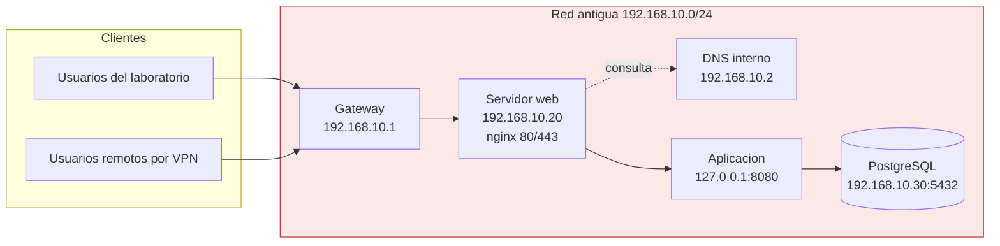
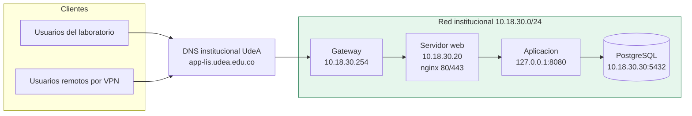
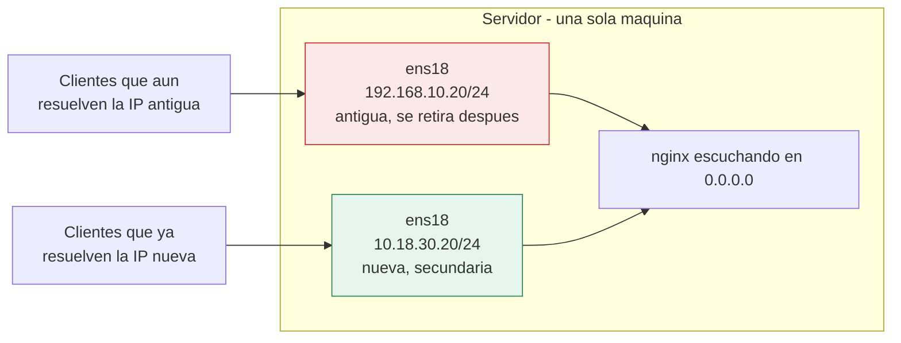
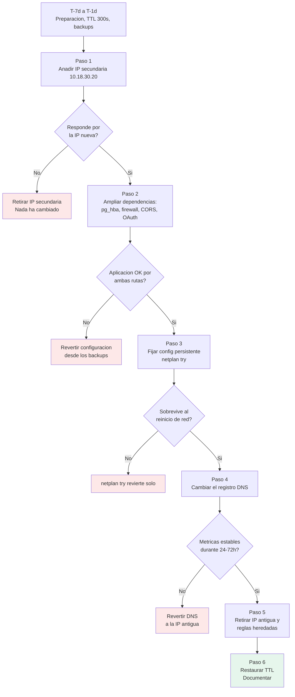

# Reto 4 — Migración de servicios entre redes del LIS

**Propuesta técnica para migrar una aplicación web del direccionamiento `192.168.x.x` al esquema institucional `10.18.30.x`**

Prueba Técnica 2026-2 · Laboratorio Integrado de Sistemas · Facultad de Ingeniería · Universidad de Antioquia

---

## Aviso sobre las salidas de comandos

Este informe se redactó **sin conexión activa a la VPN del laboratorio**. En consecuencia:

- Todos los **comandos** son reales y ejecutables tal cual.
- Todas las **salidas** que aparecen en los bloques de código están marcadas con `# SALIDA ILUSTRATIVA` y sirven para explicar *qué hay que mirar* en cada una. **No son capturas de la infraestructura real del LIS.**
- Los valores de direccionamiento (`192.168.10.0/24`, `10.18.30.20`, …) son **supuestos de trabajo** coherentes con los datos que sí aparecen en el enunciado de la prueba, y están recogidos en la sección [Supuestos](#supuestos-de-trabajo) para que se confirmen o corrijan antes de ejecutar nada.

Los scripts de [`scripts/`](scripts/) sí producen salidas reales cuando se ejecutan en la máquina a migrar.

---

## Índice

1. [Contexto y alcance](#1-contexto-y-alcance)
2. [Supuestos de trabajo](#supuestos-de-trabajo)
3. [Diagnóstico del entorno actual](#2-diagnóstico-del-entorno-actual)
4. [Propuesta de migración](#3-propuesta-de-migración)
5. [Plan de ejecución y reversión](#4-plan-de-ejecución-y-reversión)
6. [Validación posterior](#5-validación-posterior)
7. [Riesgos y puntos críticos](#6-riesgos-y-puntos-críticos)
8. [Referencias](#7-referencias)
9. [Anexos: scripts](#anexos)

---

## 1. Contexto y alcance

El LIS viene trasladando servicios que operaban sobre direccionamiento privado propio (`192.168.x.x`) al direccionamiento institucional de la Universidad de Antioquia, que incluye el rango `10.18.30.x`.

El caso que se aborda es una **aplicación web del laboratorio** desplegada sobre un servidor Linux, publicada tras un *reverse proxy*, con base de datos propia y algunos componentes en contenedores Docker. Es el perfil más común en el laboratorio y el que concentra todas las dependencias interesantes.

**Lo que este documento sostiene como tesis principal:** cambiar la IP es la parte fácil y la que menos falla. Lo que rompe una migración de este tipo son las **referencias a la dirección antigua que viven fuera de la configuración de red**: cadenas de conexión, orígenes permitidos por CORS, `redirect_uri` registrados en proveedores externos, reglas `allow/deny` del proxy, `pg_hba.conf`, entradas DNS cacheadas y direcciones escritas a mano en el código. Por eso el peso del informe está en el inventario previo y en la validación, no en el comando que asigna la IP.

### Alcance

| Dentro del alcance | Fuera del alcance |
|---|---|
| Direccionamiento, rutas, DNS y MTU del servidor | Rediseño de la topología física del laboratorio |
| Publicación del servicio (proxy inverso, certificados) | Migración de la red de puestos de trabajo |
| Dependencias de la aplicación (BD, variables, contenedores) | Cambio de proveedor cloud de la base de datos |
| Reglas de acceso (firewall, ACL, NAT) | Segmentación con VLAN nuevas |
| Plan de reversión y validación | Automatización con Ansible/Terraform (se menciona como mejora) |

---

## Supuestos de trabajo

Estos valores **deben confirmarse con el equipo de redes de la Universidad antes de ejecutar nada**. Se explicitan aquí para que el plan sea reproducible y para no esconder decisiones detrás de ejemplos.

| Elemento | Estado actual (supuesto) | Estado objetivo (supuesto) | Cómo confirmarlo |
|---|---|---|---|
| Subred | `192.168.10.0/24` | `10.18.30.0/24` | Solicitud formal a redes |
| Gateway | `192.168.10.1` | `10.18.30.254` | Ver nota abajo |
| IP del servidor web | `192.168.10.20` | `10.18.30.20` | Asignación de redes |
| IP de la base de datos | `192.168.10.30` | `10.18.30.30` | Asignación de redes |
| DNS | `192.168.10.2` (interno del lab) | Servidores institucionales UdeA | `resolvectl status` tras el cambio |
| Nombre público | `app.lis.local` | `app-lis.udea.edu.co` | Alta en el DNS institucional |
| Interfaz de red | `ens18` | la misma | `ip -br link` |

> **Sobre el gateway `10.18.30.254`:** el propio enunciado de la prueba, en el Reto 1, pide hacer `ping` desde la máquina del laboratorio a `10.18.30.254`. Esa dirección, siendo la última utilizable de un `/24`, es una candidata muy razonable a ser el gateway del segmento. **Es una inferencia, no un dato confirmado**, y figura aquí como supuesto precisamente para que se valide antes de configurarlo.

> **Sobre la máscara:** se asume `/24` (254 direcciones utilizables). Si redes entrega un prefijo distinto (`/23`, `/22`…), cambia la máscara y la dirección de broadcast, pero **no** el resto del plan. Una máscara mal puesta es de los fallos más frecuentes y más difíciles de diagnosticar, porque el servidor sigue respondiendo dentro de su segmento y solo falla contra ciertos destinos.

---

## 2. Diagnóstico del entorno actual

El objetivo de esta fase es responder a una pregunta: **¿dónde aparece la red antigua?** No solo en la configuración de red, sino en cualquier punto del sistema.

Se recomienda ejecutar [`scripts/inventario-pre-migracion.sh`](scripts/inventario-pre-migracion.sh), que automatiza todo lo que sigue y deja un informe fechado. Lo que viene a continuación explica **qué hay que mirar en cada salida y por qué**.

### 2.1 Capa de red del servidor

```bash
ip -br addr                 # resumen de interfaces y direcciones
ip addr show ens18          # detalle: IP, máscara, broadcast, scope
ip route                    # tabla de rutas y ruta por defecto
ip -br link                 # estado y MAC de cada interfaz
resolvectl status           # servidores DNS efectivos y dominios de búsqueda
cat /etc/resolv.conf        # ojo: puede ser un enlace gestionado por systemd-resolved
ip neigh                    # tabla ARP: quién está hablando con este host
```

```text
# SALIDA ILUSTRATIVA de `ip addr show ens18`
2: ens18: <BROADCAST,MULTICAST,UP,LOWER_UP> mtu 1500 qdisc fq_codel state UP
    link/ether 3a:1c:4f:22:9b:07 brd ff:ff:ff:ff:ff:ff
    inet 192.168.10.20/24 brd 192.168.10.255 scope global ens18
       valid_lft forever preferred_lft forever
```

**Qué anotar:**

| Dato | Por qué importa |
|---|---|
| Prefijo (`/24`) | Determina qué destinos se consideran locales. Si queda mal, el tráfico a algunos destinos no sale al gateway |
| MTU | Si la red institucional usa MTU distinta (túneles, VPN), aparecerán fallos intermitentes solo con paquetes grandes |
| MAC | Necesaria si hay reservas DHCP o control de acceso por MAC |
| `scope global` vs `secondary` | Relevante en la estrategia de doble dirección de la sección 3 |

**Dónde vive la configuración persistente** (no basta con `ip addr`, que se pierde al reiniciar):

```bash
ls -la /etc/netplan/                    # Ubuntu moderno
nmcli connection show                   # NetworkManager (RHEL, Fedora, Ubuntu Desktop)
cat /etc/network/interfaces             # Debian clásico
ls -la /etc/sysconfig/network-scripts/  # RHEL/CentOS antiguo
```

### 2.2 Servicios y puertos

```bash
ss -tulpn                               # puertos en escucha, con proceso
ss -tn state established                # conexiones activas: revela dependencias reales
systemctl list-units --type=service --state=running
docker ps -a
docker network ls
docker inspect $(docker ps -q) | grep -i -E 'IPAddress|Gateway|Subnet'
```

```text
# SALIDA ILUSTRATIVA de `ss -tulpn`
Netid State  Local Address:Port   Process
tcp   LISTEN 0.0.0.0:22           sshd
tcp   LISTEN 0.0.0.0:80           nginx
tcp   LISTEN 0.0.0.0:443          nginx
tcp   LISTEN 127.0.0.1:8080       java        <-- app detrás del proxy
tcp   LISTEN 192.168.10.20:5432   postgres    <-- ATENCIÓN: atado a la IP antigua
```

**El hallazgo crítico de este bloque** es el último: un servicio con `bind` a la IP antigua concreta (en lugar de `0.0.0.0` o `::`) **dejará de escuchar en cuanto esa IP desaparezca**. Es una de las causas más frecuentes de "migré la IP y el servicio no arranca". Buscar en `postgresql.conf` (`listen_addresses`), `redis.conf` (`bind`), y en los `ExecStart` de las unidades systemd.

`ss -tn state established` merece atención aparte: muestra **con quién habla realmente el servidor ahora mismo**. Es la forma más fiable de descubrir dependencias que nadie documentó.

### 2.3 Rastreo de la red antigua en configuración y código

Esta es la parte que más fallos evita y la que suele omitirse:

```bash
# En configuración del sistema y de servicios
sudo grep -rIn --exclude-dir={proc,sys} '192\.168\.' /etc /opt /srv /usr/local/etc 2>/dev/null

# En el código y los despliegues de la aplicación
grep -rIn '192\.168\.' /ruta/al/proyecto \
     --exclude-dir={.git,node_modules,target,dist,build,vendor}

# En variables de entorno y ficheros de despliegue
grep -rIn '192\.168\.' /ruta/al/proyecto --include='*.env*' --include='*.yml' \
     --include='*.yaml' --include='*.properties' --include='*.json' --include='Dockerfile*'

# En unidades systemd y tareas programadas
sudo grep -rIn '192\.168\.' /etc/systemd/ /etc/cron* /var/spool/cron/ 2>/dev/null
```

Checklist de sitios donde casi siempre aparece una IP antigua:

| Componente | Fichero / lugar típico | Qué buscar |
|---|---|---|
| Proxy inverso | `/etc/nginx/sites-enabled/*` | `proxy_pass`, `upstream`, `allow`/`deny`, `set_real_ip_from` |
| PostgreSQL | `pg_hba.conf`, `postgresql.conf` | reglas `host … 192.168.10.0/24`, `listen_addresses` |
| Aplicación | `.env`, `application.properties` | cadenas de conexión, `CORS`, orígenes permitidos, URLs de servicios internos |
| Docker | `docker-compose.yml`, `docker network` | `subnet:`, `extra_hosts:`, IP fijas de contenedores |
| Firewall | `ufw status`, `iptables -S`, `nft list ruleset` | reglas que permiten `192.168.10.0/24` |
| NFS / Samba | `/etc/exports`, `smb.conf` | listas de clientes autorizados |
| Resolución local | `/etc/hosts` | entradas manuales que puentean el DNS |
| Copias de seguridad | scripts de `cron`, `rsync` | destino remoto por IP |
| Monitorización | Prometheus, Zabbix, Nagios | *targets* apuntando a la IP antigua |
| SSH | `~/.ssh/config`, `known_hosts` | *hosts* definidos por IP |

### 2.4 Perímetro y clientes

```bash
dig app.lis.local +short                # resolución directa
dig app.lis.local                       # ver TTL: condiciona la ventana de propagación
dig -x 192.168.10.20 +short             # resolución inversa (PTR)
sudo ufw status verbose                 # o: sudo nft list ruleset
sudo iptables -t nat -S                 # NAT y redirecciones de puerto
```

Del certificado TLS hay que conocer sus nombres alternativos antes de tocar nada:

```bash
echo | openssl s_client -connect app.lis.local:443 -servername app.lis.local 2>/dev/null \
  | openssl x509 -noout -subject -dates -ext subjectAltName
```

```text
# SALIDA ILUSTRATIVA
subject=CN = app.lis.local
notBefore=Feb 14 00:00:00 2026 GMT
notAfter=May 15 23:59:59 2026 GMT
X509v3 Subject Alternative Name:
    DNS:app.lis.local
```

Si el certificado solo cubre el nombre antiguo, o si los clientes acceden **por IP**, hay trabajo pendiente: los certificados de una CA pública **no pueden emitirse para direcciones IP privadas ni para nombres no delegables** (ver [Referencias](#7-referencias)). La conclusión práctica es que el acceso debe hacerse **por nombre de dominio**, no por IP, y ese nombre debe existir en el DNS institucional antes del cambio.

### 2.5 Producto de esta fase

Una tabla de inventario que se usará como lista de verificación en la fase de ejecución:

| # | Elemento | Valor actual | Valor objetivo | Responsable | Verificado |
|---|---|---|---|---|---|
| 1 | IP servidor | `192.168.10.20/24` | `10.18.30.20/24` | Redes / LIS | ☐ |
| 2 | Gateway | `192.168.10.1` | `10.18.30.254` | Redes | ☐ |
| 3 | DNS | `192.168.10.2` | institucional | Redes | ☐ |
| 4 | Registro DNS del servicio | `app.lis.local` → `.20` | `app-lis.udea.edu.co` → `10.18.30.20` | Redes | ☐ |
| 5 | `listen_addresses` de PostgreSQL | `192.168.10.20` | `0.0.0.0` o `10.18.30.30` | LIS | ☐ |
| 6 | `pg_hba.conf` | `192.168.10.0/24` | añadir `10.18.30.0/24` | LIS | ☐ |
| 7 | `proxy_pass` de nginx | IP antigua | nombre o nueva IP | LIS | ☐ |
| 8 | Orígenes CORS de la API | IP/nombre antiguos | nuevo nombre | LIS | ☐ |
| 9 | `redirect_uri` del proveedor OAuth | URL antigua | nueva URL | LIS | ☐ |
| 10 | Certificado TLS | SAN antiguo | SAN nuevo | LIS | ☐ |
| 11 | Reglas de firewall | permiten `192.168.10.0/24` | permitir `10.18.30.0/24` | Redes / LIS | ☐ |
| 12 | Destinos de copias de seguridad | IP antigua | nueva | LIS | ☐ |

---

## 3. Propuesta de migración

### 3.1 Diagrama: estado actual



### 3.2 Diagrama: estado objetivo



### 3.3 Diagrama: ventana de transición (doble direccionamiento)

Durante la migración el servidor responde **simultáneamente** en ambas direcciones. Es la pieza central de la propuesta:



### 3.4 Estrategia: doble direccionamiento transitorio

**Recomendación principal:** no hacer un corte seco. En lugar de sustituir la IP, se **añade** la nueva como dirección secundaria sobre la misma interfaz, y solo después de validar y de que el DNS haya propagado se retira la antigua.

```bash
# Añadir la nueva dirección SIN eliminar la actual (efecto inmediato, no persistente)
sudo ip addr add 10.18.30.20/24 dev ens18

# Comprobar que ambas conviven
ip -br addr show ens18
```

Por qué esta estrategia y no un cambio directo:

| Ventaja | Explicación |
|---|---|
| **Sin interrupción** | Los clientes que todavía resuelven la dirección antigua siguen funcionando mientras propaga el DNS |
| **Reversión instantánea** | Volver atrás es revertir un registro DNS, no reconfigurar el servidor |
| **Validación real** | Se prueba el servicio por la nueva ruta con tráfico real antes de comprometerse |
| **No se pierde el acceso** | Si la nueva configuración estuviera mal, la sesión SSH por la IP antigua sigue viva. Un cambio directo mal hecho **deja la máquina inaccesible** |
| **Retirada controlada** | La dirección antigua se elimina cuando los registros de acceso demuestran que ya nadie la usa |

> **Precaución si solo se dispone de acceso remoto:** cualquier cambio que reinicie la red puede dejar la máquina incomunicada. Antes de aplicar la configuración persistente hay que asegurar una vía de rescate: consola física, KVM/IPMI, consola del hipervisor, o la red de respaldo de acceso. Como medida adicional, programar una reversión automática antes de aplicar el cambio:
>
> ```bash
> # Si en 10 minutos no se cancela, restaura la configuración anterior
> sudo bash -c 'echo "netplan apply /etc/netplan/backup.yaml" | at now + 10 minutes'
> ```
>
> Netplan ofrece esto de serie con `netplan try`, que revierte solo si no se confirma.

### 3.5 Configuración persistente

Una vez validada la dirección temporal, se fija en la configuración. Ejemplo con **Netplan** (Ubuntu):

```yaml
# /etc/netplan/01-lis-app.yaml
network:
  version: 2
  renderer: networkd
  ethernets:
    ens18:
      addresses:
        - 10.18.30.20/24
        # Se conserva durante la ventana de transición y se elimina al cerrarla:
        - 192.168.10.20/24
      routes:
        - to: default
          via: 10.18.30.254
      nameservers:
        addresses: [DNS_INSTITUCIONAL_1, DNS_INSTITUCIONAL_2]
        search: [udea.edu.co]
```

```bash
sudo netplan generate          # valida la sintaxis sin aplicar
sudo netplan try               # aplica y revierte solo si no se confirma en 120 s
sudo netplan apply             # aplica de forma definitiva
```

Equivalente con **NetworkManager**:

```bash
sudo nmcli connection modify ens18 \
  ipv4.addresses "10.18.30.20/24,192.168.10.20/24" \
  ipv4.gateway "10.18.30.254" \
  ipv4.dns "DNS_INSTITUCIONAL_1 DNS_INSTITUCIONAL_2" \
  ipv4.method manual
sudo nmcli connection up ens18
```

> **Solo una ruta por defecto.** Un error habitual al mantener dos direcciones es dejar también dos *gateways*: el tráfico saliente se reparte de forma impredecible y aparecen fallos intermitentes muy difíciles de diagnosticar. La ruta por defecto debe apuntar **únicamente** al gateway nuevo; la red antigua seguirá siendo alcanzable por su ruta directa de enlace.

### 3.6 Dependencias de la aplicación

Aquí es donde se juega la migración. Ordenadas por probabilidad de causar una caída:

#### a) Base de datos

```conf
# postgresql.conf — que no quede atado a una IP que va a desaparecer
listen_addresses = '*'          # o la lista explícita incluyendo la nueva
```

```conf
# pg_hba.conf — AÑADIR la nueva red antes de quitar la antigua
host    lisdb    lisuser    10.18.30.0/24     scram-sha-256
host    lisdb    lisuser    192.168.10.0/24   scram-sha-256   # retirar al cerrar la ventana
```

```bash
sudo systemctl reload postgresql    # reload basta para pg_hba.conf; listen_addresses exige restart
```

#### b) Proxy inverso

```nginx
server {
    server_name app-lis.udea.edu.co;

    # Preferir el nombre a la IP: sobrevive a futuras migraciones
    location / {
        proxy_pass http://127.0.0.1:8080;
        proxy_set_header Host              $host;
        proxy_set_header X-Real-IP         $remote_addr;
        proxy_set_header X-Forwarded-For   $proxy_add_x_forwarded_for;
        proxy_set_header X-Forwarded-Proto $scheme;
    }
}
```

Si existían restricciones por red, hay que ampliarlas **antes** del corte:

```nginx
allow 10.18.30.0/24;
allow 192.168.10.0/24;   # retirar al cerrar la ventana
deny  all;
```

Y si el proxy recibe tráfico de otro balanceador, `set_real_ip_from` debe incluir el nuevo rango o los registros mostrarán la IP del intermediario en lugar de la del cliente.

#### c) Aplicación: variables, CORS y OAuth

| Elemento | Acción | Consecuencia de omitirlo |
|---|---|---|
| Cadena de conexión a BD | Apuntar al nuevo nombre o IP | La aplicación arranca pero no responde |
| **Orígenes permitidos (CORS)** | Añadir el nuevo origen | El navegador bloquea las llamadas: la interfaz se ve pero está vacía y el error solo aparece en la consola |
| **`redirect_uri` de OAuth** | Registrarla en el proveedor **antes** del corte | El inicio de sesión falla con `redirect_uri_mismatch` |
| URLs de servicios internos | Actualizar | Fallos parciales, difíciles de atribuir |
| Webhooks entrantes | Reconfigurar en el emisor | Pérdida silenciosa de eventos |

El CORS y el `redirect_uri` merecen énfasis porque **fallan de forma silenciosa o confusa**: el servidor responde correctamente y aun así la aplicación no funciona. Son las dos causas que más tiempo consumen si no se previeron.

Regla general: si el proveedor de identidad lo permite, **registrar la URL nueva sin borrar la antigua** durante la ventana de transición.

#### d) Contenedores

```bash
docker network inspect <red> | grep -i subnet
```

Dos comprobaciones:

1. **Redes Docker definidas en `192.168.x.x`** en `docker-compose.yml`: no dejan de funcionar por sí solas, pero conviene alinearlas para no arrastrar confusión.
2. **Colisión de rangos.** Si la institución usa `10.0.0.0/8` de forma amplia y Docker tiene configurados *pools* dentro de ese espacio, una red de contenedores puede **solapar con rutas institucionales** y hacer inalcanzables destinos legítimos desde dentro de los contenedores. Se acota fijando los rangos:

```json
// /etc/docker/daemon.json
{
  "default-address-pools": [
    { "base": "172.20.0.0/16", "size": 24 }
  ]
}
```

Este punto es fácil de pasar por alto y produce un síntoma desconcertante: el servidor tiene conectividad, pero un contenedor concreto no alcanza un servicio institucional.

#### e) NAT y publicación del servicio

El enunciado menciona NAT expresamente, y es de los puntos que más fácilmente se olvidan porque la regla no vive en el servidor, sino en el router o el cortafuegos perimetral.

**Lo primero es preguntarse si el NAT sigue haciendo falta.** Con el direccionamiento antiguo, publicar el servicio hacia fuera exigía casi con seguridad una redirección de puerto (DNAT) desde el router del laboratorio hacia `192.168.10.20`. Si el nuevo rango `10.18.30.0/24` es **encaminable dentro de la red institucional**, esa traducción puede sobrar: los clientes llegarían directamente al servidor. Simplificar aquí es una de las ganancias reales de la migración, no solo un trámite.

Casos a revisar, en orden:

| Elemento | Qué comprobar | Acción |
|---|---|---|
| **DNAT / port forwarding** | Reglas del router que apuntan a `192.168.10.20:443` | Recrear hacia `10.18.30.20`, o **eliminarlas** si el nuevo rango ya es alcanzable |
| **SNAT / masquerade de salida** | Si el router enmascaraba `192.168.10.0/24` para salir | Confirmar con redes si el nuevo rango sale enmascarado o con IP propia: cambia la IP de origen que ven los servicios externos |
| **Listas por IP de origen en terceros** | Servicios externos que solo aceptan la IP pública anterior | Avisar con antelación; si cambia el SNAT, cambia la IP que ven |
| **NAT de Docker** | `docker ps` mostrando `192.168.10.20:8080->8080/tcp` | Un contenedor publicado **atado a la IP antigua** deja de aceptar conexiones al retirarla |
| **NAT reflexivo (hairpin)** | Clientes internos que acceden por el nombre público | Si el router no lo soporta, resolver con DNS de vista interna |

El caso de Docker merece detalle porque es el mismo patrón que ya vimos con `listen_addresses`: publicar un puerto atado a una dirección concreta.

```bash
# Ver a qué dirección está atada cada publicación de puerto
docker ps --format '{{.Names}}\t{{.Ports}}'
```

```text
# SALIDA ILUSTRATIVA
api-lis    192.168.10.20:8080->8080/tcp    <-- PROBLEMA: atado a la IP antigua
web-lis    0.0.0.0:443->443/tcp            <-- correcto: escucha en todas
```

La corrección es publicar en todas las interfaces (`-p 8080:8080`) o, si se quiere restringir, atar a la dirección nueva. Requiere **recrear el contenedor**: las publicaciones de puerto no se pueden modificar en caliente.

Inspección de las reglas vigentes:

```bash
sudo iptables -t nat -S | grep -E 'DNAT|SNAT|MASQUERADE'
sudo nft list table nat 2>/dev/null
```

Y la verificación que de verdad importa, desde **fuera** del segmento:

```bash
curl -I --resolve app-lis.udea.edu.co:443:10.18.30.20 https://app-lis.udea.edu.co
```

> Si el servicio se publica a través de un cortafuegos gestionado por el equipo de redes, este cambio **no está en manos del LIS**. Debe solicitarse por escrito junto con las ACL (tarea 2 de la preparación) y confirmarse activo **antes** de mover el DNS.

#### f) Vecindario de red

Tras cambiar la IP, otros equipos conservan la asociación IP↔MAC anterior en su tabla ARP. Se fuerza la actualización:

```bash
sudo arping -U -I ens18 -c 3 10.18.30.20     # ARP gratuito: "esta IP soy yo"
```

Y en las estaciones que se conectaban por IP, la clave SSH quedará asociada a la dirección antigua:

```bash
ssh-keygen -R 192.168.10.20      # limpia la entrada obsoleta de known_hosts
```

---

## 4. Plan de ejecución y reversión

### 4.1 Preparación (de T-7 días a T-1 día)

| # | Tarea | Detalle |
|---|---|---|
| 1 | Solicitar direccionamiento | IP, máscara, gateway, DNS y VLAN al equipo de redes, **por escrito** |
| 2 | Solicitar reglas de acceso | Que el nuevo rango tenga las mismas ACL/NAT que el antiguo, **activadas antes del corte** |
| 3 | Ejecutar el inventario | [`scripts/inventario-pre-migracion.sh`](scripts/inventario-pre-migracion.sh) y revisar hallazgos |
| 4 | **Bajar el TTL del DNS a 300 s** | Con 24-48 h de antelación. Es lo que hace que la propagación —y la reversión— sean rápidas |
| 5 | Crear el registro DNS nuevo | `app-lis.udea.edu.co`, todavía apuntando a la IP antigua |
| 6 | Emitir el certificado TLS | Con el nombre nuevo entre sus SAN |
| 7 | Registrar el `redirect_uri` nuevo | En el proveedor OAuth, **conservando el antiguo** |
| 8 | Copias de seguridad | Configuración de red, `nginx`, `pg_hba.conf`, `.env`, y volcado de la base de datos |
| 9 | Asegurar vía de rescate | Consola física / KVM / consola del hipervisor verificada y accesible |
| 10 | Comunicar la ventana | Avisar a los usuarios con la fecha, la duración estimada y la nueva URL |

Copia de seguridad mínima antes de tocar nada:

```bash
sudo mkdir -p /root/backup-migracion-$(date +%F)
cd /root/backup-migracion-$(date +%F)
sudo cp -a /etc/netplan .            2>/dev/null
sudo cp -a /etc/nginx .              2>/dev/null
sudo cp /etc/postgresql/*/main/pg_hba.conf .  2>/dev/null
sudo cp /etc/hosts /etc/resolv.conf  .
ip addr > ip-addr.txt; ip route > ip-route.txt; ss -tulpn > puertos.txt
sudo ufw status verbose > firewall.txt 2>/dev/null
```

### 4.2 Ejecución (día T)

El orden **no es arbitrario**: cada paso deja el sistema en un estado válido y reversible, y ninguno depende de que el siguiente salga bien.



| Paso | Acción | Criterio de éxito | Reversión |
|---|---|---|---|
| **1** | `ip addr add 10.18.30.20/24 dev ens18` | `ping` al nuevo gateway y `curl` al servicio por la IP nueva responden | `ip addr del …` — no se ha modificado nada persistente |
| **2** | Ampliar `pg_hba.conf`, firewall, CORS y OAuth con los valores nuevos, **sin quitar los antiguos** | La aplicación funciona por ambas rutas | Restaurar los ficheros del respaldo y recargar servicios |
| **3** | Fijar la configuración en Netplan/NetworkManager y `netplan try` | Tras `systemctl restart systemd-networkd`, ambas IP siguen presentes | `netplan try` revierte solo si no se confirma |
| **4** | Cambiar el registro DNS a `10.18.30.20` | El script de verificación pasa al 100 % desde varios puntos de red | Devolver el registro a la IP antigua: con TTL 300 s el efecto es casi inmediato |
| **5** | Tras 24-72 h estables: retirar la IP antigua y las reglas heredadas | Los registros de acceso no muestran tráfico por la dirección antigua | Volver a añadir la IP secundaria |
| **6** | Restaurar el TTL, actualizar documentación e inventario | — | — |

Antes del paso 5, comprobar que efectivamente ya nadie usa la dirección antigua:

```bash
# ¿Sigue entrando tráfico por la IP que vamos a retirar?
sudo ss -tn state established dst 192.168.10.0/24
sudo tcpdump -ni ens18 host 192.168.10.20 -c 20
```

### 4.3 Criterios de éxito y de reversión

**Se considera exitosa** si, durante la ventana de observación, se cumple todo:

- Resolución DNS correcta desde al menos dos puntos de red distintos.
- `HTTP 200` en el *healthcheck* de la aplicación por la nueva URL.
- Cero errores de conexión a la base de datos en los registros.
- Inicio de sesión con el proveedor externo funcionando de extremo a extremo.
- Tasa de error HTTP 5xx igual o inferior a la del día anterior.
- Latencia sin degradación apreciable.

**Se revierte de inmediato** si ocurre cualquiera de estas:

- El servicio queda inaccesible más de 5 minutos para más del 10 % de usuarios.
- La aplicación no conecta con la base de datos.
- El inicio de sesión falla y no se corrige en 10 minutos.
- Aparece pérdida de datos o corrupción, **por leve que sea**.

La reversión con TTL bajo es cuestión de minutos: es exactamente el motivo por el que se baja con antelación.

---

## 5. Validación posterior

Validación en capas: si falla una, no tiene sentido probar las de arriba. Este orden ahorra tiempo de diagnóstico.

El script [`scripts/verificar-migracion.sh`](scripts/verificar-migracion.sh) automatiza todo lo que sigue y devuelve un código de salida distinto de cero si alguna comprobación falla, de modo que puede integrarse en una tarea programada o en un *pipeline*.

### Capa 1 — Conectividad

```bash
ip -br addr show ens18                  # ¿está la nueva IP con la máscara correcta?
ip route | grep default                 # ¿una sola ruta por defecto, al gateway nuevo?
ping -c 4 10.18.30.254                  # gateway
ping -c 4 8.8.8.8                       # salida a internet por IP (descarta DNS)
traceroute 8.8.8.8                      # ¿el primer salto es el gateway esperado?
```

> Si `ping` a una IP funciona pero a un nombre no, el problema es **DNS**, no conectividad. Separar ambas pruebas es lo que permite localizar el fallo en segundos.

### Capa 2 — Resolución de nombres

```bash
resolvectl status | grep -A2 'DNS Servers'
dig app-lis.udea.edu.co +short          # debe devolver 10.18.30.20
dig app-lis.udea.edu.co | grep -i ttl   # confirmar el TTL vigente
dig @DNS_INSTITUCIONAL app-lis.udea.edu.co +short   # sin caché intermedia
nslookup app-lis.udea.edu.co
dig -x 10.18.30.20 +short               # inversa, si procede
```

Si la resolución local devuelve algo distinto del servidor autoritativo, hay **caché** de por medio:

```bash
sudo resolvectl flush-caches
```

### Capa 3 — Puertos y accesibilidad

```bash
# En el servidor: ¿escucha donde debe?
ss -tulpn | grep -E ':(80|443|5432)'

# Desde otro equipo: ¿es alcanzable?
nc -zv 10.18.30.20 443
nmap -Pn -p 22,80,443,5432 10.18.30.20
```

> **Sobre `nmap`:** ejecutarlo únicamente contra los equipos del entorno autorizado y dentro de la ventana acordada. Un escaneo no anunciado sobre la red institucional puede interpretarse como actividad hostil y disparar alertas de seguridad. Conviene notificarlo al equipo de redes.

Comprobación deseable: que **PostgreSQL no sea alcanzable desde fuera** del segmento previsto. Migrar no debe ampliar la superficie expuesta.

### Capa 4 — Aplicación

```bash
curl -I https://app-lis.udea.edu.co                    # ¿200?
curl -sS https://app-lis.udea.edu.co/health            # healthcheck
curl -w '\nDNS:%{time_namelookup}s TLS:%{time_appconnect}s Total:%{time_total}s\n' \
     -o /dev/null -s https://app-lis.udea.edu.co       # dónde se va el tiempo

# Probar el servidor por IP saltándose el DNS: aísla si el fallo es de DNS o de servicio
curl -I --resolve app-lis.udea.edu.co:443:10.18.30.20 https://app-lis.udea.edu.co
```

El truco de `--resolve` es especialmente útil: permite validar el servicio **antes** de cambiar el DNS.

Certificado:

```bash
echo | openssl s_client -connect app-lis.udea.edu.co:443 \
     -servername app-lis.udea.edu.co 2>/dev/null \
  | openssl x509 -noout -subject -dates -ext subjectAltName
```

CORS, que es el fallo silencioso por excelencia:

```bash
curl -I -X OPTIONS https://app-lis.udea.edu.co/api/recurso \
  -H "Origin: https://app-lis.udea.edu.co" \
  -H "Access-Control-Request-Method: GET"
# Debe aparecer: Access-Control-Allow-Origin
```

### Capa 5 — Dependencias

```bash
# Base de datos desde el servidor de aplicación
psql -h 10.18.30.30 -U lisuser -d lisdb -c 'SELECT 1;'
pg_isready -h 10.18.30.30 -p 5432

# Desde los contenedores, que tienen su propia pila de red
docker exec -it <contenedor> sh -c 'nc -zv 10.18.30.30 5432; getent hosts app-lis.udea.edu.co'

# Errores recientes
sudo journalctl -u nginx --since '30 min ago' -p err
sudo journalctl -u postgresql --since '30 min ago' -p err
```

Probar desde **dentro de un contenedor** no es redundante: tienen su propio espacio de nombres de red, su propio DNS y sus propias rutas. Es habitual que el anfitrión funcione y el contenedor no.

### Capa 6 — Experiencia real de usuario

Lo que ninguna herramienta de línea de comandos confirma:

- Abrir la aplicación en un navegador desde la red del laboratorio **y** desde la VPN.
- Completar un inicio de sesión real con el proveedor externo.
- Ejecutar una operación de escritura de extremo a extremo.
- Revisar la consola del navegador: los errores de CORS y de contenido mixto **solo aparecen ahí**.
- Probar desde un móvil en la red institucional.

---

## 6. Riesgos y puntos críticos

### 6.1 Matriz de riesgos

Probabilidad e impacto en escala Alta / Media / Baja.

| # | Riesgo | Prob. | Imp. | Cómo se detecta | Mitigación |
|---|---|---|---|---|---|
| R1 | **IP escrita a mano en el código** que nadie recordaba | Alta | Alto | `grep` del inventario; errores de conexión en los registros | Rastreo exhaustivo previo (§2.3); sustituir IP por nombres |
| R2 | **Pérdida de acceso remoto** al aplicar la configuración | Media | Crítico | La sesión SSH se corta y no vuelve | `netplan try`, reversión programada con `at`, consola de rescate verificada |
| R3 | **Caché DNS** en clientes y resolutores intermedios | Alta | Medio | Unos usuarios acceden y otros no | Bajar el TTL 24-48 h antes; mantener doble direccionamiento |
| R4 | **`redirect_uri` de OAuth sin registrar** | Media | Alto | `redirect_uri_mismatch` al iniciar sesión | Registrar la URL nueva antes del corte, conservando la antigua |
| R5 | **CORS sin actualizar** | Media | Alto | La interfaz carga vacía; el error solo se ve en la consola del navegador | Añadir el nuevo origen antes del corte; validar con `curl -X OPTIONS` |
| R6 | **Máscara o gateway incorrectos** | Media | Alto | Alcanza unos destinos y otros no; `traceroute` con primer salto raro | Confirmar el prefijo por escrito; validar con `ip route` y `traceroute` |
| R7 | **ACL o firewall sin abrir para el nuevo rango** | Media | Alto | Tiempos de espera agotados desde clientes legítimos | Solicitar las reglas **antes**; probar con `nc -zv` desde varios orígenes |
| R8 | **Servicio atado (`bind`) a la IP antigua** | Media | Alto | El servicio no arranca o no escucha tras retirar la dirección | Revisar `listen_addresses` y `bind` en §2.2 |
| R9 | **Certificado TLS sin el nombre nuevo** | Media | Medio | Advertencia de certificado en el navegador | Emitirlo con la SAN correcta antes del cambio |
| R10 | **Solape de rangos Docker con la red institucional** | Baja | Alto | El anfitrión conecta, el contenedor no | Fijar `default-address-pools` fuera de `10.0.0.0/8` |
| R11 | **Dos rutas por defecto** conviviendo | Media | Medio | Fallos intermitentes sin patrón claro | Una sola ruta por defecto: la del gateway nuevo |
| R12 | **Copias de seguridad o monitorización apuntando a la IP antigua** | Alta | Medio | Silencioso: se descubre cuando hace falta restaurar | Incluirlas en el inventario; verificar tras el cambio |
| R13 | **Tablas ARP obsoletas** en equipos vecinos | Media | Bajo | Fallos los primeros minutos, se corrigen solos | `arping -U`; esperar la expiración de la caché |
| R14 | **Servicios de terceros con listas por IP** | Baja | Alto | Rechazo de peticiones desde el nuevo origen | Inventariar integraciones externas y avisar con antelación |
| R15 | **Licencias atadas a IP o MAC** | Baja | Alto | El software deja de arrancar tras el cambio | Consultar al proveedor antes; la MAC no cambia, la IP sí |

### 6.2 Los cinco puntos que más atención merecen

1. **La reversión debe estar probada, no solo escrita.** Un plan de reversión que nunca se ha ejecutado es una hipótesis. Conviene ensayar al menos el cambio de DNS de ida y vuelta.
2. **El TTL bajo es la palanca más barata.** Cuesta un ajuste dos días antes y convierte una reversión de horas en una de minutos.
3. **El acceso remoto es el mayor peligro operativo.** El riesgo no es que la aplicación falle: es quedarse sin vía para arreglarla.
4. **Los fallos silenciosos cuestan más que las caídas.** Una caída se ve; un CORS mal puesto o una copia de seguridad que dejó de correr pueden pasar semanas inadvertidos. De ahí el peso de la validación de capa 4 y 5.
5. **Migrar no debe ampliar la exposición.** Conviene comprobar explícitamente que servicios internos como la base de datos siguen restringidos al segmento previsto.

---

## 7. Referencias

Documentación consultada, relacionada con la decisión concreta que sustenta.

| # | Fuente | Enlace | Decisión que respalda |
|---|---|---|---|
| 1 | RFC 1918 — *Address Allocation for Private Internets* | https://datatracker.ietf.org/doc/html/rfc1918 | Tanto `192.168.0.0/16` como `10.0.0.0/8` son espacios privados; el cambio es de plan de direccionamiento, no de naturaleza de la red (§1) |
| 2 | `ip(8)` — manual de iproute2 | https://man7.org/linux/man-pages/man8/ip.8.html | Sintaxis de `ip addr add/del` y de la gestión de rutas; base del doble direccionamiento (§3.4) |
| 3 | Netplan — documentación oficial | https://netplan.readthedocs.io/ | Configuración persistente y, sobre todo, `netplan try` con reversión automática (§3.5, R2) |
| 4 | NetworkManager — `nmcli` | https://networkmanager.dev/docs/api/latest/nmcli.html | Alternativa persistente en distribuciones con NetworkManager (§3.5) |
| 5 | PostgreSQL — *Client Authentication* (`pg_hba.conf`) | https://www.postgresql.org/docs/current/auth-pg-hba-conf.html | Añadir el nuevo rango antes de retirar el antiguo (§3.6a) |
| 6 | PostgreSQL — *Connection Settings* (`listen_addresses`) | https://www.postgresql.org/docs/current/runtime-config-connection.html | Riesgo de servicios atados a una IP que va a desaparecer (§2.2, R8) |
| 7 | nginx — módulo `ngx_http_proxy_module` | https://nginx.org/en/docs/http/ngx_http_proxy_module.html | Uso de `proxy_pass` y cabeceras `X-Forwarded-*` (§3.6b) |
| 8 | nginx — módulo `ngx_http_realip_module` | https://nginx.org/en/docs/http/ngx_http_realip_module.html | `set_real_ip_from` debe incluir el nuevo rango o los registros pierden la IP real del cliente (§3.6b) |
| 9 | MDN — *Cross-Origin Resource Sharing (CORS)* | https://developer.mozilla.org/en-US/docs/Web/HTTP/CORS | Por qué un origen no actualizado rompe la aplicación de forma silenciosa (§3.6c, R5) |
| 10 | Google Identity — *Using OAuth 2.0 for Web Server Applications* | https://developers.google.com/identity/protocols/oauth2/web-server | Las URI de redirección deben estar registradas previamente; origen de `redirect_uri_mismatch` (§3.6c, R4) |
| 11 | Docker — *Networking overview* | https://docs.docker.com/engine/network/ | Espacio de nombres de red propio de los contenedores: por eso hay que validar desde dentro (§5, capa 5) |
| 12 | Docker — *Daemon configuration* (`default-address-pools`) | https://docs.docker.com/reference/cli/dockerd/ | Evitar el solape de rangos de contenedores con la red institucional (§3.6d, R10) |
| 13 | CA/Browser Forum — *Baseline Requirements* | https://cabforum.org/working-groups/server/baseline-requirements/documents/ | Las CA públicas no emiten certificados para IP privadas ni nombres internos: el acceso debe ser por nombre de dominio (§2.4) |
| 14 | `dig(1)` — BIND 9 | https://bind9.readthedocs.io/en/latest/manpages.html | Consulta directa al servidor autoritativo para descartar caché (§5, capa 2) |
| 15 | `systemd-resolved` / `resolvectl(1)` | https://www.freedesktop.org/software/systemd/man/latest/resolvectl.html | Servidores DNS efectivos y vaciado de caché (§5, capa 2, R3) |
| 16 | Nmap — *Legal Issues* | https://nmap.org/book/legal-issues.html | Fundamento de la advertencia sobre escanear solo el entorno autorizado (§5, capa 3) |
| 17 | RFC 826 — *An Ethernet Address Resolution Protocol* | https://datatracker.ietf.org/doc/html/rfc826 | Comportamiento de la caché ARP y utilidad del ARP gratuito (§3.6e, R13) |
| 18 | curl — manual | https://curl.se/docs/manpage.html | `--resolve` para validar el servicio antes de mover el DNS, y `-w` para medir dónde se va el tiempo (§5, capa 4) |

---

## Anexos

### Scripts incluidos

| Script | Cuándo se usa | Qué hace |
|---|---|---|
| [`scripts/inventario-pre-migracion.sh`](scripts/inventario-pre-migracion.sh) | **Antes** de migrar | Recoge el estado completo (red, rutas, DNS, puertos, contenedores, firewall, certificados) y rastrea apariciones de `192.168.` en configuración y código. Genera un informe fechado que sirve de línea base y de referencia para la reversión |
| [`scripts/verificar-migracion.sh`](scripts/verificar-migracion.sh) | **Después** de cada paso | Ejecuta las comprobaciones de las seis capas de la §5 con resultado correcto/fallo por prueba y devuelve un código de salida distinto de cero si algo falla, de modo que puede automatizarse |

Uso:

```bash
chmod +x scripts/*.sh

# Línea base, antes de tocar nada
sudo ./scripts/inventario-pre-migracion.sh

# Rastrear también el código de la aplicación, no solo /etc
sudo ./scripts/inventario-pre-migracion.sh -p /opt/mi-app -p /srv/otra-app

# Verificación tras cada paso del plan
./scripts/verificar-migracion.sh --host app-lis.udea.edu.co --ip 10.18.30.20 \
                                 --gateway 10.18.30.254 --db-host 10.18.30.30

# Si el servicio no está en 443 (por ejemplo, tras un proxy en otro puerto)
./scripts/verificar-migracion.sh --host app-lis.udea.edu.co --ip 10.18.30.20 \
                                 --http --port 8080 --path /health

# Ayuda de cada script
./scripts/verificar-migracion.sh --help
```

Ambos están comentados en castellano y son legibles de principio a fin: la intención es que sirvan también como documentación ejecutable del procedimiento. Ninguno de los dos modifica nada del sistema.

**Comprobación realizada:** ambos scripts pasan `bash -n`, y se ejecutaron de verdad durante la redacción del informe. `verificar-migracion.sh` se probó contra un servicio local accesible (todas las comprobaciones en verde, código de salida 0) y contra un destino inexistente (fallos detectados uno a uno, código de salida 1). `inventario-pre-migracion.sh` se ejecutó sobre un proyecto de prueba con IP antiguas en un `.env` y las localizó correctamente.

### Mejoras futuras

- **Automatizar la configuración** con Ansible, para que el estado de red sea declarativo y reproducible en lugar de una secuencia de comandos manuales.
- **Sustituir todas las IP por nombres DNS** en la configuración de los servicios: la próxima migración sería casi transparente.
- **Registrar las comprobaciones en la monitorización** para que la validación de la §5 corra de forma continua y no solo el día del cambio.