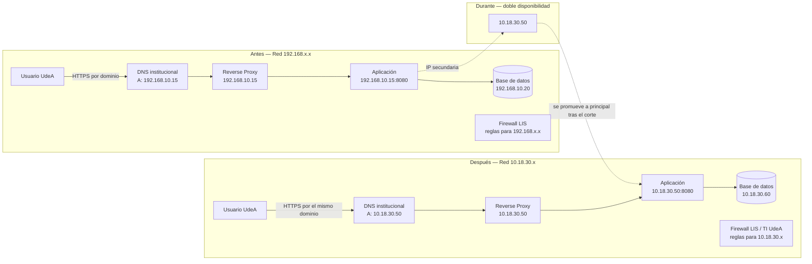

<h1>Estrategia de migración de servicios de red del LIS</h1>

## 1) Contexto, alcance y supuestos

El reto plantea trasladar los servicios de la red `192.168.x.x` al nuevo esquema institucional `10.18.30.x`, sin especificar detalles del servidor (físico o virtual), del uso de contenedores ni del motor de base de datos. Ante esa ambigüedad, la propuesta se construye sobre supuestos mínimos y explícitos, en vez de asumir una configuración concreta no confirmada, para que sirva como plantilla general del patrón recurrente de migración que el LIS ya viene ejecutando, priorizando disponibilidad continua y trazabilidad de dependencias.

**Supuestos de diseño:**

1. **Arquitectura desacoplada:** el servicio consta de un frontend/proxy y un backend de datos como componentes separados.
2. **Interfaz única:** el servidor tiene una sola interfaz de red relevante, conectada al segmento `192.168.x.x`.
3. **Dependencia de nombres:** el acceso se realiza por un dominio completo, no por IP directa.

## 2) Fundamentos teóricos y mejores prácticas

La propuesta se apoya en tres ideas de la literatura técnica en migraciones, cada una atada a una decisión concreta del plan:

**Movilidad de sesiones.** La arquitectura Seamless Transport Endpoint Mobility (STEM) demuestra que cualquier cambio de IP rompe la "5-tupla" que identifica una sesión TCP (IP origen, puerto origen, IP destino, puerto destino, protocolo), forzando el cierre de la conexión [1]. STEM resuelve esto con un módulo de kernel y un daemon de control instalado en ambos extremos — viable entre nodos controlados, pero no aplicable a un servicio con usuarios externos sobre los que el LIS no tiene control. Por eso, en vez de evitar el corte de sesión, esta propuesta lo **planifica y minimiza**: una transición de DNS en fases con un período de disponibilidad dual (servidor accesible por ambas IPs a la vez) antes de retirar la dirección antigua.

**Mapeo de dependencias.** La causa más frecuente de fallas post-migración no es el cambio de IP en sí, sino las referencias "escondidas" a la IP anterior que no estan documentadas: una cadena de conexión con la IP quemada, una entrada de `/etc/hosts`, un `allowed_origins` de CORS, una regla de firewall, que a pesar de ser malas prácticas, se deben tener en cuenta durante una migración [18, 19]. Antes de mover varios componentes dependientes entre sí conviene construir un mapa de dependencias y detectar cuándo la ruta de salida de uno se solapa con la ruta de entrada de otro, porque eso determina el orden en que deben migrarse para no generar un corte parcial innecesario [18]. 

**Validación por paridad.** Una migración solo se considera exitosa si el servicio en la red nueva demuestra paridad de accesibilidad y de latencia frente a la red anterior, no solo si "responde" [22]. Esto es lo que justifica que la validación incluya comparación de tiempos de respuesta contra una línea base, y no únicamente pruebas de conectividad.

## 3) Diagnóstico del entorno actual (pre-migración)

El diagnóstico busca identificar cada punto donde el sistema asume, implícita o explícitamente, que vive en `192.168.x.x`. Se organiza en cuatro frentes, cada uno apuntando a un tipo distinto de dependencia oculta.

**a) Configuración de red del servidor.** Documenta la IP actual, máscara/subred, gateway y rutas — la línea base contra la que se compara todo lo demás.

```bash
ip addr show           # IP, máscara y estado de la interfaz
ip route show          # gateway y rutas configuradas
cat /etc/resolv.conf   # servidores DNS configurados en el propio host
```

**b) Conexiones activas y puertos en uso.** Se debe conocer las comunicaciones con la IP porque eso revela dependencias que no están documentadas.

```bash
ss -tapn | grep 192.168   # flujos activos hacia/desde la red antigua
```

**c) Referencias a la IP antigua en configuración y código.**

```bash
grep -r "192.168" /etc/hosts /etc/nginx/ /etc/apache2/
grep -r "192.168" /ruta/al/proyecto --include="*.env" --include="*.json"
```

**d) DNS y resolución de nombres.** Documenta el registro DNS actual del servicio (tipo A, TTL vigente) y si existe resolución interna adicional (por ejemplo, un DNS split-horizon).

```bash
dig app.lis.udea.edu.co                   # IP que resuelve actualmente el dominio
dig app.lis.udea.edu.co +noall +answer    # TTL vigente del registro
```

## 4) Propuesta técnica de migración

La estrategia estándar para este tipo de casos no es evitar el corte de sesión, sino planificarlo y minimizarlo: una ventana de mantenimiento corta y coordinada, con transición de DNS en fases y un período de doble disponibilidad antes de retirar la dirección antigua. Este enfoque de *make-before-break* (tener la configuración nueva funcionando en paralelo antes de apagar la anterior) es el mismo principio que documenta la IETF para renumeraciones de red sin "flag day" [3, 4]; aunque esos RFC están escritos pensando en IPv6, el principio de fondo (no depender de un corte instantáneo y total) aplica igual aquí.

### 4.1 Doble disponibilidad (make-before-break)

En vez de reemplazar la IP de una sola vez, se asigna la nueva `10.18.30.x` como dirección secundaria de la misma interfaz:

```bash
sudo ip addr add 10.18.30.50/24 dev eth0
```

Esto permite verificar conectividad, rutas y firewall de la nueva dirección antes de que ningún usuario dependa de ella, reduciendo el riesgo de descubrir un problema justo en el momento del corte [2]. 

### 4.2 Configuración de servicios y seguridad

**Firewall/ACL y NAT.** Se debe tener abiertos los puertos en `10.18.30.x` (80, 443, el puerto de la base de datos, etc.) aplicando el principio de privilegio mínimo [8]: no se replican automáticamente las reglas antiguas, se audita cada una. Si el segmento actual sale a Internet vía NAT y el nuevo tiene una política distinta (NAT estático, dinámico, o direccionamiento ya enrutable dentro del campus), debe tenerse en cuenta porque cambia el acceso desde fuera del campus [7, 17]; RFC 3022 [7] formaliza el funcionamiento de NAT si hace falta documentar o depurar reglas durante la transición.

**DNS.** Es, junto con las dependencias hardcodeadas, el punto más crítico de la migración porque es lo único que ven los usuarios finales:

1. Reducir el TTL del registro a 300 segundos entre 24 y 48 horas antes del corte, para que los resolutores dejen de cachear la respuesta anterior por horas y el cambio se propague en minutos [5].
2. Documentar el registro actual completo como respaldo antes de tocar nada.
3. Cambiar el registro A a la nueva IP solo después de confirmar que el servicio ya responde correctamente en `10.18.30.x`.

**Reverse proxy y CORS.** Los bloques `upstream`/`proxy_pass` de Nginx/Apache que apuntan a la IP interna del backend deben actualizarse a `10.18.30.x` [10]: el reverse proxy es el segundo lugar más importante para revisar después del DNS, porque ahí vive la mayoría de las referencias internas a la IP antigua. Si la aplicación valida orígenes permitidos (CORS) o tiene URLs de callback/redirect con la IP o dominio anterior, deben actualizarse explícitamente.

**TLS/SSL.** Si el certificado lista el hostname en su extensión *Subject Alternative Name* (SAN, RFC 5280 [6]) y no la IP, el cambio de dirección no debería invalidarlo ni requerir re-emisión — una razón más para acceder siempre por nombre de dominio. Con Let's Encrypt (certificación TLS), conviene revalidar tras el corte que la renovación automática (que depende de alcanzar el servidor por HTTP en la IP vigente) sigue funcionando desde la nueva dirección [11].

**Base de datos.** Suele ser el componente con más referencias directas a la IP antigua: `bind-address` (si escucha en una interfaz específica), reglas `GRANT`/`pg_hba.conf` que autorizan solo desde `192.168.x.x`, y cadenas de conexión de la aplicación. Cada una se actualiza y prueba por separado.

**Contenedores.** Revisar variables de entorno y archivos de orquestación (`docker-compose.yml`, `.env`) que referencien la IP del host o de otros contenedores por dirección fija en vez de por nombre de servicio — mismo patrón de dependencia oculta que en el diagnóstico, pero dentro de la capa de orquestación.

### 4.3 Gestión de datos y sincronización

Para conjuntos de datos grandes (bases de datos, logs), se usan herramientas que preservan metadatos, para no introducir el riesgo de permisos rotos.

- **Linux:** `rsync -a` (conserva timestamps, permisos y propietarios).
- **Windows:** `robocopy /copyall /mir`.

## 5) Plan de ejecución y reversión

### 5.1 Secuencia de migración

El orden de los cambios no es arbitrario: la base de datos y las reglas de firewall deben quedar listas y verificadas en la red nueva **antes** de mover el tráfico de usuarios [18]. Si se invierte el orden, el servicio queda activo en `10.18.30.x` pero sin poder hablar con su base de datos, generando errores de aplicación más difíciles de diagnosticar que una simple falta de conectividad.

| Momento | Acción |
|---|---|
| **T-48h** | Bajar TTL del registro DNS a 300s. Confirmar backups recientes y restaurables de base de datos y configuración — sin un backup validado no hay reversión posible, solo improvisación. Solicitar a TI la apertura de puertos en `10.18.30.x`. |
| **T-24h** | Aprovisionar la nueva IP como dirección secundaria y probar conectividad con el gateway (sección 4.1). |
| **T-0 (corte)** | Pausar cron jobs y tareas no esenciales. Sincronización final de la base de datos (dump/restore o replicación). Actualizar variables de entorno y configuración de servicios (reverse proxy, CORS, `bind-address`). Validar (sección 6) que el servicio responde correctamente en `10.18.30.x` **directamente por IP**. Solo entonces, cambiar el registro DNS A hacia la nueva IP. |
| **T+24h** | Monitoreo activo y validación funcional continua. |
| **T+48h a T+72h** | Si no hay incidentes, retirar la IP antigua de la interfaz y cerrar las reglas de firewall asociadas a `192.168.x.x`. |

### 5.2 Plan de reversión

Gracias a la doble disponibilidad, el rollback es de bajo impacto: si las pruebas funcionales fallan, se revierte el registro DNS a `192.168.x.x`, que sigue activa en la interfaz porque no se retira hasta T+48h/T+72h. Esto convierte el rollback de una recuperación de emergencia en un cambio de una sola línea de configuración DNS, y permite investigar la causa raíz sin presión de indisponibilidad.

## 6) Validación posterior y criterios de éxito

El éxito se define de forma verificable: el servicio responde en `10.18.30.x` con los mismos códigos HTTP y tiempos de respuesta comparables a los de antes de la migración [22], la base de datos acepta conexiones desde la nueva dirección, y el DNS resuelve consistentemente a la nueva IP desde al menos dos resolutores distintos.

| Prueba | Comando | Objetivo |
|---|---|---|
| Conectividad L3 básica | `ping 10.18.30.1` | Validar el gateway |
| Enrutamiento | `ip route` | Confirmar salida por la subred correcta |
| Accesibilidad L4 | `nc -zv 10.18.30.50 443` | Validar reglas de firewall/ACL |
| Resolución DNS | `dig @8.8.8.8 app.lis.udea.edu.co` | Confirmar propagación externa |
| Integridad de la app | `curl -I https://app.lis.udea.edu.co` | Verificar `200 OK` y headers correctos |
| Superficie expuesta | `nmap -sT 10.18.30.50` | Confirmar que solo los puertos esperados están abiertos |

Herramientas de referencia: `ip`/`ss` [12, 13], `traceroute` [14], Nmap [15], `dig` (BIND9) [16].

Estas pruebas se ejecutan primero **directamente sobre `10.18.30.x`**, sin pasar por el DNS público, y solo si todas pasan se procede a cambiar el registro A, siguiendo el orden ya justificado en la sección 5.1.

## 7) Riesgos y puntos críticos

**Caché DNS recalcitrante.** Algunos resolutores de ISP ignoran el TTL bajo y mantienen la respuesta anterior más tiempo del esperado [5]. Mitigación: mantener la IP antigua activa al menos 72 horas (sección 5.1) para que ese tráfico rezagado siga funcionando mientras el resto del mundo ya ve la IP nueva.

**CORS / orígenes permitidos.** Un desajuste entre la IP o dominio configurado en `allowed_origins` y el origen real tras la migración produce fallos silenciosos en el frontend, sin error de red visible [9]. Mitigación: revisar y actualizar explícitamente la configuración de orígenes permitidos como parte del paso T-0 (sección 5.1), no después de que se reporten errores.

**SPF/MX desactualizados.** Si el servicio envía correo, el registro SPF debe incluir la nueva IP pública de salida; de lo contrario los mensajes pueden marcarse como spam o rechazarse aunque el servicio web funcione con normalidad. Mitigación: documentar y actualizar SPF/MX en el mismo paso que el registro A (sección 4.2, DNS).

## 8) Diagrama de red: antes / después



El estado intermedio (doble disponibilidad) es el único momento en que ambas redes están activas a la vez — es lo que permite que el rollback (sección 5.2) sea un cambio de DNS y no una recuperación de emergencia.

## 9) Referencias

[1] Ansari, F., Sathyanath, A. [*STEM: Seamless Transport Endpoint Mobility*](https://dl.acm.org/doi/abs/10.1145/1282221.1282222). Mobile Computing and Communications Review, Vol. 11, No. 2. Bell Laboratories, Alcatel-Lucent.

[2] RFC 1918 — [Address Allocation for Private Internets](https://www.rfc-editor.org/rfc/rfc1918.html). IETF.

[3] RFC 2071 — [Network Renumbering Overview](https://www.rfc-editor.org/rfc/rfc2071.html). IETF.

[4] RFC 2072 — [Router Renumbering Guide](https://www.rfc-editor.org/rfc/rfc2072.html). IETF.

[5] RFC 1035 — [Domain Names – Implementation and Specification](https://www.rfc-editor.org/rfc/rfc1035.html). IETF.

[6] RFC 5280 — [Internet X.509 Public Key Infrastructure Certificate and CRL Profile](https://www.rfc-editor.org/rfc/rfc5280.html). IETF.

[7] RFC 3022 — [Traditional IP Network Address Translator (Traditional NAT)](https://www.rfc-editor.org/rfc/rfc3022.html). IETF.

[8] NIST SP 800-41 Rev. 1 — [Guidelines on Firewalls and Firewall Policy](https://nvlpubs.nist.gov/nistpubs/legacy/sp/nistspecialpublication800-41r1.pdf). National Institute of Standards and Technology.

[9] MDN Web Docs — [Cross-Origin Resource Sharing (CORS)](https://developer.mozilla.org/en-US/docs/Web/HTTP/Guides/CORS).

[10] NGINX — [Reverse Proxy / ngx_http_proxy_module](https://nginx.org/en/docs/http/ngx_http_proxy_module.html). Documentación oficial.

[11] Let's Encrypt — [FAQ](https://letsencrypt.org/docs/faq/). Documentación oficial.

[12] man7.org — [ip(8) — Linux manual page](https://man7.org/linux/man-pages/man8/ip.8.html).

[13] man7.org — [ss(8) — Linux manual page](https://man7.org/linux/man-pages/man8/ss.8.html).

[14] man7.org — [traceroute(8) — Linux manual page](https://man7.org/linux/man-pages/man8/traceroute.8.html).

[15] Nmap Project — [Nmap Reference Guide](https://nmap.org/book/man.html).

[16] ISC — [BIND 9 Manual Pages — dig](https://bind9.readthedocs.io/en/latest/manpages.html#dig-dns-lookup-utility).

[17] Cisco — [What Is Network Address Translation (NAT)?](https://www.cisco.com/site/us/en/learn/topics/networking/what-is-network-address-translation-nat.html).

[18] Solicitud de patente — *Migrating services in data communication networks* (mapeo de dependencias y secuenciación para migración de servicios en redes de datos), consultada vía [scispace.com](https://scispace.com/papers/migrating-services-in-data-communication-networks-1hdhnnvok9). Se cita como fuente de la idea de secuenciación por dependencias, no como estándar normativo.

[19] InMotion Hosting — [Checklist para migración de servidores](https://www.inmotionhosting.com/blog/es/server-migration-checklist/).

[20] InMotion Hosting — [Guía completa de migración de DNS](https://www.inmotionhosting.com/blog/es/complete-dns-migration-guide/).

[21] Cloudflare — [What Is a Reverse Proxy?](https://www.cloudflare.com/learning/cdn/glossary/reverse-proxy/). Cloudflare Learning Center.

[22] Arista Networks — [Network Migrations and Derisking Transformations](https://www.arista.com/assets/data/pdf/Whitepapers/Network-Migrations-Derisking-Transformations-WP.pdf) (whitepaper sobre validación de migraciones mediante comparación de métricas de rendimiento pre/post migración).
