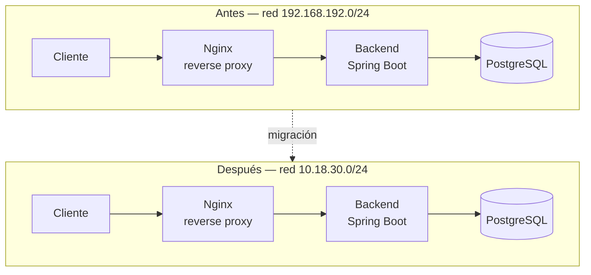

# Reto 4: Investigación (Bonus)
## Migración de servicios entre redes del LIS

**Miguel Andrés Mejía Cuadrado**

Agosto de 2026

---

## Tabla de contenidos

- [0. Alcance y punto de partida](#0-alcance-y-punto-de-partida)
- [1. Diagnóstico del entorno actual](#1-diagnóstico-del-entorno-actual)
  - [1.1 Direccionamiento, máscara, gateway y rutas](#11-direccionamiento-máscara-gateway-y-rutas)
  - [1.2 Resolución de nombres (DNS)](#12-resolución-de-nombres-dns)
  - [1.3 Puertos y servicios en escucha](#13-puertos-y-servicios-en-escucha)
  - [1.4 Dependencias que aún referencian `192.168.192.x`](#14-dependencias-que-aún-referencian-192168192x)
  - [Matriz resumen de diagnóstico](#matriz-resumen-de-diagnóstico)
- [2. Propuesta de migración](#2-propuesta-de-migración)
  - [2.1 Direccionamiento, máscara, gateway y rutas](#21-direccionamiento-máscara-gateway-y-rutas)
  - [2.2 DNS](#22-dns)
  - [2.3 Firewall / ACL y NAT](#23-firewall--acl-y-nat)
  - [2.4 Reverse proxy (Nginx)](#24-reverse-proxy-nginx)
  - [2.5 Certificados TLS](#25-certificados-tls)
  - [2.6 CORS / orígenes permitidos](#26-cors--orígenes-permitidos)
  - [2.7 Variables de entorno y base de datos](#27-variables-de-entorno-y-base-de-datos)
  - [2.8 Contenedores Docker](#28-contenedores-docker)
  - [Matriz de cambios por capa](#matriz-de-cambios-por-capa)
- [3. Plan de ejecución y reversión](#3-plan-de-ejecución-y-reversión)
  - [3.1 Ventana de mantenimiento](#31-ventana-de-mantenimiento)
  - [3.2 Respaldos previos](#32-respaldos-previos)
  - [3.3 Orden de ejecución](#33-orden-de-ejecución)
  - [3.4 Criterios de éxito](#34-criterios-de-éxito)
  - [3.5 Procedimiento de rollback](#35-procedimiento-de-rollback)
- [4. Validación posterior](#4-validación-posterior)
  - [4.1 Red](#41-red)
  - [4.2 DNS](#42-dns)
  - [4.3 Puertos](#43-puertos)
  - [4.4 Aplicación](#44-aplicación)
  - [4.5 Dependencias](#45-dependencias)
- [5. Riesgos y puntos críticos](#5-riesgos-y-puntos-críticos)
- [6. Referencias](#6-referencias)
  - [Bloque Linux networking (comandos y diagnóstico)](#bloque-linux-networking-comandos-y-diagnóstico)
  - [Bloque DNS](#bloque-dns)
  - [Bloque Seguridad de red](#bloque-seguridad-de-red)
  - [Bloque Aplicaciones web](#bloque-aplicaciones-web)
  - [Bloque Dependencias e integración (Docker, variables de entorno)](#bloque-dependencias-e-integración-docker-variables-de-entorno)
  - [Información del LIS](#información-del-lis)
  - [Sobre el uso de herramientas de IA en este informe](#sobre-el-uso-de-herramientas-de-ia-en-este-informe)

---

### 0. Alcance y punto de partida

Antes de entrar en la propuesta, quiero ser claro sobre el enfoque de este documento: es una investigación teórica y metodológica, no la documentación de una migración que haya ejecutado. No tengo acceso a la infraestructura real del LIS ni credenciales de administración, así que no voy a inventar valores de IP, gateway o reglas de firewall como si los hubiera verificado (eso sería peor que admitir que no los tengo). En su lugar, planteo una metodología reproducible: qué comandos correría, qué buscaría en cada capa y cómo tomaría decisiones si estuviera frente al caso real.

Dicho esto, tampoco parto de cero. Este semestre estoy cursando Comunicaciones y Laboratorio, una materia que está justo en la intersección de este reto: entender los conceptos de red a nivel teórico y, en paralelo, llevarlos a la práctica en laboratorio. Es la primera vez que estoy construyendo esa base de forma estructurada, y este informe es en buena parte un ejercicio de aplicar lo que voy aprendiendo ahí a un caso concreto y con implicaciones reales de arquitectura de software (que es donde sí me muevo con más soltura). Por eso el documento combina dos cosas: fundamentos de red que estoy consolidando ahora, y decisiones de arquitectura de aplicaciones (Spring Boot, Docker, variables de entorno, bases de datos) donde ya tengo experiencia directa por proyectos anteriores del programa.

Para no partir de un ejemplo inventado, uso dos fuentes reales como referencia:

**1. Datos verificados en el Reto 1 de esta misma prueba.** Me conecté por SSH a la máquina `10.18.29.37` desde la VPN del laboratorio, y un ping hacia `10.18.30.254` confirmó que ese rango ya está operativo y es alcanzable.

**2. La guía de instalación y configuración de OpenVPN + Stunnel**, que incluye una tabla de direccionamiento de red:

| Descripción | Dirección de red |
|---|---|
| Red VPN | `10.0.8.0/24` |
| Red Telemática | `192.168.30.0/24` |
| Red LIS Sala 1 | `192.168.192.0/24` |
| Red LIS Sala 2 y 3 | `192.168.193.0/24` |
| Red LIS Sala 4 | `192.168.194.0/24` |
| Red Ingeniería | `172.21.0.0/16` |

Esta tabla es útil, pero hay que leerla con cuidado. Primero, confirma que el `192.168.x.x` mencionado en el enunciado no es una suposición mía: las salas del LIS efectivamente están (o estaban documentadas) en ese rango. Segundo, noto algo que me parece relevante para el propio reto: la VPN documentada aquí es `10.0.8.0/24`, distinta de `10.18.30.x` (el nuevo direccionamiento institucional) y también distinta del rango `10.18.29.x` desde el que me conecté en el Reto 1. Esto sugiere que este documento probablemente no está actualizado con el esquema de direccionamiento más reciente de la universidad. Lejos de ser un problema, esto es en sí mismo un argumento a favor del reto: es exactamente el tipo de "desfase" que ocurre cuando una migración de red es paulatina, que podría agravarse si es que dicho proceso no se acompaña de una actualización de la documentación, y por eso lo incluyo también como punto de atención en la sección de riesgos.

El resto de datos que no puedo confirmar con estas dos fuentes (máscara exacta del servidor real a migrar, gateway real, reglas vigentes de firewall, nombres DNS internos del LIS) los trataré como desconocidos y sujetos a verificación en el entorno autorizado, como pide el enunciado.

Para darle un caso concreto a la propuesta, asumiré una aplicación web típica de gestión de inventario/reservas de equipos (backend REST en Spring Boot, base de datos PostgreSQL, un reverse proxy delante del backend), operando sobre la **Red LIS Sala 1 (`192.168.192.0/24`)** como origen (una arquitectura que sí conozco bien por trabajo previo), y un rango real y documentado del laboratorio, evitando algo completamente genérico.

A modo de resumen visual, así se vería la misma cadena de componentes antes y después de la migración:



## 1. Diagnóstico del entorno actual

Antes de tocar cualquier configuración, lo primero es construir un inventario completo de todo lo que depende de la red `192.168.192.0/24` (Sala 1) actual. La idea no es solo confirmar la IP del servidor, sino entender qué otras piezas (DNS, firewall, otros servicios) asumen esa dirección como algo fijo. Si no se hace este paso con calma, es muy fácil migrar el servidor y dejar dos o tres dependencias "invisibles" apuntando a la red vieja.

Dividamos el diagnóstico en cuatro frentes: red del servidor, resolución de nombres, puertos/servicios activos, y dependencias de la aplicación.

### 1.1 Direccionamiento, máscara, gateway y rutas

| Qué se revisa | Comando | Qué se busca |
|---|---|---|
| IP actual y máscara/prefijo de la interfaz | `ip addr` | Confirmar la IP en uso (ej. `192.168.192.50/24`, dentro del rango documentado de la Sala 1) y que la interfaz esté `UP`. La notación `/24` indica cuántos bits pertenecen a la red. |
| Ruta por defecto y rutas específicas | `ip route` | Ver por dónde sale el tráfico que no es local (`default via <gateway> dev <interfaz>`) y si hay rutas estáticas que asuman `192.168.192.0/24`. |
| Alcance del gateway | `ping -c 4 <gateway>` | Confirmar que el gateway responde y que efectivamente pertenece a la misma subred que el servidor (no puede ser una IP de `192.168.193.0/24` ni de ningún otro rango de la tabla). |
| Conectividad hacia la red nueva (para comparar) | `ping -c 4 10.18.30.254` | Esto ya lo verifiqué en el Reto 1 desde `10.18.29.37`: el rango `10.18.30.x` responde desde la VPN del laboratorio, lo cual es un buen punto de partida para saber que la red destino está activa. |

### 1.2 Resolución de nombres (DNS)

Si la aplicación se accede por un nombre (por ejemplo `reservalis.udea.edu.co`) en lugar de la IP directa, hay que saber a dónde apunta ese nombre *antes* de mover nada.

| Qué se revisa | Comando | Qué se busca |
|---|---|---|
| Registro DNS actual del servicio | `dig reservalis.udea.edu.co` o `nslookup reservalis.udea.edu.co` | Confirmar la IP que devuelve hoy (debería caer dentro de `192.168.192.0/24` si el servicio depende de la Sala 1). |
| TTL del registro | Se ve en la misma salida de `dig` (campo TTL) | Un TTL alto significa que, al cambiar el registro, los clientes tardarán más en enterarse del cambio. Es información clave para planear la ventana de migración. |
| DNS interno vs. DNS público | Consultar con el equipo del LIS o revisar configuración del servidor DNS institucional | Saber si la resolución depende de un servidor DNS interno de la universidad o de un proveedor externo. |

### 1.3 Puertos y servicios en escucha

| Qué se revisa | Comando | Qué se busca |
|---|---|---|
| Servicios activos y en qué interfaz escuchan | `ss -tulpn` | Diferenciar servicios en `0.0.0.0:<puerto>` (aceptan conexiones externas, sujeto a firewall) de los que están solo en `127.0.0.1:<puerto>` (únicamente locales). |
| Accesibilidad real del puerto desde otra máquina | `nc -vz <ip> <puerto>` o `curl -I http://<ip>:<puerto>` | Confirmar que el puerto no solo está "abierto" en el servidor, sino que realmente se puede alcanzar desde afuera (descarta bloqueos de firewall). |
| Trayecto de red hacia el servidor | `traceroute <ip>` | Útil si hay sospecha de que el tráfico se está enrutando por un camino inesperado, sobre todo al comparar antes/después de la migración. |

### 1.4 Dependencias que aún referencian `192.168.192.x`

Esta parte es más de revisión manual que de comandos de red, pero es donde suelen esconderse los problemas reales. Para el tipo de arquitectura que estoy asumiendo (backend Spring Boot + PostgreSQL + Nginx + Docker), los lugares típicos donde una IP antigua puede quedar "hardcodeada" son:

- **Variables de entorno / `application.properties` o `application.yml`**: campos como `DB_HOST`, `spring.datasource.url`, o URLs de servicios externos (ej. integración con otra API del LIS).
- **`docker-compose.yml`**: IPs fijas en lugar de nombres de servicio, o redes de Docker configuradas con rangos que colisionen con el nuevo esquema (o incluso con otras redes de la propia tabla, como `192.168.193.0/24` o `192.168.194.0/24`).
- **Configuración de Nginx** (`/etc/nginx/sites-available/*` o el `.conf` montado en el contenedor): directivas `proxy_pass` apuntando a una IP en vez de un hostname.
- **CORS / orígenes permitidos** en el backend: si el `allowedOrigins` incluye una IP literal del frontend antiguo.
- **Certificados TLS**: si el certificado está emitido para una IP en vez de un nombre de dominio (poco común, pero, al parecer, posible en entornos internos como es el caso).
- **Scripts de despliegue o `.sh` de arranque**: cualquier script que use `curl`, `scp` o `ssh` contra una IP fija.

> Para hacer esta búsqueda de forma sistemática en el entorno autorizado, un grep simple ayudaría bastante: `grep -r "192.168" /ruta/del/proyecto --include="*.yml" --include="*.properties" --include="*.env" --include="*.conf"`.

### Matriz resumen de diagnóstico

| Componente | ¿Depende de `192.168.192.x`? | Cómo se verifica |
|---|---|---|
| Interfaz de red del servidor | Sí (IP/máscara/gateway) | `ip addr`, `ip route` |
| DNS del servicio | Posiblemente (según el tipo de entrada) | `dig` / `nslookup` |
| Firewall / reglas de acceso | Posiblemente (origen permitido) | Revisión de reglas (`ufw status` o equivalente) |
| Reverse proxy (Nginx) | Posiblemente (`proxy_pass`) | Revisión de archivo de configuración |
| Backend (Spring Boot) | Posiblemente (`.env`, `application.yml`) | Revisión de configuración + variables de entorno |
| Base de datos (PostgreSQL) | Posiblemente (host de conexión) | Revisión de cadena de conexión |
| Contenedores Docker | Posiblemente (`docker-compose.yml`) | Revisión de definición de red y variables |
| Frontend | Posiblemente (URL de API, CORS) | Revisión de configuración de build/entorno |

## 2. Propuesta de migración

Con el diagnóstico hecho, esta sección plantea qué cambiaría en cada capa para que `reservalis` pase de operar sobre `192.168.192.0/24` (Sala 1) a operar sobre `10.18.30.0/24`. Organizada en el mismo orden en que normalmente se propaga un problema si algo queda mal configurado: primero la red, después la resolución de nombres, después el perímetro (firewall/NAT), y finalmente la aplicación en sí misma.

### 2.1 Direccionamiento, máscara, gateway y rutas

Lo primero es solicitar al equipo del LIS la asignación formal dentro de `10.18.30.0/24`: una IP dentro del rango de hosts utilizables, con su máscara (`/24`, a menos que el LIS indique una segmentación distinta para este nuevo esquema) y el gateway correspondiente a esa subred específica.

Un punto que aprendí revisando esto con detalle: el gateway *tiene* que pertenecer a la misma subred que el servidor. No es una recomendación de buenas prácticas, es una restricción de cómo funciona ARP, ya que un equipo no puede entregarle paquetes a un gateway que esté fuera de su propio dominio de broadcast, porque no hay forma de resolver su dirección física. Si el servidor recibe `10.18.30.50/24`, el gateway tiene que ser algo como `10.18.30.1` (o el host reservado por el LIS para ese rol), nunca una IP de otra subred.

Las rutas estáticas, si existen (por ejemplo, para llegar a otras salas o a la red de Ingeniería `172.21.0.0/16`), también hay que revisarlas: cualquier ruta que hoy apunte explícitamente a `192.168.192.0/24` como destino intermedio deja de tener sentido y debe reemplazarse por su equivalente en el nuevo esquema, o eliminarse si ya no aplica.

### 2.2 DNS

Si `reservalis` se resuelve internamente por nombre (algo como `reservalis.udea.edu.co`), el registro debe actualizarse para apuntar a la nueva IP en `10.18.30.x`. Dos cosas a tener en cuenta aquí:

- **TTL**: si es posible coordinarlo con el equipo de red antes de la ventana de migración, bajar temporalmente el TTL del registro reduce el tiempo en que algunos clientes seguirán resolviendo hacia la IP vieja por caché.
- **Caché local en los propios equipos cliente**: incluso con el registro ya actualizado, un equipo que consultó recientemente puede tener la respuesta vieja guardada. Esto hay que tenerlo presente en la validación, no solo en el cambio.

Si en cambio `reservalis` se accede directamente por IP (sin nombre de dominio interno), esta sección se reduce a comunicar la nueva IP a los usuarios/documentación, pero es justamente el escenario que hace más frágil una migración, porque cualquier cambio de red rompe el acceso sin que haya una capa de indirección que lo absorba. Si ese fuera el caso, lo recomendable como parte de esta misma migración sería aprovechar el cambio para introducir un nombre DNS interno, y no seguir dependiendo de IPs fijas hacia adelante.

### 2.3 Firewall / ACL y NAT

Cualquier regla que hoy permita tráfico específicamente desde o hacia `192.168.192.0/24` necesita su equivalente para `10.18.30.0/24`. Esto aplica tanto a reglas de host (si el servidor usa `ufw` o `iptables` directamente) como a reglas de infraestructura de red que administre el LIS.

Un caso concreto para `reservalis`: si el backend expone el puerto de la API (por ejemplo `8080`) solo hacia la subred del laboratorio y no al mundo, la regla de origen permitido tiene que migrar junto con la IP del servidor. Si no se actualiza, el diagnóstico posterior mostraría algo clásico: el servicio responde en `localhost`, pero no desde otra máquina, puerto cerrado por firewall, no por la aplicación.

Sobre NAT: no tengo evidencia de que exista traducción de direcciones en el esquema actual del LIS (ni la documentación de OpenVPN/Stunnel ni el Reto 1 lo mencionan), pero lo dejo señalado como punto a confirmar. Si existiera algún NAT que traduzca `192.168.192.x` hacia una IP visible externamente, esas reglas de traducción tendrían que actualizarse también.

### 2.4 Reverse proxy (Nginx)

Si `reservalis` corre detrás de Nginx (como asumo en arquitecturas de referencia), el archivo de configuración probablemente tiene una directiva como:

```nginx
location /api/ {
    proxy_pass http://192.168.192.50:8080/;
}
```

Esta línea debe cambiar a la nueva IP (o, mejor todavía, a un nombre DNS interno si ya existe uno, para no tener que tocar este archivo en la próxima migración). Vale la pena mencionar que si Nginx corre dentro de un contenedor Docker en la misma red que el backend, la forma más robusta de escribir esto no es con una IP en absoluto, sino con el nombre del servicio de Docker Compose (`proxy_pass http://backend:8080/;`), dejando que Docker resuelva la IP interna automáticamente sin importar el direccionamiento de afuera.

### 2.5 Certificados TLS

Si `reservalis` usa un certificado emitido para un nombre de dominio (lo más común, y lo que ya aplica en el despliegue actual sobre Vercel), el cambio de IP del servidor interno no debería invalidar el certificado, siempre que el hostname público siga siendo el mismo y la cadena de resolución (DNS → IP nueva) quede correctamente actualizada. Si en algún punto el certificado estuviera atado a una IP específica en vez de a un nombre, eso sí sería un problema serio a resolver antes de continuar, porque tocaría reemitirlo.

### 2.6 CORS / orígenes permitidos

En el backend, la configuración de CORS (`allowedOrigins` en Spring Security) debe seguir apuntando al dominio público del frontend, no a ninguna IP interna. Este es un punto en el que, si la arquitectura ya está bien separada (frontend público, por ejemplo, en Vercel, backend con su propio dominio o IP interna), la migración de red del backend no debería tocar CORS en absoluto, y si lo hiciera, sería una señal de que había una dependencia mal ubicada (por ejemplo, una IP literal en vez de un nombre) que convenía corregir de todas formas.

### 2.7 Variables de entorno y base de datos

Aquí es donde más atención hay que poner, porque es la dependencia más fácil de pasar por alto. Si `DB_HOST` (o `spring.datasource.url`) apunta a una IP fija de PostgreSQL en `192.168.192.x`, migrar el backend a `10.18.30.x` sin actualizar esta variable produce un escenario típico (apostaría, a todos nos ha pasado algo al menos similar): la aplicación arranca sin errores (`Spring Boot: RUNNING`), pero cualquier operación que toque la base de datos falla con `Connection refused` o similar. El servidor está "funcionando", pero la aplicación no.

La recomendación aquí, más allá de simplemente actualizar el valor, es la misma que para Nginx: si PostgreSQL y el backend van a convivir en la misma red de Docker, usar el nombre del servicio en vez de una IP evita este problema en la próxima migración que ocurra.

### 2.8 Contenedores Docker

Si `reservalis` se despliega con Docker (backend, y posiblemente PostgreSQL en contenedores separados), hay tres cosas a revisar en `docker-compose.yml`:

- Variables de entorno con IPs fijas (ya cubierto arriba).
- Configuración de red de Docker: si se definió una red custom con un rango de subred explícito, verificar que no colisione con `10.18.30.0/24` ni con ninguna otra subred de la tabla del LIS (Telemática, Sala 1-4, Ingeniería).
- Volúmenes montados con archivos de configuración (como el `.conf` de Nginx) que puedan tener IPs hardcodeadas dentro, no solo en el propio `docker-compose.yml`.

### Matriz de cambios por capa

| Capa | Cambio necesario | Depende de |
|---|---|---|
| Red / SO | IP, máscara, gateway, rutas estáticas | Asignación formal del LIS en `10.18.30.0/24` |
| DNS | Actualizar registro (o crear uno, si no existía) | Coordinación de TTL con el equipo de red |
| Firewall / ACL | Reglas de origen/destino por subred | Reglas actuales documentadas o consultadas |
| NAT | Actualizar traducción, si existe | Confirmar si el esquema actual la usa |
| Reverse proxy | `proxy_pass` a nueva IP o nombre de servicio | Si Nginx corre en el mismo host/red que el backend |
| Certificados | Verificar que sigan atados a un hostname, no a una IP | Vigencia y emisor del certificado actual |
| CORS | Confirmar que `allowedOrigins` use dominio, no IP | Configuración de Spring Security |
| Variables de entorno | `DB_HOST` y URLs de servicios dependientes | `.env` / `application.yml` / Docker Compose |
| Contenedores | Red de Docker sin colisión con nuevas subredes | `docker-compose.yml` |

## 3. Plan de ejecución y reversión

### 3.1 Ventana de mantenimiento

Antes de pensar en el orden técnico de los cambios, hay una decisión que me parece igual de importante y que casi nunca se menciona primero: *cuándo* hacer la migración. Un laboratorio como el LIS tiene un patrón de uso muy marcado por el calendario académico (clases, monitorías, entregas, espacios de estudio) así que intentar migrar `reservalis` en las semanas más concurridas del semestre sería la peor decisión posible, por más bien planeada que esté la parte técnica.

Lo lógico sería aprovechar un periodo de baja actividad (vacaciones entre semestres, o al menos una semana "de baja" en las salas que dependen del servicio) por dos razones concretas: primero, si se suspenden los servicios que el LIS tiene de forma no planeada durante la migración, el impacto sobre usuarios reales es mínimo o nulo; segundo, y esto es algo que tengo muy en cuenta como estudiante que también desarrolla: da margen real de tiempo para que las cosas no salgan bien a la primera. Migrar redes rara vez es un proceso de "cambio y listo", casi siempre hay una vuelta o dos de ajustes finos, y es mejor tener uno o dos días de colchón que estar corriendo contra el reloj con gente esperando que el servicio vuelva.

### 3.2 Respaldos previos

Antes de tocar cualquier configuración, hay que dejar un punto de retorno claro:

- **Base de datos**: un `pg_dump` completo de PostgreSQL antes de iniciar, con timestamp en el nombre del archivo para no confundirlo con respaldos "casuales".
- **Archivos de configuración**: copia de los archivos que se van a modificar (`application.yml`/`.env`, el `.conf` de Nginx, `docker-compose.yml`), y cualquier registro DNS documentado (aunque sea una captura de pantalla del panel de administración, si no hay forma de exportarlo directamente).
- **Estado actual de red**: guardar la salida de `ip addr`, `ip route`, `ss -tulpn` y `ufw status` (o equivalente) del servidor antes del cambio. Esto no es solo para poder revertir, también sirve como referencia para comparar contra el estado posterior en la validación.

### 3.3 Orden de ejecución

Este es el orden que propondría, pensando en minimizar el tiempo en que algo queda a medio migrar (que es cuando más fácil es que algo se rompa sin saber qué pasó):

1. Preparar el destino sin apagar el origen. Si es posible, dejar lista la nueva IP/configuración de red asignada por el LIS, pero sin desconectar todavía el servicio de `192.168.192.x`. La idea es que el "salto" sea lo más corto posible, no reconfigurar con el servicio ya caído.
2. Aplicar el cambio de red (IP, máscara, gateway, rutas) en el servidor.
3. Actualizar firewall/ACL para el nuevo rango, antes de intentar cualquier prueba de conectividad, ya que si se hace después, cualquier fallo de conectividad se puede confundir entre "no llegó por red" y "llegó pero el firewall lo bloqueó".
4. Actualizar dependencias de la aplicación: variables de entorno (`DB_HOST`, URLs internas), configuración de Nginx (`proxy_pass`), y `docker-compose.yml` si aplica.
5. Reiniciar los servicios afectados (backend, y Nginx si su configuración cambió) para que tomen la nueva configuración.
6. Actualizar el registro DNS, esto sí, al final de este bloque, no al principio. Así se evita que, mientras el resto del cambio todavía está en curso, algún usuario resuelva hacia una IP que aún no está completamente lista.
7. Ejecutar el "abc" de validación (sección 4) antes de considerar cerrada la migración.

### 3.4 Criterios de éxito

Antes de dar por terminada la migración, estos son los puntos que definiría como "listo":

- El servidor responde en la nueva IP (`10.18.30.x`) con la máscara, gateway y rutas esperadas.
- El registro DNS de `reservalis` resuelve hacia la nueva IP de forma consistente (no solo desde una máquina, sino verificado desde al menos dos puntos distintos de la red).
- Los puertos necesarios (HTTP/HTTPS del reverse proxy, puerto del backend si aplica) están accesibles desde donde deberían estarlo, y bloqueados desde donde no.
- La aplicación responde correctamente extremo a extremo. No solo que Nginx devuelva algo, sino que una petición real a la API llegue al backend y este pueda consultar la base de datos.
- No quedan referencias a `192.168.192.x` en ningún archivo de configuración activo (verificado con el `grep` mencionado en la sección 1).

Si alguno de estos puntos falla y no se puede resolver en un tiempo razonable dentro de la "ventana" de mantenimiento que se abrió, entra en juego el rollback.

### 3.5 Procedimiento de rollback

El rollback solo es rápido si el respaldo de la sección 3.2 se hizo bien, así que en cierto sentido esta sección depende completamente de esa. El procedimiento, en caso de que algo falle:

1. Revertir la configuración de red del servidor a la IP, máscara y gateway anteriores (`192.168.192.x`).
2. Revertir el registro DNS a la IP anterior. Aquí es donde el TTL bajo (mencionado en la sección 2.2) se vuelve importante: si se redujo antes de la migración, el rollback también se propaga rápido.
3. Restaurar los archivos de configuración (Nginx, `.env`/`application.yml`, `docker-compose.yml`) desde las copias hechas en 3.2.
4. Revertir las reglas de firewall/ACL al estado anterior, si se llegaron a modificar.
5. Reiniciar los servicios con la configuración restaurada.
6. Confirmar que el servicio vuelve a responder en la red anterior con las mismas pruebas básicas de la sección 4, antes de dar por cerrado el rollback.

Un detalle que vale la pena anotar: si el rollback ocurre después de que el registro DNS ya llevaba un tiempo apuntando a la IP nueva, es posible que algunos clientes tengan esa IP nueva cacheada y tarden en volver a resolver correctamente hacia la vieja, el mismo problema de caché que se puede dar en el sentido contrario durante la migración. Por eso, aunque el rollback técnico se complete rápido, conviene dejarlo documentado como una posible causa de reportes que llegan tarde de usuarios ("a mí todavía no me carga") en las horas siguientes.

## 4. Validación posterior

Llegados a este punto, terminar de aplicar los cambios no es lo mismo que terminar la migración, eso ya quedó claro en la sección de criterios de éxito. Esta parte es el plan de pruebas concreto, organizado capa por capa, en el mismo orden en que se propagaría un problema si algo quedó mal: primero confirmar que la red básica funciona, después que el nombre resuelve, después que los puertos están accesibles, y solo al final que la aplicación completa responde de extremo a extremo.

### 4.1 Red

| Prueba | Comando | Qué confirma |
|---|---|---|
| Conectividad básica al servidor | `ping -c 4 10.18.30.X` | Que el servidor responde en la nueva IP. Pilas: si ICMP está bloqueado por firewall, esto puede fallar aunque el servicio esté perfectamente arriba, esta no es una prueba concluyente por sí sola. |
| Alcance del gateway | `ping -c 4 <gateway>` | Que el servidor efectivamente puede salir de su propia subred. |
| Interfaz y direccionamiento locales | `ip addr` | Confirmar, desde dentro del servidor, que la IP/máscara asignadas son las correctas y que la interfaz está `UP`. |
| Tabla de rutas | `ip route` | Confirmar que la ruta por defecto y las rutas estáticas (si las hay) apuntan al gateway correcto del nuevo esquema. |
| Trayecto hacia el servidor | `traceroute 10.18.30.X` (o `traceroute -n` para no depender de resolución DNS en cada salto) | Detectar si el tráfico está tomando un camino inesperado (útil sobre todo comparando este resultado contra el que se tenía antes de migrar). |

### 4.2 DNS

| Prueba | Comando | Qué confirma |
|---|---|---|
| Resolución del nombre del servicio | `dig reservalis.udea.edu.co` o `nslookup reservalis.udea.edu.co` | Que el registro ya devuelve la IP nueva, no la de `192.168.192.x`. |
| Consistencia entre puntos de red distintos | Repetir la consulta anterior desde al menos dos máquinas o redes diferentes | Descartar que la propagación quedó a medias, o que hay caché local sirviendo una respuesta vieja en algún punto. |
| Vigencia del TTL | Revisar el campo TTL en la salida de `dig` | Confirmar que quedó en un valor razonable después de la migración (si se bajó temporalmente para la ventana de mantenimiento, este es el momento de devolverlo a su valor normal). |

### 4.3 Puertos

| Prueba | Comando | Qué confirma |
|---|---|---|
| Servicios en escucha en el servidor | `ss -tulpn` | Que el backend y/o Nginx están efectivamente escuchando en el puerto esperado, y en qué interfaz (`0.0.0.0` vs `127.0.0.1`). |
| Alcance del puerto desde otra máquina | `nc -vz 10.18.30.X 443` (o el puerto que corresponda) | Confirmar que el puerto no solo está abierto en el servidor, sino que se puede alcanzar desde afuera (esta es la prueba que distingue "el servicio está vivo" de "el servicio es accesible"). |
| Puerto de la base de datos | `nc -vz 10.18.30.Y 5432` | Lo mismo, pero para confirmar que el backend puede llegar a PostgreSQL si están en máquinas o contenedores distintos. |

### 4.4 Aplicación

Aquí es donde entra el matiz importante: `ping` nunca fue pensado para validar una aplicación web, solo confirma que hay algo respondiendo a nivel de red. La prueba real tiene que hablar el mismo protocolo que usan los usuarios.

| Prueba | Comando | Qué confirma |
|---|---|---|
| Respuesta HTTP/HTTPS básica | `curl -I https://reservalis.udea.edu.co` (o la URL que corresponda) | Que el reverse proxy responde con un código HTTP válido, y que el certificado TLS es aceptado. |
| Endpoint de salud del backend (si existe) | `curl https://reservalis.udea.edu.co/api/health` | Confirmar que la petición efectivamente llega hasta el backend, no que se queda respondida por Nginx o por un caché intermedio. |
| Flujo real de la aplicación | Probar manualmente un caso de uso básico (login, consulta de inventario, una reserva de prueba) desde el navegador | Es la prueba más cercana a lo que realmente le importa al usuario, y la única que confirma que todo el camino (DNS, proxy, backend, base de datos) funciona junto y no solo por partes. |

### 4.5 Dependencias

| Prueba | Cómo se hace | Qué confirma |
|---|---|---|
| Conexión del backend a PostgreSQL | Revisar logs del backend al arrancar, o intentar una operación que dependa de la base de datos | Descartar el escenario típico: "Spring Boot: RUNNING" pero `Connection refused` en cualquier consulta real. |
| Ausencia de referencias a la IP vieja | `grep -r "192.168.192" /ruta/del/proyecto --include="*.yml" --include="*.properties" --include="*.env" --include="*.conf"` | Confirmar, después del cambio, que efectivamente no quedó ningún archivo de configuración activo apuntando a la red antigua. |
| Origen permitido en CORS | Probar una petición real desde el frontend desplegado y revisar la consola del navegador | Descartar bloqueos de CORS que no se detectan con `curl` porque no dependen del navegador. |
| Escaneo de puertos del host (opcional) | `nmap 10.18.30.X` | Confirmar de forma más amplia qué puertos quedaron abiertos tras el cambio (pero esto solo se ejecuta sobre hosts y rangos expresamente autorizados por el LIS); no es una herramienta para usar por cuenta propia sobre infraestructura institucional (como este caso) sin permiso. |

## 5. Riesgos y puntos críticos

Con el diagnóstico, la propuesta y el plan de validación ya definidos, ya en esta sección se junta todo lo que puede salir mal, pensando en qué tan probable es que ocurra y qué tan grave sería si ocurre en un proyecto con la arquitectura de `reservalis` (Spring Boot + PostgreSQL + Nginx/Docker + frontend separado en Vercel).

| # | Riesgo | Probabilidad | Impacto | Por qué aplica a `reservalis` |
|---|---|---|---|---|
| 1 | IP hardcodeada en `.env` / `application.yml` (`DB_HOST` u otra URL de servicio) | Alta | Alto | Es el punto que más mencioné en la sección 2.7: el backend arranca sin errores, pero cualquier consulta a la base de datos falla con `Connection refused`. Es "inofensivo" hasta que alguien usa la aplicación de verdad. |
| 2 | Nginx (`proxy_pass`) apuntando a la IP vieja | Alta | Alto | Si el backend migró pero el proxy no se actualizó, el resultado es un `502 Bad Gateway` inmediato (al menos este es fácil de detectar rápido, a diferencia del anterior.) |
| 3 | Caché DNS (local o de resolvers intermedios) | Media | Medio | Aunque el registro ya apunte a la IP nueva, algunos clientes pueden seguir resolviendo hacia la vieja durante un rato. Con un TTL bajo planeado de antemano (sección 2.2), el impacto se reduce bastante. |
| 4 | Reglas de firewall/ACL no actualizadas para el nuevo rango | Alta | Alto | Es el escenario clásico de "todo está bien configurado pero el puerto sigue cerrado". Fácil de pasar por alto porque no genera ningún error visible en la aplicación misma. |
| 5 | Gateway o máscara mal configurados | Media | Alto | Si se comete un error aquí (por ejemplo, copiar el gateway de otra sala documentada en la tabla de subredes), el servidor queda con IP correcta pero sin poder salir de su propia red. |
| 6 | CORS bloqueando peticiones del frontend | Baja | Medio | En una arquitectura ya bien separada como esta (frontend en Vercel, backend con su propio dominio), no debería tocarse durante la migración de red. Aunque, si `allowedOrigins` tuviera alguna IP literal en vez de un dominio, aparecería aquí. |
| 7 | Certificado TLS atado a IP en vez de a hostname | Baja | Alto (si ocurre) | Poco probable en este caso porque el certificado ya está pensado para un dominio público, pero si llegara a pasar, no sería un ajuste rápido, tocaría reemitir. |
| 8 | Red de Docker Compose colisionando con otra subred de la tabla del LIS | Media | Medio | Con varias subredes distintas documentadas (VPN, Telemática, Salas y demás), es un escenario real si se define una red custom sin verificar contra esa tabla primero. |
| 9 | Rutas estáticas obsoletas hacia la red vieja | Baja | Medio | Más importante si el servidor necesita comunicarse con otros servicios internos del LIS, no solo con el mundo exterior. |
| 10 | Scripts de despliegue con IP fija (`scp`, `ssh`, `curl` en algún `.sh`) | Media | Bajo | No rompe el servicio en producción, pero sí rompe el flujo de despliegue la próxima vez que alguien intente actualizarlo. |
| 11 | Documentación desactualizada del propio LIS | Media | Bajo (pero importante) | Esto lo noté en la sección 0: la tabla de subredes que usé viene de la guía de OpenVPN + Stunnel, y menciona una VPN (`10.0.8.0/24`) distinta de la que verifiqué en el Reto 1 (`10.18.29.x`). Si la documentación interna no se actualizara junto con la red, cualquier persona que planee una migración futura corre el riesgo de partir de datos viejos. |
| 12 | Rollback incompleto por caché DNS en sentido inverso | Baja | Medio | Mencionado en la sección 3.5: si el rollback ocurre después de que la IP nueva ya se propagó, revertir el registro no soluciona el problema instantáneamente para todos los usuarios. |

Los riesgos 1, 2 y 4 son, en mi opinión, los que más pesarían para un proyecto como este: son los más probables y los que más fácil pasan desapercibidos hasta que alguien intenta usar la aplicación. Por eso el orden de ejecución de la sección 3.3 los prioriza explícitamente (firewall antes de dar por buena la conectividad, dependencias de aplicación revisadas con `grep` antes de cerrar la migración).

---

Trabajando en este documento terminé cayendo en cuenta de algo que no esperaba: varios de estos "riesgos" no son exclusivos de una migración de red, son directamente buenas prácticas que se deberían haber aplicado en el desarrollo de `reservalis`. Lo de evitar IPs hardcodeadas y usar nombres de servicio de Docker en vez de direcciones fijas, por ejemplo, no es algo que solo importe el día que la red cambia, es simplemente una mejor forma de escribir la configuración desde el principio, y hubiera evitado que este documento tuviera que "advertir" sobre algo que se pudo haber prevenido antes.

Dicho eso, y siendo honesto: después de tres días bastante intensos con el resto de la prueba, no me alcanzan ni las energías ni el tiempo para devolverme a `reservalis` y **tratar** de aplicar cambios como esos jaja. Y, curiosamente, creo que ese es justo uno de los aprendizajes más genuinos de este reto, no el técnico, sino el de gestión: una migración (o incluso una mejora de este tipo) no es algo que se deba improvisar en el camino ni "a las malas" cuando ya se está agotado. Se planea, se le da su espacio, y se ejecuta con cabeza fría, que es exactamente lo que este mismo documento termina defendiendo en la sección 3.

## 6. Referencias

Las fuentes que uso a continuación se agrupan según el bloque conceptual investigado para el trabajo, para que sea fácil relacionar cada una con las decisiones técnicas donde aparece.

### Bloque Linux networking (comandos y diagnóstico)

Usado principalmente en las secciones 1.1, 1.3 y 4.1, para justificar el uso de `ip addr`, `ip route`, `ping` y `traceroute` como herramientas de diagnóstico, y para entender qué información retorna cada uno más allá de la sintaxis.

- LPI - [Comandos básicos de red en Linux](https://learning.lpi.org/es/learning-materials/010-160/4/4.4/4.4_01/)
- Arch Wiki - [Depuración de red (Network Debugging)](https://wiki.archlinux.org/title/Network_Debugging_(Espa%C3%B1ol))
- IONOS Digital Guide - [Comando ping en Linux](https://www.ionos.com/es-us/digitalguide/servidores/configuracion/comando-ping-de-linux/)

### Bloque DNS

Usado en las secciones 1.2, 2.2 y 4.2, en particular para entender la diferencia entre `dig` y `nslookup`, y el rol del TTL en la propagación de un cambio de registro A.

- Raiolanetworks - [Qué es nslookup](https://raiolanetworks.com/blog/nslookup/)
- Axarnet - [Qué es nslookup y para qué sirve](https://axarnet.es/blog/que-es-nslookup)
- Hosting.com KB - [Troubleshooting DNS with dig and nslookup](https://kb.hosting.com/docs/troubleshooting-dns-with-dig-and-nslookup)

### Bloque Seguridad de red

Usado en la sección 2.3, para los conceptos de listas de control de acceso (ACL) y las reglas que definen origen, destino, puerto y acción en un firewall.

- Fortinet - [Network Access Control List (ACL)](https://www.fortinet.com/lat/resources/cyberglossary/network-access-control-list)
- AmeliCA - [Artículo sobre seguridad y enrutamiento de tráfico en redes](https://portal.amelica.org/ameli/journal/731/7313661002/html/)

### Bloque Aplicaciones web

Usado en las secciones 2.4 y 2.6, para el rol de un reverse proxy frente a un backend, y para la especificación de CORS que sustenta por qué `allowedOrigins` debe apuntar a un dominio y no a una IP.

- YouTube - [Video explicativo sobre reverse proxy](https://www.youtube.com/watch?v=PPcARCBFzf4)
- MDN Web Docs - [CORS (Cross-Origin Resource Sharing)](https://developer.mozilla.org/es/docs/Web/HTTP/CORS)

### Bloque Dependencias e integración (Docker, variables de entorno)

Usado en las secciones 2.7 y 2.8, como referencia de una configuración limpia de Spring Boot + PostgreSQL con Docker Compose, evitando IPs fijas en favor de nombres de servicio y variables de entorno.

- dev.to - [Docker Compose, Spring Boot and Postgres example](https://dev.to/tienbku/docker-compose-spring-boot-and-postgres-example-4l82)
- Stack Overflow en español - [Cómo configurar variables de entorno dentro de Docker Compose](https://es.stackoverflow.com/questions/28408/como-puedo-configurar-variables-de-entorno-dentro-de-docker-compose)

### Información del LIS

Fuente primaria de los datos reales usados en las secciones 0 y 1 (tabla de subredes, contexto de la VPN institucional).

- Universidad de Antioquia - [Guía de instalación de OpenVPN + Stunnel](https://drive.google.com/file/d/1tlNNAjoVZPTmZgohyywJ0iCqpQb9Xk6e/view) (fuente de la tabla de direccionamiento de red usada en la sección 0)
- LIS UdeA - [Documentación pública, sala de Telemática](https://lisudea.github.io/telematica/)

### Sobre el uso de herramientas de IA en este informe

Para la elaboración de este documento consulté conceptos de redes con **ChatGPT (GPT)**, principalmente para resolver dudas puntuales sobre temas que estoy viendo apenas este semestre en Comunicaciones y Laboratorio, por qué un gateway mal configurado no funciona a nivel de ARP, o el rol de un reverse proxy frente a una aplicación Spring Boot. Esa conversación no reemplaza el aprendizaje de los contenidos de la materia ni la práctica en el laboratorio, pero sí me ayudó a organizar las preguntas correctas antes de investigar en las fuentes formales listadas arriba.
