<p align="center">
  
</p>

<p align="center">
  
</p>

<h3 align="center">LABORATORIO INTEGRADO DE SISTEMAS</h3>
<h3 align="center">UNIVERSIDAD DE ANTIOQUIA</h3>
<h1 align="center">RETO 2: BACKEND</h1>
<h2 align="center">REST API · Sistema de Gestión y Reservas de Equipos del LIS</h2>

<p align="center"><strong>Persistencia</strong> · <strong>Seguridad</strong> · <strong>Reservas transaccionales</strong> · <strong>DevSecOps</strong></p>

<p align="center">
  María Camila Castañeda Piedrahita · CC 1021805193 · maria.castanedap@udea.edu.co · Medellín · Agosto de 2026
</p>

<p align="center">
  <a href="#qué-pedía-la-prueba">📖 Requisitos</a> ·
  <a href="#arquitectura">🏗️ Arquitectura</a> ·
  <a href="#clonar-y-ejecutar">🚀 Ejecutar</a> ·
  <a href="#swagger-y-jwt">⚙️ API</a> ·
  <a href="#reservas-y-concurrencia">📅 Reservas</a> ·
  <a href="#seguridad">🔐 Seguridad</a> ·
  <a href="#evidencias">📸 Evidencias</a> ·
  <a href="#aws-y-despliegue">☁️ Deployment</a>
</p>

<div align="center">

[](lisource-backend/pom.xml)
[](lisource-backend/pom.xml)
[](lisource-backend/pom.xml)
[](lisource-backend/src/main/resources/db)
[](https://technical-test-2026-2-v96h.onrender.com/swagger-ui/index.html)
[](lisource-backend/Dockerfile)
[](.github/workflows/backend-ci.yml)
[](infra/aws-oidc)
[](infra/aws-oidc)
[](https://technical-test-2026-2-v96h.onrender.com)

</div>

## Producción

| Servicio | Enlace |
|---|---|
| API REST | https://technical-test-2026-2-v96h.onrender.com |
| Swagger UI | https://technical-test-2026-2-v96h.onrender.com/swagger-ui/index.html |
| Health check | https://technical-test-2026-2-v96h.onrender.com/actuator/health |
| OpenAPI JSON | https://technical-test-2026-2-v96h.onrender.com/v3/api-docs |

> [!NOTE]
> El backend es la autoridad funcional del sistema. El frontend consume esta API; no accede directamente a PostgreSQL, Supabase Storage ni a Google.

LISource Backend resuelve el problema de inventario y reservas del Laboratorio Integrado de Sistemas con Spring Boot, Spring Security, PostgreSQL y SQL explícito con `JdbcClient`. La prioridad del diseño es que la disponibilidad, la autorización, la concurrencia y la auditoría se decidan en el servidor, no en el navegador.

La solución cubre gestión de equipos, catálogos, autenticación local y con Google, sesiones y refresh, reservas multi-equipo con validación transaccional, estadísticas, administración y observabilidad mínima para operación y defensa técnica.

## Índice

- [Visión general](#visión-general)
- [Qué pedía la prueba](#qué-pedía-la-prueba)
- [Requerimientos obligatorios](#requerimientos-obligatorios)
- [Bonus solicitados](#bonus-solicitados)
- [Más allá del reto](#más-allá-del-reto)
- [Interpretación de ingeniería](#interpretación-de-ingeniería)
- [Guía rápida de evaluación](#guía-rápida-de-evaluación)
- [Mapa de LISource](#mapa-de-lisource)
- [Arquitectura](#arquitectura)
- [Decisiones de ingeniería y alternativas](#decisiones-de-ingeniería-y-alternativas)
- [Tecnologías](#tecnologías)
- [Prerrequisitos](#prerrequisitos)
- [¿Cómo quiere probar LISource?](#cómo-quiere-probar-lisource)
- [Clonar y ejecutar](#clonar-y-ejecutar)
- [Variables de entorno](#variables-de-entorno)
- [Base de datos](#base-de-datos)
- [Usuarios de evaluación](#usuarios-de-evaluación)
- [Swagger y JWT](#swagger-y-jwt)
- [API](#api)
- [Reservas y concurrencia](#reservas-y-concurrencia)
- [Seguridad](#seguridad)
- [Testing y calidad](#testing-y-calidad)
- [DevSecOps](#devsecops)
- [AWS y despliegue](#aws-y-despliegue)
- [Evidencias](#evidencias)
- [Troubleshooting](#troubleshooting)
- [Glosario técnico](#glosario-técnico)
- [Referencias](#referencias)

## Visión general

LISource Backend administra equipos, disponibilidad y reservas con ventanas de tiempo reales. El problema central no es solo guardar registros: también hay que evitar que dos usuarios reserven el mismo equipo en un intervalo superpuesto, y hacerlo de manera correcta incluso cuando llegan solicitudes concurrentes.

Para eso el backend aplica validación de entrada, controles de dominio, bloqueo transaccional de filas, código HTTP adecuado y un modelo de autenticación que combina JWT corto, refresh opaco en cookie HttpOnly y política de dominio institucional exacto `@udea.edu.co`.

La arquitectura real es un monolito modular por feature y capas. Tiene ideas compatibles con ports-and-adapters, pero no es hexagonal pura: varios servicios usan repositorios y adaptadores concretos de forma directa cuando eso simplifica la prueba técnica sin sacrificar claridad.

## Qué pedía la prueba

Reto 2 exige una API REST con **persistencia real** y cuatro capacidades obligatorias: gestionar equipos, consultar el inventario de forma paginada y filtrable, gestionar reservas y rechazar estrictamente los solapamientos. Como bonus, solicita estadísticas y autenticación institucional con Google SSO y JWT.

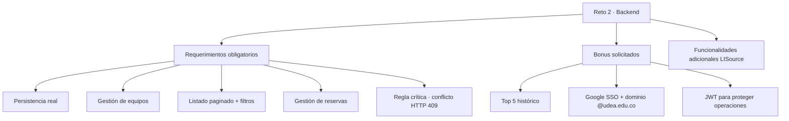

> [!IMPORTANT]
> **Interpretación de ingeniería:** consultar si un equipo “parece libre” no es suficiente. La creación de la reserva debe volver a comprobar la disponibilidad dentro de la transacción y protegerse frente a solicitudes concurrentes. Por eso la autoridad final vive en el backend, no en el navegador.

## Requerimientos obligatorios

| Requisito | Qué hace | Dónde está | Cómo probarlo |
|---|---|---|---|
| **Persistencia real** | PostgreSQL en Supabase; no se almacena el dominio únicamente en memoria | `JdbcClient`, repositorios SQL y `src/main/resources/db` | ejecutar SQL `01 → 02 → 03`, iniciar API y consultar datos persistidos |
| **Gestión de equipos** | Registrar, actualizar y visualizar equipos con ID único, nombre, serie/MAC, categoría y estado | [EquipmentController](lisource-backend/src/main/java/co/edu/udea/lis/lisource/equipment/api/EquipmentController.java) | crear, editar, listar y consultar un equipo en Swagger/Postman |
| **Listado avanzado** | Paginación, búsqueda, categoría, estado y orden | `GET /api/v1/equipment` | variar `page`, `pageSize`, `category` y `status` |
| **Gestión de reservas** | Crear, cancelar y listar reservas asociadas al usuario y a uno o varios equipos, con inicio y fin | [ReservationService](lisource-backend/src/main/java/co/edu/udea/lis/lisource/reservation/application/ReservationService.java) | crear una reserva, consultar `/me` y cancelarla |
| **Regla crítica de solapamiento** | Rechaza intervalos que chocan con otra reserva | capa transaccional de reservas | repetir una franja ocupada y comprobar `409 Conflict` |
| **HTTP apropiado** | Respuestas de éxito y error normalizadas con Problem Details | OpenAPI + manejo global de errores | provocar casos `201`, `400`, `401`, `403`, `404` y `409` |

<details>
<summary><strong>✅ Trazabilidad literal de los subrequisitos</strong></summary>

**Gestión de equipos**

- ✅ ID único.
- ✅ Nombre.
- ✅ Número de serie y/o MAC.
- ✅ Categoría.
- ✅ Estado actual.
- ✅ Registro.
- ✅ Actualización.
- ✅ Visualización.

**Gestión de reservas**

- ✅ Usuario identificado por la cuenta autenticada.
- ✅ Nombre y correo disponibles desde el perfil.
- ✅ Equipo(s) reservado(s).
- ✅ Fecha/hora de inicio.
- ✅ Fecha/hora de fin.
- ✅ Crear.
- ✅ Cancelar.
- ✅ Listar.
- ✅ Rechazar solapamientos con `409 Conflict`.

</details>

## Bonus solicitados

| Bonus | Qué hace | Dónde está | Cómo probarlo |
|---|---|---|---|
| Top 5 | Calcula el ranking histórico de equipos más reservados | [StatisticsController](lisource-backend/src/main/java/co/edu/udea/lis/lisource/statistics/api/StatisticsController.java) | consultar `GET /api/v1/statistics/top-equipment?limit=5` |
| Google SSO | Ingreso institucional con validación de `id_token` | [AuthService](lisource-backend/src/main/java/co/edu/udea/lis/lisource/auth/application/AuthService.java) | login Google con correo `@udea.edu.co` |
| Dominio `@udea.edu.co` | Bloquea dominios fuera de la universidad | [EmailDomainPolicyTest](lisource-backend/src/test/java/co/edu/udea/lis/lisource/auth/application/EmailDomainPolicyTest.java) | intentar con una cuenta no institucional |
| JWT | Access corto + refresh HttpOnly | [TokenCodecTest](lisource-backend/src/test/java/co/edu/udea/lis/lisource/shared/security/TokenCodecTest.java) | login, copiar solo `accessToken` y autorizar Swagger |

## Más allá del reto

| Extra | Qué hace | Dónde está | Cómo probarlo |
|---|---|---|---|
| Sesiones | Lista, revoca y cierra sesiones activas | [ProfileController](lisource-backend/src/main/java/co/edu/udea/lis/lisource/user/api/ProfileController.java), [AuthService](lisource-backend/src/main/java/co/edu/udea/lis/lisource/auth/application/AuthService.java) | abrir `GET /api/v1/sessions` y revocar una sesión |
| Perfil | Consulta y actualización de nombre e idioma | [ProfileController](lisource-backend/src/main/java/co/edu/udea/lis/lisource/user/api/ProfileController.java) | abrir `/api/v1/profile` y guardar cambios |
| Recuperación | Solicita y aplica reinicio de contraseña | [AuthService](lisource-backend/src/main/java/co/edu/udea/lis/lisource/auth/application/AuthService.java) | usar `forgot-password` y `reset-password` |
| Múltiples roles | Permite seleccionar y cambiar rol activo | [AuthService](lisource-backend/src/main/java/co/edu/udea/lis/lisource/auth/application/AuthService.java) | probar `select-role` y `switch-role` con usuario dual |
| Storage | Sube o elimina imágenes de equipos en Supabase Storage | [EquipmentImageStorage](lisource-backend/src/main/java/co/edu/udea/lis/lisource/equipment/application/EquipmentImageStorage.java) | cargar una imagen desde el endpoint de equipo |
| Administración | Gestiona usuarios, roles, categorías, ubicaciones y configuración | [AdminUserService](lisource-backend/src/main/java/co/edu/udea/lis/lisource/user/application/AdminUserService.java), [AdminCatalogService](lisource-backend/src/main/java/co/edu/udea/lis/lisource/catalog/application/AdminCatalogService.java), [ConfigurationService](lisource-backend/src/main/java/co/edu/udea/lis/lisource/configuration/application/ConfigurationService.java) | abrir endpoints `/api/v1/admin/*` en Swagger |
| Dashboard | Resume inventario y actividad operativa | [StatisticsController](lisource-backend/src/main/java/co/edu/udea/lis/lisource/statistics/api/StatisticsController.java) | consultar `/api/v1/dashboard/summary` |
| Auditoría | Registra eventos con metadatos y trazabilidad | [AuditController](lisource-backend/src/main/java/co/edu/udea/lis/lisource/audit/api/AuditController.java) | consultar `/api/v1/admin/audit` |
| Correlation ID | Propaga trazabilidad de una petición a otra | [CorrelationIdFilter](lisource-backend/src/main/java/co/edu/udea/lis/lisource/shared/web/CorrelationIdFilter.java) | enviar `X-Correlation-ID` y revisarlo en respuesta/logs |
| Realtime | Publica eventos sobre cambios relevantes | [WebSocketConfig](lisource-backend/src/main/java/co/edu/udea/lis/lisource/shared/config/WebSocketConfig.java) | conectar cliente STOMP y verificar publicación |

## Interpretación de ingeniería

La parte difícil no era solo guardar equipos o aceptar reservas. El problema real fue garantizar que la disponibilidad se decide con la misma verdad que ve el servidor, incluso cuando dos solicitudes llegan al mismo tiempo. Por eso la solución usa transacción, bloqueo, validación de dominio y respuestas HTTP explícitas.

## Guía rápida de evaluación

1. Abra [Health](https://technical-test-2026-2-v96h.onrender.com/actuator/health) o Swagger para despertar Render si está en cold start.
2. Ejecute `POST /api/v1/auth/login` con una cuenta demo activa.
3. Si la respuesta exige selección de rol, use `POST /api/v1/auth/select-role` con el `selectionToken`.
4. En Swagger, copie solo el `accessToken` en **Authorize**.
5. Liste equipos con filtros y paginación para comprobar persistencia y lectura real.
6. Cree una reserva futura y luego repítala para verificar el `409 Conflict`.
7. Consulte `GET /api/v1/statistics/top-equipment?limit=5` para validar el bonus de estadísticas.
8. Revise la colección Postman canónica si prefiere una ruta guiada.

## Mapa de LISource

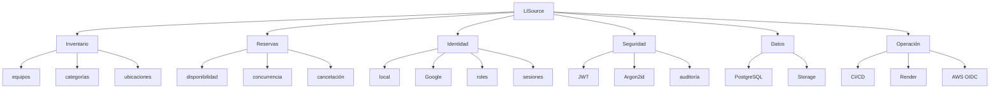

## Arquitectura

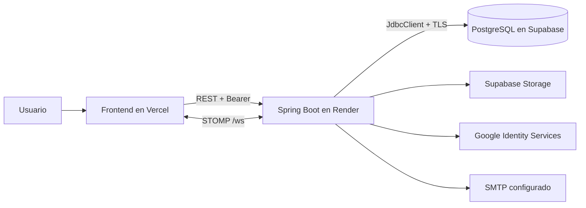

La separación real es modular por feature y por capas. El backend concentra controladores, servicios, repositorios JDBC, seguridad, configuración y adaptadores externos.

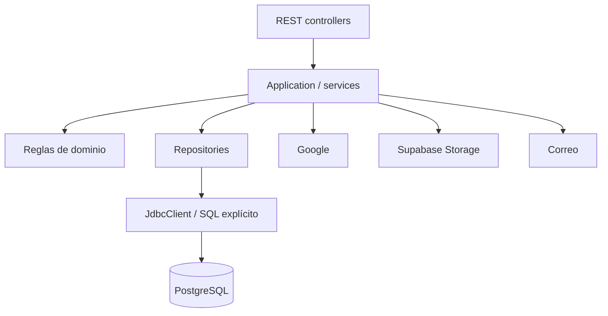

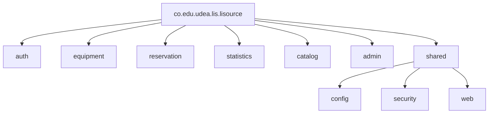

> [!IMPORTANT]
> La arquitectura tiene ideas compatibles con ports-and-adapters, pero no constituye una implementación hexagonal estricta. Esa precisión importa para no vender como "puramente hexagonal" una base de código que deliberadamente mezcla abstracción con accesos concretos para mantener el proyecto claro y defendible.

## Decisiones de ingeniería y alternativas

| Decisión | Alternativas consideradas | Por qué LISource | Trade-off | Cuándo elegiría otra opción |
|---|---|---|---|---|
| Java + Spring Boot | FastAPI / NestJS / Express | Ecosistema sólido, seguridad integrada y pruebas claras | Más verbosidad inicial | Si el equipo prioriza prototipado rápido en Python o Node |
| PostgreSQL | NoSQL | Transacciones, FK y consultas relacionales son críticas para reservas | Menos flexibilidad documental | Si el dominio fuera altamente documental o semi-estructurado |
| `JdbcClient` + SQL | JPA/Hibernate | Control total sobre locks, overlap y queries de lectura | Más SQL manual | Si se prefiriera mapeo ORM y menos SQL explícito |
| Monolito modular | Microservicios | Una sola transacción y despliegue simplifican la prueba técnica | Menor aislamiento entre dominios | Si hubiera varios equipos y una escala operativa mayor |
| Arquitectura actual | Hexagonal estricta | Mantiene claridad sin sobre-abstractar el proyecto | Menos separación formal por puertos | Si el sistema creciera y exigiera un borde de dominio más riguroso |
| JWT corto + refresh HttpOnly | JWT largo / localStorage | Reduce exposición y obliga a renovar con sesión | Más lógica de sesión | Si no existiera necesidad de sesión persistente o revocación |
| Argon2id | BCrypt / PBKDF2 | Mejor postura moderna para hashes de contraseña | Costo computacional mayor | Si la plataforma tuviera una limitación fuerte de CPU |
| Supabase Storage | BYTEA / Base64 | Descarga almacenamiento binario fuera de la base | Depende de servicio externo | Si se quisiera todo autocontenido en PostgreSQL |
| Render | Servidor propio / AWS runtime | Menos operación y despliegue más simple | Menor control de infraestructura | Si se necesitara entorno dedicado o red privada completa |
| GitHub Actions | Deploy manual | Repetibilidad y validación automática | Requiere definir pipeline | Si el proyecto fuera muy pequeño o efímero |
| Terraform | Configuración manual | Infraestructura reproducible y versionada | Más archivos y curva de aprendizaje | Si la infraestructura fuera mínima y estable |
| AWS OIDC | Access keys permanentes | Credenciales temporales, sin secretos largos | Requiere federación y roles | Si no existiera integración con GitHub Actions |

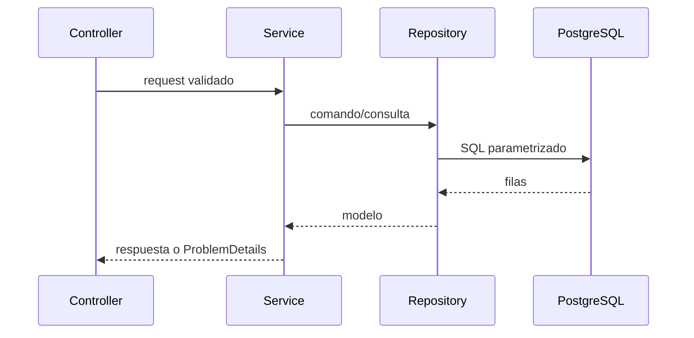

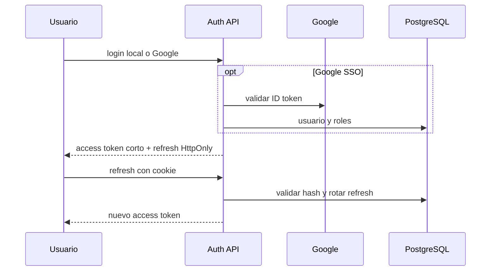

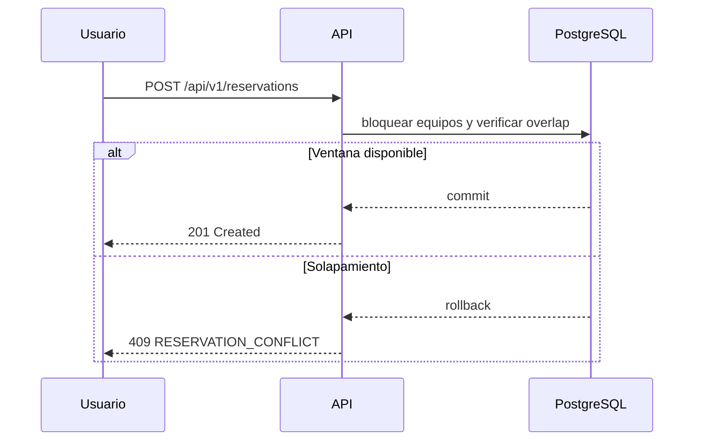

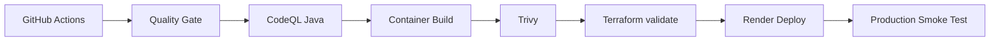

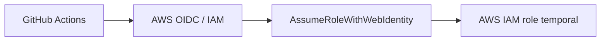

## Tecnologías

| Área | Tecnología | Para qué se usa |
|---|---|---|
| Runtime | Java 21 | ejecución del backend |
| Framework | Spring Boot 3.5.16 | API, autoconfiguración y despliegue |
| Seguridad | Spring Security | auth, RBAC y sesiones |
| Persistencia | PostgreSQL + JdbcClient | datos, locks y SQL explícito |
| Contrato | Springdoc OpenAPI | Swagger UI y contrato técnico |
| Calidad | JUnit, Mockito, Testcontainers, ArchUnit, JaCoCo | pruebas y arquitectura |
| Entrega | Maven Wrapper, Docker | build reproducible |
| CI/CD | GitHub Actions, CodeQL, Trivy | validación y seguridad |
| Infra | Terraform, AWS OIDC | identidad federada para CI |
| Cloud | Render y Supabase | backend y datos |

## Prerrequisitos

| Herramienta | Uso | Obligatoria | Verificación |
|---|---|---|---|
| Git | clonar ramas y revisar cambios | Sí | `git --version` |
| Java 21 | ejecutar backend y pruebas | Sí | `java --version` |
| Maven global | no requerido | No | el proyecto usa Maven Wrapper |
| Docker | builds de imagen y validaciones opcionales | No | `docker --version` |
| Postman | pruebas manuales guiadas | No | abrir la colección canónica |
| `psql` | alternativa al SQL Editor de Supabase | No | `psql --version` |
| Terraform + AWS CLI | solo para IaC y OIDC | No para ejecución local | `terraform --version` / `aws --version` |

<details>
<summary>🪟 Preparar Windows</summary>

- Git: instálelo desde [git-scm.com](https://git-scm.com/downloads) y confirme con `git --version`.
- Java 21: instale un JDK 21 desde [Eclipse Adoptium](https://adoptium.net/) o proveedor equivalente y confirme con `java --version`.
- PowerShell: viene incluido en Windows; úselo para clonar, ejecutar y revisar salidas.
- Docker Desktop: opcional, solo si quiere construir imágenes o repetir el flujo CI localmente.
- Postman: opcional, útil para explorar la API sin leer código.

</details>

<details>
<summary>🐧 Preparar Linux</summary>

- Git: instálelo con el gestor de paquetes de su distribución y confirme con `git --version`.
- Java 21: instale un JDK 21 y confirme con `java --version`.
- Shell: Bash o equivalente; no necesita Maven global porque el proyecto usa Maven Wrapper.
- Docker: opcional, solo para validación de contenedor.
- Postman: opcional, útil para probar requests de forma manual.

</details>

Instalación oficial: [Git](https://git-scm.com/downloads), [Java](https://adoptium.net/), [Docker](https://www.docker.com/products/docker-desktop/), [Postman](https://www.postman.com/downloads/), [Terraform](https://developer.hashicorp.com/terraform/downloads), [AWS CLI](https://docs.aws.amazon.com/cli/latest/userguide/getting-started-install.html).

## 🚀 ¿Cómo quiere probar LISource?

| Modo | Backend | Frontend | Requiere instalación | Ideal para |
|---|---|---|---|---|
| Local | `http://localhost:8080` | `http://localhost:3000` | Sí | desarrollo, depuración y edición |
| Producción | Render | Vercel | No | evaluación rápida y demo |

### Producción

1. Abra [Health](https://technical-test-2026-2-v96h.onrender.com/actuator/health) para despertar Render si está en cold start.
2. Espere la respuesta `UP`.
3. Abra [Swagger](https://technical-test-2026-2-v96h.onrender.com/swagger-ui/index.html) si desea probar API.
4. Inicie sesión con una cuenta demo.
5. Copie solo el `accessToken` en Swagger.
6. Pruebe `GET /api/v1/equipment` o una reserva de ejemplo.

## Clonar y ejecutar

### Windows

1. Clone el repositorio y cambie a la rama correcta.

```powershell
git clone --branch 1021805193-reto2 --single-branch https://github.com/lisudea/technical-test-2026-2.git lisource-backend-reto2
cd lisource-backend-reto2
git switch 1021805193-reto2
cd lisource-backend
```

2. Descargue `backend.txt` desde el Carpeta de evaluación en Google Drive y guárdelo exactamente como `lisource-backend/.env`.
3. Ejecute, en Supabase SQL Editor o `psql`, los scripts `01-estructura.sql`, `02-semilla.sql` y `03-pruebas.sql` en ese orden.
4. Inicie la aplicación.

```powershell
.\mvnw.cmd spring-boot:run
```

5. Abra `http://localhost:8080/actuator/health` y después `http://localhost:8080/swagger-ui/index.html`.

### Linux / macOS

1. Clone el repositorio y cambie a la rama correcta.

```bash
git clone --branch 1021805193-reto2 --single-branch https://github.com/lisudea/technical-test-2026-2.git lisource-backend-reto2
cd lisource-backend-reto2
git switch 1021805193-reto2
cd lisource-backend
```

2. Descargue `backend.txt` desde el Carpeta de evaluación en Google Drive y guárdelo exactamente como `lisource-backend/.env`.
3. Ejecute los scripts SQL en orden.
4. Inicie la aplicación.

```bash
chmod +x mvnw
./mvnw spring-boot:run
```

5. Compruebe health y Swagger en el navegador.

> [!TIP]
> El proyecto usa Maven Wrapper, así que no necesita instalar Maven global para compilar o ejecutar.

## Variables de entorno

[Carpeta de evaluación en Google Drive (`backend.txt` y `frontend.txt`)](https://drive.google.com/drive/folders/1acpvFdobQNkvmGB5Q5b15UoR8ZOfqfgI?usp=sharing)

El backend carga `optional:file:.env[.properties]` desde la carpeta de ejecución. Para Reto 2, descargue `backend.txt` y cree **exactamente** `lisource-backend/.env`.

No publique ni versione los valores reales. `.env.example` funciona únicamente como plantilla de nombres.

Grupos de variables esperados:

- `DB_*`
- `JWT_*`
- `GOOGLE_*`
- `CORS_*`
- `COOKIE_*`
- `SUPABASE_*`
- `MAIL_*`

La ubicación debe quedar así:

```text
technical-test-2026-2/
└── lisource-backend/
    ├── .env              ← CREAR AQUÍ con el contenido de backend.txt
    ├── .env.example
    ├── pom.xml
    ├── mvnw
    ├── mvnw.cmd
    └── src/
```

> [!WARNING]
> Las credenciales demo del README son datos ficticios de QA. Las variables reales de infraestructura **no** deben copiarse al repositorio.

## Base de datos

> [!CAUTION]
> `01-estructura.sql` reconstruye la estructura y puede eliminar información existente. Úselo solo sobre una base descartable o nueva.

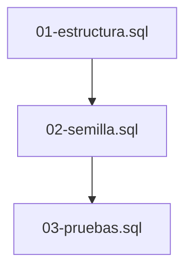

| Etapa | Qué deja listo | Resultado verificable |
|---|---|---|
| `01-estructura.sql` | 20 tablas, PK/FK, checks, índices y RLS | estructura relacional limpia |
| `02-semilla.sql` | catálogos, estados, roles, idiomas y configuración | base referencial lista |
| `03-pruebas.sql` | dataset demo/QA con usuarios, equipos, reservas y auditoría | datos utilizables sin solapamientos |

<table align="center">
  <tr>
    <td align="center"><strong>20</strong><br>tablas</td>
    <td align="center"><strong>12</strong><br>usuarios demo</td>
    <td align="center"><strong>15</strong><br>asignaciones de rol</td>
    <td align="center"><strong>10</strong><br>sesiones</td>
  </tr>
  <tr>
    <td align="center"><strong>6</strong><br>recuperaciones</td>
    <td align="center"><strong>30</strong><br>equipos</td>
    <td align="center"><strong>40</strong><br>reservas</td>
    <td align="center"><strong>47</strong><br>relaciones reserva-equipo</td>
  </tr>
</table>

### Composición esperada del dataset QA

Los siguientes gráficos permiten comprobar visualmente el resultado esperado después de ejecutar correctamente `01-estructura.sql → 02-semilla.sql → 03-pruebas.sql`.

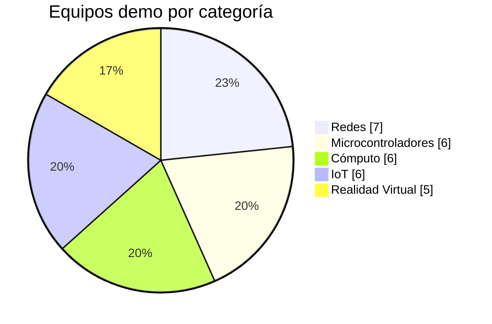

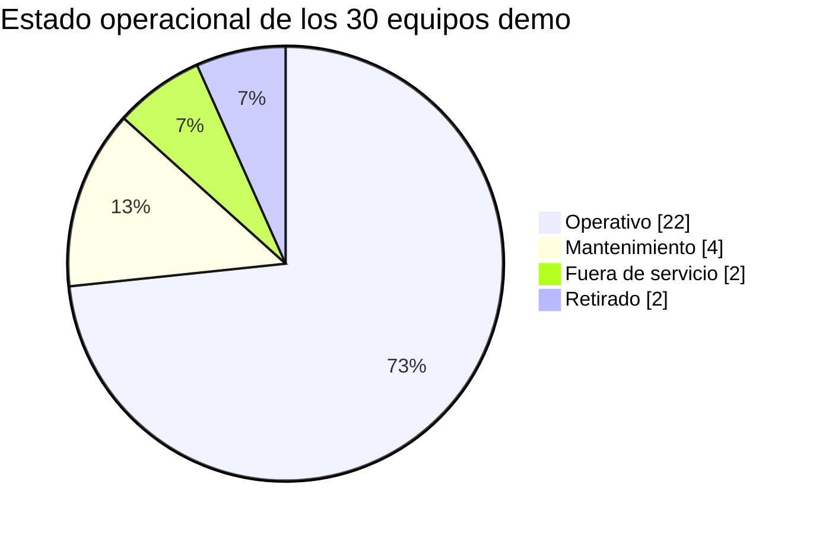

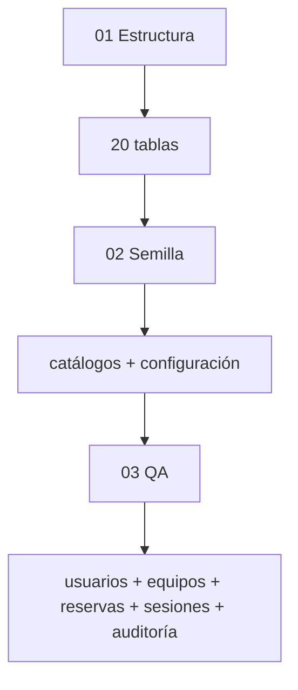

El modelo se organiza en seis grupos conceptuales:

| Grupo | Tablas | Idea |
|---|---|---|
| Estados | `tbl_estado_registro`, `tbl_estado_usuario`, `tbl_estado_equipo`, `tbl_estado_reserva` | catálogos de ciclo de vida |
| Usuarios / auth | `tbl_rol`, `tbl_idioma`, `tbl_usuario`, `tbl_usuario_rol`, `tbl_sesion`, `tbl_recuperacion_password` | identidad, rol y sesiones |
| Inventario | `tbl_categoria_equipo`, `tbl_ubicacion`, `tbl_equipo` | catálogo físico |
| Reservas | `tbl_reserva`, `tbl_reserva_equipo` | cabecera y relación N:M |
| Configuración | `tbl_categoria_configuracion`, `tbl_configuracion` | parámetros tipados |
| Auditoría | `tbl_nivel_auditoria`, `tbl_tipo_evento_auditoria`, `tbl_auditoria` | trazabilidad |

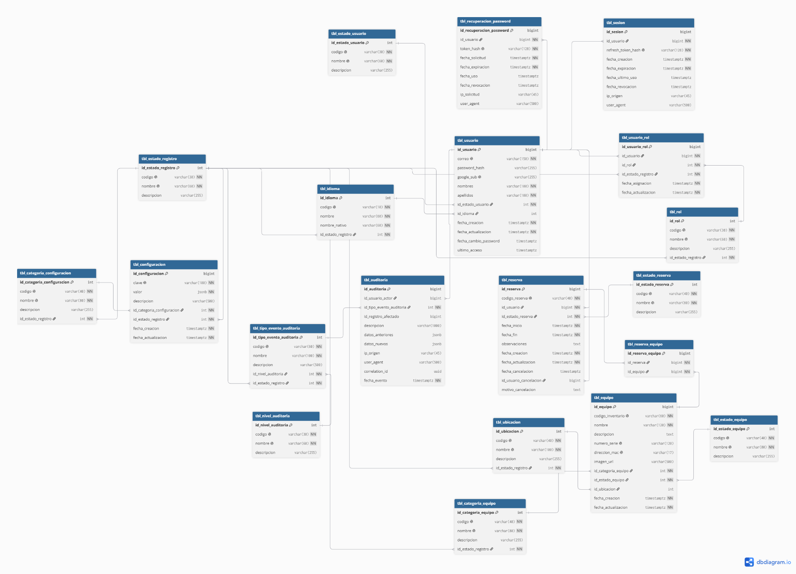

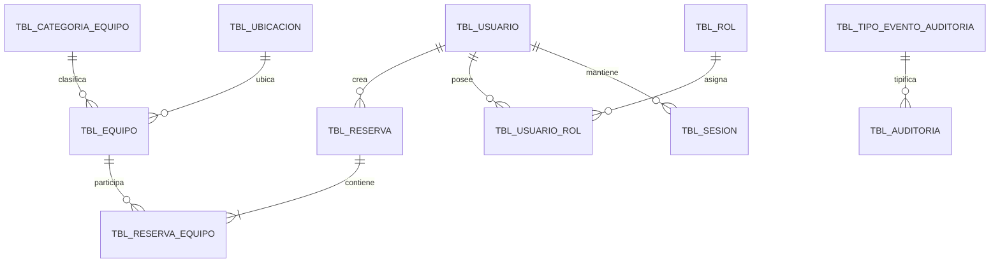

### Estados persistidos y derivados

El modelo separa el **estado persistido** de la lectura temporal derivada. Esto evita guardar como dato permanente algo que depende de la hora de consulta.

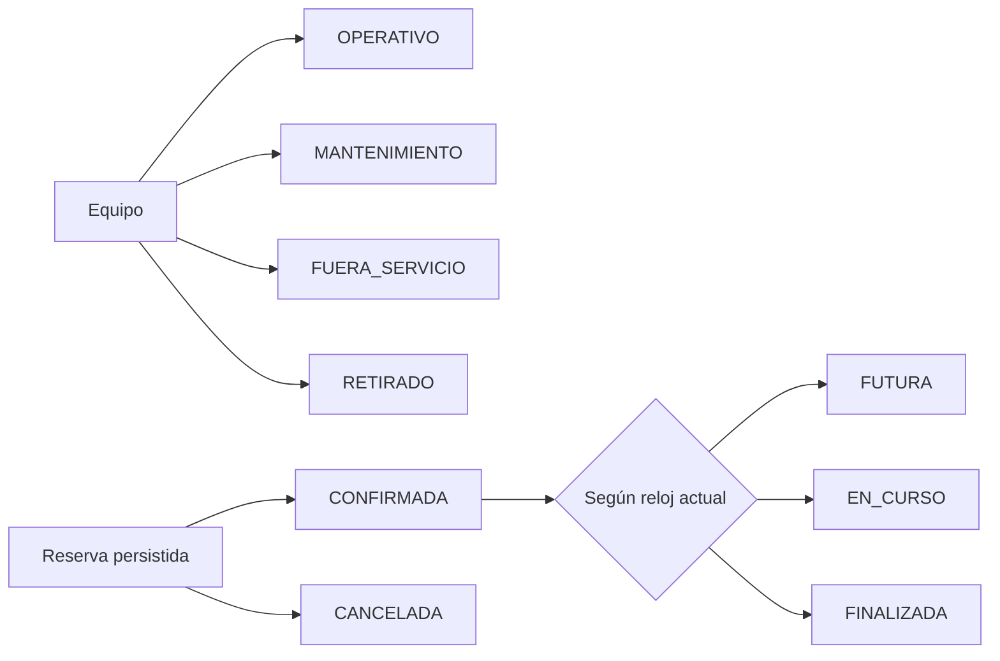

## Usuarios de evaluación

> [!IMPORTANT]
> Estas credenciales son ficticias y se publican únicamente para demostración y QA.

| Perfil | Correo | Contraseña | Uso |
|---|---|---|---|
| Administrador | `admin.demo@udea.edu.co` | `DemoAdmin2026!` | CRUD completo, roles y catálogo admin |
| Usuario | `usuario.demo@udea.edu.co` | `DemoUsuario2026!` | flujo normal de catálogo y reservas |
| Reservas | `reservas.demo@udea.edu.co` | `DemoReservas2026!` | historial y cancelación |
| Dual | `dual.demo@udea.edu.co` | `DemoDual2026!` | selección y cambio de rol |
| Inactivo | `inactivo.demo@udea.edu.co` | `DemoInactivo2026!` | prueba negativa de acceso |
| Google only | `google.demo@udea.edu.co` | sin contraseña local | referencia SSO institucional |

## Swagger y JWT

1. Ejecute `POST /api/v1/auth/login` con una cuenta demo activa.
2. Si la respuesta solicita selección de rol, use `selectionToken` en `POST /api/v1/auth/select-role`.
3. Copie únicamente `accessToken`.
4. En Swagger pulse **Authorize** y pegue solo el access token como Bearer.
5. No use el refresh token para autorizar requests manuales: el refresh vive en cookie HttpOnly.

`accessToken` y `refreshToken` no son equivalentes. El primero viaja en el header `Authorization`; el segundo se rota en cookie y solo lo procesa el backend.

## API

La aplicación expone **52 operaciones funcionales en 11 controladores**. Los grupos siguientes muestran el contrato real por dominio. Los casos negativos no añaden endpoints nuevos; prueban reglas de seguridad y dominio.

<details>
<summary><strong>Authentication</strong></summary>

| Método | Ruta | Uso |
|---|---|---|
| `POST` | `/api/v1/auth/login` | login local |
| `POST` | `/api/v1/auth/google` | login con Google |
| `POST` | `/api/v1/auth/refresh` | rotar refresh y entregar nuevo access |
| `POST` | `/api/v1/auth/select-role` | crear sesión para el rol elegido |
| `POST` | `/api/v1/auth/switch-role` | cambiar rol activo |
| `POST` | `/api/v1/auth/logout` | cerrar sesión actual |
| `POST` | `/api/v1/auth/logout-all` | cerrar todas las sesiones |
| `POST` | `/api/v1/auth/forgot-password` | solicitar recuperación |
| `POST` | `/api/v1/auth/reset-password` | redefinir contraseña |
| `POST` | `/api/v1/auth/set-password` | establecer contraseña local |
| `POST` | `/api/v1/auth/change-password` | cambiar contraseña local |
</details>

<details>
<summary><strong>Sessions</strong></summary>

| Método | Ruta | Uso |
|---|---|---|
| `GET` | `/api/v1/sessions` | listar sesiones activas |
| `DELETE` | `/api/v1/sessions/{sessionId}` | revocar una sesión |
| `POST` | `/api/v1/sessions/logout-others` | mantener solo la sesión actual |
</details>

<details>
<summary><strong>Equipment</strong></summary>

| Método | Ruta | Uso |
|---|---|---|
| `GET` | `/api/v1/equipment` | listar con paginación, filtros y orden |
| `GET` | `/api/v1/equipment/{id}` | detalle de un equipo |
| `POST` | `/api/v1/equipment` | crear equipo |
| `PUT` | `/api/v1/equipment/{id}` | actualizar equipo |
| `PATCH` | `/api/v1/equipment/{id}/status` | cambiar estado operacional |
| `POST` | `/api/v1/equipment/{id}/image` | subir imagen multipart |
| `DELETE` | `/api/v1/equipment/{id}/image` | eliminar imagen |
</details>

<details>
<summary><strong>Reservations</strong></summary>

| Método | Ruta | Uso |
|---|---|---|
| `POST` | `/api/v1/reservations` | crear reserva atómica |
| `GET` | `/api/v1/reservations/me` | listar mis reservas |
| `GET` | `/api/v1/reservations/{id}` | detalle autorizado |
| `POST` | `/api/v1/reservations/{id}/cancel` | cancelar sin borrar historial |
| `GET` | `/api/v1/equipment/{id}/busy-slots` | intervalos ocupados |
| `GET` | `/api/v1/equipment/{id}/availability` | disponibilidad orientativa |
</details>

<details>
<summary><strong>Dashboard and Statistics</strong></summary>

| Método | Ruta | Uso |
|---|---|---|
| `GET` | `/api/v1/dashboard/summary` | resumen del inventario |
| `GET` | `/api/v1/statistics/top-equipment` | Top 5 histórico |
</details>

<details>
<summary><strong>Catalogs</strong></summary>

| Método | Ruta | Uso |
|---|---|---|
| `GET` | `/api/v1/catalogs/categories` | categorías activas |
| `GET` | `/api/v1/catalogs/locations` | ubicaciones activas |
| `GET` | `/api/v1/catalogs/equipment-statuses` | estados de equipo |
| `GET` | `/api/v1/catalogs/languages` | idiomas disponibles |
</details>

<details>
<summary><strong>Administration - Users</strong></summary>

| Método | Ruta | Uso |
|---|---|---|
| `GET` | `/api/v1/admin/users` | listar usuarios |
| `GET` | `/api/v1/admin/users/{id}` | detalle de usuario |
| `PATCH` | `/api/v1/admin/users/{id}/status` | cambiar estado |
| `PUT` | `/api/v1/admin/users/{id}/roles/{role}` | asignar rol |
</details>

<details>
<summary><strong>Administration - Roles</strong></summary>

| Método | Ruta | Uso |
|---|---|---|
| `GET` | `/api/v1/admin/roles` | listar roles |
| `PATCH` | `/api/v1/admin/roles/{role}/status` | cambiar estado de rol |
</details>

<details>
<summary><strong>Administration - Categories</strong></summary>

| Método | Ruta | Uso |
|---|---|---|
| `GET` | `/api/v1/admin/categories` | listar categorías |
| `POST` | `/api/v1/admin/categories` | crear categoría |
| `PUT` | `/api/v1/admin/categories/{id}` | actualizar categoría |
| `PATCH` | `/api/v1/admin/categories/{id}/status` | cambiar estado |
</details>

<details>
<summary><strong>Administration - Locations</strong></summary>

| Método | Ruta | Uso |
|---|---|---|
| `GET` | `/api/v1/admin/locations` | listar ubicaciones |
| `POST` | `/api/v1/admin/locations` | crear ubicación |
| `PUT` | `/api/v1/admin/locations/{id}` | actualizar ubicación |
| `PATCH` | `/api/v1/admin/locations/{id}/status` | cambiar estado |
</details>

<details>
<summary><strong>Administration - Configuration</strong></summary>

| Método | Ruta | Uso |
|---|---|---|
| `GET` | `/api/v1/admin/configuration` | listar configuración |
| `PATCH` | `/api/v1/admin/configuration/{key}` | actualizar valor |
</details>

<details>
<summary><strong>Administration - Audit</strong></summary>

| Método | Ruta | Uso |
|---|---|---|
| `GET` | `/api/v1/admin/audit` | consultar auditoría |
</details>

## Reservas y concurrencia

La semántica de tiempo es `[inicio, fin)`: el instante final no pertenece al intervalo. Eso permite que una reserva termine exactamente cuando otra comienza sin generar conflicto.

| Caso | Resultado |
|---|---|
| `10:00–11:00` y `11:00–12:00` | permitido |
| `10:00–11:00` y `10:30–11:30` | conflicto |

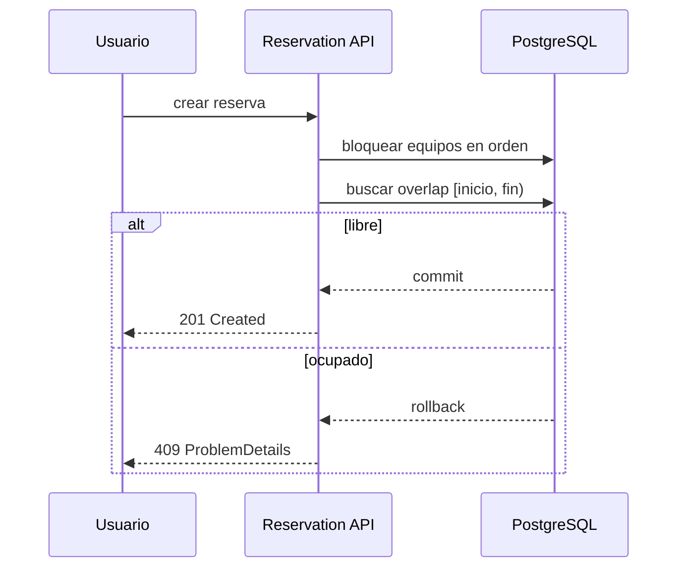

La disponibilidad en pantalla es orientativa. La validación definitiva sucede dentro de la transacción de creación, después del bloqueo y antes del commit. Por eso el backend devuelve `409 Conflict` con `RESERVATION_CONFLICT` cuando la franja ya no está libre.

## Seguridad

| Amenaza | Control |
|---|---|
| Robo de contraseña | Argon2id y política de dominio exacto |
| XSS sobre token | access corto en memoria; refresh HttpOnly |
| CSRF sobre refresh | SameSite, Secure, path restringido y CORS/origin allowlist |
| Replay de refresh | hash persistido + rotación |
| Escalada de privilegio | Spring Security, `@PreAuthorize`, rol activo y ownership |
| SQL injection | `JdbcClient` y parámetros |
| Doble reserva | transacción, locks y overlap server-side |
| Fuga de secretos | `.env` fuera de Git y OIDC para AWS |

Flujo de protección:

- `issuer` y `tokenUse` validan el JWT.
- `sid` identifica la sesión concreta.
- `refresh` rota y puede revocar la sesión actual o todas.
- `ProblemDetails` normaliza errores sin filtrar internals.
- `correlation ID` permite rastreo operativo.

### Matriz de roles

La autorización distingue el uso normal del sistema de las operaciones administrativas.

| Operación | USUARIO | ADMINISTRADOR |
|---|:---:|:---:|
| Consultar equipos y catálogos | ✅ | ✅ |
| Crear y consultar sus reservas | ✅ | ✅ |
| Consultar perfil y sesiones propias | ✅ | ✅ |
| Crear/editar/cambiar estado de equipos | ❌ | ✅ |
| Gestionar usuarios, roles, categorías y ubicaciones | ❌ | ✅ |
| Consultar auditoría | ❌ | ✅ |
| Modificar configuración | ❌ | ✅ |

> [!NOTE]
> La matriz resume el modelo de autorización documentado. La decisión efectiva se aplica en Spring Security y en los controles de ownership/rol del backend.

## Testing y calidad

La última validación documentada en `target/surefire-reports` reportó **32 tests, 0 failures, 0 errors y 11 skipped**. Vuelva a ejecutar `clean verify` para confirmar las cifras en su entorno. Las suites cubren autenticación, dominio de correo, codec del token, sesión, perfiles, imagen de equipo, auditoría, arquitectura, PostgreSQL e integración de reservas.

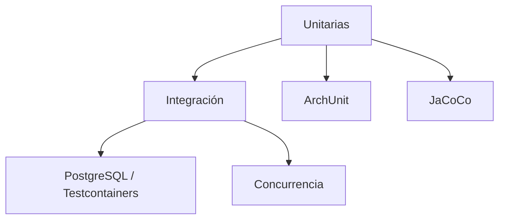

```powershell
.\mvnw.cmd -B clean verify
```

```bash
./mvnw -B clean verify
```

Cobertura y herramientas:

| Área | Herramienta |
|---|---|
| Unitarios | JUnit 5, Mockito |
| Integración | Spring Boot Test |
| Base de datos | Testcontainers PostgreSQL |
| Arquitectura | ArchUnit |
| Cobertura | JaCoCo |

## DevSecOps

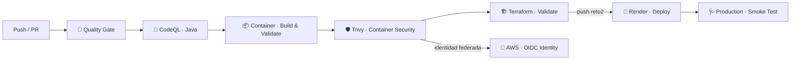

El pipeline combina calidad funcional, análisis estático, reproducibilidad de contenedor, escaneo de vulnerabilidades, validación de IaC, despliegue y smoke test. AWS aparece como una rama de identidad federada; no es el runtime de LISource.

| Job | Propósito | Qué valida | Riesgo que reduce | Si falla |
|---|---|---|---|---|
| 🧪 **Quality Gate** | compilar, probar y empaquetar | build y tests backend | regresiones funcionales | el flujo no continúa |
| 🔎 **CodeQL · Java** | análisis estático | patrones inseguros en código | defectos y vulnerabilidades | no se supera la validación SAST |
| 📦 **Container · Build & Validate** | construir imagen reproducible | Dockerfile y runtime esperado | diferencias local/CI | no hay artefacto válido para escanear |
| 🛡️ **Trivy · Container Security** | escanear imagen/artefactos | CVE relevantes | dependencias vulnerables | la imagen no supera el gate |
| 🏗️ **Terraform · Validate** | comprobar IaC | formato, init sin backend y validate | errores de infraestructura | la configuración cloud no se considera válida |
| 🚀 **Render · Deploy** | publicar backend | entrega automatizada | errores de operación manual | la versión no llega a producción |
| 🩺 **Production · Smoke Test** | verificar endpoints públicos | health/OpenAPI tras deploy | despliegues rotos | el workflow falla después del deploy |
| 🔐 **AWS · OIDC Identity** | obtener identidad temporal | trust policy y federación | access keys permanentes | la federación no queda validada |

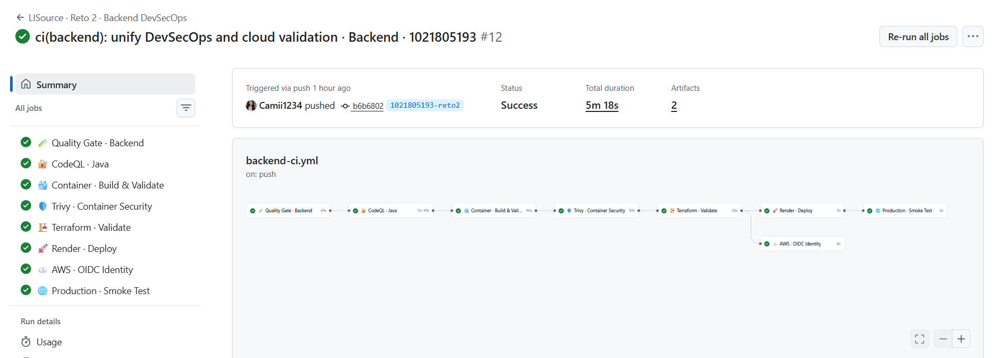

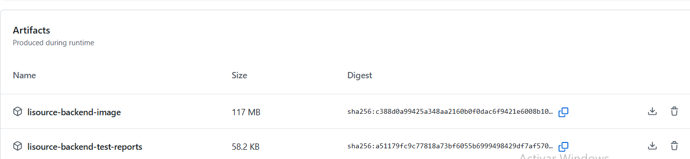

## AWS y despliegue

> [!IMPORTANT]
> AWS no aloja LISource. La app corre en Render, Vercel y Supabase. AWS se usa solo como identidad federada para GitHub Actions.

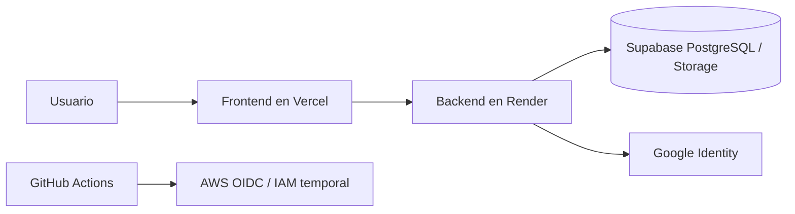

Terraform crea el provider OIDC de GitHub y los roles IAM necesarios para obtener credenciales temporales con `AssumeRoleWithWebIdentity`. La decisión evita access keys permanentes y reduce el riesgo de fuga de credenciales.


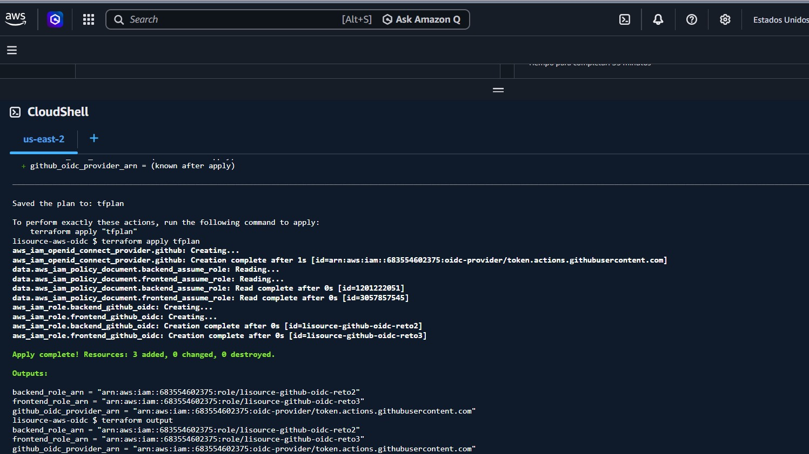

## Evidencias

Las evidencias visuales viven en `lisource-backend/docs/assets`. Este README las usa donde aportan contexto real:

- modelo relacional: [imagen base de datos](lisource-backend/docs/assets/database/modelo-relacional.png)
- CI/CD backend: [pipeline](lisource-backend/docs/assets/evidence/backend/ci-cd/01-backend-devsecops-pipeline-success.png) y [artefactos](lisource-backend/docs/assets/evidence/backend/ci-cd/02-backend-artifacts.png)
- cloud compartido: [Terraform init/validate](lisource-backend/docs/assets/evidence/shared/cloud/01-aws-terraform-init-validate.png) y [Terraform apply / OIDC](lisource-backend/docs/assets/evidence/shared/cloud/02-aws-terraform-apply-oidc-roles.png)

## Troubleshooting

| Problema | Causa probable | Solución |
|---|---|---|
| Java incorrecto | JDK distinto de 21 | revise `java --version` y apunte a JDK 21 |
| `.env` no se lee | archivo en ruta equivocada o con extensión oculta | ubique `lisource-backend/.env` y verifique `.env.txt` |
| Error de DB | scripts SQL no ejecutados o credenciales inválidas | ejecute 01 → 02 → 03 y confirme variables |
| `401` | access expirado o ausente | repita login o refresh |
| `403` | rol insuficiente o dominio inválido | use el usuario/rol correcto |
| `409` | solapamiento de reserva | cambie horario o equipo |
| Swagger no autoriza | se pegó el refresh token | copie solo el `accessToken` |
| Render tarda en responder | cold start | espere unos segundos y reintente health |
| Docker falla | imagen no reconstruida | vuelva a compilar y revisar logs |

## Glosario técnico

<details>
<summary>📖 Glosario técnico</summary>

| Término | Definición |
|---|---|
| JWT | token firmado que transporta identidad y roles de forma temporal |
| refresh token | credencial opaca para renovar el access token sin volver a iniciar sesión |
| OIDC | capa de identidad sobre OAuth 2.0 usada aquí para GitHub Actions y Google |
| STOMP | protocolo de mensajería usado para realtime sobre WebSocket |
| Problem Details | formato estándar de error HTTP con contexto legible |
| correlation ID | identificador único para rastrear una petición extremo a extremo |
| cold start | demora inicial cuando el servicio despierta tras estar inactivo |
| worktree | vista adicional del mismo repositorio sin hacer checkout constante |
| RLS | Row Level Security, control de acceso a nivel de fila en PostgreSQL |

</details>

## Referencias

- [Spring Boot](https://spring.io/projects/spring-boot)
- [Spring Security](https://spring.io/projects/spring-security)
- [PostgreSQL](https://www.postgresql.org/)
- [Supabase](https://supabase.com/)
- [Docker](https://www.docker.com/)
- [OpenAPI Initiative](https://www.openapis.org/)
- [GitHub Actions](https://docs.github.com/actions)
- [Terraform](https://developer.hashicorp.com/terraform)
- [AWS IAM OIDC](https://docs.aws.amazon.com/IAM/latest/UserGuide/id_roles_providers_oidc.html)
- [Render](https://render.com/)

<p align="center">
  
</p>
