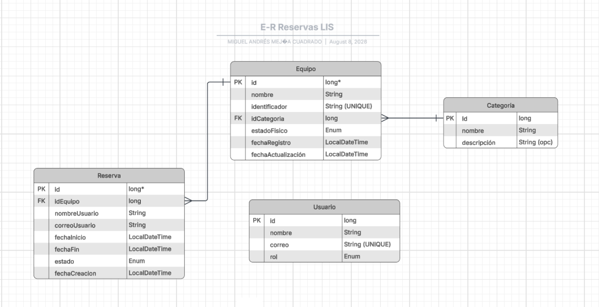

# Prueba Técnica LIS 2026-2 — Reto 2: Backend
## Sistema de Gestión y Reservas de Equipos

**Miguel Mejía**

Estudiante de Ingeniería de Sistemas

Universidad de Antioquia

## Tabla de contenido

- [Stack tecnológico](#stack-tecnológico)
- [Modelo de datos](#modelo-de-datos)
- [Estructura del proyecto](#estructura-del-proyecto)
- [Configuración y arranque](#configuración-y-arranque)
- [Endpoints](#endpoints)
- [Reglas de negocio](#reglas-de-negocio)
- [Decisiones de diseño](#decisiones-de-diseño)

---

## Stack tecnológico

| Componente | Tecnología |
|---|---|
| Lenguaje | Java 21 |
| Framework | Spring Boot 4.1.0 |
| Persistencia | Spring Data JPA |
| Base de datos | PostgreSQL (hospedado en [Supabase](https://supabase.com)) |
| Utilidades | Lombok |
| Documentación de API | springdoc-openapi (Swagger UI) |
| Autenticación *(pendiente)* | JWT + Google SSO |

---

## Modelo de datos

El diseño completo del modelo entidad-relación se pensó antes de escribir código, partiendo de los requerimientos obligatorios del reto.



**Entidades principales:**

- **Equipo** — inventario de hardware del laboratorio (nombre, identificador único, categoría, estado físico).
- **Categoria** — entidad independiente (no un enum fijo), para permitir que un administrador registre nuevas categorías sin recompilar el sistema.
- **Reserva** — franjas de tiempo reservadas por un usuario (identificado solo por nombre y correo) sobre un equipo específico.
- **Usuario** — exclusivamente para administración/autenticación (rol `ADMIN`). No tiene relación con `Reserva`.

---

## Estructura del proyecto

```
co.edu.lab.sistemas
├── model/            # Entidades JPA (Equipo, Categoria, Reserva, Usuario)
├── enums/            # Enums de dominio (EstadoFisico, EstadoReserva, Rol)
├── repository/        # Interfaces JpaRepository
├── service/           # Lógica de negocio (pendiente)
├── controller/         # Endpoints REST (pendiente)
├── dto/                # Objetos de request/response (pendiente)
├── exception/          # Manejo global de errores (pendiente)
└── config/             # Configuración (seguridad, JWT) (pendiente)
```

---

## Configuración y arranque

### 1. Clonar el repositorio

```powershell
git clone https://github.com/lisudea/technical-test-2026-2.git
cd technical-test-2026-2
git checkout 1032179304-reto2
```

### 2. Configurar la base de datos local

El proyecto usa PostgreSQL alojado en Supabase. El `application.properties` principal ya está preparado para delegar la configuración sensible a un archivo separado no versionado:

```properties
spring.application.name=gestion-reservas-equipos
spring.config.import=optional:classpath:application-local.properties
```

Para configurarlo:

1. Crea un archivo `application-local.properties` dentro de `src/main/resources` con el siguiente contenido:

```properties
spring.datasource.url=jdbc:postgresql://<host>:<puerto>/postgres
spring.datasource.username=postgres.<tu-project-ref>
spring.datasource.password=<tu-password>
spring.datasource.driver-class-name=org.postgresql.Driver

spring.jpa.hibernate.ddl-auto=update
spring.jpa.show-sql=true
spring.jpa.properties.hibernate.dialect=org.postgresql.PostgreSQL.PostgreSQLDialect
```

2. Completa los valores de conexión (`<host>`, `<puerto>`, `<tu-project-ref>`, `<tu-password>`) con tus propias credenciales de Supabase.
3. **No subas este archivo al repositorio** — ya está excluido vía `.gitignore`.

> **¿Necesitas conectarte a mi base de datos real?** Las credenciales de conexión son personales y no están expuestas en este repositorio por seguridad. Contáctame directamente en **miguemej07@gmail.com | m.mejia1@udea.edu.co]** y te las comparto.

### 3. Ejecutar el proyecto

```powershell
./mvnw spring-boot:run
```

La API debería quedar disponible en `http://localhost:8080`.

---

## Endpoints

> ⚠️ Sección en construcción — se irá completando a medida que se implementen los módulos.

### Equipos
| Método | Ruta | Descripción | Estado |
|---|---|---|---|
| POST | `/api/equipos` | Registrar equipo | 🔲 Pendiente |
| PUT | `/api/equipos/{id}` | Actualizar equipo | 🔲 Pendiente |
| GET | `/api/equipos/{id}` | Consultar equipo por id | 🔲 Pendiente |
| GET | `/api/equipos` | Listado paginado + filtros | 🔲 Pendiente |

### Categorías
| Método | Ruta | Descripción | Estado |
|---|---|---|---|
| POST | `/api/categorias` | Crear categoría | 🔲 Pendiente |
| GET | `/api/categorias` | Listar categorías | 🔲 Pendiente |

### Reservas
| Método | Ruta | Descripción | Estado |
|---|---|---|---|
| POST | `/api/reservas` | Crear reserva (valida solape) | 🔲 Pendiente |
| DELETE | `/api/reservas/{id}` | Cancelar reserva | 🔲 Pendiente |
| GET | `/api/reservas` | Listar reservas | 🔲 Pendiente |

### Bonus
| Método | Ruta | Descripción | Estado |
|---|---|---|---|
| GET | `/api/estadisticas/top-equipos` | Top 5 equipos más reservados | 🔲 Pendiente |
| POST | `/api/auth/login` | Login institucional (JWT) | 🔲 Pendiente |

---

## Reglas de negocio

- **Validación de solape de reservas:** al crear una reserva, el sistema rechaza la solicitud con `409 Conflict` si el equipo ya tiene otra reserva `ACTIVA` cuyo rango de tiempo se cruza con el solicitado.
- **Cancelación como soft-delete:** cancelar una reserva cambia su estado a `CANCELADA`, no elimina el registro (se conserva para históricos y estadísticas).
- **Disponibilidad derivada:** un equipo no tiene un campo de "disponible/reservado" — su disponibilidad en un momento dado se calcula consultando si existe una reserva activa que se solape con ese rango.

---

## Decisiones de diseño

- **`Categoria` es una entidad, no un enum:** el enunciado da ejemplos de categorías ("Microcontroladores, VR, Redes") sin cerrarlas a una lista fija, así que se modeló como tabla independiente para que un administrador pueda registrar nuevas sin recompilar el sistema.
- **`Usuario` no se relaciona con `Reserva`:** el enunciado especifica que quien reserva se identifica solo por nombre y correo, sin necesidad de cuenta. `Usuario` existe únicamente para la capa de administración/autenticación (bonus), manteniendo ambos conceptos desacoplados a propósito.
- **`estadoFisico` en `Equipo` no representa disponibilidad:** solo cubre condiciones físicas del equipo (`DISPONIBLE`, `MANTENIMIENTO`, `DE_BAJA`). Si el equipo está prestado en un momento específico es algo que se infiere de las reservas activas, no un campo propio — evita tener que sincronizar estado manualmente en cada reserva/cancelación.
- **IDs autogenerados con `IDENTITY`:** se usa `Long` con `GenerationType.IDENTITY` en vez de `UUID`, ya que no hay requisito de no-secuencialidad en los identificadores para este alcance.
