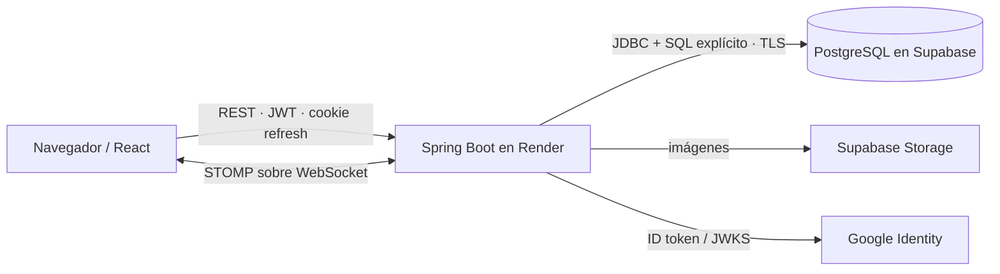

# LISource · Reto 2 · Backend

[](https://adoptium.net/)
[](https://spring.io/projects/spring-boot)
[](https://www.postgresql.org/)
[](.github/workflows/backend-ci.yml)
[](lisource-backend/Dockerfile)

API REST para gestionar, consultar y reservar equipos del Laboratorio Integrado de Sistemas (LIS). El backend concentra autenticación, autorización, reglas transaccionales, auditoría y acceso a PostgreSQL; el frontend nunca accede directamente a la base de datos.

**Producción:** [API](https://technical-test-2026-2-v96h.onrender.com) · [Swagger UI](https://technical-test-2026-2-v96h.onrender.com/swagger-ui/index.html) · [OpenAPI](https://technical-test-2026-2-v96h.onrender.com/v3/api-docs) · [Health](https://technical-test-2026-2-v96h.onrender.com/actuator/health) · [Frontend](https://lisource-1021805193.vercel.app)

## Indice

- [Cumplimiento de la prueba técnica](#cumplimiento-de-la-prueba-técnica)
- [Arquitectura](#arquitectura)
- [Ejecutar LISource desde cero](#ejecutar-lisource-desde-cero)
- [Variables de entorno](#variables-de-entorno)
- [Base de datos](#base-de-datos)
- [API y Postman](#api-y-postman)
- [Seguridad](#seguridad)
- [Pruebas y DevSecOps](#pruebas-y-devsecops)
- [Cloud y despliegue](#cloud-y-despliegue)
- [Documentación extendida](#documentación-extendida)

## Cumplimiento de la prueba técnica

| Requerimiento | Estado comprobado | Implementación | Endpoint | Código | Prueba | Evidencia |
|---|---|---|---|---|---|---|
| Registrar, actualizar y visualizar equipos con identificador, nombre, serial/MAC, categoría y estado | Cumple | DTO validado, identificador único y SQL parametrizado | `POST/PUT/GET /api/v1/equipment` | [`equipment`](lisource-backend/src/main/java/co/edu/udea/lis/lisource/equipment) | `LisourcePostgresIntegrationTest.enforcesAuthenticationPaginationFiltersAndRbac` | OpenAPI + integración PostgreSQL |
| Listado paginado y filtros por categoría/estado | Cumple | `page`, `pageSize`, `category`, `status`, búsqueda y sort con whitelist | `GET /api/v1/equipment` | `EquipmentController`, `EquipmentRepository` | integración de paginación, filtros y RBAC | [API](lisource-backend/docs/04-api-rest.md) |
| Crear, listar y cancelar reservas con inicio/fin | Cumple | agregado multi-equipo, propietario y cancelación histórica | `POST /reservations`, `GET /reservations/me`, `POST /{id}/cancel` | [`reservation`](lisource-backend/src/main/java/co/edu/udea/lis/lisource/reservation) | unitarias + Testcontainers | [Flujo](lisource-backend/docs/06-reservas-y-concurrencia.md) |
| Impedir doble reserva y responder conflicto | Cumple | transacción, locks ordenados `FOR UPDATE`, consulta de overlap `[inicio, fin)` y rollback atómico | `POST /api/v1/reservations` → `409` | `ReservationService`, `EquipmentRepository.lockInOrder`, `ReservationRepository.overlapExists` | adyacencia, overlap, concurrencia 201/409 y rollback multi-equipo | [Demostración](lisource-backend/docs/06-reservas-y-concurrencia.md) |
| Bonus: Top 5 histórico | Cumple | agregado SQL de reservas confirmadas; excluye canceladas | `GET /api/v1/statistics/top-equipment?limit=5` | `StatisticsRepository` | `topFiveExcludesCancelledReservations` | OpenAPI + Postman |
| Bonus: Google, dominio institucional, JWT y protección | Cumple por código/prueba; login Google interactivo requiere usuario | verificación Google, dominio exacto `@udea.edu.co`, JWT HS256 corto, refresh opaco HttpOnly y RBAC | `/api/v1/auth/*` | `GoogleIdTokenVerifier`, `EmailDomainPolicy`, `JwtService`, `SecurityConfig` | `AuthServiceGoogleTest`, `EmailDomainPolicyTest`, integración RBAC | [Seguridad](lisource-backend/docs/05-autenticacion-y-seguridad.md) |

La prueba pedía reservar un equipo. LISource admite varios `equipmentIds` en una sola reserva y conserva atomicidad: si uno entra en conflicto no se persiste ninguno. El intervalo es semiabierto: `10:00–11:00` y `11:00–12:00` son adyacentes porque el overlap real exige `inicioExistente < finNuevo` **y** `finExistente > inicioNuevo`.

## Arquitectura



Es un **monolito modular por feature**, no una arquitectura hexagonal pura. Cada módulo separa `api`, `application`, `domain` cuando aporta modelo y `infrastructure`; sin embargo, los servicios usan repositorios concretos y no todos tienen interfaces de puerto. El [mapeo preciso a puertos y adaptadores](lisource-backend/docs/02-arquitectura.md#mapeo-conceptual-a-puertos-y-adaptadores) evita afirmar una pureza que el código no implementa. No hay JPA/Hibernate: la persistencia usa `JdbcClient` y SQL visible.

## Ejecutar LISource desde cero

### Opción A · ramas tradicionales

```powershell
git clone <URL_DEL_REPOSITORIO> lisource
cd lisource
git switch 1021805193-reto2
cd lisource-backend
```

1. Cree `.env` con las instrucciones de [Variables de entorno](#variables-de-entorno).
2. Prepare PostgreSQL ejecutando, en orden, `01-estructura.sql`, `02-semilla.sql` y `03-pruebas.sql`.
3. Ejecute `./mvnw spring-boot:run` (Linux) o `.\mvnw.cmd spring-boot:run` (Windows).
4. Verifique `http://localhost:8080/actuator/health` y Swagger.
5. Detenga el backend, vuelva a la raíz, cambie a `1021805193-reto3`, configure `lisource-frontend/.env`, ejecute `npm ci` y `npm run dev`.

### Opción B · worktrees

```powershell
git worktree add ..\lisource-reto2 1021805193-reto2
git worktree add ..\lisource-reto3 1021805193-reto3
```

Permite mantener backend y frontend simultáneamente en carpetas distintas sin alternar checkout. No es obligatorio para evaluar el proyecto. Guías completas: [Windows](lisource-backend/docs/07-instalacion-windows.md) · [Linux](lisource-backend/docs/08-instalacion-linux.md).

## Variables de entorno

`.env.example` es la plantilla pública; `.env` es configuración runtime ignorada por Git. Los valores de evaluación se distribuyen fuera del repositorio:

1. Abra la [carpeta de evaluación en Drive](https://drive.google.com/drive/folders/1acpvFdobQNkvmGB5Q5b15UoR8ZOfqfgI?usp=sharing).
2. Copie `backend.txt` a `lisource-backend/.env` y `frontend.txt` a `lisource-frontend/.env` en sus ramas respectivas.
3. No publique, copie a documentación ni confirme esos valores. Esta distribución externa no se presenta como almacenamiento criptográfico.

El backend requiere nombres como `DB_*`, `JWT_*`, `GOOGLE_CLIENT_ID`, `CORS_ALLOWED_ORIGINS`, `SUPABASE_*`, cookies y SMTP; consulte solo [`lisource-backend/.env.example`](lisource-backend/.env.example).

## Base de datos

> [!CAUTION]
> `01-estructura.sql` elimina y reconstruye la estructura. **No lo ejecute contra una base con información que deba conservarse.**

Orden exacto: [`01-estructura.sql`](lisource-backend/src/main/resources/db/01-estructura.sql) → [`02-semilla.sql`](lisource-backend/src/main/resources/db/02-semilla.sql) → [`03-pruebas.sql`](lisource-backend/src/main/resources/db/03-pruebas.sql). El modelo normalizado de 20 tablas, claves, relaciones y RLS se explica en [Base de datos](lisource-backend/docs/03-base-de-datos.md).

## API y Postman

Base local: `http://localhost:8080`; las rutas funcionales parten de `/api/v1`. Swagger es el contrato interactivo y la [referencia REST](lisource-backend/docs/04-api-rest.md) resume autenticación, roles, cuerpos y códigos. La colección importable y dos entornos sin secretos están en [`postman/`](lisource-backend/postman/); vea la [guía Postman](lisource-backend/docs/09-postman.md).

## Seguridad

- Access token Bearer JWT HS256 corto, con `issuer`, `tokenUse`, `activeRole`, `sid`, `jti` y expiración.
- Refresh opaco en cookie `HttpOnly`; solo su SHA-256 llega a PostgreSQL y se rota al renovar.
- Contraseñas Argon2id; Google verifica firma/audience/issuer/email y dominio institucional exacto.
- CORS por allowlist, validación de `Origin`, DTO validation, SQL parametrizado, RBAC y Problem Details con correlation ID.
- Logout revoca refresh/sesión; un access token ya emitido sigue siendo stateless hasta expirar (no hay blacklist).

Threat model y límites: [Autenticación y seguridad](lisource-backend/docs/05-autenticacion-y-seguridad.md).

## Pruebas y DevSecOps

```powershell
cd lisource-backend
.\mvnw.cmd -B clean verify
```

La suite combina JUnit, Mockito, ArchUnit, Spring Security y PostgreSQL 16 con Testcontainers; JaCoCo genera reporte local sin publicar un porcentaje en este README. El workflow independiente ejecuta quality gate, CodeQL, build de contenedor, Trivy, validación Terraform, deploy Render, smoke test y AWS OIDC. Detalle: [Testing](lisource-backend/docs/10-testing.md) · [DevSecOps](lisource-backend/docs/11-devsecops.md).

## Cloud y despliegue

Producción usa Vercel (frontend), Render (backend) y Supabase (PostgreSQL/Storage). AWS no aloja la aplicación: demuestra identidad federada para CI mediante GitHub OIDC y roles temporales gestionados con Terraform. CI valida Terraform pero no ejecuta `apply`. Consulte [Cloud y deployment](lisource-backend/docs/12-cloud-y-deployment.md).

## Documentación extendida

| Documento | Contenido |
|---|---|
| [01 · Problema y requisitos](lisource-backend/docs/01-problema-y-requerimientos.md) | alcance y trazabilidad |
| [02 · Arquitectura](lisource-backend/docs/02-arquitectura.md) | contexto, contenedores, componentes, secuencias y paquetes |
| [03 · Base de datos](lisource-backend/docs/03-base-de-datos.md) | modelo conceptual/lógico y scripts |
| [04 · API REST](lisource-backend/docs/04-api-rest.md) | catálogo de endpoints y errores |
| [05 · Autenticación y seguridad](lisource-backend/docs/05-autenticacion-y-seguridad.md) | tokens, roles y amenazas |
| [06 · Reservas y concurrencia](lisource-backend/docs/06-reservas-y-concurrencia.md) | overlap, locks, rollback y 409 |
| [07 · Windows](lisource-backend/docs/07-instalacion-windows.md) / [08 · Linux](lisource-backend/docs/08-instalacion-linux.md) | instalación y ejecución |
| [09 · Postman](lisource-backend/docs/09-postman.md) | evaluación manual reproducible |
| [10 · Testing](lisource-backend/docs/10-testing.md) | alcance y límites de pruebas |
| [11 · DevSecOps](lisource-backend/docs/11-devsecops.md) | CI/CD, CodeQL y Trivy |
| [12 · Cloud](lisource-backend/docs/12-cloud-y-deployment.md) | Render, Supabase, AWS OIDC y Terraform |
| [13 · Troubleshooting](lisource-backend/docs/13-troubleshooting.md) | fallos frecuentes |
| [14 · Evidencias](lisource-backend/docs/14-evidencias.md) | capturas verificables y pendientes |
| [ADR](lisource-backend/docs/adr/README.md) | decisiones y trade-offs |
