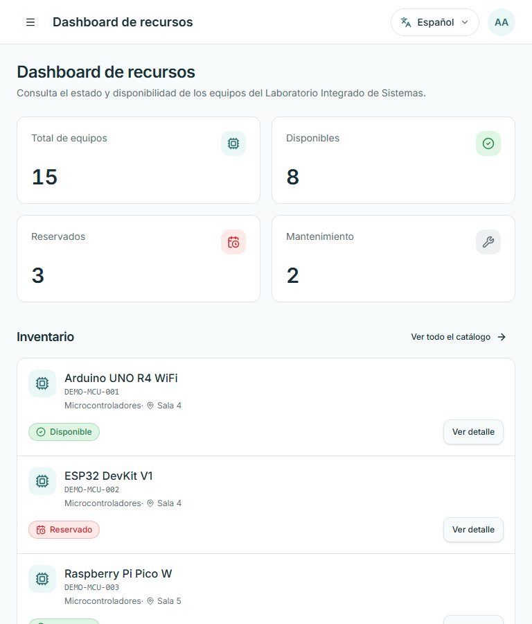
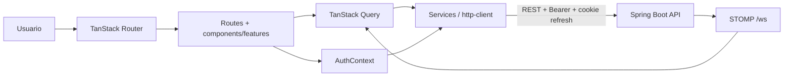

<div align="center">

# LISource Frontend

### Dashboard responsive de gestión y reservas del LIS · Reto 3

[](https://lisource-1021805193.vercel.app)
[](lisource-frontend/package.json)
[](lisource-frontend/package.json)
[](lisource-frontend/vite.config.ts)
[](lisource-frontend/src/i18n/index.ts)
[](.github/workflows/frontend-ci.yml)
[](lisource-frontend/Dockerfile)

</div>

Interfaz web responsive de LISource para consultar equipos del LIS, reservarlos sin solapamiento y administrar inventario según rol. Consume únicamente la API Spring Boot; el navegador nunca recibe credenciales ni conecta directamente a PostgreSQL/Supabase.

**Producción:** [Frontend](https://lisource-1021805193.vercel.app) · [API](https://technical-test-2026-2-v96h.onrender.com) · [Swagger](https://technical-test-2026-2-v96h.onrender.com/swagger-ui/index.html) · [Health](https://technical-test-2026-2-v96h.onrender.com/actuator/health)

## Índice

- [Cumplimiento](#cumplimiento)
- [Capturas responsive](#capturas-responsive)
- [Arquitectura y tecnologías](#arquitectura-y-tecnologías)
- [Inicio rápido](#inicio-rápido)
- [Responsive e internacionalización](#responsive-e-internacionalización)
- [API, autenticación y 409](#api-autenticación-y-409)
- [Testing, DevSecOps y despliegue](#testing-devsecops-y-despliegue)
- [Documentación](#documentación)

## Cumplimiento

El Reto 3 exigía un framework JS, diseño responsive, dashboard de equipos consumiendo Reto 2, estados visuales, filtros dinámicos, manejo amigable de errores e integración REST. El bonus era internacionalización ES/EN.

| Requisito | Estado | Implementación | Componente | API | Prueba | Evidencia |
|---|---|---|---|---|---|---|
| Framework/librería JS | Verificado | React 19 + TypeScript + TanStack Start/Router | [`router.tsx`](lisource-frontend/src/router.tsx) · [rutas](lisource-frontend/src/routes) | — | `npm run build` en Quality Gate | [Arquitectura](lisource-frontend/docs/02-arquitectura-frontend.md) |
| Dashboard principal | Verificado | resumen operacional y muestra de inventario con estados | [`routes/index.tsx`](lisource-frontend/src/routes/index.tsx) | `GET /api/v1/dashboard/summary` · `GET /api/v1/equipment` | build + auditoría responsive | [320/768/1440](#capturas-responsive) |
| Listado paginado y filtros dinámicos | Verificado | búsqueda, categoría, estado, página y query keys | [EquipmentFilters](lisource-frontend/src/features/equipment/equipment-filters.tsx) · [EquipmentList](lisource-frontend/src/features/equipment/equipment-list.tsx) | `GET /api/v1/equipment` | revisión de servicio/query + prueba de filtros del backend | [API/estado](lisource-frontend/docs/04-api-y-estado-remoto.md) |
| Estados visuales claros | Verificado | badges/iconos verde, rojo y gris con texto; no depende solo del color | [StatusBadge](lisource-frontend/src/components/common/status-badge.tsx) | estado visual de equipos | tests de branding/idioma + capturas | [Dashboard](#capturas-responsive) |
| Reservar, listar y cancelar | Verificado por código/API | formulario validado, reservas propias y cancelación | [ReservationDialog](lisource-frontend/src/features/reservations/reservation-dialog.tsx) · [`routes/reservas.tsx`](lisource-frontend/src/routes/reservas.tsx) | `POST /api/v1/reservations` · `GET /api/v1/reservations/me` · `POST /api/v1/reservations/{id}/cancel` | build + pruebas de reservas del backend; no hay E2E versionado | [Flujo y límite](lisource-frontend/docs/06-reservas.md) |
| Error amigable ante solapamiento | Verificado por código/test | Problem Details → `ApiError`; `409` conserva el diálogo y muestra acción correctiva | [ReservationDialog](lisource-frontend/src/features/reservations/reservation-dialog.tsx) · [`api-error.ts`](lisource-frontend/src/lib/api-error.ts) | `409 RESERVATION_CONFLICT` | [`api-error.test.ts`](lisource-frontend/src/lib/api-error.test.ts) | [Reservas](lisource-frontend/docs/06-reservas.md) |
| Responsive móvil/escritorio | Verificado | inventario usa cards bajo `xl`; admin usa cards bajo `md`; overlays acotados al viewport | layout, equipos, admin y primitives Radix | — | 10 rutas × 11 anchos = 110 combinaciones | [Metodología](lisource-frontend/docs/03-responsive-y-accesibilidad.md) |
| Integración REST/autenticación | Verificado | cliente central, Bearer en memoria, refresh cookie y retry único | [`http-client.ts`](lisource-frontend/src/services/http-client.ts) · [AuthContext](lisource-frontend/src/features/auth/auth-context.tsx) | `/api/v1` | tests de login/logout/perfil/sesión | [Autenticación](lisource-frontend/docs/05-autenticacion.md) |
| Bonus i18n | Supera ES/EN | ES, EN, FR, PT, DE e IT con catálogos reales | [i18n](lisource-frontend/src/i18n) · [locales](lisource-frontend/src/locales) | preferencia en perfil | `languages.test` + `i18n-keys.test` | [Selector de seis idiomas](lisource-frontend/docs/14-evidencias.md) |
| Adicional: Top 5 y tiempo real | Verificado por código/API | barras CSS en vista activa; STOMP invalida queries | [`estadisticas.tsx`](lisource-frontend/src/routes/estadisticas.tsx) · [`realtime.service.ts`](lisource-frontend/src/services/realtime.service.ts) | `GET /api/v1/statistics/top-equipment` · `/ws` | backend prueba STOMP/Top 5 | [Alcance honesto](lisource-frontend/docs/01-requerimientos.md) |

> **Límite de alcance:** el frontend implementa administración visual de equipos. Los dominios administrativos adicionales expuestos por el backend —usuarios, roles, categorías, ubicaciones, configuración y auditoría— permanecen disponibles mediante API/Swagger/Postman, pero no se presentan aquí como pantallas del Reto 3.

## Capturas responsive

| 320 px | 768 px | 1440 px |
|---|---|---|
|  |  |  |

Más evidencia: [login, reservas, menú, dropdowns y diálogos](lisource-frontend/docs/14-evidencias.md).

## Arquitectura y tecnologías



Es una aplicación React 19/TypeScript organizada por rutas, features, componentes compartidos, services, i18n y tipos. `VITE_DATA_MODE=api` usa backend real; `mock` permite explorar sin mutar la arquitectura. [Diagramas completos](lisource-frontend/docs/02-arquitectura-frontend.md).

| Área | Tecnología real | Versión/fuente |
|---|---|---|
| UI/runtime | React, TypeScript, Vite, TanStack Start/Router | React 19.2 · TypeScript 5.8 · Vite 8.2 |
| Datos | TanStack Query, servicios REST y STOMP | Query 5.101 · STOMP 7.3 |
| Diseño/formularios | Tailwind CSS, Radix UI, React Hook Form, Zod | Tailwind 4.2 · RHF 7.71 · Zod 3.24 |
| i18n | i18next + react-i18next | seis catálogos verificados |
| Gráficas | barras CSS en Top 5; Recharts disponible en componente base | no se atribuye Recharts a la vista activa |
| Calidad/entrega | Vitest, Testing Library, ESLint, Docker, CodeQL, Trivy, Actions | Node 22 en CI |
| Cloud | Vercel, Render API, Supabase indirecto, AWS OIDC | AWS no aloja la app |

[Por qué se eligieron estas alternativas](lisource-frontend/docs/15-decisiones-arquitectonicas.md).

## Inicio rápido

Requiere Git y Node.js 22/npm; Docker es opcional. Para API real, inicie primero base de datos y backend en Reto 2.

```powershell
git clone <URL> lisource
cd lisource
git switch 1021805193-reto3
cd lisource-frontend
# Descargue frontend.txt desde Drive y guárdelo aquí como .env
npm ci
npm run dev
```

Abra `http://localhost:3000`. Variables públicas de build:

```dotenv
VITE_API_URL=http://localhost:8080/api/v1
VITE_DATA_MODE=api
VITE_GOOGLE_CLIENT_ID=
```

Valores de evaluación: abra [la carpeta de Drive](https://drive.google.com/drive/folders/1acpvFdobQNkvmGB5Q5b15UoR8ZOfqfgI?usp=sharing), descargue `frontend.txt`, renómbrelo `.env` y ubíquelo en `lisource-frontend/.env`. `.env.example` documenta los nombres, pero no reemplaza ese archivo de evaluación. `VITE_*` es visible en el bundle: no coloque secretos. Guías: [Windows](lisource-frontend/docs/08-instalacion-windows.md) · [Linux](lisource-frontend/docs/09-instalacion-linux.md).

Para ejecutar el sistema completo, prepare/inicie primero backend y DB en la rama `1021805193-reto2`, luego este frontend. Puede usar branches tradicionales o `git worktree` para mantener ambas ramas en directorios simultáneos.

## Responsive e internacionalización

Se probaron las 10 rutas reales en 11 anchos: 320, 360, 375, 390, 414, 480, 640, 768, 1024, 1280 y 1440 px. Además se abrieron navegación móvil, selectores y diálogos. El inventario usa cards hasta `xl`; administración de equipos usa cards bajo `md`. No quedaron desbordamientos horizontales en el barrido final. [Metodología y límites](lisource-frontend/docs/03-responsive-y-accesibilidad.md).

El bonus ES/EN se supera con español, inglés, francés, portugués, alemán e italiano. Los catálogos comparten claves verificadas automáticamente; agregar un idioma implica registrar la opción y un JSON completo, no duplicar strings por ruta. [Arquitectura i18n](lisource-frontend/docs/07-internacionalizacion.md).

## API, autenticación y 409

`http-client` adjunta el access token guardado solo en memoria y reintenta una vez tras refresh por cookie HttpOnly. TanStack Query maneja cache/invalidation. Un `409` al reservar se conserva como conflicto de dominio: el diálogo informa y permite ajustar horario/equipo; no se presenta como error técnico genérico. El frontend oculta acciones por rol para UX, pero el backend vuelve a autorizarlas.

## Testing, DevSecOps y despliegue

```powershell
npm ci
npm test
npm run lint
npm run build
```

El workflow independiente de Reto 3 ejecuta quality gate con Node 22, CodeQL, build Docker, Trivy, deploy Vercel, smoke de frontend/backend y asunción AWS temporal por OIDC. Los path filters limitan ejecuciones a cambios del frontend/workflow. AWS entrega identidad temporal; producción continúa en Vercel + Render + Supabase. [Detalle](lisource-frontend/docs/11-devsecops.md) · [Deployment](lisource-frontend/docs/12-deployment.md).

| Pipeline frontend | AWS OIDC/Terraform |
|---|---|
| [](lisource-frontend/docs/14-evidencias.md#cicd) | [](lisource-frontend/docs/14-evidencias.md#cloud-compartido) |

## Documentación

- [Requerimientos](lisource-frontend/docs/01-requerimientos.md) · [Arquitectura](lisource-frontend/docs/02-arquitectura-frontend.md)
- [Responsive](lisource-frontend/docs/03-responsive-y-accesibilidad.md) · [API/Query](lisource-frontend/docs/04-api-y-estado-remoto.md)
- [Autenticación](lisource-frontend/docs/05-autenticacion.md) · [Reservas](lisource-frontend/docs/06-reservas.md) · [i18n](lisource-frontend/docs/07-internacionalizacion.md)
- [Windows](lisource-frontend/docs/08-instalacion-windows.md) · [Linux](lisource-frontend/docs/09-instalacion-linux.md)
- [Testing](lisource-frontend/docs/10-testing.md) · [DevSecOps](lisource-frontend/docs/11-devsecops.md) · [Deployment](lisource-frontend/docs/12-deployment.md)
- [Troubleshooting](lisource-frontend/docs/13-troubleshooting.md) · [Evidencias](lisource-frontend/docs/14-evidencias.md) · [Decisiones](lisource-frontend/docs/15-decisiones-arquitectonicas.md)
