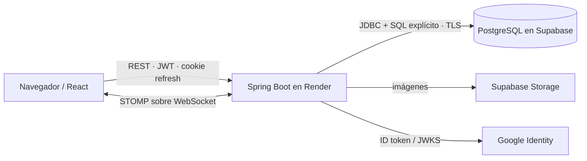

<div align="center">

# LISource Backend

### Sistema de gestión y reservas de recursos del LIS · Reto 2

[](https://technical-test-2026-2-v96h.onrender.com)
[](https://technical-test-2026-2-v96h.onrender.com/swagger-ui/index.html)
[](https://adoptium.net/)
[](lisource-backend/pom.xml)
[](lisource-backend/src/main/resources/db/01-estructura.sql)
[](.github/workflows/backend-ci.yml)
[](lisource-backend/Dockerfile)
[](lisource-backend/postman/LISource-Reto2.postman_collection.json)

</div>

API REST para gestionar, consultar y reservar equipos del Laboratorio Integrado de Sistemas (LIS). El backend concentra autenticación, autorización, reglas transaccionales, auditoría y acceso a PostgreSQL; el frontend nunca accede directamente a la base de datos.

**Producción:** [API](https://technical-test-2026-2-v96h.onrender.com) · [Swagger UI](https://technical-test-2026-2-v96h.onrender.com/swagger-ui/index.html) · [OpenAPI](https://technical-test-2026-2-v96h.onrender.com/v3/api-docs) · [Health](https://technical-test-2026-2-v96h.onrender.com/actuator/health) · [Frontend](https://lisource-1021805193.vercel.app)

## Índice

- [Problema y cumplimiento](#problema-y-cumplimiento)
- [Arquitectura y tecnologías](#arquitectura-y-tecnologías)
- [Evidencia principal](#evidencia-principal)
- [Ejecutar LISource desde cero](#ejecutar-lisource-desde-cero)
- [Configuración, datos y API](#configuración-datos-y-api)
- [Abrir y probar Swagger](#abrir-y-probar-swagger)
- [Reservas y seguridad](#reservas-y-seguridad)
- [Calidad, DevSecOps y cloud](#calidad-devsecops-y-cloud)
- [Documentación extendida](#documentación-extendida)

## Problema y cumplimiento

El Reto 2 solicitó una API para registrar, actualizar y visualizar equipos; listarlos con paginación y filtros por categoría/estado; y crear, listar y cancelar reservas identificadas por usuario y franja horaria. La regla decisiva era rechazar cualquier solapamiento con un código HTTP apropiado. Como bonus se evaluaban el Top 5 histórico y Google SSO institucional con JWT.

**Criterio de lectura:** “verificado” significa que la fila tiene implementación y prueba automática rastreables. Una captura complementa esa evidencia, pero no sustituye el código ni el test.

| Requisito | Estado | Cómo se resolvió | Endpoint | Código | Prueba | Evidencia |
|---|---|---|---|---|---|---|
| Gestión de equipos: alta, actualización y consulta con ID, nombre, serial/MAC, categoría y estado | Verificado | DTO validado, código único, restricciones SQL y autorización Admin para mutaciones | `POST /api/v1/equipment` · `PUT /api/v1/equipment/{id}` · `GET /api/v1/equipment[/{id}]` | [EquipmentController](lisource-backend/src/main/java/co/edu/udea/lis/lisource/equipment/api/EquipmentController.java) · [EquipmentRepository](lisource-backend/src/main/java/co/edu/udea/lis/lisource/equipment/infrastructure/EquipmentRepository.java) | [Integración PostgreSQL/RBAC](lisource-backend/src/test/java/co/edu/udea/lis/lisource/LisourcePostgresIntegrationTest.java) | [OpenAPI/Postman](lisource-backend/docs/04-api-rest.md) |
| Listado paginado y filtros por categoría/estado | Verificado | `page`, `pageSize`, `category`, `status`, búsqueda y ordenamiento con whitelist | `GET /api/v1/equipment` | [EquipmentController](lisource-backend/src/main/java/co/edu/udea/lis/lisource/equipment/api/EquipmentController.java) · [EquipmentRepository](lisource-backend/src/main/java/co/edu/udea/lis/lisource/equipment/infrastructure/EquipmentRepository.java) | `enforcesAuthenticationPaginationFiltersAndRbac` | [Colección: 59 requests](lisource-backend/docs/09-postman.md) |
| Crear, listar y cancelar reservas con usuario, correo e inicio/fin | Verificado | usuario autenticado, lista propia, cancelación histórica y soporte multi-equipo | `POST /api/v1/reservations` · `GET /api/v1/reservations/me` · `POST /api/v1/reservations/{id}/cancel` | [ReservationController](lisource-backend/src/main/java/co/edu/udea/lis/lisource/reservation/api/ReservationController.java) · [ReservationService](lisource-backend/src/main/java/co/edu/udea/lis/lisource/reservation/application/ReservationService.java) | [Unitarias e integración](lisource-backend/src/test/java/co/edu/udea/lis/lisource/reservation/application/ReservationServiceTest.java) | [Flujo verificable](lisource-backend/docs/06-reservas-y-concurrencia.md) |
| Regla crítica: impedir solapamiento y responder HTTP adecuado | Verificado | `@Transactional`, locks ordenados `FOR UPDATE`, overlap `[inicio, fin)` y rollback atómico | `POST /api/v1/reservations` → `409 Conflict` | [ReservationService](lisource-backend/src/main/java/co/edu/udea/lis/lisource/reservation/application/ReservationService.java) · [ReservationRepository](lisource-backend/src/main/java/co/edu/udea/lis/lisource/reservation/infrastructure/ReservationRepository.java) | adyacencia, overlap, concurrencia (un éxito/un conflicto) y rollback multi-equipo | [Regla completa](lisource-backend/docs/06-reservas-y-concurrencia.md) |
| Bonus: Top 5 histórico | Verificado | agregado SQL de reservas confirmadas; las canceladas no aportan | `GET /api/v1/statistics/top-equipment?limit=5` | [StatisticsRepository](lisource-backend/src/main/java/co/edu/udea/lis/lisource/statistics/infrastructure/StatisticsRepository.java) | `topFiveExcludesCancelledReservations` | [API + Postman](lisource-backend/docs/04-api-rest.md) |
| Bonus: Google SSO, `@udea.edu.co`, JWT y rutas protegidas | Verificado por código/test | validación del ID token, dominio exacto, JWT HS256 corto, refresh opaco HttpOnly y RBAC | `POST /api/v1/auth/google` y rutas protegidas | [GoogleIdTokenVerifier](lisource-backend/src/main/java/co/edu/udea/lis/lisource/auth/infrastructure/GoogleIdTokenVerifier.java) · [SecurityConfig](lisource-backend/src/main/java/co/edu/udea/lis/lisource/shared/security/SecurityConfig.java) | [AuthServiceGoogleTest](lisource-backend/src/test/java/co/edu/udea/lis/lisource/auth/application/AuthServiceGoogleTest.java) · [EmailDomainPolicyTest](lisource-backend/src/test/java/co/edu/udea/lis/lisource/auth/application/EmailDomainPolicyTest.java) | [Seguridad](lisource-backend/docs/05-autenticacion-y-seguridad.md) |

La prueba pedía reservar un equipo. LISource admite varios `equipmentIds` en una sola reserva y conserva atomicidad: si uno entra en conflicto no se persiste ninguno. El intervalo es semiabierto: `10:00–11:00` y `11:00–12:00` son adyacentes porque el overlap real exige `inicioExistente < finNuevo` **y** `finExistente > inicioNuevo`.

## Arquitectura y tecnologías



Es un **monolito modular por feature**, no una arquitectura hexagonal pura. Cada módulo separa `api`, `application`, `domain` cuando aporta modelo y `infrastructure`; sin embargo, los servicios usan repositorios concretos y no todos tienen interfaces de puerto. El [mapeo preciso a puertos y adaptadores](lisource-backend/docs/02-arquitectura.md#mapeo-conceptual-a-puertos-y-adaptadores) evita afirmar una pureza que el código no implementa. No hay JPA/Hibernate: la persistencia usa `JdbcClient` y SQL visible.

| Área | Tecnología real | Versión/fuente |
|---|---|---|
| Runtime | Java, Spring Boot, Spring Security | Java 21 · Spring Boot 3.5.16 · [`pom.xml`](lisource-backend/pom.xml) |
| Persistencia | `JdbcClient`/JDBC, PostgreSQL, Supabase | PostgreSQL 16 en integración · 20 tablas |
| Contrato/seguridad | Springdoc OpenAPI, OAuth2 Resource Server, JWT HS256, Google Identity, Argon2id | Springdoc 2.8.13 |
| Calidad | JUnit, Mockito, Testcontainers, ArchUnit, JaCoCo | ArchUnit 1.4.1 · JaCoCo 0.8.13 |
| Entrega | Maven Wrapper, Docker, GitHub Actions, CodeQL, Trivy | Maven 3.9.11 · wrapper 3.3.4 |
| Cloud | Render, Supabase, AWS IAM/OIDC, Terraform | Terraform 1.15.x · provider AWS 6.51.0 |

## Evidencia principal

| Evidencia | Qué demuestra | Alcance |
|---|---|---|
| [Pipeline backend exitoso](lisource-backend/docs/14-evidencias.md#ci-backend) | quality, CodeQL, Docker, Trivy, Terraform, deploy, OIDC y smoke del run capturado | evidencia histórica del commit mostrado |
| [Modelo relacional](lisource-backend/docs/14-evidencias.md#modelo-relacional) | las 20 tablas y relaciones del dominio | complementa SQL y test estructural |
| [AWS/Terraform](lisource-backend/docs/14-evidencias.md#aws-oidcterraform) | provider OIDC y dos roles creados de forma controlada | AWS es identidad de CI, no hosting |

| CI/CD backend | Modelo relacional | AWS OIDC/Terraform |
|---|---|---|
| [](lisource-backend/docs/14-evidencias.md#ci-backend) | [](lisource-backend/docs/14-evidencias.md#modelo-relacional) | [](lisource-backend/docs/14-evidencias.md#aws-oidcterraform) |

Las imágenes son accesos rápidos; el documento de evidencias explica qué demuestra y qué no demuestra cada una.

## Ejecutar LISource desde cero

Esta es la ruta principal de evaluación. Las ramas tradicionales son suficientes; `git worktree` es opcional.

1. Instale Git, JDK 21 y Node.js 22/npm. Docker, Postman y `psql` son opcionales según la prueba.
2. Clone el repositorio y entre a la rama backend:

   ```powershell
   git clone <URL_DEL_REPOSITORIO> lisource
   cd lisource
   git switch 1021805193-reto2
   cd lisource-backend
   ```

3. Abra la [carpeta de credenciales de evaluación](https://drive.google.com/drive/folders/1acpvFdobQNkvmGB5Q5b15UoR8ZOfqfgI?usp=sharing).
4. Descargue `backend.txt`, renómbrelo `.env` y ubíquelo en `lisource-backend/.env`.
5. En una base nueva/descartable ejecute `01-estructura.sql`.
6. Ejecute `02-semilla.sql`.
7. Ejecute `03-pruebas.sql` para cargar datos de demostración.
8. Inicie backend: Windows `.\mvnw.cmd spring-boot:run`; Linux `./mvnw spring-boot:run`. No necesita Maven global.
9. Verifique `http://localhost:8080/actuator/health`.
10. Abra `http://localhost:8080/swagger-ui/index.html`.
11. Pruebe login y API con [Postman](lisource-backend/docs/09-postman.md).
12. Detenga backend solo si reutilizará la misma carpeta; vuelva a la raíz y cambie a `1021805193-reto3`. Para mantener ambos activos use dos worktrees.
13. Entre en `lisource-frontend`.
14. Descargue `frontend.txt` desde la misma carpeta de Drive, renómbrelo `.env` y ubíquelo en `lisource-frontend/.env`.
15. Ejecute `npm ci` y luego `npm run dev`.
16. Abra `http://localhost:3000`.
17. Verifique login, dashboard, filtros y una reserva contra el backend.

### Opción B · worktrees

```powershell
git worktree add ..\lisource-reto2 1021805193-reto2
git worktree add ..\lisource-reto3 1021805193-reto3
```

Permite mantener backend y frontend simultáneamente en carpetas distintas sin alternar checkout. No es obligatorio. Guías completas: [Windows](lisource-backend/docs/07-instalacion-windows.md) · [Linux](lisource-backend/docs/08-instalacion-linux.md).

## Configuración, datos y API

### Variables de entorno

`.env.example` es la plantilla pública; `.env` es configuración runtime ignorada por Git. Los valores de evaluación se distribuyen fuera del repositorio:

1. Abra la [carpeta de evaluación en Drive](https://drive.google.com/drive/folders/1acpvFdobQNkvmGB5Q5b15UoR8ZOfqfgI?usp=sharing).
2. Descargue `backend.txt` y `frontend.txt`.
3. Renombre cada copia como `.env` y colóquela en `lisource-backend/.env` o `lisource-frontend/.env`, respectivamente.
4. Use `.env.example` para conocer el propósito y nombre de cada variable, no como sustituto de los valores de evaluación.
5. No publique, copie a documentación ni confirme esos valores. Drive es el canal de entrega para la evaluación; no se presenta como un gestor de secretos.

El backend requiere nombres como `DB_*`, `JWT_*`, `GOOGLE_CLIENT_ID`, `CORS_ALLOWED_ORIGINS`, `SUPABASE_*`, cookies y SMTP; consulte solo [`lisource-backend/.env.example`](lisource-backend/.env.example).

### Base de datos

> [!CAUTION]
> `01-estructura.sql` elimina y reconstruye la estructura. **No lo ejecute contra una base con información que deba conservarse.**

Orden exacto: [`01-estructura.sql`](lisource-backend/src/main/resources/db/01-estructura.sql) → [`02-semilla.sql`](lisource-backend/src/main/resources/db/02-semilla.sql) → [`03-pruebas.sql`](lisource-backend/src/main/resources/db/03-pruebas.sql). El modelo normalizado de 20 tablas, claves, relaciones y RLS se explica en [Base de datos](lisource-backend/docs/03-base-de-datos.md).

### API y Postman

Base local: `http://localhost:8080`; las rutas funcionales parten de `/api/v1`. Swagger es el contrato interactivo y la [referencia REST](lisource-backend/docs/04-api-rest.md) resume autenticación, roles, cuerpos y códigos. La colección importable y dos entornos sin secretos están en [`postman/`](lisource-backend/postman/); vea la [guía Postman](lisource-backend/docs/09-postman.md).

## Abrir y probar Swagger

Swagger permite consultar y ejecutar los endpoints sin instalar Postman:

1. En producción abra [Swagger UI](https://technical-test-2026-2-v96h.onrender.com/swagger-ui/index.html). Para ejecución local use `http://localhost:8080/swagger-ui/index.html`.
2. Si Render estaba inactivo, espere la primera carga y compruebe [Health](https://technical-test-2026-2-v96h.onrender.com/actuator/health).
3. Despliegue **Authentication** → `POST /api/v1/auth/login` → **Try it out**.
4. Escriba el correo y la contraseña de evaluación suministrados de forma privada; nunca los copie al repositorio:

   ```json
   {
     "email": "CORREO_DE_EVALUACION",
     "password": "CONTRASENA_DE_EVALUACION"
   }
   ```

5. Pulse **Execute**. Una autenticación válida devuelve `200 OK`. Copie el `accessToken` de la respuesta.
6. Pulse **Authorize** en la parte superior, pegue el token en el esquema Bearer y confirme. Desde ese momento puede ejecutar las rutas protegidas.

Pruebas rápidas recomendadas:

| Qué validar | Operación y ejemplo | Resultado esperado |
|---|---|---|
| Paginación y filtros | `GET /api/v1/equipment?page=1&pageSize=10&status=ALL&sort=name,asc` | `200 OK` y una página de equipos |
| Top 5 | `GET /api/v1/statistics/top-equipment?limit=5` | `200 OK` con hasta cinco equipos |
| Reserva válida | ejecute una vez el cuerpo mostrado abajo con un equipo operativo y una franja futura libre | `201 Created` |
| Solapamiento | repita exactamente el mismo equipo y horario | `409 Conflict` con `code: RESERVATION_CONFLICT` |

```json
{
  "equipmentIds": [1],
  "startsAt": "2026-08-20T10:00:00-05:00",
  "endsAt": "2026-08-20T11:00:00-05:00",
  "notes": "Prueba de reserva desde Swagger"
}
```

Cambie el ID y la fecha si el equipo ya está ocupado. Para una validación completa y encadenada, la colección Postman incluida conserva 59 solicitudes y guarda automáticamente los tokens de la sesión.

## Reservas y seguridad

### Regla crítica `[inicio, fin)`

> [!IMPORTANT]
> Reserva A `10:00–11:00` y Reserva B `11:00–12:00` **no** entran en conflicto. Reserva C `10:30–11:30` **sí** entra en conflicto. El backend bloquea equipos en orden, consulta el overlap dentro de la misma transacción y devuelve `409 Conflict` con Problem Details si detecta solapamiento.

La trazabilidad requisito → diseño → código → prueba → respuesta se explica en [Reservas y concurrencia](lisource-backend/docs/06-reservas-y-concurrencia.md).

### Seguridad

- Access token Bearer JWT HS256 corto, con `issuer`, `tokenUse`, `activeRole`, `sid`, `jti` y expiración.
- Refresh opaco en cookie `HttpOnly`; solo su SHA-256 llega a PostgreSQL y se rota al renovar.
- Contraseñas Argon2id; Google verifica firma/audience/issuer/email y dominio institucional exacto.
- CORS por allowlist, validación de `Origin`, DTO validation, SQL parametrizado, RBAC y Problem Details con correlation ID.
- Logout revoca refresh/sesión; un access token ya emitido sigue siendo stateless hasta expirar (no hay blacklist).

Threat model y límites: [Autenticación y seguridad](lisource-backend/docs/05-autenticacion-y-seguridad.md).

## Calidad, DevSecOps y cloud

### Pruebas y DevSecOps

```powershell
cd lisource-backend
.\mvnw.cmd -B clean verify
```

La suite combina JUnit, Mockito, ArchUnit, Spring Security y PostgreSQL 16 con Testcontainers; JaCoCo genera reporte local sin publicar un porcentaje en este README. El workflow independiente ejecuta quality gate, CodeQL, build de contenedor, Trivy, validación Terraform, deploy Render, smoke test y AWS OIDC. Detalle: [Testing](lisource-backend/docs/10-testing.md) · [DevSecOps](lisource-backend/docs/11-devsecops.md).

### Cloud y despliegue

Producción usa Vercel (frontend), Render (backend) y Supabase (PostgreSQL/Storage). AWS no aloja la aplicación: demuestra identidad federada para CI mediante GitHub OIDC y roles temporales gestionados con Terraform. CI valida Terraform pero no ejecuta `apply`. Consulte [Cloud y deployment](lisource-backend/docs/12-cloud-y-deployment.md).

## Documentación extendida

| Documento | Contenido |
|---|---|
| [01 · Problema y requisitos](lisource-backend/docs/01-problema-y-requerimientos.md) | alcance y trazabilidad |
| [02 · Arquitectura](lisource-backend/docs/02-arquitectura.md) | contexto, contenedores, componentes, secuencias y paquetes |
| [03 · Base de datos](lisource-backend/docs/03-base-de-datos.md) | modelo conceptual/lógico y scripts |
| [04 · API REST](lisource-backend/docs/04-api-rest.md) | catálogo de endpoints y errores |
| [05 · Autenticación y seguridad](lisource-backend/docs/05-autenticacion-y-seguridad.md) | tokens, roles y amenazas |
| [06 · Reservas y concurrencia](lisource-backend/docs/06-reservas-y-concurrencia.md) | overlap, locks, rollback y 409 |
| [07 · Windows](lisource-backend/docs/07-instalacion-windows.md) / [08 · Linux](lisource-backend/docs/08-instalacion-linux.md) | instalación y ejecución |
| [09 · Postman](lisource-backend/docs/09-postman.md) | evaluación manual reproducible |
| [10 · Testing](lisource-backend/docs/10-testing.md) | alcance y límites de pruebas |
| [11 · DevSecOps](lisource-backend/docs/11-devsecops.md) | CI/CD, CodeQL y Trivy |
| [12 · Cloud](lisource-backend/docs/12-cloud-y-deployment.md) | Render, Supabase, AWS OIDC y Terraform |
| [13 · Troubleshooting](lisource-backend/docs/13-troubleshooting.md) | fallos frecuentes |
| [14 · Evidencias](lisource-backend/docs/14-evidencias.md) | capturas reales disponibles |
| [ADR](lisource-backend/docs/adr/README.md) | decisiones y trade-offs |
