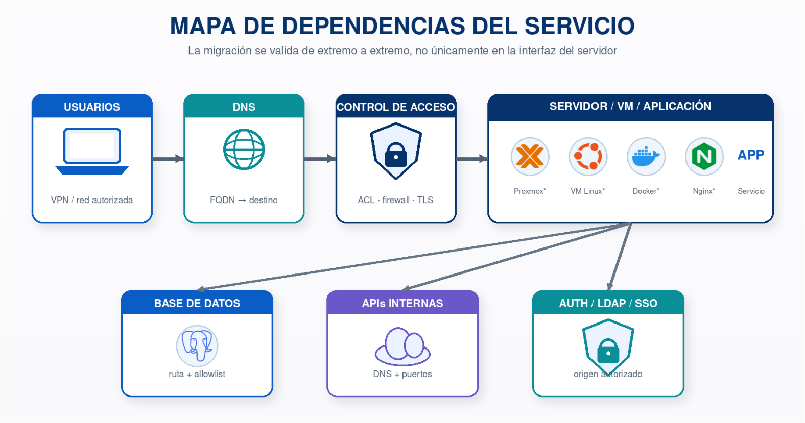
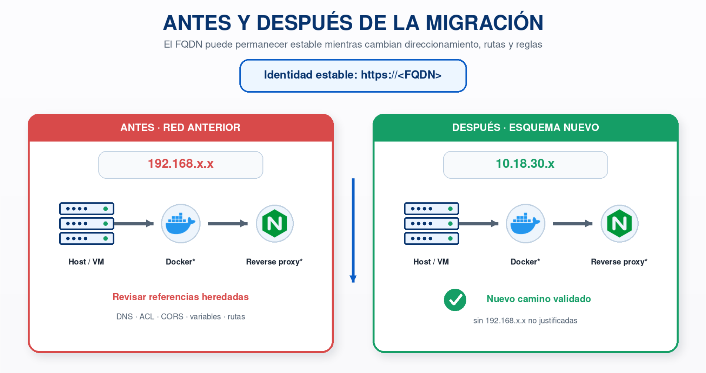
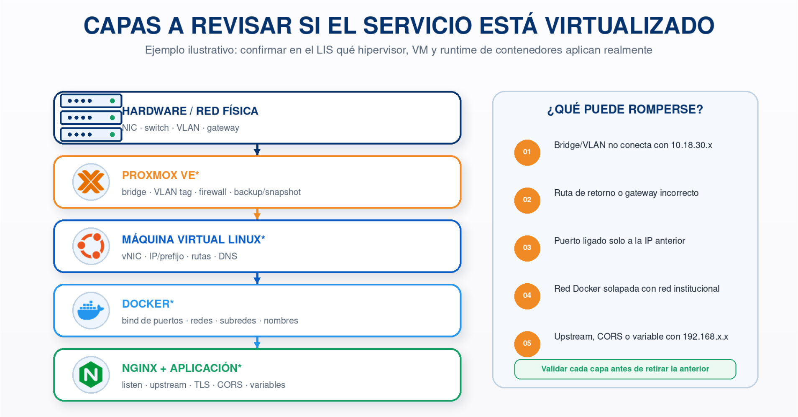
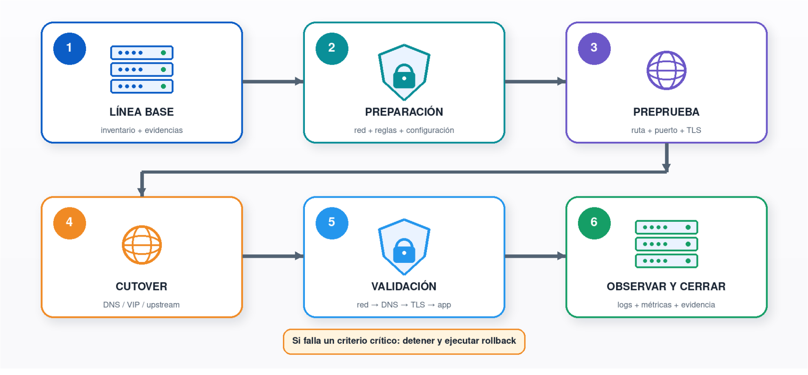
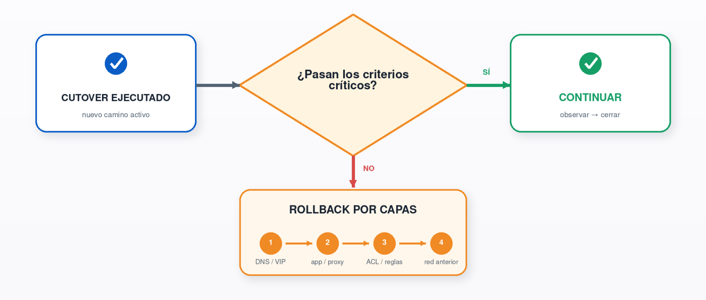
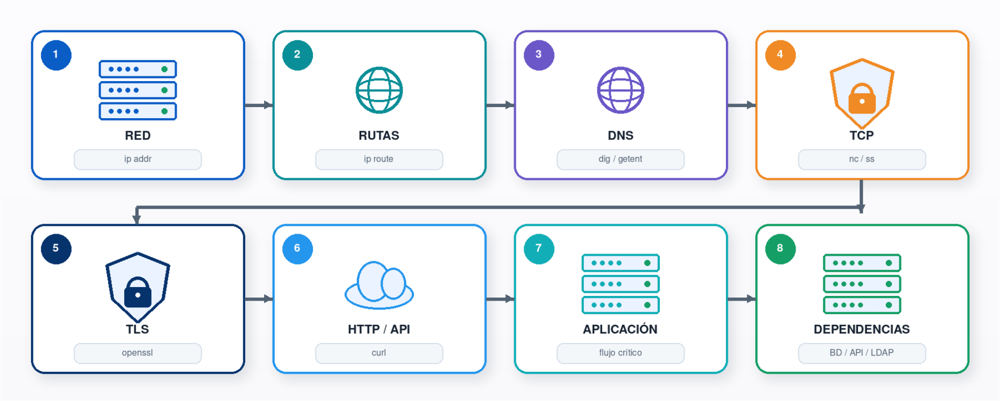
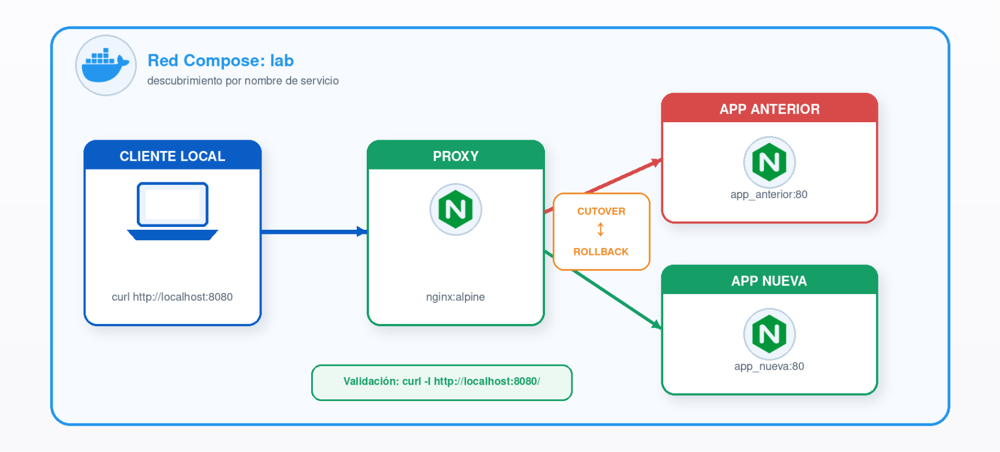

<p align="center">
  
</p>

<h3 align="center">LABORATORIO INTEGRADO DE SISTEMAS</h3>
<h3 align="center">UNIVERSIDAD DE ANTIOQUIA</h3>

<h1 align="center">RETO 4: INVESTIGACIÓN (BONUS)</h1>
<h2 align="center">Migración de servicios entre redes del LIS</h2>

<p align="center"><em>Propuesta técnica de migración, validación y reversión</em></p>

<p align="center">
  <strong>María Camila Castañeda Piedrahita</strong><br>
  CC 1021805193<br>
  Correo: maria.castanedap@udea.edu.co<br><br>
  Medellín - Agosto de 2026
</p>


<div align="justify">

# **Tabla de contenido**

- [Resumen ejecutivo](#resumen-ejecutivo)
- [1. Alcance, objetivo y supuestos](#1-alcance-objetivo-y-supuestos)
  - [1.1 Objetivo](#11-objetivo)
  - [1.2 Supuestos explícitos](#12-supuestos-explícitos)
  - [1.3 Criterio técnico rector](#13-criterio-técnico-rector)
- [2. Diagnóstico del entorno actual](#2-diagnóstico-del-entorno-actual)
  - [2.1 Inventario mínimo del servidor](#21-inventario-mínimo-del-servidor)
  - [2.2 DNS y forma de acceso de los usuarios](#22-dns-y-forma-de-acceso-de-los-usuarios)
  - [2.3 Puertos, publicación y dependencias](#23-puertos-publicación-y-dependencias)
  - [2.4 Búsqueda de referencias al direccionamiento anterior](#24-búsqueda-de-referencias-al-direccionamiento-anterior)
  - [2.5 Línea base funcional](#25-línea-base-funcional)
- [3. Propuesta de migración](#3-propuesta-de-migración)
  - [3.1 Estado objetivo](#31-estado-objetivo)
  - [3.2 Configuración IP, máscara, gateway y rutas](#32-configuración-ip-máscara-gateway-y-rutas)
  - [3.3 DNS](#33-dns)
  - [3.4 Firewall, ACL y NAT](#34-firewall-acl-y-nat)
  - [3.5 Reverse proxy, publicación web y certificados](#35-reverse-proxy-publicación-web-y-certificados)
  - [3.6 CORS y orígenes permitidos](#36-cors-y-orígenes-permitidos)
  - [3.7 Variables de entorno y configuración de la aplicación](#37-variables-de-entorno-y-configuración-de-la-aplicación)
  - [3.8 Bases de datos y servicios internos](#38-bases-de-datos-y-servicios-internos)
  - [3.9 Contenedores](#39-contenedores)
  - [3.10 Ejemplos ilustrativos de configuración](#310-ejemplos-ilustrativos-de-configuración)
- [4. Plan de ejecución y reversión](#4-plan-de-ejecución-y-reversión)
  - [4.1 Preparación previa](#41-preparación-previa)
  - [4.2 Secuencia de cambio](#42-secuencia-de-cambio)
  - [4.3 Prueba previa sin cambiar DNS](#43-prueba-previa-sin-cambiar-dns)
  - [4.4 Criterios Go / No-Go](#44-criterios-go--no-go)
  - [4.5 Rollback por capas](#45-rollback-por-capas)
- [5. Validación posterior](#5-validación-posterior)
  - [5.1 Validaciones desde varios puntos](#51-validaciones-desde-varios-puntos)
  - [5.2 Prueba funcional mínima](#52-prueba-funcional-mínima)
- [6. Riesgos y puntos críticos](#6-riesgos-y-puntos-críticos)
  - [6.1 Riesgo especial: solapamiento de subredes](#61-riesgo-especial-solapamiento-de-subredes)
- [7. Seguridad, trazabilidad y manejo del cambio](#7-seguridad-trazabilidad-y-manejo-del-cambio)
- [8. Criterios de aceptación](#8-criterios-de-aceptación)
- [9. Matriz de evidencias del cambio](#9-matriz-de-evidencias-del-cambio)
- [10. Checklist operativo resumido](#10-checklist-operativo-resumido)
- [11. POC local y script reproducible](#11-poc-local-y-script-reproducible)
  - [11.1 POC local con Docker Compose](#111-poc-local-con-docker-compose)
  - [11.2 Script de precheck/postcheck](#112-script-de-precheckpostcheck)
- [12. Conclusiones](#12-conclusiones)
- [13. Referencias](#13-referencias)
- [14. Anexos](#14-anexos)
  - [14.1 Plantilla para registrar una migración real](#141-plantilla-para-registrar-una-migración-real)
  - [14.2 Script reproducible de precheck/postcheck](#142-script-reproducible-de-precheckpostcheck)
  - [14.3 Secuencia compacta de verificación](#143-secuencia-compacta-de-verificación)

# **Resumen ejecutivo**

Migrar una aplicación web desde el direccionamiento 192.168.x.x hacia el nuevo esquema institucional que incluye 10.18.30.x no debe tratarse como un simple cambio de dirección IP. El servicio puede depender de rutas, DNS, reglas de firewall o ACL, NAT, reverse proxy, certificados TLS, políticas CORS, variables de entorno, conexiones a bases de datos, redes de contenedores y otros sistemas que todavía identifiquen el servidor por una dirección de la red anterior. El propio RFC 1918 advierte que un cambio de direccionamiento puede requerir ajustes de DNS y de configuraciones en otros hosts que referencian la IP anterior (Rekhter et al., 1996).

La propuesta de este informe se basa en cuatro ideas: construir primero una línea base verificable; preparar el nuevo estado sin retirar prematuramente el anterior; ejecutar un corte controlado con criterios de éxito medibles; y mantener un rollback probado y rápido. Siempre que la arquitectura lo permita, se recomienda reducir el acoplamiento a IPs mediante nombres DNS y nombres de servicio, especialmente en redes de contenedores, donde Docker ofrece resolución por nombre dentro de redes definidas por el usuario (Docker Inc., s. f.).

**Alcance de seguridad:** Este documento es una propuesta. No ejecuta cambios sobre infraestructura del LIS, no incluye credenciales ni secretos y plantea que herramientas de escaneo como `nmap` se usen únicamente sobre activos y puertos expresamente autorizados.

<br>

# **1. Alcance, objetivo y supuestos**

## **1.1 Objetivo**

Diseñar un procedimiento ordenado, seguro, reversible y auditable para reubicar o reconfigurar una aplicación web del LIS que hoy está asociada al direccionamiento 192.168.x.x, de modo que opere correctamente en el nuevo esquema institucional que incluye el rango 10.18.30.x, sin asumir datos de infraestructura que no han sido proporcionados.

## **1.2 Supuestos explícitos**

- El enunciado no define la IP exacta, máscara/prefijo, gateway, VLAN, servidores DNS, FQDN, puertos, sistema operativo ni topología reales. Por tanto, se usan marcadores como \<IP_ANTERIOR\>, \<IP_NUEVA\>, \<PREFIJO\>, \<GATEWAY\>, \<FQDN\> y \<PUERTO\>.

- El texto “10.18.30.x” identifica un rango de interés, pero no autoriza asumir que el prefijo sea /24. La máscara debe confirmarse con la configuración institucional antes del cambio.

- La aplicación se modela de forma genérica como un servicio web que puede estar detrás de un reverse proxy y consumir una base de datos y/o APIs internas.

- La migración real exigiría ventana de cambio, autorización del administrador de red/servicio y validación de propietarios de dependencias.

- No se recomienda retirar la IP anterior, borrar reglas o reiniciar servicios sin haber probado antes el nuevo camino y sin disponer de reversión.

## **1.3 Criterio técnico rector**

La unidad real de migración no es la IP aislada, sino el flujo completo usuario -\> nombre DNS -\> control de acceso -\> reverse proxy/servicio -\> aplicación -\> dependencias. Una migración se considera exitosa solo cuando ese flujo funciona desde los segmentos que realmente lo utilizan y cuando no quedan referencias antiguas no justificadas.



<br>

# **2. Diagnóstico del entorno actual**

El diagnóstico debe producir evidencia “antes del cambio”. El objetivo es saber exactamente qué existe, quién depende de qué y qué resultado debe conservarse después de la migración. Los comandos `ip` permiten inspeccionar direcciones, interfaces y rutas del sistema (Litvak, s. f.); `ss` permite verificar sockets/listeners (Kuznetsov & Prokop, s. f.).

## **2.1 Inventario mínimo del servidor**

| **Elemento**     | **Qué registrar**                                      | **Cómo comprobarlo**                          |
|------------------|--------------------------------------------------------|-----------------------------------------------|
| Interfaz         | Nombre, estado y MAC                                   | `ip -br link`                                   |
| Dirección actual | IP + prefijo real                                      | `ip -br addr`                                   |
| Gateway          | Ruta por defecto y métrica                             | `ip route show default`                         |
| Rutas            | Redes directamente conectadas y estáticas              | `ip route`                                      |
| DNS              | Servidores, dominio de búsqueda y método de resolución | `resolvectl status` o configuración equivalente |
| Listeners        | Puertos TCP/UDP y proceso asociado                     | `ss -lntup`                                     |
| Nombre           | Hostname/FQDN y resolución directa                     | `hostname -f; getent ahosts <FQDN>`              |
| Hora             | Sincronización temporal, relevante para TLS y logs     | `timedatectl status`                            |

```console
$ ip -br addr
$ ip route
$ ip route get <IP_DE_UNA_DEPENDENCIA>
$ ss -lntup
```

Guardar la salida con fecha y hostname en el expediente de cambio, evitando exponer contraseñas, tokens, llaves privadas o variables secretas. Esta línea base permite comparar el “antes” y el “después”.

## **2.2 DNS y forma de acceso de los usuarios**

Se debe determinar si los usuarios acceden por nombre, por IP o mediante otro proxy. BIND documenta `dig` como una herramienta de diagnóstico DNS; permite consultar qué dirección devuelve un nombre y contra qué servidor se obtiene la respuesta (Internet Systems Consortium, s. f.). Si existe un registro A asociado a la IP anterior, el cambio de DNS forma parte del cutover. También debe comprobarse si existen DNS internos/externos distintos, split DNS o registros en archivos hosts.

```console
$ dig <FQDN> A
$ dig @<DNS_AUTORITATIVO> <FQDN> A
$ getent ahosts <FQDN>
```

- Registrar TTL actual del registro y, si la política institucional lo permite, reducirlo con suficiente anticipación para acortar el periodo de caché durante el corte.

- Inventariar accesos directos por IP. Deben reemplazarse por nombre DNS cuando sea viable, porque una IP fija codificada vuelve más costosas migraciones futuras.

## **2.3 Puertos, publicación y dependencias**

Para cada flujo se debe registrar origen, destino, protocolo, puerto y motivo. No basta con confirmar que “el servidor responde”: una aplicación puede abrir 443 para usuarios y, al mismo tiempo, necesitar 5432/3306 hacia una base de datos, 389/636 hacia LDAP, 25/587 hacia correo, o puertos propios hacia APIs internas. Los números son ejemplos y solo deben conservarse si aplican al servicio real.

| **Flujo**     | **Origen**       | **Destino**           | **Puerto/protocolo** | **Dependencia**       |
|---------------|------------------|-----------------------|----------------------|-----------------------|
| Entrada web   | Usuarios / proxy | \<FQDN\>/\<IP_NUEVA\> | 443/TCP (si aplica)  | Acceso HTTPS          |
| Proxy -\> app | Reverse proxy    | Aplicación            | \<PUERTO_APP\>/TCP   | Publicación interna   |
| App -\> BD    | Aplicación       | \<HOST_BD\>           | \<PUERTO_BD\>/TCP    | Persistencia          |
| App -\> API   | Aplicación       | \<HOST_API\>          | \<PUERTO_API\>/TCP   | Servicio dependiente  |
| DNS           | Servidor/app     | \<DNS\>               | 53/UDP/TCP           | Resolución de nombres |

## **2.4 Búsqueda de referencias al direccionamiento anterior**

Una IP antigua puede permanecer en archivos de configuración, unidades systemd, configuraciones de Nginx/Apache, variables de entorno, pipelines, scripts de despliegue, CORS, reglas de firewall, configuraciones de base de datos, archivos hosts o documentación operacional. La revisión debe limitarse a rutas autorizadas y nunca copiar secretos al informe.

```console
$ rg -n "192\\.168\\." <DIRECTORIO_APLICACION> <DIRECTORIOS_CONFIG_AUTORIZADOS>
$ grep -R "192.168." <RUTA_CONFIG_AUTORIZADA> # alternativa si rg no está disponible
```

Cada coincidencia debe clasificarse: “debe cambiar”, “puede cambiarse por DNS/nombre de servicio”, “se conserva por una dependencia que aún vive en la red anterior” o “falso positivo/documentación histórica”. No debe hacerse un reemplazo masivo a ciegas.

## **2.5 Línea base funcional**

- Código HTTP esperado de portada y endpoint de salud, si existe.

- Latencia aproximada y tiempo de conexión desde un origen representativo.

- Operación funcional crítica: autenticación, consulta y escritura controlada, si el entorno de prueba lo permite.

- Conectividad aplicación -\> base de datos/API sin publicar la dependencia a redes que no la necesitan.

- Estado del certificado TLS y coincidencia con el FQDN usado por los usuarios.

```console
$ curl -fsS --max-time 10 -o /dev/null -w "%{http_code} %{time_connect} %{time_total}\n" https://<FQDN>/<RUTA_SALUD>
```

<br>

# **3. Propuesta de migración**

La estrategia recomendada es preparar primero el nuevo camino y cambiar la referencia estable del servicio -preferiblemente el FQDN- solo cuando la nueva ruta funcione. Se evita así una sustitución simultánea de demasiadas variables y se mantiene una ruta clara de reversión.

## **3.1 Estado objetivo**

- El servidor o instancia destino usa \<IP_NUEVA\>/\<PREFIJO\> y \<GATEWAY\> confirmados por la administración de red.

- El \<FQDN\> resuelve a la dirección que corresponda al nuevo esquema, directamente o a través del reverse proxy/balanceador institucional.

- Las ACL/firewalls permiten únicamente los flujos necesarios, desde los orígenes autorizados y hacia los puertos requeridos.

- Reverse proxy, certificados, CORS y configuración de la aplicación usan el nombre/origen correcto y no dependen innecesariamente de 192.168.x.x.

- Las dependencias que sigan en la red anterior son alcanzables mediante rutas y reglas explícitas; se documentan como deuda/compatibilidad temporal.

- Se conservan logs y métricas suficientes para comparar el comportamiento antes y después.



## **3.2 Configuración IP, máscara, gateway y rutas**

La nueva dirección debe configurarse usando el mecanismo persistente propio del sistema (por ejemplo, NetworkManager, Netplan o systemd-networkd), no únicamente con un comando temporal. Antes de aplicar, se validan IP, prefijo, gateway, VLAN/interfaz y ausencia de conflicto. Después se confirma que la ruta de retorno hacia usuarios y dependencias sea coherente. El comando `ip route get` resulta especialmente útil para verificar qué interfaz, gateway y dirección origen usaría el kernel hacia un destino (Litvak, s. f.).

- No asumir /24 a partir de “10.18.30.x”; confirmar \<PREFIJO\>.

- No asumir que el gateway termina en .1 o .254; confirmar \<GATEWAY\>.

- Si se requieren rutas estáticas, registrar destino, siguiente salto, interfaz, métrica y propietario de la red.

- Si se usa una fase de doble direccionamiento, verificar que las respuestas salgan por el camino esperado y que no aparezca enrutamiento asimétrico.

## **3.3 DNS**

Cuando el servicio tiene FQDN, el nombre debe ser la identidad estable del servicio y la IP un detalle de implementación. Para el corte se actualiza el registro correspondiente sólo después de probar el nuevo destino. La resolución se verifica contra el DNS autoritativo y desde clientes reales. RFC 1918 menciona explícitamente que los cambios de direccionamiento pueden requerir actualizar DNS y hosts que referencian la IP anterior (Rekhter et al., 1996).

- Reducir TTL previamente solo si la política institucional lo permite y con tiempo suficiente para que el TTL anterior expire.

- Tras estabilizar la migración, devolver el TTL a su valor operativo normal.

- Revisar `/etc/hosts`, DNS internos, split DNS, balanceadores y registros secundarios que puedan mantener 192.168.x.x.

## **3.4 Firewall, ACL y NAT**

Las reglas deben expresarse según necesidad de comunicación, no como una apertura amplia de la nueva subred. nftables/Netfilter permite filtrado con estado y NAT (Netfilter Project, s. f.). Se revisan reglas tanto en el host como en firewalls de red, ACL de routers/switches, grupos de seguridad equivalentes y listas de acceso de bases de datos o APIs.

- Crear o ajustar primero las reglas del nuevo origen/destino; validarlas; retirar las antiguas solo al cerrar el periodo de observación.

- Evitar NAT si existe enrutamiento directo y controlado. Si NAT es obligatorio, documentar dónde ocurre y cómo afecta logs, allowlists y trazabilidad de la IP origen.

- Mantener mínimo privilegio: origen específico + destino específico + puerto/protocolo necesario.

## **3.5 Reverse proxy, publicación web y certificados**

Si Nginx u otro reverse proxy publica la aplicación, deben revisarse `listen`/`bind`, `server_name`, `upstream`/`proxy_pass` y cualquier `allow`/`deny` con IPs antiguas. La documentación de Nginx define `proxy_pass` como el mecanismo para enviar solicitudes a un servidor upstream (NGINX, s. f.). Un cambio del backend puede requerir modificar el upstream, aun cuando el FQDN público no cambie.

- Validar la configuración antes de recargar el proxy (por ejemplo, `nginx -t` cuando aplique).

- Preferir FQDN/nombres de servicio para upstreams si la plataforma resuelve y gestiona correctamente esos nombres; evitar IPs rígidas cuando no sean necesarias.

- Confirmar que el certificado TLS cubre el FQDN usado por el cliente. OpenSSL recuerda que la validación TLS incluye comprobar que el hostname coincide con el certificado (OpenSSL Project Authors, s. f.).

```console
$ openssl s_client -connect <FQDN>:443 -servername <FQDN> -verify_hostname <FQDN> </dev/null
```

## **3.6 CORS y orígenes permitidos**

CORS depende del origen web, que combina esquema, host y puerto; el Fetch Standard define CORS como el protocolo HTTP que permite a una respuesta declarar con qué orígenes puede compartirse (WHATWG, 2026). Si front-end y API cambian de host, esquema o puerto, se revisan las allowlists. Cambiar solo la IP interna de un backend detrás del mismo FQDN puede no requerir cambio CORS; por eso se verifica y no se modifica por rutina.

- Conservar únicamente orígenes necesarios; evitar “\*” cuando hay credenciales o cuando la política de seguridad exige orígenes explícitos.

- Revisar también URLs absolutas del front-end, callbacks OAuth/SSO y redirects registrados, si existen.

## **3.7 Variables de entorno y configuración de la aplicación**

Se debe inventariar toda configuración que contenga hostnames, URLs o IPs: `DATABASE_URL`, `API_BASE_URL`, `LDAP_HOST`, `SMTP_HOST`, `ALLOWED_HOSTS`, `TRUSTED_PROXIES`, `CORS_ALLOWED_ORIGINS`, callbacks y endpoints. La migración no debe copiar secretos a documentación ni cambiar valores no relacionados.

- Separar configuración de código; parametrizar host/URL cuando sea posible.

- Preferir nombres DNS o nombres de servicio administrados sobre IPs literales.

- Realizar búsqueda final de “192.168.” y revisar cada coincidencia antes de declarar cerrado el cambio.

## **3.8 Bases de datos y servicios internos**

La base de datos puede no migrar al mismo tiempo. En ese caso, la nueva red debe tener ruta y autorización hacia la BD; además, el servidor de base de datos puede aplicar allowlists por IP de origen. Se deben revisar bind/listen, reglas host-based del motor cuando existan, usuarios restringidos por host, TLS y DNS. La prueba debe cubrir conexión y una operación funcional controlada, no solo apertura del puerto.

## **3.9 Contenedores**

Docker distingue la red del host de las redes internas de contenedores. En redes definidas por el usuario, los contenedores pueden comunicarse por nombre, lo que reduce la necesidad de codificar IPs de contenedor (Docker Inc., s. f.). La migración del host no implica necesariamente renumerar todas las redes internas; hacerlo sin necesidad aumenta el riesgo.

- Revisar publicación de puertos host:contenedor y el bind address del host.

- Revisar redes externas, subredes con posible solapamiento y rutas hacia dependencias.

- Usar nombres de servicio en Docker Compose para tráfico interno cuando corresponda.

- No volcar al informe salidas que incluyan secretos de variables de entorno.

**Virtualización / hipervisor (si aplica)**

Si la aplicación se ejecuta dentro de una máquina virtual administrada por Proxmox VE u otro hipervisor, debe revisarse también la capa de virtualización: bridge o puente de red, etiqueta VLAN, NIC virtual, firewall aplicado al nodo o a la VM y disponibilidad de backup/snapshot previo al cambio. Una configuración IP correcta dentro de la VM puede seguir siendo inaccesible si el bridge o la VLAN no conectan con el segmento institucional previsto. Proxmox VE integra redes, máquinas virtuales KVM, firewall y mecanismos de backup, por lo que esta capa debe incluirse en el diagnóstico cuando aplique (Proxmox Server Solutions GmbH, 2025).



```console
$ docker compose ps
$ docker network ls
```

## **3.10 Ejemplos ilustrativos de configuración**

Los siguientes fragmentos muestran cómo podría materializarse la propuesta sin afirmar que el LIS use exactamente estas herramientas. Los valores reales deben confirmarse con la configuración institucional antes de cualquier cambio.

*Ejemplo Netplan (dirección, ruta por defecto y DNS). La documentación oficial de Netplan usa addresses, routes y nameservers para este tipo de configuración (Canonical Ltd., s. f.).*

```yaml
network:
  version: 2
  ethernets:
    <INTERFAZ>:
      dhcp4: false
      addresses:
        - <IP_NUEVA>/<PREFIJO>
      routes:
        - to: default
          via: <GATEWAY>
      nameservers:
        addresses: [<DNS_1>, <DNS_2>]
```

*Ejemplo Nginx (publicación mediante nombre estable y upstream parametrizado) (NGINX, s. f.).*

```nginx
upstream lis_app {
    server <HOST_APP>:<PUERTO_APP>;
}

server {
    listen 443 ssl;
    server_name <FQDN>;

    location / {
        proxy_set_header Host $host;
        proxy_set_header X-Forwarded-Proto $scheme;
        proxy_pass http://lis_app;
    }
}
```

*Ejemplo de variables de entorno. La idea es desacoplar direcciones del código y permitir que el cambio sea trazable.*

```ini
APP_BASE_URL=https://<FQDN>
DATABASE_HOST=<HOST_BD>
LDAP_HOST=<HOST_LDAP>
CORS_ALLOWED_ORIGINS=https://<ORIGEN_FRONTEND>
```

<br>

# **4. Plan de ejecución y reversión**

El cambio se propone como una secuencia con “puntos de decisión”. Cada fase debe poder detenerse sin obligar a avanzar. La regla principal es no destruir el estado anterior hasta que el nuevo haya superado las pruebas técnicas y funcionales y haya transcurrido el periodo de observación acordado.

## **4.1 Preparación previa**

- Aprobar ventana de mantenimiento, responsables, canal de comunicación y criterio de abortar.

- Exportar/copiar configuraciones relevantes: red, reverse proxy, servicio, firewall, archivos de entorno sin exponer secretos, y manifiestos de despliegue. Registrar versión/fecha.

- Confirmar respaldo de datos de la aplicación y de la base de datos cuando el cambio pueda afectar persistencia; verificar que el respaldo sea utilizable según el procedimiento institucional.

- Capturar línea base de IP, rutas, DNS, puertos, estado de servicios, pruebas HTTP/API y dependencias.

- Validar que \<IP_NUEVA\> no está asignada y que pertenece al prefijo/VLAN autorizados mediante el procedimiento institucional.

- Preparar nuevas ACL/firewall y el registro DNS sin retirar todavía las reglas antiguas si la política permite convivencia temporal.

## **4.2 Secuencia de cambio**



| **Fase**                      | **Resultado requerido**                                                                                                                         |
|-------------------------------|-------------------------------------------------------------------------------------------------------------------------------------------------|
| Fase 0 - Línea base           | Congelar inventario, dependencias, prueba funcional y evidencias del estado anterior.                                                           |
| Fase 1 - Preparar red nueva   | Configurar \<IP_NUEVA\>/\<PREFIJO\>, gateway/rutas y reglas necesarias; comprobar conectividad saliente y retorno.                              |
| Fase 2 - Preparar aplicación  | Actualizar únicamente referencias necesarias: proxy/upstream, variables, allowlists, BD/APIs, contenedores. Validar sintaxis antes de recargar. |
| Fase 3 - Prueba previa al DNS | Probar HTTPS contra la nueva IP conservando Host/SNI, por ejemplo con `curl --resolve`, para separar “servicio” de “DNS”.                         |
| Fase 4 - Cutover              | Actualizar la referencia estable: registro DNS, VIP o upstream correspondiente. Mantener el estado anterior disponible para rollback.           |
| Fase 5 - Validación integral  | Ejecutar matriz de pruebas desde clientes representativos y verificar logs, errores, dependencias y certificado.                                |
| Fase 6 - Observación          | Monitorizar durante la ventana acordada; comparar con la línea base y atender caches/consumidores rezagados.                                    |
| Fase 7 - Cierre               | Retirar referencias/reglas antiguas solo tras aprobación; normalizar TTL y actualizar documentación.                                            |

## **4.3 Prueba previa sin cambiar DNS**

`curl` permite forzar temporalmente la resolución de un host mediante `--resolve` y, al mismo tiempo, conservar el nombre en la URL. Esto permite probar la nueva IP con el Host/SNI esperado antes de cambiar el DNS (curl project, s. f.).

```console
$ curl -vk --resolve <FQDN>:443:<IP_NUEVA> https://<FQDN>/<RUTA_SALUD>
```

Durante una ejecución real se retiraría `-k` para exigir validación normal del certificado; se incluye aquí solo como ejemplo de diagnóstico inicial si todavía se está verificando la cadena. La aceptación final debe validar TLS correctamente.

```console
$ curl -fsS --resolve <FQDN>:443:<IP_NUEVA> https://<FQDN>/<RUTA_SALUD>
```

## **4.4 Criterios Go / No-Go**

| **Decisión** | **Condición**                                                                                                                                                                                   |
|--------------|-------------------------------------------------------------------------------------------------------------------------------------------------------------------------------------------------|
| GO           | IP/prefijo/gateway confirmados; nueva IP alcanzable; rutas correctas; puertos requeridos accesibles; app saludable; dependencias funcionales; TLS/FQDN válidos; rollback listo.                 |
| NO-GO        | IP o prefijo dudoso, rutas inconsistentes, dependencia crítica sin probar, regla de acceso pendiente, backup/rollback no disponible, error de configuración o prueba funcional crítica fallida. |
| ROLLBACK     | Tras el corte aparece pérdida sostenida de acceso, errores HTTP críticos, fallas de autenticación/BD, resolución incorrecta persistente, degradación severa o riesgo para integridad de datos.  |

## **4.5 Rollback por capas**

La reversión debe ejecutarse en orden inverso al cambio y con un objetivo claro: restablecer el último estado conocido como bueno. No se “depura en producción” indefinidamente mientras el servicio permanece degradado; se revierte cuando se supera el umbral acordado.



| **Paso** | **Acción de reversión**                       | **Verificación**                                                                |
|----------|-----------------------------------------------|---------------------------------------------------------------------------------|
| 1        | Restaurar DNS/VIP/upstream anterior           | El nombre vuelve a dirigir al camino conocido. Considerar TTL/caches.           |
| 2        | Restaurar proxy y configuración de aplicación | Reponer archivos versionados/respaldados y validar sintaxis antes de recargar.  |
| 3        | Restaurar reglas/ACL anteriores               | Recuperar flujos de entrada/salida sin abrir permisos adicionales.              |
| 4        | Reactivar direccionamiento anterior           | Si fue retirado, reponer IP/rutas persistentes según respaldo.                  |
| 5        | Validar funcionalidad                         | Repetir pruebas base: DNS, 443/API, autenticación y dependencias.               |
| 6        | Registrar incidente                           | Conservar evidencia, causa probable, hora, impacto y decisiones para reintento. |

<br>

# **5. Validación posterior**

La validación debe probar de abajo hacia arriba: interfaz/rutas -\> DNS -\> puertos -\> TLS/HTTP -\> aplicación -\> dependencias -\> experiencia funcional. Un ping exitoso no demuestra por sí solo que el servicio web funcione; de la misma forma, un 200 HTTP no demuestra que una operación de negocio que requiere BD esté completa.



| **Capa**         | **Prueba sugerida**                                         | **Resultado esperado**                                            |
|------------------|-------------------------------------------------------------|-------------------------------------------------------------------|
| Interfaz         | `ip -br addr`                                                 | \<IP_NUEVA\>/\<PREFIJO\> en la interfaz correcta.                 |
| Ruta             | `ip route; ip route get <DESTINO>`                            | Gateway/interfaz/origen coinciden con el diseño.                  |
| Gateway          | `ping -c 4 <GATEWAY>`                                         | Respuesta si ICMP está permitido; si no, validar por otro método. |
| Trayecto         | `traceroute <DESTINO>` o `tracepath <DESTINO>`                | Ruta coherente; útil para localizar saltos, no como única prueba. |
| DNS              | `dig <FQDN> A`                                                | Respuesta esperada y TTL coherente.                               |
| Resolver cliente | `getent ahosts <FQDN>`                                        | El cliente usa la dirección prevista.                             |
| Listener local   | `ss -lntup`                                                   | Servicio escuchando en IP/puerto esperados.                       |
| TCP              | `nc -vz <HOST> <PUERTO>`                                      | Handshake TCP posible desde origen autorizado.                    |
| HTTPS            | `curl -fsS -I https://<FQDN>/`                                | Código esperado, sin error de conexión/TLS.                       |
| TLS/SNI          | `openssl s_client -connect <FQDN>:443 -servername <FQDN>`     | Cadena y hostname válidos.                                        |
| Puertos          | `nmap -sT -p <P1,P2> <IP_NUEVA>`                              | Solo puertos previstos; únicamente desde entorno autorizado.      |
| API              | `curl -fsS https://<FQDN>/api/<health>`                       | Respuesta y contenido esperado.                                   |
| Dependencia      | `nc`/`curl`/cliente nativo hacia \<HOST_DEP\>                 | Conexión desde la aplicación y operación controlada.              |
| Contenedores     | `docker compose ps`                                           | Servicios necesarios en estado esperado.                          |
| Logs             | `journalctl`/\<logs de app\>                                  | Sin incremento anormal de errores de red, DNS, TLS o 5xx.         |

El Nmap Reference Guide documenta técnicas de escaneo de puertos (Lyon, 2009). En este plan se limita a direcciones/puertos autorizados y a confirmar exposición prevista; no se plantea reconocimiento de terceros ni rangos no aprobados.

## **5.1 Validaciones desde varios puntos**

- Desde el propio servidor: listeners, rutas y dependencias salientes.

- Desde el reverse proxy/balanceador: conectividad real hacia el backend nuevo.

- Desde una estación/VPN autorizada: DNS, TLS y acceso de usuario.

- Desde la aplicación: comunicación real con BD, APIs, LDAP/SSO o servicios que apliquen.

- Desde redes adicionales solo si son consumidores reales del servicio y están dentro del alcance autorizado.

## **5.2 Prueba funcional mínima**

Además de checks técnicos, se elige una transacción representativa y reversible: abrir la aplicación, autenticarse si aplica, consultar un recurso y ejecutar una operación controlada de lectura/escritura en un entorno donde esté permitido. Esto detecta fallas que un simple health check puede ocultar, como un backend sin acceso a la base de datos.

<br>

# **6. Riesgos y puntos críticos**

| **Riesgo**                     | **Impacto** | **Señal**                                                       | **Prevención/detección**                               | **Reversión**                                          |
|--------------------------------|-------------|-----------------------------------------------------------------|--------------------------------------------------------|--------------------------------------------------------|
| Máscara/prefijo incorrecto     | Alta        | Host considera destinos como locales o remotos incorrectamente. | Confirmar prefijo institucional; `ip route get`.       | Restaurar configuración anterior.                      |
| Gateway/ruta incorrecta        | Alta        | Salida o retorno fallan.                                        | Pruebas por destino y revisión de rutas.               | Restaurar gateway/rutas.                               |
| IP duplicada                   | Alta        | Conectividad intermitente/ARP inconsistente.                    | Reserva e inventario institucional; validación previa. | Retirar IP nueva y corregir asignación.                |
| DNS/caché                      | Media-Alta  | Clientes llegan a destinos diferentes.                          | TTL planificado; `dig` autoritativo + resolver cliente. | Reponer registro anterior y esperar/gestionar caché.   |
| ACL/firewall incompleto        | Alta        | Puerto inaccesible aunque IP responda.                          | Matriz origen-destino-puerto; `nc`/`curl`.              | Restaurar regla conocida; corregir mínima regla nueva. |
| Ruta asimétrica                | Alta        | Sesiones fallan o firewall stateful descarta tráfico.           | `ip route get` en ambos extremos; trazas/logs.          | Reponer ruta anterior o corregir next-hop.             |
| IP hardcoded                   | Alta        | Componente sigue llamando a 192.168.x.x.                        | `rg` + inventario de configuración.                    | Restaurar config o parametrizar referencia.            |
| Reverse proxy/upstream         | Alta        | 502/504 o servicio equivocado.                                  | Validación de config + `curl` desde proxy.             | Restaurar upstream anterior.                           |
| TLS/SNI                        | Media-Alta  | Advertencia o rechazo de certificado.                           | `openssl`/`curl` por FQDN.                             | Restaurar endpoint/certificado conocido.               |
| CORS/origen                    | Media       | Frontend falla aunque API responda a curl.                      | Prueba en navegador y headers CORS.                    | Restaurar allowlist anterior y corregir origen exacto. |
| BD/allowlist                   | Alta        | App abre pero operaciones fallan.                               | Prueba funcional + logs + puerto BD.                   | Restaurar origen/regla/conexión anterior.              |
| Redes Docker solapadas         | Media-Alta  | Rutas hacia 10.18.30.x pueden colisionar.                       | `docker network ls` + inspección autorizada de subredes. | No renumerar sin plan; volver a red previa.          |
| Dependencia aún en 192.168.x.x | Media-Alta  | Función parcial tras migración.                                 | Mapa de dependencias y pruebas por flujo.              | Mantener ruta/regla temporal documentada.              |

## **6.1 Riesgo especial: solapamiento de subredes**

El rango 10.0.0.0/8 también es privado según RFC 1918 (Rekhter et al., 1996). Docker y otras plataformas pueden crear redes privadas internas. Si una red de contenedores usa un prefijo que se solapa con la red institucional, el host puede enviar tráfico al bridge local en vez de a la interfaz institucional. Por eso el inventario de rutas y redes de contenedores debe preceder la migración.

<br>

# **7. Seguridad, trazabilidad y manejo del cambio**

- Aplicar mínimo privilegio en ACL/firewall y evitar reglas amplias “temporales” sin fecha de retiro.

- No publicar en GitHub contraseñas, tokens, llaves privadas, archivos .env reales ni volcados de configuración que contengan secretos.

- Registrar quién aprobó el cambio, quién lo ejecutó, hora de inicio/fin, configuración anterior/nueva, pruebas y resultado.

- Conservar backups de configuración y datos según política, pero no confundir “existe un archivo” con “el rollback está probado”.

- No ampliar el escaneo a rangos completos por curiosidad. Las pruebas activas deben limitarse al alcance autorizado y necesario para validar el servicio.

- Tras la estabilización, retirar accesos antiguos, excepciones temporales, TTL reducido y referencias obsoletas.

<br>

# **8. Criterios de aceptación**

- La nueva IP, prefijo, gateway y rutas coinciden con la asignación institucional.

- El FQDN resuelve al destino correcto desde los resolvers relevantes.

- Solo los puertos necesarios están accesibles desde los orígenes autorizados.

- El reverse proxy llega al backend sin 502/504 y conserva headers/esquema esperados.

- El certificado TLS es válido para el FQDN y la cadena es aceptada por clientes.

- La política CORS permite únicamente los orígenes requeridos y el frontend funciona.

- La aplicación se comunica con base de datos y dependencias necesarias.

- Los contenedores/servicios están saludables y sin conflicto de redes.

- La prueba funcional crítica se completa con un resultado equivalente a la línea base.

- No se observa incremento anormal de errores de red, DNS, TLS, 4xx/5xx o timeouts.

- Las coincidencias restantes de 192.168.x.x están eliminadas o documentadas y justificadas.

- Rollback y respaldos siguen disponibles hasta cerrar formalmente el cambio.

<br>

# **9. Matriz de evidencias del cambio**

| **Momento**     | **Evidencia**          | **Dato clave**                      | **Resultado**     |
|-----------------|------------------------|-------------------------------------|-------------------|
| Antes           | `ip -br addr` / `ip route` | IP/prefijo/gateway/rutas anteriores | Línea base     |
| Antes           | `dig` + `curl`             | DNS, HTTP, TLS, latencia            | Línea base     |
| Previo al corte | `curl --resolve`           | Nueva IP con FQDN/SNI               | Debe pasar     |
| Después         | `ip`/`dig`/`ss`            | Red, DNS y listeners nuevos         | Debe pasar     |
| Después         | `curl`/API/funcional       | Web + dependencia + transacción     | Debe pasar     |
| Después         | logs/métricas          | Errores y timeouts                  | Sin degradación   |
| Cierre          | búsqueda 192.168.      | Referencias antiguas                | 0 no justificadas |

<br>

# **10. Checklist operativo resumido**

- Confirmar autorización, ventana, responsables y contactos.

- Confirmar \<IP_NUEVA\>, \<PREFIJO\>, \<GATEWAY\>, VLAN/interfaz y DNS.

- Capturar línea base y respaldar configuraciones/datos pertinentes.

- Inventariar dependencias y referencias 192.168.x.x.

- Preparar rutas, ACL/firewall y configuración nueva sin retirar la anterior.

- Validar sintaxis del proxy/servicio antes de recargar.

- Probar la nueva IP con `curl --resolve` antes del cambio DNS.

- Ejecutar cutover del DNS/VIP/upstream.

- Ejecutar matriz de validación de red, DNS, TCP, TLS, HTTP/API y dependencias.

- Ejecutar prueba funcional representativa.

- Observar logs/métricas durante el periodo acordado.

- Si falla criterio crítico, ejecutar rollback documentado.

- Si estabiliza, retirar referencias/reglas antiguas y normalizar TTL.

- Actualizar diagrama, inventario y bitácora final.

<br>

# **11. POC local y script reproducible**

La prueba de concepto propuesta es deliberadamente aislada: no utiliza direcciones reales del LIS, no toca DNS institucional y no requiere modificar producción. Su objetivo es demostrar el mismo patrón de migración con nombres de servicio de Docker Compose: cliente local -\> Nginx -\> backend anterior/nuevo. Docker documenta que los servicios de una red Compose se descubren por nombre, evitando depender de IPs internas efímeras (Docker Inc., s. f.).



## **11.1 POC local con Docker Compose**

```yaml
services:
  proxy:
    image: nginx:alpine
    ports: ["8080:80"]
    volumes:
      - ./nginx.conf:/etc/nginx/conf.d/default.conf:ro
    networks: [lab]
  app_anterior:
    image: nginx:alpine
    networks: [lab]
  app_nueva:
    image: nginx:alpine
    networks: [lab]

networks:
  lab: {}
```

El estado A usa `server app_anterior:80;` en el upstream de Nginx. El cutover de laboratorio cambia ese único upstream a `app_nueva:80;` y el rollback lo devuelve a `app_anterior:80`. Antes y después se comprueba el proxy con `curl`. La POC demuestra reversibilidad sin mezclar datos institucionales.

```nginx
upstream lis_app { server app_nueva:80; }

server {
    listen 80;
    location / { proxy_pass http://lis_app; }
}
```

```console
# Validación local
$ curl -I http://localhost:8080/
```

## **11.2 Script de precheck/postcheck**

Para convertir la lista de comandos en evidencia reproducible, el Anexo 14.2 incluye un script Bash de solo lectura. Recibe FQDN, IP nueva, gateway y puerto; registra fecha/hostname y ejecuta comprobaciones de interfaz, rutas, DNS, sockets, gateway, TCP y HTTP. No cambia configuración, no contiene secretos y debe ejecutarse únicamente sobre activos autorizados.

<br>

# **12. Conclusiones**

La migración de una aplicación web desde el direccionamiento anterior 192.168.x.x hacia el nuevo esquema institucional que incluye 10.18.30.x debe entenderse como un proceso integral y no únicamente como un cambio de dirección IP. Su correcta ejecución exige considerar de manera conjunta la configuración de red, rutas, gateway, DNS, reglas de firewall y ACL, publicación del servicio, certificados, variables de entorno y todas las dependencias internas o externas que puedan conservar referencias al direccionamiento anterior.

El análisis realizado permite concluir que uno de los principales factores de riesgo se encuentra precisamente en esas dependencias y configuraciones no visibles a primera vista. Una IP escrita directamente en el código, una ruta de retorno incorrecta, una regla de seguridad no actualizada, un contenedor con configuración antigua o una inconsistencia entre DNS, TLS y CORS pueden provocar que el servidor tenga conectividad y, aun así, la aplicación no funcione correctamente para sus usuarios.

Por esta razón, la migración debe ejecutarse mediante un procedimiento planificado, gradual y verificable, comenzando con un inventario y diagnóstico del entorno actual, seguido de respaldos y controles previos, configuración del nuevo direccionamiento, validaciones por capas y una transición controlada de los usuarios hacia el nuevo servicio. Los criterios Go/No-Go y el plan de rollback permiten, además, tomar decisiones objetivas durante la ventana de cambio y retornar de forma ordenada al estado anterior si se presenta una falla crítica.

La validación posterior tampoco debe limitarse a comprobar que el servidor responde a un ping. Es necesario verificar la resolución DNS, rutas, puertos, acceso HTTP/HTTPS, API, certificados y comunicación con bases de datos y demás dependencias, realizando pruebas desde los puntos de la red que realmente representan el uso del servicio. De esta manera, el éxito de la migración se determina por la disponibilidad funcional de la aplicación de extremo a extremo, y no solamente por la conectividad de la nueva dirección IP.

Finalmente, una migración puede considerarse satisfactoria cuando el servicio funciona de manera estable sobre el nuevo esquema institucional, sus usuarios y dependencias pueden acceder correctamente, no permanecen referencias injustificadas a 192.168.x.x, las configuraciones temporales han sido retiradas y existe evidencia de las verificaciones realizadas. Así, la propuesta planteada convierte la migración en un proceso seguro, trazable, reproducible y auditable, reduciendo el riesgo operativo y facilitando futuras migraciones de otros servicios del LIS.

<br>

# **13. Referencias**

Canonical Ltd. (s. f.). *How to use static IP addresses*. Netplan documentation. Recuperado el 7 de agosto de 2026, de https://netplan.readthedocs.io/en/stable/using-static-ip-addresses/

> **Relación con la propuesta:** Sustenta el ejemplo ilustrativo de dirección estática, ruta por defecto y servidores DNS mediante `addresses`, `routes` y `nameservers`.

curl project. (s. f.). *curl - How to use*. curl. Recuperado el 7 de agosto de 2026, de https://curl.se/docs/manpage.html

> **Relación con la propuesta:** Sustenta las pruebas HTTP/HTTPS, la medición de tiempos de conexión y la resolución controlada con `--resolve`.

Docker Inc. (s. f.). *Networking overview*. Docker Docs. Recuperado el 7 de agosto de 2026, de https://docs.docker.com/engine/network/

> **Relación con la propuesta:** Sustenta el análisis de redes de contenedores, resolución por nombre y conectividad/publicación de servicios.

Internet Systems Consortium. (s. f.). *Manual pages - BIND 9 documentation*. BIND 9. Recuperado el 7 de agosto de 2026, de https://bind9.readthedocs.io/en/stable/manpages.html

> **Relación con la propuesta:** Sustenta el uso de `dig` para consultar y diagnosticar la resolución DNS antes y después del corte.

Kuznetsov, A., & Prokop, M. (s. f.). *ss(8) - Linux manual page*. man7.org. Recuperado el 7 de agosto de 2026, de https://man7.org/linux/man-pages/man8/ss.8.html

> **Relación con la propuesta:** Sustenta la verificación de sockets, listeners y puertos activos del servidor.

Litvak, M. (s. f.). *ip(8) - Linux manual page*. man7.org. Recuperado el 7 de agosto de 2026, de https://man7.org/linux/man-pages/man8/ip.8.html

> **Relación con la propuesta:** Sustenta la inspección de interfaces, direcciones y rutas, incluido el uso de `ip route get`.

Lyon, G. F. (2009). Port scanning techniques. En *Nmap network scanning: The official Nmap project guide to network discovery and security scanning*. Insecure.Com LLC. https://nmap.org/book/man-port-scanning-techniques.html

> **Relación con la propuesta:** Sustenta la comprobación acotada de puertos únicamente sobre activos y rangos autorizados.

Netfilter Project. (s. f.). *nftables*. nftables wiki. Recuperado el 7 de agosto de 2026, de https://wiki.nftables.org/

> **Relación con la propuesta:** Sustenta la revisión de filtrado con estado y NAT mediante `nftables` cuando aplique a la migración.

NGINX. (s. f.). *Module ngx_http_proxy_module*. Recuperado el 7 de agosto de 2026, de https://nginx.org/en/docs/http/ngx_http_proxy_module.html

> **Relación con la propuesta:** Sustenta la revisión de `proxy_pass`, upstreams y parámetros del reverse proxy durante el cambio de backend.

OpenSSL Project Authors. (s. f.). *ossl-guide-tls-introduction*. OpenSSL Documentation. Recuperado el 7 de agosto de 2026, de https://docs.openssl.org/4.0/man7/ossl-guide-tls-introduction/

> **Relación con la propuesta:** Sustenta la validación TLS y la comprobación de que el nombre usado por el cliente corresponda al certificado.

Proxmox Server Solutions GmbH. (2025). *Proxmox VE Administration Guide (Version 9.2).* https://pve.proxmox.com/pve-docs/pve-admin-guide.html

> **Relación con la propuesta:** Sustenta la revisión de la capa de virtualización cuando aplique, incluyendo redes/bridges, máquinas virtuales KVM, firewall y respaldo previo al cambio.

Rekhter, Y., Moskowitz, B., Karrenberg, D., de Groot, G. J., & Lear, E. (1996). *Address allocation for private internets (RFC 1918)*. Internet Engineering Task Force. https://doi.org/10.17487/RFC1918

> **Relación con la propuesta:** Fundamenta el uso de rangos privados y el impacto del renumerado sobre DNS y configuraciones que referencian direcciones anteriores.

WHATWG. (2026, 2 de julio). *Fetch standard*. https://fetch.spec.whatwg.org/

> **Relación con la propuesta:** Sustenta la revisión de CORS cuando cambian el esquema, host o puerto que componen el origen web.

<br>

# **14. Anexos**

## **14.1 Plantilla para registrar una migración real**

| **Campo**            | **Valor a completar**                |
|----------------------|--------------------------------------|
| Servicio / FQDN      | \<FQDN\>                             |
| Servidor / hostname  | \<HOSTNAME\>                         |
| IP anterior          | \<IP_ANTERIOR\>/\<PREFIJO_ANTERIOR\> |
| IP nueva             | \<IP_NUEVA\>/\<PREFIJO_NUEVO\>       |
| Gateway nuevo        | \<GATEWAY\>                          |
| DNS autoritativo     | \<DNS\>                              |
| Puertos requeridos   | \<LISTA_DE_PUERTOS\>                 |
| Dependencias         | \<BD / APIs / LDAP / SMTP / otras\>  |
| Ventana              | \<FECHA_HORA\>                       |
| Responsable técnico  | \<NOMBRE\>                           |
| Criterio de rollback | \<UMBRAL / FALLA CRÍTICA\>           |
| Resultado final      | \<ÉXITO / ROLLBACK / PARCIAL\>       |

## **14.2 Script reproducible de precheck/postcheck**

Este script está pensado para generar evidencia comparable antes y después. No modifica red, DNS, firewall ni servicios; únicamente consulta el estado y guarda la salida localmente. Los fallos de una prueba no detienen las siguientes para que el reporte conserve contexto.

```bash
#!/usr/bin/env bash
set -u

if [ "$#" -lt 4 ]; then
  echo "Uso: $0 <FQDN> <IP_NUEVA> <GATEWAY> <PUERTO> [precheck|postcheck]"
  exit 2
fi

FQDN="$1"; IP_NUEVA="$2"; GATEWAY="$3"; PUERTO="$4"
MODO="${5:-precheck}"
mkdir -p evidencias
SALIDA="evidencias/${MODO}-$(date +%Y%m%d-%H%M%S).txt"
exec > >(tee -a "$SALIDA") 2>&1

date
hostname
ip -br addr
ip route
ip route get "$IP_NUEVA" || true
getent ahosts "$FQDN" || true
dig "$FQDN" A || true
ss -lntup || true
ping -c 4 "$GATEWAY" || true
nc -vz "$IP_NUEVA" "$PUERTO" || true
curl -fsS --max-time 10 -o /dev/null \
  -w "HTTP=%{http_code} connect=%{time_connect} total=%{time_total}\n" \
  "https://${FQDN}/" || true
curl -fsS --max-time 10 --resolve "${FQDN}:${PUERTO}:${IP_NUEVA}" \
  -o /dev/null -w "PRE_DNS HTTP=%{http_code} total=%{time_total}\n" \
  "https://${FQDN}:${PUERTO}/" || true

echo "Evidencia guardada en: $SALIDA"
```

*Uso de ejemplo con marcadores:* `./precheck_postcheck.sh <FQDN> <IP_NUEVA> <GATEWAY> 443 precheck`

## **14.3 Secuencia compacta de verificación**

Los siguientes comandos son una guía de lectura/verificación y deben adaptarse al sistema operativo y al entorno autorizado. Los marcadores entre \< \> deben sustituirse por datos reales confirmados.

```console
$ ip -br addr
$ ip route
$ ip route get <IP_DEPENDENCIA>
$ dig <FQDN> A
$ getent ahosts <FQDN>
$ ss -lntup
$ ping -c 4 <GATEWAY>
$ traceroute <DESTINO> # o tracepath <DESTINO>
$ nc -vz <HOST> <PUERTO>
$ curl -fsS --max-time 10 https://<FQDN>/<RUTA_SALUD>
$ curl -fsS --resolve <FQDN>:443:<IP_NUEVA> https://<FQDN>/<RUTA_SALUD>
$ openssl s_client -connect <FQDN>:443 -servername <FQDN> -verify_hostname <FQDN> </dev/null
$ nmap -sT -p <PUERTOS_AUTORIZADOS> <IP_NUEVA>
$ docker compose ps # si la aplicación usa Compose
```

Los comandos no sustituyen el criterio de aceptación funcional. La evidencia final debe demostrar que el usuario llega al servicio por el nombre previsto y que la aplicación conserva comunicación con todas sus dependencias críticas.

</div>
