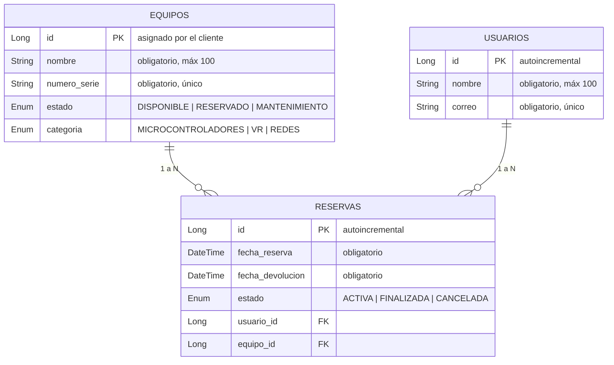

# Equipos Reservas API

API REST para la gestión de equipos y reservas de un laboratorio de la Universidad de Antioquia (LIS). Los usuarios reservan equipos por franjas de tiempo; las reservas se cancelan con soft delete para conservar el historial.

## Stack

| Tecnología | Versión |
|---|---|
| Java | 21 |
| Spring Boot | 4.1 |
| Spring Data JPA (Hibernate) | incluido |
| MySQL | 8 |
| Maven | Wrapper incluido (`mvnw.cmd`), no requiere instalación |

## Estructura del proyecto

```
backend-reto2/
├── equipos-reservas-api/          # Aplicación Spring Boot
│   ├── db/init.sql                # Crea el esquema de la base de datos
│   ├── postman/                   # Colección de pruebas de Postman
│   ├── .env.example               # Plantilla de credenciales
│   └── src/                       # Código fuente
└── README.md
```

## Modelo de datos



| Entidad | Detalles |
|---|---|
| **Equipo** | El `id` lo asigna el cliente (no es autoincremental). Un equipo puede tener varias reservas a lo largo del tiempo. |
| **Usuario** | Se crea automáticamente al reservar si su correo no existe. Solo es referenciado desde las reservas. |
| **Reserva** | Pertenece a un equipo y a un usuario. La cancelación cambia su estado a `CANCELADA` (no se elimina). El estado `FINALIZADA` se asigna automáticamente cuando la fecha de devolución ya pasó. |

## Puesta en marcha

Todas las instrucciones se ejecutan dentro de `equipos-reservas-api/`:

```bash
cd equipos-reservas-api
```

### 1. Crear la base de datos

JPA crea las tablas al arrancar (`ddl-auto: update`), pero **no** crea el esquema:

```bash
mysql -u root -p < db/init.sql
```

### 2. Configurar las credenciales

```bash
copy .env.example .env
```

Edita `.env` con los datos de tu MySQL local (`DB_HOST`, `DB_PORT`, `DB_NAME`, `DB_USERNAME`, `DB_PASSWORD`). El archivo está en `.gitignore`; sin él, la aplicación usa los valores por defecto (`root` / `simon123`).

### 3. Arrancar la aplicación

```bash
./mvnw.cmd spring-boot:run
```

Al arrancar contra una base vacía, el seeder inserta datos de ejemplo (ver [Datos de ejemplo](#datos-de-ejemplo)).

### 4. Verificar

- API: `http://localhost:8080/api/equipos`
- Base de datos: `equipos_lis` con las tablas `equipos`, `reservas`, `usuarios`

## Endpoints

### Equipos

| Método | Ruta | Descripción | Respuesta |
|---|---|---|---|
| POST | `/api/equipos` | Registra un equipo (el `id` lo asigna el cliente) | `201` |
| PUT | `/api/equipos` | Actualiza el equipo con el `id` del body | `200` |
| GET | `/api/equipos/{id}` | Consulta un equipo por id | `200` |
| GET | `/api/equipos` | Lista paginada. Filtros: `categoria`, `estado`, `page`, `size` | `200` |

```json
{
  "id": 10,
  "nombre": "Arduino Uno",
  "numeroSerie": "SN-001",
  "categoria": "MICROCONTROLADORES",
  "estado": "DISPONIBLE"
}
```

### Reservas

| Método | Ruta | Descripción | Respuesta |
|---|---|---|---|
| POST | `/api/reservas` | Crea una reserva; el usuario se crea solo si no existe (por correo) | `201` |
| POST | `/api/reservas/{id}/cancelar` | Cancela la reserva (soft delete) | `200` |
| GET | `/api/reservas` | Lista paginada. Filtros: `equipoId`, `estado`, `page`, `size` | `200` |

Fechas en formato ISO-8601 (`yyyy-MM-ddTHH:mm:ss`):

```json
{
  "nombreUsuario": "Ana Pérez",
  "correoUsuario": "ana.perez@udea.edu.co",
  "equipoId": 1,
  "fechaReserva": "2026-08-10T08:00:00",
  "fechaDevolucion": "2026-08-10T12:00:00"
}
```

### Estadísticas

| Método | Ruta | Descripción |
|---|---|---|
| GET | `/api/estadisticas/top-5` | Top 5 de equipos más solicitados históricamente |

## Reglas de negocio

- Un equipo en `MANTENIMIENTO` no se puede reservar. Un equipo `DISPONIBLE` o `RESERVADO` acepta reservas siempre que la franja no se solape con otra reserva activa (puede tener varias reservas activas simultáneas).
- La fecha de inicio debe ser posterior a la actual; la de devolución, posterior a la de inicio.
- Solo las reservas `ACTIVA` se pueden cancelar; `FINALIZADA` o `CANCELADA` devuelven `409`.
- Al crear, cancelar o listar reservas, las activas cuya fecha de devolución pasó se marcan como `FINALIZADA` y el equipo se libera (`DISPONIBLE`) si no le quedan reservas activas.
- El top 5 cuenta las reservas `ACTIVA` y `FINALIZADA`; las `CANCELADA` no cuentan.

## Manejo de errores

| Código | Significado |
|---|---|
| `400` | Datos inválidos o formato incorrecto (validación, JSON mal formado, enum no válido) |
| `404` | Recurso no encontrado |
| `409` | Conflicto: equipo duplicado (id o serie), equipo en mantenimiento, fecha en el pasado, horario en conflicto, reserva ya cancelada o finalizada |

Todos los errores devuelven un body uniforme (no el formato por defecto de Spring). Los de validación (`400`) incluyen además el array `errors`:

```json
{
  "status": 400,
  "error": "Bad Request",
  "message": "Los datos enviados no son válidos",
  "path": "/api/equipos",
  "timestamp": "2026-08-09T12:34:56.789",
  "errors": [
    { "campo": "correoUsuario", "mensaje": "El correo del usuario no tiene un formato válido" },
    { "campo": "id", "mensaje": "El id del equipo es obligatorio" }
  ]
}
```

## Datos de ejemplo

Al arrancar contra una base vacía, el seeder inserta **20 equipos** (ids 1–20, de las tres categorías) y **20 reservas** de 9 usuarios: 7 `ACTIVA` (tres no solapadas sobre el equipo 1, para demostrar reservas simultáneas), 7 `FINALIZADA` y 6 `CANCELADA`. Los equipos con reservas activas quedan como `RESERVADO`.

> El seeder solo corre si las tablas `equipos` y `reservas` están vacías. Para re-sembrar: borra el contenido de las tablas (o recrea la base con `db/init.sql`) y reinicia la aplicación.

## Postman

Importa `equipos-reservas-api/postman/equipos-reservas-api.postman_collection.json`. La colección usa la variable `{{baseUrl}}` (por defecto `http://localhost:8080`); `{{equipoId}}` y `{{reservaId}}` se editan en la pestaña de variables según los ids que devuelva la API.
