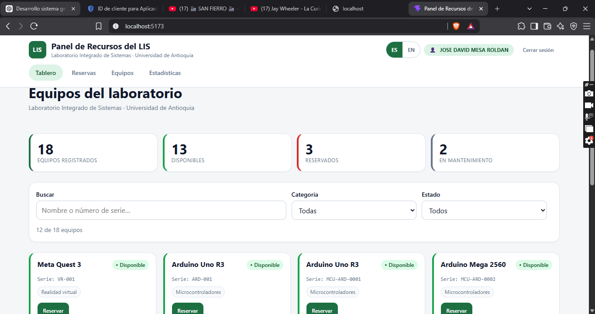
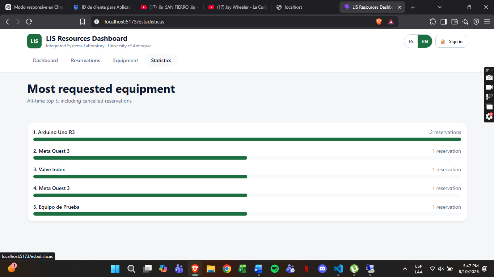
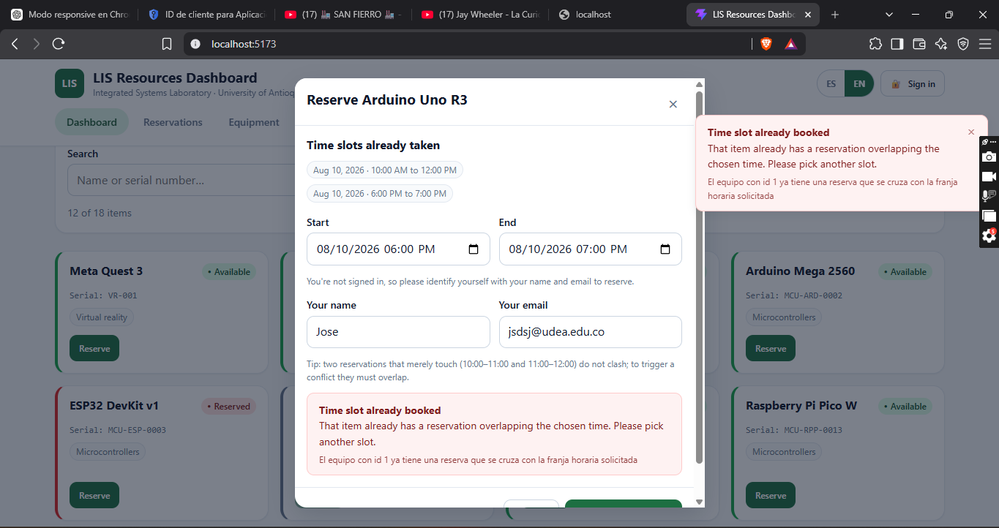
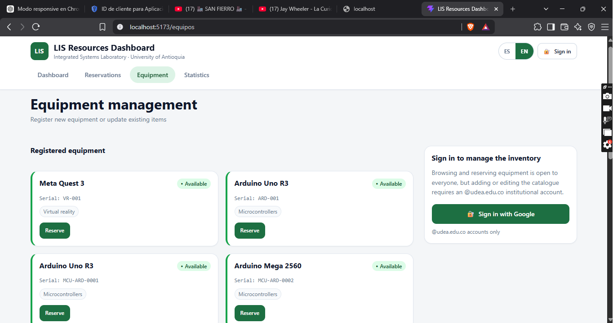
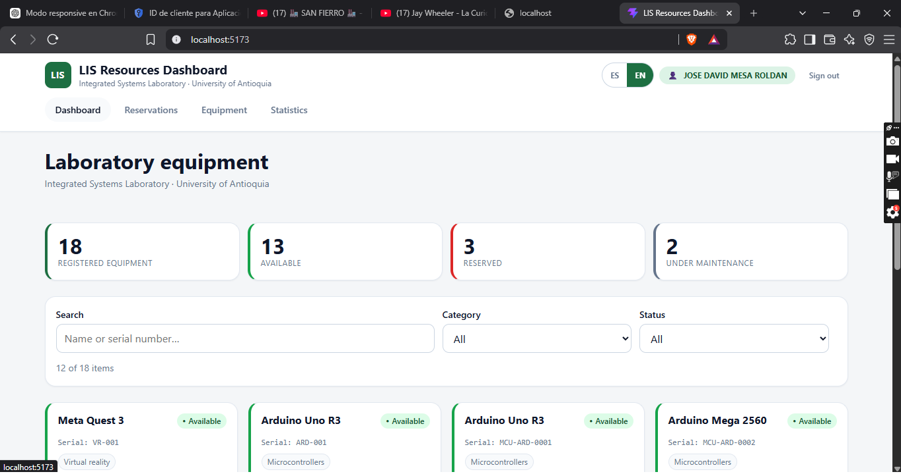
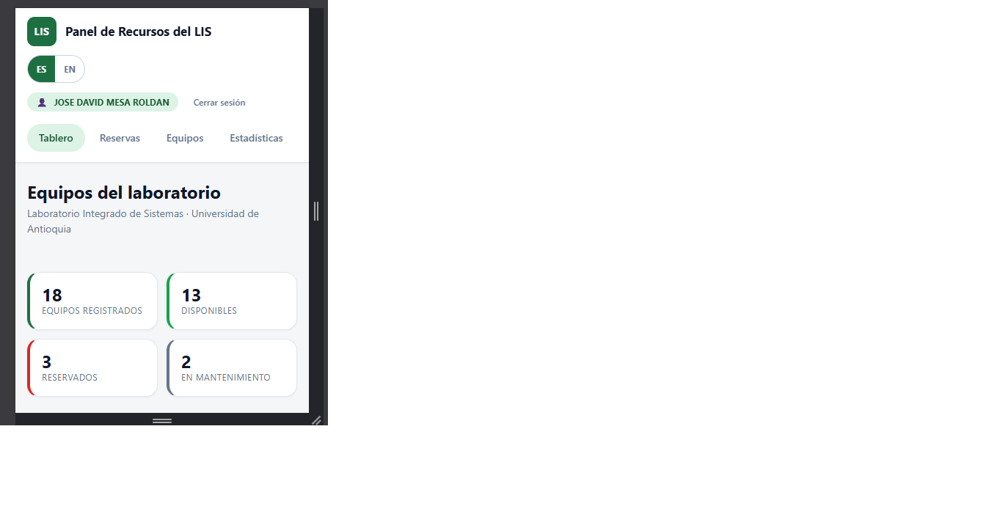

# Panel de Recursos del LIS — Frontend

**Reto 3 · Prueba Técnica 2026-2 · Laboratorio Integrado de Sistemas — Universidad de Antioquia**

Dashboard de monitoreo y reserva de equipos que consume la REST API desarrollada en el Reto 2 (proyecto `equipment-api`).



---

## Índice

1. [Qué hace](#qué-hace)
2. [Stack y por qué](#stack-y-por-qué)
3. [Puesta en marcha](#puesta-en-marcha)
4. [Cobertura de los requisitos](#cobertura-de-los-requisitos)
5. [Cómo probar cada requisito](#cómo-probar-cada-requisito)
6. [Conexión con el backend](#conexión-con-el-backend)
7. [Modo demostración](#modo-demostración)
8. [Internacionalización](#internacionalización)
9. [Manejo de errores](#manejo-de-errores)
10. [Diseño responsivo](#diseño-responsivo)
11. [Estructura del proyecto](#estructura-del-proyecto)
12. [Decisiones técnicas](#decisiones-técnicas)
13. [Limitaciones conocidas](#limitaciones-conocidas)

---

## Qué hace

| Vista | Ruta | Contenido | Acceso |
|---|---|---|---|
| **Tablero** | `/` | Indicadores del inventario, filtros dinámicos y rejilla de equipos con su estado | 🔓 libre |
| **Reservas** | `/reservas` | Todas las reservas, con cancelación de las propias | 🔓 libre |
| **Equipos** | `/equipos` | Alta y edición de equipos | 🔒 **requiere sesión** |
| **Estadísticas** | `/estadisticas` | Top 5 de equipos más solicitados | 🔓 libre |
| *Retorno del SSO* | `/auth/callback` | Recoge el JWT tras iniciar sesión con Google | — |

### Quién puede hacer qué

Consultar y reservar están abiertos: cualquiera puede ver el catálogo y reservar un equipo identificándose con su nombre y correo. **Gestionar el inventario no**: dar de alta o editar equipos exige iniciar sesión con una cuenta `@udea.edu.co`.

El criterio es el uso real del laboratorio: quien pasa por allí reserva un equipo, pero no edita el catálogo.

Sin sesión, la vista *Equipos* muestra el listado pero sustituye el formulario por una invitación a entrar, y las tarjetas no ofrecen el botón *Editar*. **Esto es cortesía hacia el usuario, no la barrera de seguridad**: quien la aplica de verdad es el backend, que responde `403` a cualquier escritura sobre `/api/equipment` sin sesión.

---

## Stack y por qué

| Elección | Motivo |
|---|---|
| **React 19 + Vite + TypeScript** | Arranque inmediato y, sobre todo, TypeScript tipa los DTOs y enums del backend: si la API cambia un campo, el error aparece al compilar y no en producción |
| **CSS puro con design tokens** | Todo el sistema visual vive en [`src/styles/tokens.css`](src/styles/tokens.css). Se resuelve el diseño responsivo con `grid auto-fill` y `clamp()`, usando solo dos `@media`. Demuestra dominio de CSS, que es justo lo que evalúa el requisito 2 |
| **i18n propia, sin librería** | El requisito pide textos centralizados y escalables, no una dependencia. Son ~60 líneas y consiguen algo que `i18next` no da: **si falta una traducción, el proyecto no compila** |
| **`react-router-dom`** | Hay cuatro vistas más la ruta de retorno del SSO. URLs reales, compartibles y con botón atrás funcional |
| **Sin axios, sin react-query, sin librería de gráficos** | `fetch` nativo y CSS bastan. Menos dependencias, menos superficie de fallo |

Dependencias de ejecución: **`react`, `react-dom` y `react-router-dom`**. Nada más.

---

## Puesta en marcha

### Requisitos

- **Node.js 20 o superior**
- El backend del Reto 2 corriendo en `http://localhost:8080` *(opcional: sin él se activa el [modo demostración](#modo-demostración))*

### Instalación y ejecución

```bash
npm install
npm run dev
```

Abrir **http://localhost:5173**.

### Otros comandos

| Comando | Qué hace |
|---|---|
| `npm run build` | Compila TypeScript y genera `dist/` para producción |
| `npm run preview` | Sirve la build de producción localmente |
| `npm run lint` | Analiza el código con oxlint |

No hace falta configurar nada: el archivo `.env` es opcional y `.env.example` documenta las dos variables disponibles.

---

## Cobertura de los requisitos

| # | Requisito del enunciado | Dónde está implementado |
|---|---|---|
| 1 | Framework o librería JS a elección | React 19 + Vite + TypeScript |
| 2 | **Diseño responsivo** móvil y escritorio | [`src/styles/global.css`](src/styles/global.css) · [ver detalle](#diseño-responsivo) |
| 3 | **Tablero** que lista los equipos consumiendo la API | [`src/pages/DashboardPage.tsx`](src/pages/DashboardPage.tsx) + [`src/hooks/useEquipment.ts`](src/hooks/useEquipment.ts) |
| 4 | **Indicadores de estado** con colores o iconos | [`src/components/dashboard/StatusBadge.tsx`](src/components/dashboard/StatusBadge.tsx) |
| 5 | **Filtros dinámicos** sin recargar la página | [`src/components/dashboard/FiltersPanel.tsx`](src/components/dashboard/FiltersPanel.tsx) |
| 6 | **Manejo de errores en UI** (incluido el 409) | [`src/utils/errors.ts`](src/utils/errors.ts) + [`src/components/reservation/ReserveModal.tsx`](src/components/reservation/ReserveModal.tsx) |
| 7 | **[Bonus] i18n** español ↔ inglés dinámico | [`src/i18n/`](src/i18n/) |

**Extras** que no pedía el Reto 3 pero hacen visibles los requisitos del Reto 2:

| Extra | Dónde |
|---|---|
| Crear y cancelar reservas | `ReserveModal.tsx` · `ReservationsPage.tsx` |
| Registrar y editar equipos | `EquipmentAdminPage.tsx` · `EquipmentForm.tsx` |
| Top 5 de equipos más solicitados | `StatisticsPage.tsx` |
| Inicio de sesión con Google (`@udea.edu.co`) | `AuthProvider.tsx` · `AuthCallbackPage.tsx` |



Las barras se dibujan con CSS puro, sin ninguna librería de gráficos: el ancho de cada una es su porcentaje respecto al equipo más reservado.

---

## Cómo probar cada requisito

### Requisito 3 y 4 — Tablero e indicadores de estado

Abrir `/`. Cada equipo muestra un distintivo con **color + icono + texto**:

| Estado | Color | Aspecto |
|---|---|---|
| `AVAILABLE` | Verde | ● Disponible |
| `RESERVED` | Rojo | ● Reservado |
| `MAINTENANCE` | Gris | ● En mantenimiento |

Además, la tarjeta lleva un borde izquierdo del color del estado, de modo que se distingue de un vistazo sin leer el texto. Los equipos en mantenimiento tienen el botón *Reservar* deshabilitado y explican por qué al pasar el ratón.

### Requisito 5 — Filtros dinámicos

En el panel de filtros:

- **Categoría** y **Estado** se envían al backend como parámetros de consulta (`?category=VR&status=AVAILABLE`) y refrescan la lista **sin recargar la página**.
- El **buscador de texto** filtra por nombre o número de serie sobre la página cargada, con 300 ms de retardo para no filtrar en cada tecla.
- El contador *«X de Y equipos»* se actualiza en vivo y el botón *Limpiar filtros* solo aparece si hay alguno activo.

### ⭐ Requisito 6 — Manejo de errores, con el 409 como caso estrella

1. Abrir el tablero y pulsar **Reservar** en *Arduino Uno R3*.
2. El modal muestra las **franjas ya ocupadas** de ese equipo.
3. Reservar de **10:00 a 11:00** e identificarse con nombre y correo → se crea correctamente.
4. Volver a pulsar **Reservar** en el mismo equipo y pedir de **10:30 a 11:30**.
5. El backend responde **409 Conflict** y la interfaz muestra un aviso traducido: *«Franja horaria ocupada — Ese equipo ya tiene una reserva que se cruza con el horario elegido»*, tanto **dentro del formulario en rojo** como en un **toast** en la esquina. Debajo, en letra pequeña, aparece el mensaje literal del servidor, como prueba de que se está leyendo su respuesta.



> ⚠️ **Detalle importante:** si en el paso 4 se pide **11:00 a 12:00** en lugar de 10:30 a 11:30, la reserva **se crea sin error**. No es un fallo: el backend trata las franjas como intervalos semiabiertos `[inicio, fin)`, así que dos reservas que se *tocan* no se solapan. Para provocar el conflicto tienen que **cruzarse**.

**Dos variantes que conviene probar también**, porque demuestran que el mensaje no se elige solo por el código HTTP:

- **Equipo en mantenimiento.** En el tablero, el botón *Reservar* de un equipo en mantenimiento está deshabilitado; para provocar el error, entra en *Equipos* (con sesión), pon un equipo en `MAINTENANCE` e intenta reservarlo desde el tablero de otra pestaña. El backend responde **409, igual que el solapamiento**, pero el aviso dice *"Equipo en mantenimiento"* y no *"Franja horaria ocupada"*.
- **Reserva demasiado larga.** Pide una franja de más de 8 horas: se rechaza con **400** y el mensaje *"Reserva demasiado larga"*.

Otros errores cubiertos: sesión expirada (401), cancelar una reserva ajena (403), recurso inexistente (404), datos inválidos (400, con el detalle campo a campo) y caída del servidor (500).

### Permisos — gestionar el inventario sin sesión

1. Sin haber iniciado sesión, entra en **Equipos**.
2. El listado se ve con normalidad, pero **no hay formulario ni botones *Editar***: en su lugar aparece una invitación a iniciar sesión.
3. Para comprobar que la barrera es real y no cosmética, prueba la API directamente:

```bash
curl -i -X POST http://localhost:8080/api/equipment \
  -H "Content-Type: application/json" \
  -d '{"name":"X","serialNumber":"X-1","category":"VR","status":"AVAILABLE"}'
```

Responde **403**. Tras iniciar sesión con una cuenta `@udea.edu.co`, el formulario aparece y esa misma llamada, con el token, funciona.



### Requisito 7 — Internacionalización

Pulsar **ES / EN** en la cabecera. Cambian **sin recargar**:

- todos los textos de la interfaz, incluidos los de los estados, los mensajes de error y los `placeholder`;
- el **formato de las fechas y horas**, mediante `Intl.DateTimeFormat` con la configuración regional correspondiente;
- el atributo `lang` del documento y el título de la pestaña.

La elección queda guardada y se recuerda en la siguiente visita.



---

## Conexión con el backend

En desarrollo, las llamadas pasan por el **proxy de Vite** definido en [`vite.config.ts`](vite.config.ts):

```
navegador ──▶ localhost:5173/api/…  (mismo origen, sin CORS)
                     │
                     ▼
              localhost:8080/api/…
```

El backend **ya declara CORS** para `http://localhost:5173`, así que las llamadas directas también funcionan. Aun así se mantiene el proxy porque en desarrollo elimina de raíz las peticiones *preflight* y los problemas de cookies de sesión durante el flujo OAuth2, y concentra el puerto del backend en un único sitio.

Para apuntar directamente al backend (por ejemplo, a uno desplegado), definir en `.env`:

```
VITE_API_BASE_URL=http://localhost:8080
```

> **Si el puerto 8080 ya está ocupado por otro proceso**, el frontend lo detecta: cuando la respuesta no es la que produce la API, muestra el aviso de conexión en lugar de inventarse un error de datos.

---

## Modo demostración

Si la API no responde, la aplicación **no se queda en blanco**: cambia a datos de ejemplo en memoria y lo anuncia con un aviso amarillo y un botón *Reintentar conexión*.

Sirve para dos cosas:

- que la interfaz se pueda evaluar aunque el backend no esté levantado;
- que el **error 409 siga siendo demostrable**, porque el cliente de demostración reproduce exactamente las mismas reglas que el backend: el solapamiento (`inicio < fin && fin > inicio`, ignorando las canceladas), el rechazo de equipos en mantenimiento, la duración máxima y la exigencia de identificarse. Emite incluso los mismos valores de `code`.

El catálogo de demostración es una **copia exacta** de lo que siembra el backend: los mismos 15 equipos, con idénticos números de serie, categorías y estados. Así una captura tomada en modo demostración no contradice a la aplicación real.

Se puede forzar desde el arranque con `VITE_USE_MOCK=true`. Los datos viven solo en memoria: al recargar la página vuelven a su estado inicial.

El cambio de modo **solo** ocurre ante fallos de conexión. Un 404, un 409 o un 500 son respuestas legítimas del backend y se propagan tal cual: la aplicación nunca sustituye datos reales por datos falsos.

---

## Internacionalización

Los diccionarios están en [`src/i18n/`](src/i18n/). El español es la fuente de verdad de las claves:

```ts
// es.ts  →  fuente de verdad
export const es = {
  'status.AVAILABLE': 'Disponible',
  'errors.CONFLICT.title': 'Franja horaria ocupada',
  'pagination.info': 'Página {current} de {total}',
} as const

// types.ts
export type TranslationKey = keyof typeof es
export type Dictionary = Record<TranslationKey, string>

// en.ts
export const en: Dictionary = { /* … */ }   // ← si falta una clave, npm run build FALLA
```

Esto da tres garantías:

1. **Ningún texto queda sin traducir**, porque el compilador lo impide.
2. **Ninguna clave inexistente se usa por error**: `t('clave.mal.escrita')` no compila.
3. **Añadir un idioma es crear un archivo** y registrarlo en `I18nProvider`; el compilador dirá exactamente qué falta.

Uso desde cualquier componente:

```ts
const { t, lang, setLang, formatDateTime } = useI18n()

t('errors.CONFLICT.body')
t('pagination.info', { current: 1, total: 3 })
t(`status.${equipment.status}`)   // validado por TypeScript
```

**Regla que se sigue en todo el proyecto:** ningún literal visible se escribe en un componente, ni siquiera los `placeholder` y los `aria-label`.

---

## Manejo de errores

El cliente HTTP ([`src/api/http.ts`](src/api/http.ts)) convierte cada respuesta en un `ApiError`, y [`src/utils/errors.ts`](src/utils/errors.ts) lo traduce a claves de i18n. La traducción ocurre en **dos niveles**.

**Nivel 1 — por código de negocio.** El backend envía un campo `code` en el cuerpo del error, y tiene prioridad:

| `code` del backend | HTTP | Mensaje al usuario |
|---|---|---|
| `RESERVATION_OVERLAP` | 409 | **Franja horaria ocupada** |
| `EQUIPMENT_IN_MAINTENANCE` | 409 | Equipo en mantenimiento |
| `DUPLICATE_RESOURCE` | 409 | Número de serie repetido |
| `INVALID_TIME_RANGE` | 400 | Horario incoherente |
| `RESERVATION_TOO_LONG` | 400 | Reserva demasiado larga |
| `IDENTITY_REQUIRED` | 400 | Falta identificarte |

**Por qué hace falta este nivel:** *"la franja está ocupada"* y *"el equipo está en mantenimiento"* son **ambas un 409**. Sin un identificador estable, la interfaz mostraría *"Franja horaria ocupada"* al intentar reservar un equipo averiado. Decidir sobre `code` en vez de sobre el texto del mensaje evita además depender del idioma en que venga redactado.

**Nivel 2 — por código HTTP**, como respaldo cuando la respuesta no trae `code`:

| Código HTTP | Categoría | Mensaje al usuario |
|---|---|---|
| 409 | `CONFLICT` | Conflicto con el estado actual |
| 400 / 422 | `VALIDATION` | Revisa los datos *(+ detalle por campo)* |
| 401 | `UNAUTHORIZED` | Sesión expirada *(y se limpia el token)* |
| 403 | `FORBIDDEN` | Sin permiso |
| 404 | `NOT_FOUND` | No encontrado |
| ≥500 | `SERVER` | Error del servidor |
| sin respuesta | `NETWORK` | Sin conexión con la API *(activa el modo demostración)* |

Detalles que importan:

- La lectura del cuerpo del error es **defensiva**: Spring Security devuelve los 401 y 403 **sin cuerpo**, y algunas respuestas usan el formato `ProblemDetail` en lugar del contrato propio de la API. Se prueban `message`, `detail` y `error` por ese orden.
- Si una respuesta **no es JSON**, se interpreta como que en ese puerto no está la API, y se avisa de un problema de conexión en vez de mostrar un error de datos inventado.
- Los errores de validación se pintan **campo a campo** en los formularios, además del aviso general.

---

## Diseño responsivo

Enfoque *mobile-first*. La mayor parte del comportamiento se consigue **sin media queries**, con `grid-template-columns: repeat(auto-fill, minmax(min(100%, 280px), 1fr))` y `clamp()`; solo hay dos `@media` reales.

| Ancho | Comportamiento |
|---|---|
| < 640 px | Una columna · indicadores en 2×2 · filtros plegables · modal a pantalla completa · tablas con desplazamiento propio |
| ≥ 640 px | Rejilla automática de tarjetas · filtros en fila |
| ≥ 900 px | Indicadores en cuatro columnas |
| ≥ 1024 px | Formulario de equipos en columna lateral |

Comprobado midiendo el DOM en **320, 360, 390, 768, 1024 y 1440 px** en las cuatro vistas: `scrollWidth === clientWidth` en todos los casos, es decir **la página nunca se desplaza en horizontal**. Los únicos elementos con desplazamiento lateral son la barra de navegación y las tablas, cada uno dentro de su propio contenedor y de forma intencionada.

Otros cuidados: objetivos táctiles de 44 px como mínimo, foco visible con `:focus-visible`, `role`/`aria-*` en diálogos, avisos y medidores, y `prefers-reduced-motion` respetado.



---

## Estructura del proyecto

```
src/
├─ main.tsx                    Proveedores: I18n › Toast › Auth › Router
├─ App.tsx                     Layout y rutas
│
├─ api/
│  ├─ http.ts                  fetch tipado, ApiError, token, lectura defensiva de errores
│  ├─ equipment.ts             GET/POST/PUT de equipos
│  ├─ reservations.ts          listar, crear y cancelar reservas
│  ├─ statistics.ts            Top 5
│  ├─ auth.ts                  URL del SSO y perfil del usuario
│  ├─ client.ts                Fachada: API real con respaldo de demostración
│  └─ mock/                    Datos y cliente en memoria (reproduce el 409)
│
├─ i18n/                       Diccionarios tipados, proveedor y hook
├─ auth/                       Sesión, token e identidad de invitado
├─ feedback/                   Avisos (toasts)
├─ hooks/                      useEquipment · useDebouncedValue
├─ utils/                      Fechas y traducción de errores
├─ types/api.ts                Espejo de los DTOs y enums del backend
├─ styles/                     tokens.css · global.css
│
├─ pages/                      Una por vista
└─ components/
   ├─ layout/                  Cabecera, idioma, sesión
   ├─ dashboard/               Indicadores, filtros, tarjeta, distintivo, paginación
   ├─ reservation/             Modal de reserva y franjas ocupadas
   ├─ equipment/               Formulario de alta y edición
   └─ common/                  Modal, estados de carga y vacío, aviso de demostración
```

---

## Decisiones técnicas

| Decisión | Motivo |
|---|---|
| **`AbortController` en cada carga** | Al cambiar de filtro rápido, una respuesta lenta podía pisar a otra más reciente y mostrar datos equivocados. Cada petición nueva cancela la anterior |
| **Buscador en cliente** | La API expone filtros por categoría y estado, pero no por nombre. Se filtra sobre la página cargada y se avisa en la propia interfaz; lo correcto a futuro es un parámetro `q` en el servidor |
| **Cambiar un filtro reinicia la paginación** | Si el usuario está en la página 3 y filtra por VR, esa página probablemente ya no exista |
| **La identidad sale del token cuando hay sesión** | El backend ignora `userName`/`userEmail` del cuerpo si llega un JWT válido, así que nadie puede reservar en nombre de otro. Sin sesión se piden esos datos, que es lo que exige el requisito obligatorio del Reto 2 |
| **El token se borra de la URL al recogerlo** | En `/auth/callback` se usa `replace` para que el JWT no quede en el historial del navegador |
| **Fechas en ISO local, sin zona horaria** | La API usa `LocalDateTime` de Java. Enviar `toISOString()` mandaría la hora en UTC y la reserva aparecería desplazada |
| **Indicadores calculados en cliente** | Se piden hasta 100 equipos y se cuentan por estado. Suficiente para un laboratorio; con más volumen convendría un endpoint de resumen |
| **El Top 5 no tumba el tablero si falla** | Es información complementaria: si su endpoint no responde, el componente simplemente no se pinta |

---

## Limitaciones conocidas

- **Búsqueda por texto limitada a la página actual**, por lo explicado arriba.
- **Sin tests automatizados.** El backend sí los tiene (41, incluidos 13 sobre la regla de solapamiento). Aquí la verificación fue manual y con capturas; lo natural sería añadir Vitest + Testing Library.
- **Los indicadores leen hasta 100 equipos.** Con un inventario mayor, el recuento por estado se quedaría corto.
- **El catálogo de demostración se mantiene a mano.** Si cambia el `DataSeeder` del backend, hay que reflejarlo en `src/api/mock/data.ts`; nada lo comprueba automáticamente.
- **Rol único.** La interfaz distingue entre con sesión y sin sesión, pero no hay perfiles diferenciados: cualquier cuenta institucional puede gestionar el inventario.
- **Sin tema oscuro**, aunque los tokens de color ya están centralizados y añadirlo sería directo.
- **El token JWT dura una hora** y no hay refresco: al expirar hay que volver a iniciar sesión (la aplicación lo detecta y lo avisa).
- **Los datos del modo demostración no persisten**: se reinician al recargar la página.