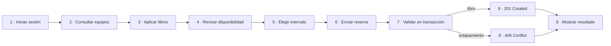
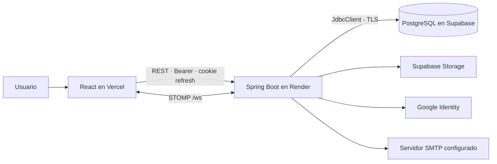

<div align="center">

# LISource Backend

### API de inventario, reservas y seguridad institucional del LIS · Reto 2

[](https://technical-test-2026-2-v96h.onrender.com)
[](https://technical-test-2026-2-v96h.onrender.com/swagger-ui/index.html)
[](lisource-backend/pom.xml)
[](lisource-backend/pom.xml)
[](lisource-backend/postman/LISource-Reto2.postman_collection.json)
[](.github/workflows/backend-ci.yml)

</div>

API REST de LISource para administrar equipos del Laboratorio Integrado de Sistemas, autenticar usuarios institucionales y crear reservas sin solapamientos. El backend es la autoridad sobre autorización, disponibilidad, transacciones, auditoría y PostgreSQL; el frontend nunca accede directamente a Supabase.

**Estado:** solución funcional y desplegada · **Rama:** `1021805193-reto2` · **Contrato verificado:** 52 operaciones en 11 controladores.

**Producción:** [API](https://technical-test-2026-2-v96h.onrender.com) · [Swagger UI](https://technical-test-2026-2-v96h.onrender.com/swagger-ui/index.html) · [OpenAPI JSON](https://technical-test-2026-2-v96h.onrender.com/v3/api-docs) · [Health](https://technical-test-2026-2-v96h.onrender.com/actuator/health) · [Frontend](https://lisource-1021805193.vercel.app)

## Índice

- [Entendimiento del reto](#entendimiento-del-reto)
- [Cumplimiento obligatorio](#cumplimiento-obligatorio)
- [Bonus y funcionalidades adicionales](#bonus-y-funcionalidades-adicionales)
- [Arquitectura](#arquitectura)
- [Tecnologías](#tecnologías)
- [Requisitos previos](#requisitos-previos)
- [Variables de entorno](#variables-de-entorno)
- [Preparación de la base de datos](#preparación-de-la-base-de-datos)
- [Ejecución local](#ejecución-local)
- [Ejecutar LISource completo](#ejecutar-lisource-completo)
- [Usuarios de prueba](#usuarios-de-prueba)
- [Swagger](#swagger)
- [Postman](#postman)
- [Pruebas y calidad](#pruebas-y-calidad)
- [CI/CD](#cicd)
- [Infraestructura y despliegue](#infraestructura-y-despliegue)
- [Seguridad](#seguridad)
- [Decisiones arquitectónicas](#decisiones-arquitectónicas)
- [Estructura y documentación](#estructura-y-documentación)
- [Solución de problemas](#solución-de-problemas)

## Entendimiento del reto

LISource responde a una necesidad concreta: mantener un inventario consultable de equipos —con identificador, nombre, serie o MAC, categoría, ubicación y estado— y evitar que dos personas reserven el mismo recurso en intervalos superpuestos. La solución agrega búsqueda, filtrado, paginación, reservas con inicio/fin, cancelación, autenticación institucional, autorización por roles, estadísticas, auditoría, experiencia responsive e internacionalización; español/inglés eran el bonus solicitado y el cliente incluye seis idiomas.



La disponibilidad mostrada por el navegador es orientativa. La verificación definitiva ocurre en el backend, dentro de la transacción de creación y después de bloquear los equipos en orden; por eso dos solicitudes concurrentes no pueden confiar solo en una consulta previa.

## Cumplimiento obligatorio

| Requisito de la prueba | Implementación verificable | Endpoint principal | Prueba o evidencia |
|---|---|---|---|
| Registrar equipos | DTO validado y mutación exclusiva de `ADMINISTRADOR` | `POST /api/v1/equipment` | `EquipmentController` + integración RBAC |
| Actualizar equipos | reemplazo completo conservando restricciones | `PUT /api/v1/equipment/{id}` | integración PostgreSQL |
| Visualizar equipos | listado y detalle por ID | `GET /api/v1/equipment`, `GET /equipment/{id}` | OpenAPI + Postman |
| ID único | PK numérica y `inventoryCode` único | operaciones de equipos | constraints de `tbl_equipo` |
| Nombre | `name`, obligatorio, máximo 120 | `POST/PUT /equipment` | Bean Validation |
| Serie o MAC | `serialNumber` y `macAddress`, con longitudes validadas | `POST/PUT /equipment` | DTO + SQL |
| Categoría | FK `categoryId` y catálogo activo | `GET /catalogs/categories` | modelo relacional |
| Estado | estado operacional y estado visual derivado | `PATCH /equipment/{id}/status` | servicio + badges frontend |
| Paginación | `page`, `pageSize` y respuesta paginada | `GET /equipment` | `enforcesAuthenticationPaginationFiltersAndRbac` |
| Filtro por categoría | parámetro `category` | `GET /equipment?category=...` | integración + colección |
| Filtro por estado | `status`/`operationalStatus` | `GET /equipment?status=...` | integración + colección |
| Crear reservas | agregado atómico de hasta 20 equipos | `POST /reservations` | unitarias + Testcontainers |
| Cancelar reservas | transición histórica, sin borrar registro | `POST /reservations/{id}/cancel` | integración PostgreSQL |
| Listar reservas | reservas propias y detalle con ownership/Admin | `GET /reservations/me` | integración de autorización |
| Fechas de inicio y fin | `startsAt`/`endsAt` como `Instant`; fin debe ser posterior | `POST /reservations` | `rejectsEndEqualToOrBeforeStart` |
| Evitar solapamiento | locks `FOR UPDATE`, overlap `[inicio, fin)` y rollback atómico | `POST /reservations` | concurrencia: un éxito y un conflicto |
| HTTP `409` | Problem Details con `RESERVATION_CONFLICT` | `POST /reservations` | caso reproducible Swagger/Postman |

Código y trazabilidad detallada: [problema y requisitos](lisource-backend/docs/01-problema-y-requerimientos.md) · [reservas y concurrencia](lisource-backend/docs/06-reservas-y-concurrencia.md).

## Bonus y funcionalidades adicionales

### Bonus de la prueba

| Bonus | Implementación | Endpoint | Evidencia |
|---|---|---|---|
| Top 5 histórico | agregado SQL de reservas confirmadas; excluye canceladas | `GET /api/v1/statistics/top-equipment?limit=5` | `topFiveExcludesCancelledReservations` |
| Google SSO | validación de ID token, issuer, audience y usuario | `POST /api/v1/auth/google` | `AuthServiceGoogleTest` |
| Dominio `@udea.edu.co` | comparación exacta normalizada; rechaza subdominios/lookalikes | endpoints de autenticación | `EmailDomainPolicyTest` |
| JWT | access HS256 corto con issuer, `tokenUse`, sesión y rol activo | login/select-role/refresh | `JwtService` + integración |

### Funcionalidades adicionales del proyecto

No se presentan como mínimos exigidos: perfiles e idioma, sesiones y revocación, recuperación/cambio de contraseña, múltiples roles, imágenes en Supabase Storage, catálogos administrables, configuración, dashboard, WebSocket/STOMP, auditoría y correlation ID.

## Arquitectura



El backend es un **monolito modular por feature y capas**, adecuado para una prueba técnica: mantiene una sola transacción, un despliegue y límites comprensibles entre `api`, `application`, `domain` e `infrastructure`. No es arquitectura hexagonal pura: varios servicios dependen de repositorios concretos y no todos los adaptadores están detrás de puertos. Una evolución hexagonal exigiría interfaces de entrada/salida en application/domain, inversión explícita de dependencias y adaptadores intercambiables para JDBC, Google, Storage y correo.

Los diagramas de componentes, paquetes reales, autenticación, reserva válida/conflictiva, CI y despliegue están en [Arquitectura backend](lisource-backend/docs/02-arquitectura.md).

## Tecnologías

<p>
  
  
  
  
  
  
  
  
</p>

| Área | Tecnología confirmada | Fuente |
|---|---|---|
| Runtime | Java 21, Spring Boot 3.5.16, Spring Security | [`pom.xml`](lisource-backend/pom.xml) |
| Persistencia | Spring JDBC/`JdbcClient`, PostgreSQL, Supabase | repositorios y SQL explícito; no JPA |
| Contrato | Springdoc OpenAPI/Swagger | `/v3/api-docs`, Swagger UI |
| Calidad | JUnit, Mockito, Testcontainers, ArchUnit, JaCoCo | `src/test`, Maven verify |
| Entrega | Maven Wrapper, Docker, GitHub Actions, CodeQL, Trivy | workflow backend |
| Cloud | Render, Supabase, Terraform y AWS IAM/OIDC | workflow + `infra/aws-oidc` |

## Requisitos previos

| Herramienta | Clasificación | Versión/uso real |
|---|---|---|
| Git | Obligatoria | clonar ramas y revisar cambios |
| JDK | Obligatoria para backend | Java 21 |
| Maven global | No requerido | se usa `mvnw.cmd`/`mvnw` |
| Node.js + npm | Obligatorios solo para frontend | Node 22 en CI |
| Navegador | Obligatorio para UI/Swagger | navegador moderno |
| Docker | Desarrollo/integración opcional | Testcontainers y builds de imagen |
| Postman | Opcional | colección incluida; Swagger es alternativa |
| `psql` | Opcional | puede usar Supabase SQL Editor |
| Terraform 1.15.x + AWS CLI | Solo infraestructura | validar/provisionar OIDC y verificar STS |

```powershell
git --version
java --version
node --version
npm --version
docker --version # solo si utilizará Docker
```

Instalación paso a paso: [Windows/PowerShell](lisource-backend/docs/07-instalacion-windows.md) · [Ubuntu/Debian/Bash](lisource-backend/docs/08-instalacion-linux.md).

## Variables de entorno

Spring importa `optional:file:.env[.properties]` desde el directorio de ejecución. La ruta correcta es `lisource-backend/.env`; Vite usa `lisource-frontend/.env`.

1. Descargue `backend.txt` y `frontend.txt` desde la carpeta privada de Drive entregada con la prueba.
2. Renombre `backend.txt` como `.env` y guárdelo dentro de `lisource-backend/`.
3. Renombre `frontend.txt` como `.env` y guárdelo dentro de `lisource-frontend/`.
4. En Windows active extensiones de archivo y confirme que no quedaron como `.env.txt`.
5. Compare **solo los nombres** con los respectivos `.env.example`; no copie valores a documentación.
6. Ejecute `git status --short`: los `.env` reales no deben aparecer.

El backend espera grupos `DB_*`, `JWT_*`, Google, CORS, cookie, Supabase Storage y correo definidos en [`lisource-backend/.env.example`](lisource-backend/.env.example). La contraseña de evaluación y las variables privadas se encuentran en la carpeta de Drive entregada junto con la prueba. `VITE_*` se incorpora al bundle del navegador y no debe contener secretos.

## Preparación de la base de datos

> [!CAUTION]
> `01-estructura.sql` elimina y reconstruye los objetos LISource. No lo ejecute sobre información que deba conservar.

| Orden | Script exacto | Propósito | Reejecución | Confirmación |
|---|---|---|---|---|
| 1 | [`01-estructura.sql`](lisource-backend/src/main/resources/db/01-estructura.sql) | recrea 20 tablas, PK/FK, checks, índices y RLS | destructiva; solo base nueva/descartable | consulta final enumera las 20 tablas |
| 2 | [`02-semilla.sql`](lisource-backend/src/main/resources/db/02-semilla.sql) | carga estados, roles, idiomas, catálogos y configuración | idempotente mediante `ON CONFLICT` | resumen final de catálogos |
| 3 | [`03-pruebas.sql`](lisource-backend/src/main/resources/db/03-pruebas.sql) | crea dataset demo/QA de usuarios, equipos, reservas y auditoría | no es idempotente por sí solo; ejecutar tras 01/02 | resumen final y cero solapamientos |

Ruta: `lisource-backend/src/main/resources/db/`. Puede pegar cada archivo completo en Supabase SQL Editor con **Run**, o usar `psql` si ya lo tiene; no es necesario instalarlo solo para evaluar. [Modelo y consultas de comprobación](lisource-backend/docs/03-base-de-datos.md).

## Ejecución local

```powershell
cd lisource-backend
.\mvnw.cmd spring-boot:run
```

Linux/Bash:

```bash
cd lisource-backend
chmod +x mvnw
./mvnw spring-boot:run
```

Mantenga esa terminal abierta. Compruebe `http://localhost:8080/actuator/health` y después `http://localhost:8080/swagger-ui/index.html`.

## Ejecutar LISource completo

Backend y frontend viven en ramas diferentes; utilice dos carpetas o dos worktrees. La opción más directa es clonar cada rama:

```powershell
git clone --branch 1021805193-reto2 --single-branch https://github.com/lisudea/technical-test-2026-2.git lisource-reto2
git clone --branch 1021805193-reto3 --single-branch https://github.com/lisudea/technical-test-2026-2.git lisource-reto3
```

1. En `lisource-reto2/lisource-backend`, coloque el `.env` backend.
2. Ejecute 01 → 02 → 03 en Supabase SQL Editor.
3. Inicie `mvnw.cmd spring-boot:run` en Windows o `./mvnw spring-boot:run` en Linux; deje abierta la terminal backend.
4. Compruebe health y Swagger en el puerto 8080.
5. En otra terminal, vaya a `lisource-reto3/lisource-frontend` y coloque el `.env` frontend.
6. Ejecute `npm ci` y `npm run dev`; deje abierta la terminal frontend.
7. Abra `http://localhost:3000`, inicie sesión, consulte el catálogo y cree una reserva futura.
8. Repita equipo/franja para comprobar el mensaje de conflicto `409`.

Checklist: base preparada · health `UP` · Swagger accesible · frontend cargando · login funcional · catálogo visible · reserva `201` · conflicto `409` comprensible.

Como alternativa, dos `git worktree` permiten compartir objetos Git sin alternar checkout; las guías de instalación contienen ambos métodos.

## Usuarios de prueba

Los siguientes candidatos fueron verificados en `03-pruebas.sql`; no se publica ninguna contraseña.

| Usuario | Estado | Rol o autenticación | Uso recomendado |
|---|---|---|---|
| `admin.demo@udea.edu.co` | Activo | local; `ADMINISTRADOR` y `USUARIO` | CRUD Admin, selección/cambio de rol |
| `usuario.demo@udea.edu.co` | Activo | local; `USUARIO` | catálogo, perfil y reserva estándar |
| `reservas.demo@udea.edu.co` | Activo | local; `USUARIO` | historial, cancelación y estadísticas |
| `dual.demo@udea.edu.co` | Activo | local + vínculo Google; ambos roles | selección de rol y cambio de contexto |
| `inactivo.demo@udea.edu.co` | Inactivo | local; rol `USUARIO` asignado | comprobar rechazo `ACCOUNT_INACTIVE` |
| `google.demo@udea.edu.co` | Activo | solo vínculo Google; `USUARIO` | referencia SSO; no tiene contraseña local |

Google SSO requiere una cuenta institucional real autorizada por el client ID. La existencia de un correo seed o `google_sub` ficticio no garantiza que esa identidad pueda autenticarse ante Google.

## Swagger

Local: `http://localhost:8080/swagger-ui/index.html` · OpenAPI: `http://localhost:8080/v3/api-docs` · [Producción](https://technical-test-2026-2-v96h.onrender.com/swagger-ui/index.html).

1. Seleccione el servidor local o producción.
2. Ejecute `POST /api/v1/auth/login` con un usuario activo y la contraseña privada.
3. Si la respuesta solicita selección de rol, ejecute `/auth/select-role` con el token temporal y un rol disponible.
4. Copie únicamente el `accessToken`, pulse **Authorize** y péguelo como token Bearer; Swagger agrega el prefijo esperado.
5. Consulte catálogos antes de usar IDs de categoría, ubicación o equipo.
6. Ejecute operaciones protegidas y al terminar cierre/limpie la autorización.

Ejemplos reales de DTO y demostración `201`/`409`: [Guía REST y Swagger](lisource-backend/docs/04-api-rest.md).

## Postman

La colección contiene **59 solicitudes**, no 59 endpoints: cubre las 52 operaciones de controladores, health/OpenAPI, variantes de login/filtros/conflicto y casos negativos. Después de eliminar query strings hay 55 pares método/ruta porque también existe una ruta negativa deliberada.

Importe [`LISource-Reto2.postman_collection.json`](lisource-backend/postman/LISource-Reto2.postman_collection.json) y uno de los ambientes Local/Production. El login guarda tokens mediante scripts; el refresh usa el cookie jar. Ejecute primero lecturas, luego reservas y finalmente Admin solo con un rol autorizado. [Orden, variables y limpieza](lisource-backend/docs/09-postman.md).

## Pruebas y calidad

```powershell
.\mvnw.cmd -B clean verify
```

La suite incluye unitarias, Spring Security, Testcontainers con PostgreSQL 16, concurrencia real, ArchUnit y JaCoCo. El último build local documentado ejecutó 32 pruebas sin fallos; no se publica un porcentaje de cobertura no verificado. [Alcance y límites](lisource-backend/docs/10-testing.md).

## CI/CD

El workflow backend se activa por push/PR a `1021805193-reto2` con filtros de rutas, o manualmente. Encadena Maven verify → reportes → CodeQL Java → Docker → artefacto de imagen → Trivy → Terraform fmt/init/validate. En push a la rama, el webhook de Render dispara deploy y luego smoke; el job AWS OIDC verifica identidad temporal. Una ejecución exitosa demuestra esos jobs para ese commit, no disponibilidad perpetua ni ausencia absoluta de vulnerabilidades. [Detalle job por job](lisource-backend/docs/11-devsecops.md).

## Infraestructura y despliegue

> [!IMPORTANT]
> **AWS no aloja LISource.** La aplicación utiliza Vercel para el frontend, Render para el backend y Supabase para datos y servicios asociados. AWS se utiliza para la integración segura de identidad de CI/CD, de acuerdo con la infraestructura Terraform del repositorio.

Terraform crea el provider OIDC de GitHub y dos roles IAM con trust policy restringida por audience y rama. No adjunta permisos de aplicación ni crea cómputo/red/datos. CI obtiene credenciales STS temporales y evita access keys permanentes. `terraform apply` es manual; `tfstate`, `tfstate.*` y `tfplan` están ignorados. [Cloud, comandos y evidencias](lisource-backend/docs/12-cloud-y-deployment.md).

## Seguridad

- JWT access HS256 de vida corta con issuer, `tokenUse`, `sid` y rol activo.
- Refresh opaco rotado en cookie `HttpOnly`; solo se persiste su hash SHA-256.
- Contraseñas Argon2id y dominio institucional exacto.
- RBAC backend, ownership, SQL parametrizado, validación DTO, CORS allowlist y correlation ID.
- Logout revoca sesión/refresh; no existe blacklist de access token, que sigue válido hasta expirar.
- Los secretos permanecen en Drive/proveedores y nunca en README, Postman exportado o Git.

[Threat model y flujo completo](lisource-backend/docs/05-autenticacion-y-seguridad.md).

## Decisiones arquitectónicas

PostgreSQL/JDBC explícito, monolito modular, JWT corto + refresh HttpOnly, intervalos `[inicio, fin)`, locking transaccional, auditoría, proveedores administrados, Terraform y OIDC se justifican con alternativas, consecuencias y evolución en [Decisiones arquitectónicas](lisource-backend/docs/adr/README.md).

## Estructura y documentación

```text
lisource-backend/
├── src/main/java/.../{auth,audit,catalog,configuration,equipment,reservation,statistics,user,shared}
├── src/main/resources/db/       # 01 estructura · 02 semilla · 03 demo/QA
├── src/test/                    # unitarias, arquitectura e integración
├── docs/                        # guías especializadas y evidencias reales
├── postman/                     # colección y ambientes sin secretos
├── Dockerfile
├── mvnw / mvnw.cmd
└── pom.xml
infra/aws-oidc/                  # provider y roles IAM para GitHub OIDC
```

| Documento | Contenido |
|---|---|
| [Problema y requisitos](lisource-backend/docs/01-problema-y-requerimientos.md) | alcance y trazabilidad |
| [Arquitectura](lisource-backend/docs/02-arquitectura.md) | contexto, componentes, paquetes y secuencias |
| [Base de datos](lisource-backend/docs/03-base-de-datos.md) | 20 tablas y ejecución SQL |
| [API REST](lisource-backend/docs/04-api-rest.md) | 52 operaciones, DTO y ejemplos |
| [Autenticación](lisource-backend/docs/05-autenticacion-y-seguridad.md) | tokens, roles y amenazas |
| [Reservas](lisource-backend/docs/06-reservas-y-concurrencia.md) | locks, overlap, rollback y `409` |
| [Windows](lisource-backend/docs/07-instalacion-windows.md) / [Linux](lisource-backend/docs/08-instalacion-linux.md) | instalación reproducible |
| [Postman](lisource-backend/docs/09-postman.md) · [Testing](lisource-backend/docs/10-testing.md) | evaluación manual/automática |
| [DevSecOps](lisource-backend/docs/11-devsecops.md) · [Cloud](lisource-backend/docs/12-cloud-y-deployment.md) | CI/CD y despliegue |
| [Troubleshooting](lisource-backend/docs/13-troubleshooting.md) · [Evidencias](lisource-backend/docs/14-evidencias.md) | operación y capturas reales |

## Solución de problemas

Java incorrecto, Docker/Testcontainers, DB/SSL, CORS/cookies, `401/403/409`, Render cold start y Storage están diagnosticados en [Troubleshooting backend](lisource-backend/docs/13-troubleshooting.md). Use correlation ID y nunca adjunte `.env`, cookies o tokens a un reporte.
