<p align="center">
  
</p>

<p align="center">
  
</p>

<h3 align="center">LABORATORIO INTEGRADO DE SISTEMAS</h3>
<h3 align="center">UNIVERSIDAD DE ANTIOQUIA</h3>
<h1 align="center">RETO 3: FRONTEND</h1>
<h2 align="center">Dashboard de Monitoreo de Recursos</h2>

<p align="center"><strong>React</strong> · <strong>Responsive</strong> · <strong>Integración REST</strong> · <strong>i18n</strong> · <strong>Experiencia de usuario</strong></p>

<p align="center">
  María Camila Castañeda Piedrahita · CC 1021805193 · maria.castanedap@udea.edu.co · Medellín · Agosto de 2026
</p>

<p align="center">
  <a href="#qué-pedía-el-reto">📖 Requisitos</a> ·
  <a href="#arquitectura">🏗️ Arquitectura</a> ·
  <a href="#-ejecutar-reto-2-y-reto-3-localmente-con-git-worktree">🚀 Ejecutar</a> ·
  <a href="#integración-rest">🔌 API</a> ·
  <a href="#responsive">📱 Responsive</a> ·
  <a href="#internacionalización">🌍 i18n</a> ·
  <a href="#seguridad">🔐 Seguridad</a> ·
  <a href="#deployment">☁️ Deployment</a>
</p>

<div align="center">

[](lisource-frontend/package.json)
[](lisource-frontend/package.json)
[](lisource-frontend/vite.config.ts)
[](lisource-frontend/src)
[](lisource-frontend/package.json)
[](lisource-frontend/src/components)
[](lisource-frontend/src/i18n)
[](lisource-frontend/package.json)
[](.github/workflows/frontend-ci.yml)
[](https://lisource-1021805193.vercel.app)

</div>

## Producción

| Servicio | Enlace |
|---|---|
| Aplicación web | https://lisource-1021805193.vercel.app |
| API REST | https://technical-test-2026-2-v96h.onrender.com/ |
| Swagger UI | https://technical-test-2026-2-v96h.onrender.com/swagger-ui/index.html |
| OpenAPI JSON | https://technical-test-2026-2-v96h.onrender.com/v3/api-docs |
| Health check | https://technical-test-2026-2-v96h.onrender.com/actuator/health |

> [!IMPORTANT]
> Reto 3 depende funcionalmente del backend del Reto 2. Complete primero la configuración y ejecución del backend antes de levantar el frontend.

## Enlaces directos del evaluador

- Frontend rama Reto 3: https://github.com/lisudea/technical-test-2026-2/tree/1021805193-reto3
- Backend rama Reto 2: https://github.com/lisudea/technical-test-2026-2/tree/1021805193-reto2
- README backend (guía maestra): https://github.com/lisudea/technical-test-2026-2/blob/1021805193-reto2/README.md
- Sección Postman backend: https://github.com/lisudea/technical-test-2026-2/blob/1021805193-reto2/README.md#-postman--prueba-guiada-completa
- Frontend producción (Vercel): https://lisource-1021805193.vercel.app
- Backend producción (Render): https://technical-test-2026-2-v96h.onrender.com
- Swagger producción: https://technical-test-2026-2-v96h.onrender.com/swagger-ui/index.html
- Health backend: https://technical-test-2026-2-v96h.onrender.com/actuator/health

Repositorio y README del backend:

- [Reto 2 en GitHub](https://github.com/lisudea/technical-test-2026-2/tree/1021805193-reto2)
- [README maestro del backend](https://github.com/lisudea/technical-test-2026-2/blob/1021805193-reto2/README.md)

LISource Frontend consume exclusivamente la API del backend del Reto 2. La aplicación nunca accede directamente a PostgreSQL ni a Supabase Storage; su responsabilidad es orquestar navegación, estado remoto, experiencia responsive, tratamiento amigable de errores y una capa visual clara para inventario, reservas y administración.

## Índice

- [Visión general](#visión-general)
- [Qué pedía el reto](#qué-pedía-el-reto)
- [Requerimientos obligatorios](#requerimientos-obligatorios)
- [Bonus solicitados](#bonus-solicitados)
- [Funcionalidades adicionales integradas](#funcionalidades-adicionales-integradas)
- [Interpretación de ingeniería](#interpretación-de-ingeniería)
- [Guía rápida de evaluación](#guía-rápida-de-evaluación)
- [Mapa de LISource UI](#mapa-de-lisource-ui)
- [Demo visual](#demo-visual)
- [Arquitectura](#arquitectura)
- [Decisiones de ingeniería y alternativas](#decisiones-de-ingeniería-y-alternativas)
- [Tecnologías](#tecnologías)
- [Prerrequisitos](#prerrequisitos)
- [¿Cómo quiere probar LISource?](#cómo-quiere-probar-lisource)
- [Ejecutar Reto 2 y Reto 3 localmente con Git Worktree](#-ejecutar-reto-2-y-reto-3-localmente-con-git-worktree)
- [Variables de entorno](#variables-de-entorno)
- [Usuarios de evaluación](#usuarios-de-evaluación)
- [Integración REST](#integración-rest)
- [Responsive](#responsive)
- [Internacionalización](#internacionalización)
- [Reservas y conflicto 409](#reservas-y-conflicto-409)
- [Testing y calidad](#testing-y-calidad)
- [Panel visual de métricas](#panel-visual-de-métricas)
- [Timeline de entregas (Git)](#timeline-de-entregas-git)
- [CI/CD](#cicd)
- [Deployment](#deployment)
- [Seguridad](#seguridad)
- [Troubleshooting](#troubleshooting)
- [Glosario técnico](#glosario-técnico)
- [Referencias](#referencias)

## Visión general

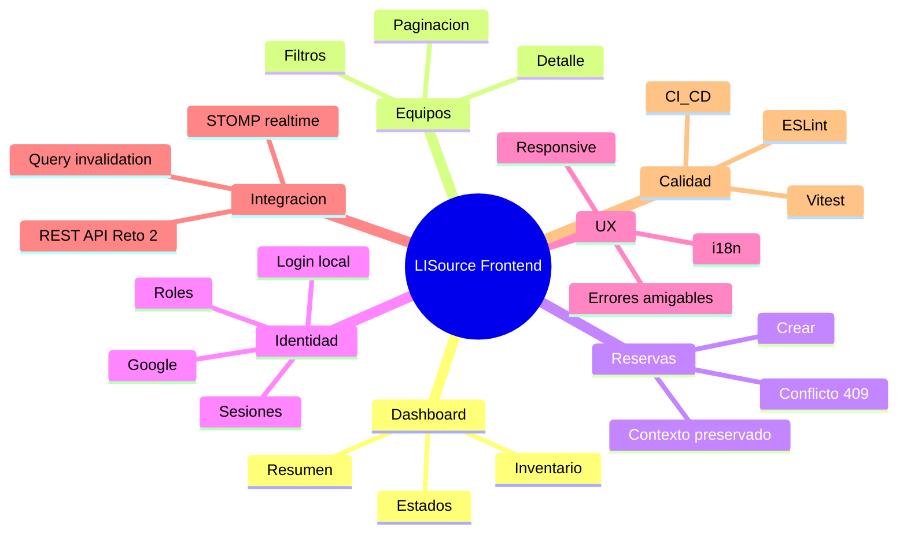

El problema del frontend no es solo pintar datos de la API. También debe ayudar al usuario a entender el estado del inventario, navegar entre equipos y reservas, tratar el conflicto `409` sin perder contexto, adaptarse a pantallas pequeñas y mantener textos consistentes en varios idiomas.

La solución usa React 19, TanStack Router y TanStack Query para separar navegación, estado remoto y estado local. El resultado es una interfaz que consume la API del backend, reacciona a cambios en tiempo real cuando corresponde y conserva el formulario o la vista cuando un error de negocio exige corregir la franja de reserva.

## Qué pedía el reto

Reto 3 solicita una interfaz construida con un framework/librería JavaScript que consuma la API del Reto 2 y permita consultar el inventario de forma clara en escritorio y móvil. Los obligatorios son tecnología JS, responsive, dashboard, indicadores de estado, filtros dinámicos y manejo amigable de errores. El bonus es i18n en español/inglés con diseño escalable.

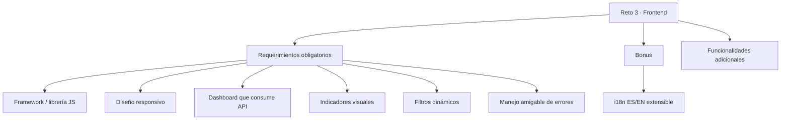

> [!IMPORTANT]
> **Interpretación de ingeniería:** el frontend debe ayudar al usuario a entender y corregir lo que ocurre, pero no reemplaza las reglas del backend. La disponibilidad definitiva, los permisos y el conflicto de reservas siguen siendo responsabilidad del Reto 2.

## Requerimientos obligatorios

| Requisito | Qué hace | Dónde está | Cómo probarlo |
|---|---|---|---|
| **Framework / librería JS** | React 19 + TypeScript + Vite | `src/router.tsx`, `src/routes`, `package.json` | abrir la app y navegar sin recargar |
| **Diseño responsivo** | Adapta navegación, equipos, formularios, diálogos y administración a móvil, tablet y escritorio | `AppShell`, `EquipmentList`, componentes UI y rutas | revisar `320/375/768/1024/1440 px`; forma parte de las 110 combinaciones auditadas |
| **Dashboard** | Lista y resume equipos del laboratorio consumiendo la REST API del Reto 2 | `/` + servicios de dashboard/equipos | entrar a `/` y comprobar datos reales del backend |
| **Indicadores de estado** | Representa visualmente disponibilidad y estados operativos mediante badges/textos | `StatusBadge`, `src/components` | abrir listado/detalle y comparar diferentes estados |
| **Filtros dinámicos** | Busca y filtra equipos sin recargar la aplicación completa | `/equipos` | aplicar categoría/estado/búsqueda y observar actualización |
| **Manejo amigable de errores** | Convierte Problem Details y el `409` de reserva en mensajes útiles sin perder contexto | `src/lib/api-error.ts`, flujo de reservas | provocar `409` o fallo de red y revisar el mensaje mostrado |

## Bonus solicitados

| Bonus | Qué hace | Dónde está | Cómo probarlo |
|---|---|---|---|
| i18n | ES, EN, FR, PT, DE e IT | `src/i18n`, `src/locales` | cambiar idioma desde el selector y verificar persistencia |

## Funcionalidades adicionales integradas

| Extra | Qué hace | Dónde está | Cómo probarlo |
|---|---|---|---|
| Reservas | Crear y cancelar reservas con contexto | `src/routes/reservas.tsx`, `src/features/reservations` | reservar desde un equipo y luego cancelar |
| Autenticación | Login local, Google y recuperación | `src/routes/ingreso.tsx`, `src/features/auth` | iniciar sesión y cerrar sesión |
| Roles | Selección y cambio de rol activo | `src/components/layout/app-shell.tsx` | usar una cuenta dual y cambiar rol |
| Administración | Alta, edición, estado e imagen de equipos | `src/routes/administracion.equipos.tsx` | abrir la vista admin y editar un equipo |
| Perfil | Editar nombre, revisar sesiones y revocar | `src/routes/perfil.tsx` | guardar cambios y cerrar otras sesiones |
| Estadísticas | Top 5 histórico | `src/routes/estadisticas.tsx` | abrir estadísticas después de cargar datos |
| Realtime | Invalida queries con STOMP | `src/services/realtime.service.ts` | cambiar datos en backend y refrescar vista |
| Correlation ID | Preserva trazabilidad de errores | `src/services/http-client.ts`, `src/lib/api-error.ts` | provocar error y revisar el identificador |

## Interpretación de ingeniería

La dificultad real no fue solo mostrar datos. Hubo que convertir la API del backend en una experiencia legible: pantallas compactas, errores que no rompen el contexto, traducciones consistentes y rutas que siguen siendo útiles tanto en móvil como en escritorio.

## Guía rápida de evaluación

1. Despierte primero el backend del Reto 2 con Health o Swagger y espere a que responda.
2. Abra [Vercel](https://lisource-1021805193.vercel.app) e inicie sesión con una cuenta demo.
3. Verifique el dashboard para confirmar carga inicial, datos y estados visuales.
4. Aplique filtros y paginación en equipos para comprobar integración REST real.
5. Abra el detalle de un equipo y pruebe el diálogo de reserva.
6. Reproduzca un conflicto `409` con la misma franja o equipo.
7. Cambie el idioma para validar i18n sin recargar la página.
8. Revise el menú de administración y las vistas responsive en móvil y escritorio.

## ✅ Cómo verificar Reto 3 requisito por requisito

| # | Requisito | Implementación | Pantalla / archivo | Cómo probar | Resultado esperado | Evidencia |
|---|---|---|---|---|---|---|
| 1 | Tecnología JS (framework/librería) | React 19 + TypeScript + Vite | `package.json`, `src/router.tsx` | iniciar app y navegar rutas | SPA sin recargas completas | build/test frontend |
| 2 | Diseño responsive | layout adaptativo móvil/tablet/escritorio | `AppShell`, componentes UI | revisar 320/375/768/1024/1440 | UI usable en todos los anchos | carpeta responsive |
| 3 | Dashboard que consume backend | consulta a `/dashboard/summary` y `/equipment` | ruta `/` + servicios | abrir dashboard autenticado | datos reales desde API | capturas dashboard |
| 4 | Indicadores visuales de estado | badges y textos de estado operativo/visual | `StatusBadge`, detalle/listado | observar equipos en distintos estados | lectura visual clara de estado | capturas equipos |
| 5 | Filtros dinámicos sin recargar | query params + TanStack Query | ruta `/equipos` | aplicar búsqueda/categoría/estado | actualización inmediata de resultados | capturas filtros |
| 6 | Manejo amigable de errores | mapeo Problem Details + UX de errores | `src/lib/api-error.ts`, `reservation-dialog.tsx` | provocar `409` o error de red | mensaje claro sin perder contexto | test `reservation-conflict.test.ts` |
| 7 | Bonus i18n ES/EN extensible | i18next + catálogos multilenguaje | `src/i18n`, `src/locales` | cambiar idioma en selector | textos traducidos y persistencia | tests i18n + capturas |

## 🎯 Ruta recomendada de evaluación

### Paso 0 · Preparar Reto 2

> Reto 3 consume la API construida en Reto 2. Antes de probar Reto 3 localmente, siga la guía del backend.

- Código Reto 2: https://github.com/lisudea/technical-test-2026-2/tree/1021805193-reto2
- README backend: https://github.com/lisudea/technical-test-2026-2/blob/1021805193-reto2/README.md
- Si quiere validar primero la API: use la guía Postman del backend.

### Obligatorios

1. Login.
2. Dashboard.
3. Indicadores de estado.
4. Filtros dinámicos.
5. Reserva válida (`201`).
6. Conflicto amigable (`409`).
7. Responsive en móvil y escritorio.

### Bonus

8. Cambio de idioma (ES/EN).

### Extras

9. Estadísticas.
10. Perfil.
11. Sesiones.
12. Cambio de rol.
13. Administración.

## Mapa de LISource UI

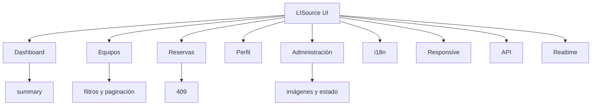

### Viaje principal del usuario

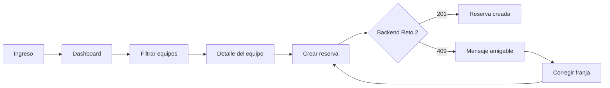

Este recorrido conecta los requisitos más importantes del frontend: consumo REST, dashboard, filtros, detalle, reserva y tratamiento comprensible del conflicto de negocio.

Recorrido recomendado del evaluador:

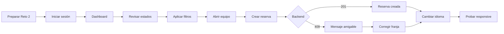

## Demo visual

<table>
  <tr>
    <td>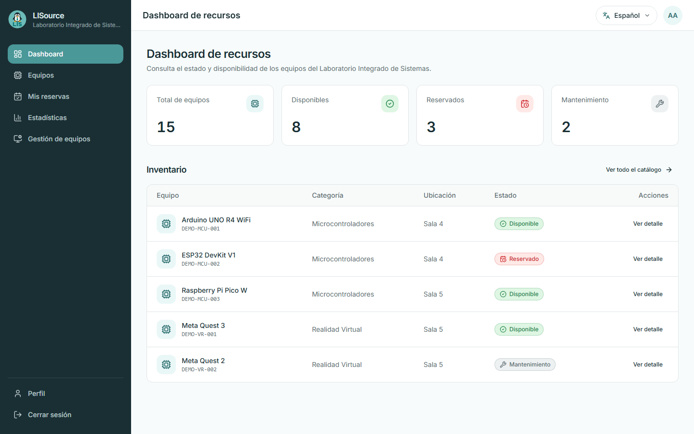</td>
    <td>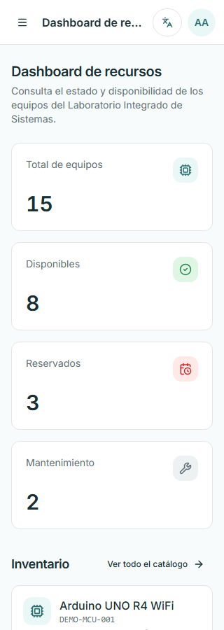</td>
  </tr>
  <tr>
    <td>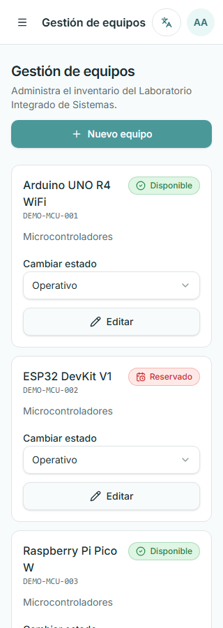</td>
    <td>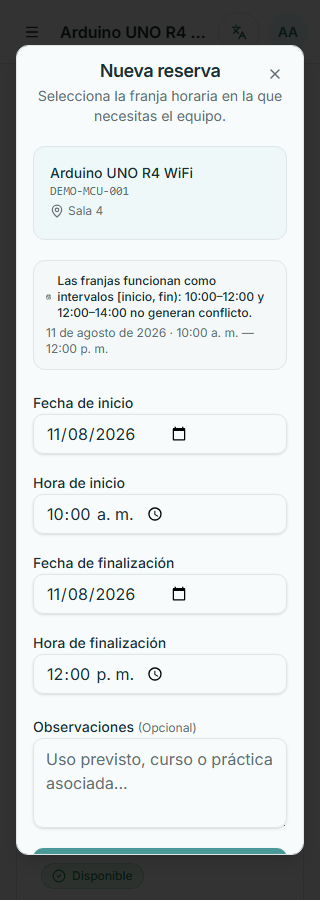</td>
  </tr>
</table>

Dashboard desktop: demuestra la vista principal del reto, el estado agregado del inventario y la lectura cómoda en escritorio.

Dashboard móvil: demuestra que el mismo contenido se reordena para pantallas pequeñas sin perder jerarquía visual.

Administración móvil: demuestra que la gestión de equipos sigue siendo usable en ancho reducido y que las acciones importantes se mantienen accesibles.

Reserva móvil: demuestra que el diálogo de reserva conserva contexto, validación y legibilidad en un viewport estrecho.

Leyenda de estados usada en la UI: 🟢 disponible, 🔴 reservado, 🟡 mantenimiento, ⚪ fuera de servicio, ⚫ retirado.

## Arquitectura

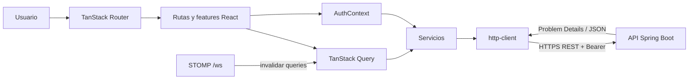

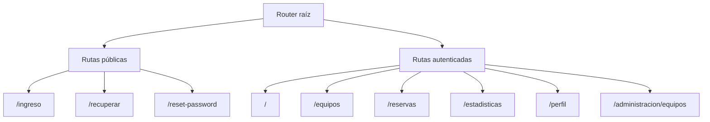

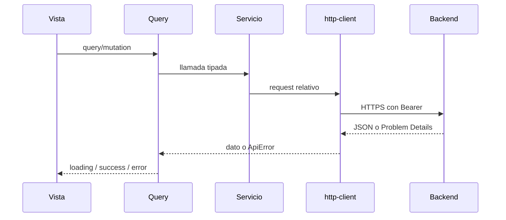

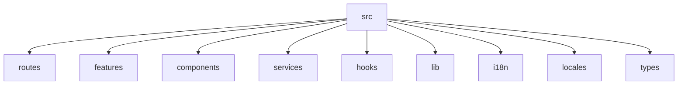

El frontend separa composición de páginas (`routes`), casos de interfaz (`features`), componentes reutilizables, servicios remotos/mock, contexto de autenticación, tipos e internacionalización. TanStack Query administra estado remoto; formularios, overlays y menús siguen siendo estado local.

Regla clave de integración:

- El frontend nunca decide la disponibilidad final de un equipo.
- La disponibilidad en UI es orientativa.
- La decisión autoritativa la toma el backend al crear la reserva.
- Si backend responde `409`, la UI conserva el formulario y guía la corrección.

## Decisiones de ingeniería y alternativas

| Decisión | Alternativas consideradas | Por qué LISource | Trade-off | Cuándo elegiría otra opción |
|---|---|---|---|---|
| React | Angular / Vue | La base ya estaba pensada para composición y estado explícito | Curva de aprendizaje del ecosistema | Si el equipo ya tuviera una convención fuerte en Angular o Vue |
| TypeScript | JavaScript | Contratos más seguros entre rutas, servicios y API | Más tipado inicial | Si la app fuera mínima y de vida corta |
| Vite | Bundling tradicional | Inicio rápido y configuración simple | Menos abstracción de framework | Si se requiriera un sistema heredado basado en webpack |
| TanStack Query | fetch manual / Context | cache, invalidación y refetch autoritativo | Aprender un patrón extra | Si casi no hubiera estado remoto |
| TanStack Router | React Router | rutas tipadas y loaders más expresivos | Dependencia adicional | Si se privilegiara la simplicidad por sobre el tipado de rutas |
| Tailwind + Radix | Bootstrap / CSS Modules | Velocidad y accesibilidad con control fino | Más disciplina visual | Si se prefiriera un sistema visual ya cerrado |
| RHF + Zod | formularios manuales | Validación declarativa y menos código de formulario | Más composición | Si los formularios fueran muy pocos y triviales |
| i18next | strings hardcoded | Catálogos centralizados y escalables | Mantenimiento de traducciones | Si la app fuera monolingüe |
| STOMP | polling | Refresco por evento sin consultas repetidas | Requiere websocket activo | Si el backend no ofreciera canal realtime |
| Vercel | hosting tradicional | Despliegue simple y reproducible | Dependencia de plataforma | Si se quisiera hosting totalmente autoalojado |
| Layout card-based en móvil | Forzar tabla responsive | Mejor lectura en pantallas pequeñas | Más trabajo de composición | Si el consumo principal fuera escritorio |

## Tecnologías

| Área | Tecnología | Para qué se usa |
|---|---|---|
| UI | React 19 | composición de vistas |
| Tipado | TypeScript 5.8 | contratos y seguridad de edición |
| Routing | TanStack Router | rutas, loaders y navegación |
| Estado remoto | TanStack Query | cache, refetch e invalidación |
| Estilos | Tailwind CSS 4 | responsive y sistema visual |
| Primitivas accesibles | Radix UI | dialogs, dropdowns y sheets |
| Formularios | React Hook Form + Zod | validación y control de inputs |
| i18n | i18next / react-i18next | textos multilingües |
| Realtime | STOMP | invalidación y refresco de datos |
| Calidad | Vitest, Testing Library, ESLint | tests y lint |
| Entrega | Vite, Docker, Vercel | build y despliegue |

## Prerrequisitos

> [!NOTE]
> Primero debe estar listo el backend del Reto 2. Sin API activa, el frontend solo mostrará errores de conexión.

| Herramienta | Uso | Obligatoria | Verificación |
|---|---|---|---|
| Git | clonar ramas | Sí | `git --version` |
| Node.js 22 | ejecutar y construir | Sí | `node --version` |
| npm | instalar dependencias | Sí | `npm --version` |
| Navegador moderno | usar la app | Sí | abrir Chrome, Edge o Firefox |
| Docker | build opcional | No | `docker --version` |
| Java 21 | ejecutar backend | Dependencia del sistema completo | `java --version` |

<details>
<summary>🪟 Preparar Windows</summary>

- Git: instálelo desde [git-scm.com](https://git-scm.com/downloads) y confirme con `git --version`.
- Node.js 22: instálelo desde [nodejs.org](https://nodejs.org/) y confirme con `node --version` y `npm --version`.
- Navegador moderno: use Chrome, Edge o Firefox para revisar la UI y el responsive.
- Java 21: requerido solo si va a ejecutar el backend localmente.
- Docker: opcional, útil si desea construir la imagen del frontend.

</details>

<details>
<summary>🐧 Preparar Linux</summary>

- Git: instálelo con el gestor de paquetes de su distribución y confirme con `git --version`.
- Node.js 22: instálelo con el método oficial o nvm y confirme con `node --version` y `npm --version`.
- Navegador moderno: use Chromium, Firefox o equivalente.
- Java 21: requerido solo para levantar el backend localmente.
- Docker: opcional, solo para build local de la imagen.

</details>

Instalación oficial: [Git](https://git-scm.com/downloads), [Node.js](https://nodejs.org/), [npm](https://docs.npmjs.com/downloading-and-installing-node-js-and-npm), [Docker](https://www.docker.com/products/docker-desktop/).

## 🚀 ¿Cómo quiere probar LISource?

| Modo | Backend | Frontend | Requiere instalación | Ideal para |
|---|---|---|---|---|
| Local | `http://localhost:8080` | `http://localhost:3000` | Sí | desarrollo, depuración y edición |
| Producción | Render | Vercel | No | evaluación rápida y demo |

### Producción

1. Abra primero [Health del backend](https://technical-test-2026-2-v96h.onrender.com/actuator/health).
2. Espere la respuesta `UP`; Render puede tardar un poco en el primer acceso por cold start.
3. Abra opcionalmente [Swagger](https://technical-test-2026-2-v96h.onrender.com/swagger-ui/index.html).
4. Luego abra [Vercel](https://lisource-1021805193.vercel.app).
5. Inicie sesión con una cuenta demo.
6. Pruebe dashboard, filtros y reserva.

## 🌳 Ejecutar Reto 2 y Reto 3 localmente con Git Worktree

Reto 2 y Reto 3 pertenecen al mismo repositorio, pero viven en ramas distintas: `1021805193-reto2` contiene el backend y `1021805193-reto3` contiene el frontend. Git Worktree permite tener ambas ramas disponibles simultáneamente en carpetas diferentes, sin cambiar constantemente de rama.

El backend puede ejecutarse y probarse de forma independiente mediante Swagger, Postman o cualquier cliente HTTP. El frontend consume el backend para obtener datos reales. Por eso, para ejecutar todo LISource localmente, backend y frontend deben permanecer activos al mismo tiempo.

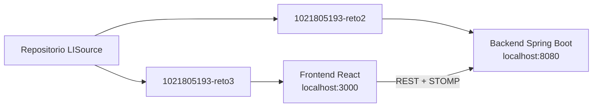

### Windows / PowerShell

Desde la carpeta en la que desea crear ambos directorios:

```powershell
git clone https://github.com/lisudea/technical-test-2026-2.git technical-test-2026-2

cd technical-test-2026-2

git switch 1021805193-reto2

git worktree add ..\technical-test-2026-2-reto3 1021805193-reto3

git worktree list
```

El resultado es:

```text
technical-test-2026-2
→ 1021805193-reto2
→ Backend

technical-test-2026-2-reto3
→ 1021805193-reto3
→ Frontend
```

Ubique las variables del backend en:

```text
technical-test-2026-2/
└── lisource-backend/
    └── .env
```

Ubique las variables del frontend en:

```text
technical-test-2026-2-reto3/
└── lisource-frontend/
    └── .env
```

En la **Terminal 1**, inicie el backend:

```powershell
cd technical-test-2026-2\lisource-backend
.\mvnw.cmd spring-boot:run
```

Verifique:

- `http://localhost:8080/actuator/health`
- `http://localhost:8080/swagger-ui/index.html`

Mantenga esta terminal abierta.

En la **Terminal 2**, inicie el frontend:

```powershell
cd technical-test-2026-2-reto3\lisource-frontend
npm ci
npm run dev
```

Verifique `http://localhost:3000` y mantenga también esta terminal abierta mientras usa LISource.

### Linux / macOS

Desde la carpeta en la que desea crear ambos directorios:

```bash
git clone https://github.com/lisudea/technical-test-2026-2.git technical-test-2026-2

cd technical-test-2026-2

git switch 1021805193-reto2

git worktree add ../technical-test-2026-2-reto3 1021805193-reto3

git worktree list
```

La distribución de carpetas y variables es la misma descrita arriba, usando `/` en las rutas. En la **Terminal 1**, inicie el backend:

```bash
cd technical-test-2026-2/lisource-backend
./mvnw spring-boot:run
```

Verifique:

- `http://localhost:8080/actuator/health`
- `http://localhost:8080/swagger-ui/index.html`

Mantenga esta terminal abierta. En la **Terminal 2**, inicie el frontend:

```bash
cd technical-test-2026-2-reto3/lisource-frontend
npm ci
npm run dev
```

Verifique `http://localhost:3000` y mantenga también esta terminal abierta mientras usa LISource.

## Variables de entorno

[Carpeta de evaluación en Google Drive (`backend.txt` y `frontend.txt`)](https://drive.google.com/drive/folders/1acpvFdobQNkvmGB5Q5b15UoR8ZOfqfgI?usp=sharing)

El frontend carga variables `VITE_*` desde `lisource-frontend/.env`. Para Reto 3, descargue `frontend.txt` y cree **exactamente** `lisource-frontend/.env`.

```text
technical-test-2026-2-reto3/
└── lisource-frontend/
    ├── .env              ← CREAR AQUÍ con el contenido de frontend.txt
    ├── .env.example
    ├── package.json
    └── src/
```

Correspondencia:

- `backend.txt` → `lisource-backend/.env`
- `frontend.txt` → `lisource-frontend/.env`

`lisource-frontend/.env.example` contiene solo la plantilla pública:

```dotenv
VITE_API_URL=http://localhost:8080/api/v1
VITE_DATA_MODE=api
VITE_GOOGLE_CLIENT_ID=
```

> [!WARNING]
> Todo valor `VITE_*` puede terminar en el bundle del navegador. No coloque secretos de infraestructura en variables del frontend.

## Usuarios de evaluación

> [!IMPORTANT]
> Estas credenciales son ficticias y solo sirven para evaluación y QA.

| Perfil | Correo | Contraseña | Uso |
|---|---|---|---|
| Administrador | `admin.demo@udea.edu.co` | `DemoAdmin2026!` | administración y cambio de rol |
| Usuario | `usuario.demo@udea.edu.co` | `DemoUsuario2026!` | catálogo y reserva estándar |
| Reservas | `reservas.demo@udea.edu.co` | `DemoReservas2026!` | historial y cancelación |
| Dual | `dual.demo@udea.edu.co` | `DemoDual2026!` | selección y cambio de rol |

La tabla completa y el escenario `google.demo@udea.edu.co` viven en el README del backend.

## Integración REST

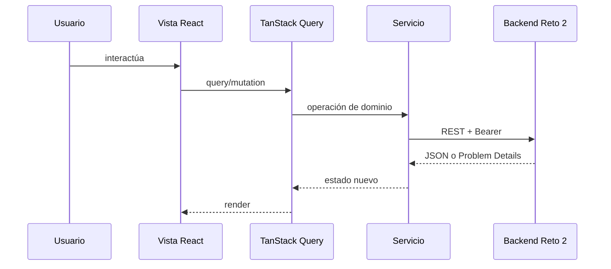

TanStack Query evita duplicar fetch en cada componente. `http-client` normaliza base URL, Bearer y errores; `ApiError` convierte Problem Details en una forma útil para la UI. Cuando el backend cambia un dato, la UI invalida y vuelve a leer el estado autoritativo.

### Mapa Vista → API

| Vista / feature | API principal consumida |
|---|---|
| Dashboard | `/api/v1/dashboard/summary`, `/api/v1/equipment` |
| Equipos | `/api/v1/equipment`, `/api/v1/catalogs/*` |
| Detalle de equipo | `/api/v1/equipment/{id}`, disponibilidad y busy-slots |
| Reservas | `/api/v1/reservations`, `/api/v1/reservations/me`, cancelación |
| Perfil | `/api/v1/profile`, `/api/v1/sessions` |
| Estadísticas | `/api/v1/statistics/top-equipment` |
| Administración de equipos | `/api/v1/equipment/*` con autorización administrativa |

Esta matriz permite seguir de forma directa cómo Reto 3 reutiliza el contrato construido en Reto 2.

## Responsive

La validación visual cubrió 10 rutas reales en 11 anchos: `320`, `360`, `375`, `390`, `414`, `480`, `640`, `768`, `1024`, `1280` y `1440` px. Eso da 110 combinaciones verificadas.

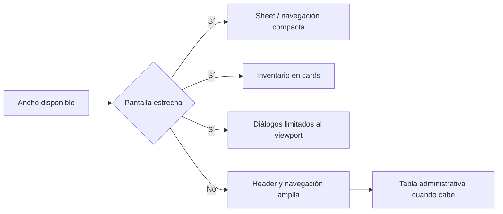

La estrategia de diseño prioriza cards en móvil y tablet, tabla cuando hay espacio, formularios con scroll útil y overlays que no rompan el viewport. Las pruebas de accesibilidad se apoyan en labels, foco visible, primitivas Radix y texto alternativo donde aporta valor.

<table>
  <tr>
    <td>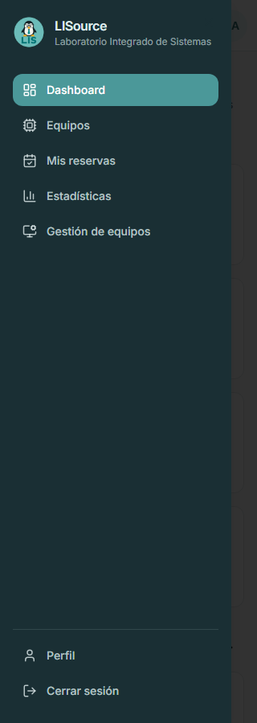</td>
    <td>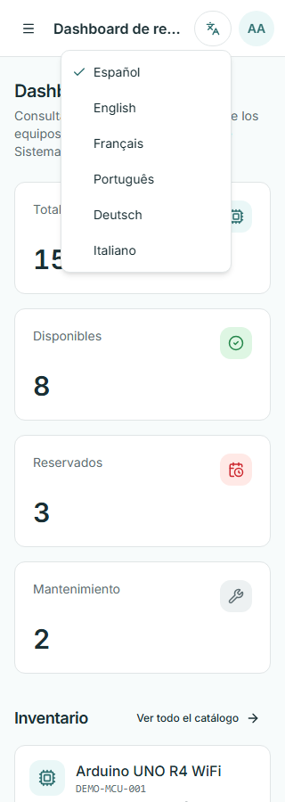</td>
  </tr>
  <tr>
    <td>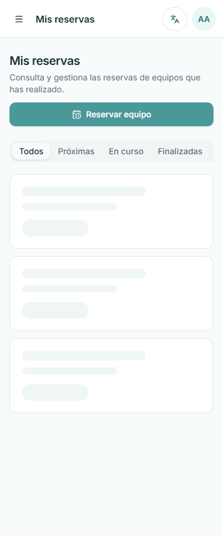</td>
    <td>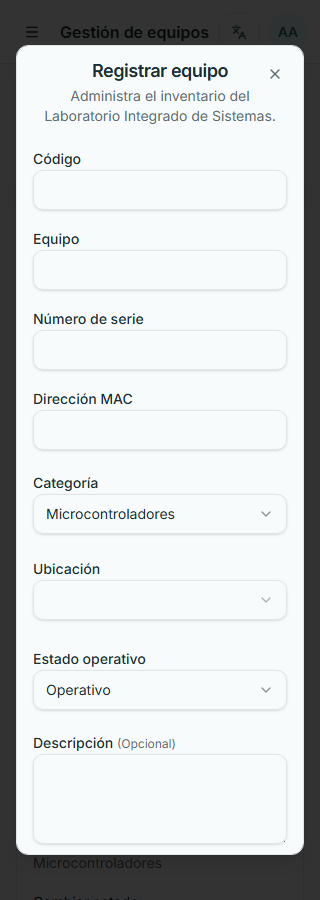</td>
  </tr>
</table>

## Internacionalización

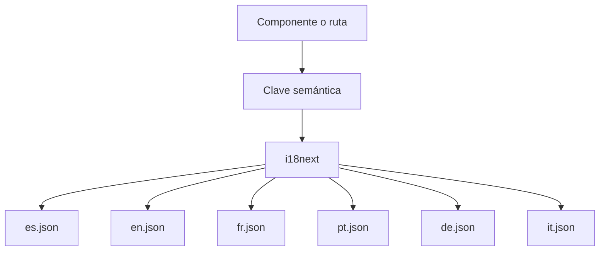

El bonus exigía español e inglés; el proyecto amplía el catálogo a francés, portugués, alemán e italiano. La preferencia se persiste y los tests verifican la consistencia de claves entre idiomas.

## Reservas y conflicto 409

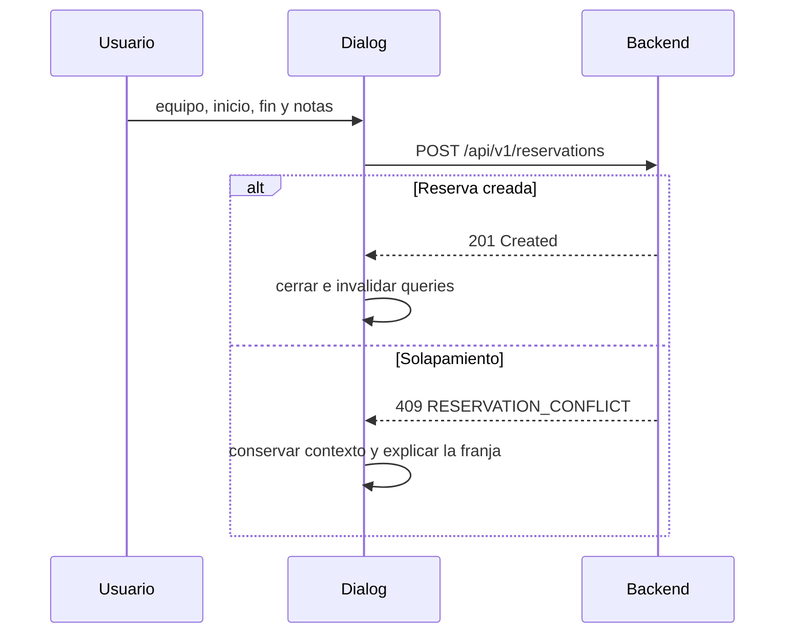

El cliente muestra un mensaje útil cuando el backend devuelve conflicto. La UI no oculta el formulario ni borra los datos ya escritos; así el usuario corrige solo la parte que cambió.

## Testing y calidad

Ejecución real en esta auditoría (`npm ci`, `npm test`, `npm run lint`, `npm run build`):

- Test files: **11**
- Tests: **30**
- Passed: **30**
- Failed: **0**
- Lint: **OK**
- Build: **OK**

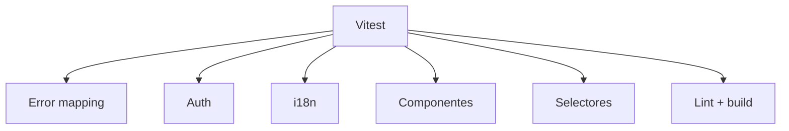

```powershell
npm ci
npm test
npm run lint
npm run build
```

Cobertura funcional:

| Área | Cobertura |
|---|---|
| Error mapping | `src/lib/api-error.test.ts` |
| Auth y sesiones | `src/features/auth/*.test.*` |
| i18n | `src/locales/i18n-keys.test.ts`, `src/i18n/languages.test.ts` |
| UI base | `src/components/common/brand.test.ts` |
| Selectores | `src/components/layout/language-selector.test.tsx` |

Matriz resumida de pruebas frontend:

| Área | Qué se verifica | Tipo |
|---|---|---|
| Auth | login/logout, sesiones y seguridad de flujo | Vitest |
| Reservas | tratamiento de conflicto `409` y preservación de contexto | Vitest |
| i18n | consistencia de claves y lenguajes soportados | Vitest |
| Error mapping | traducción de Problem Details a mensajes UI | Vitest |
| UI base | componentes esenciales y selector de idioma accesible | Vitest |

## Panel visual de métricas

| Indicador | Valor observado | Interpretación |
|---|---|---|
| Test files | 11 | cobertura por áreas clave de UI |
| Tests | 30 | validación funcional del flujo frontend |
| Passed | 30 | corrida estable sin fallos |
| Lint | OK | consistencia estática de código |
| Build | OK | bundle construible para despliegue |

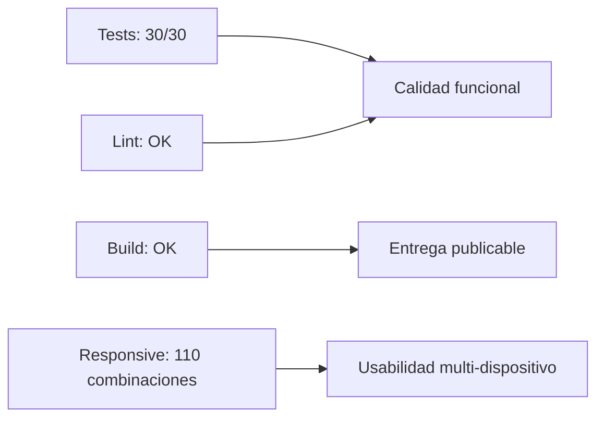

## Timeline de entregas (Git)

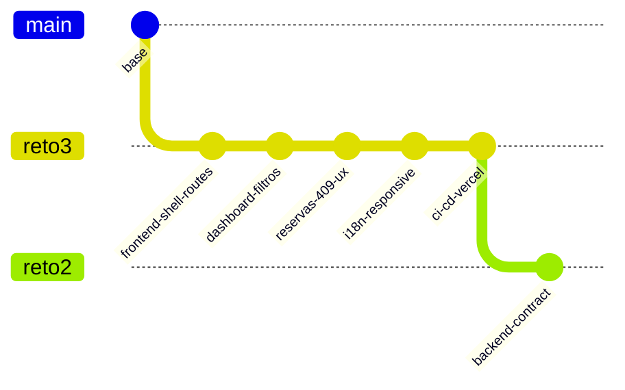

La línea de tiempo resume hitos funcionales y su dependencia del contrato backend para la evaluación integrada Reto 2 + Reto 3.

## CI/CD

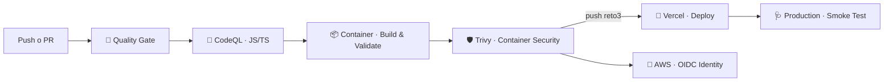

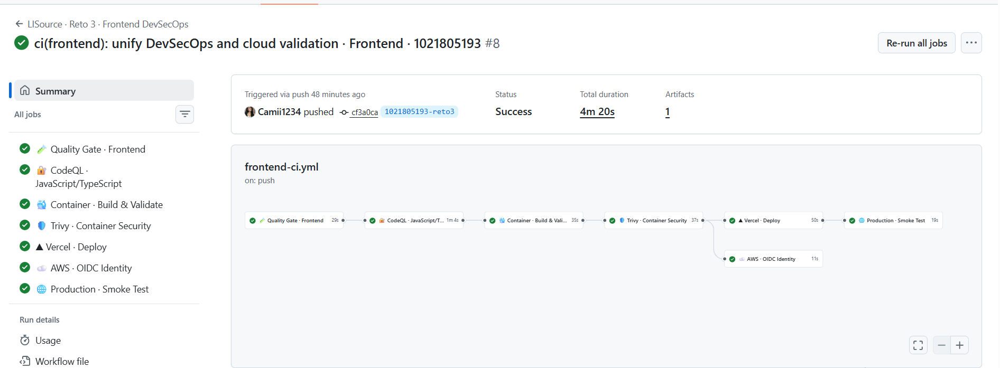

El pipeline valida instalación, tests, lint, build, análisis estático y seguridad del contenedor antes del despliegue. AWS aparece solo como identidad temporal para CI/CD; no aloja la aplicación.

| Job | Propósito | Qué valida | Riesgo que reduce | Si falla |
|---|---|---|---|---|
| 🧪 **Quality Gate** | instalar, probar, lint y build | integridad funcional del frontend | regresiones | el flujo no continúa |
| 🔎 **CodeQL · JS/TS** | análisis estático | patrones inseguros en JS/TS | vulnerabilidades de código | no se supera el gate SAST |
| 📦 **Container · Build & Validate** | construir imagen | reproducibilidad del runtime | diferencias local/CI | no existe artefacto válido |
| 🛡️ **Trivy · Container Security** | escanear imagen | CVE relevantes | dependencias vulnerables | la imagen no supera seguridad |
| 🚀 **Vercel · Deploy** | publicar frontend | entrega de producción | errores de despliegue manual | la versión no se publica |
| 🩺 **Production · Smoke Test** | comprobar rutas públicas y backend | disponibilidad tras deploy | producción rota | el workflow falla post-deploy |
| 🔐 **AWS · OIDC Identity** | obtener identidad temporal | federación GitHub→AWS | access keys permanentes | no se valida la federación |

## Deployment

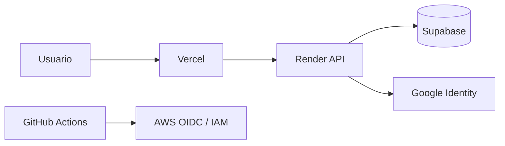

Frontend en Vercel, backend en Render y datos en Supabase. AWS se usa únicamente como federación de identidad para GitHub Actions mediante Terraform y OIDC.

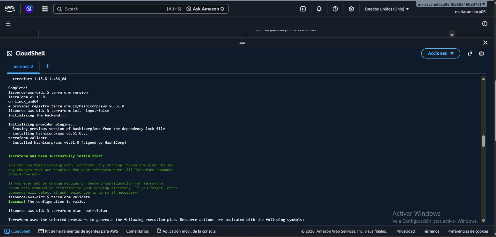


## Seguridad

- Access token solo en memoria.
- Refresh token administrado por cookie HttpOnly del backend.
- Un solo reintento de refresh antes de cerrar sesión.
- Errores normalizados desde Problem Details.
- Google SSO restringido por el backend al dominio institucional.
- `VITE_*` nunca contiene secretos.
- STOMP invalida queries y el cliente vuelve a pedir el estado autoritativo.

## Troubleshooting

| Problema | Causa probable | Solución |
|---|---|---|
| La app no abre en `3000` | puerto ocupado o `npm run dev` falló | revise consola y libere el puerto |
| Error de red/CORS | backend apagado o `VITE_API_URL` incorrecto | confirme Reto 2 activo y URL con `/api/v1` |
| Login vuelve al ingreso | cookie/sesión caducada o variables incorrectas | repita login y revise `.env` |
| Google no inicia | `VITE_GOOGLE_CLIENT_ID` vacío o cuenta no institucional | configure el cliente y use `@udea.edu.co` |
| Catálogo vacío | filtros demasiado restrictivos | limpie filtros o consulte la API |
| Reserva devuelve `409` | el backend detectó solapamiento | cambie franja o equipo |
| `.env` no surte efecto | archivo mal ubicado o con `.env.txt` | ubique `lisource-frontend/.env` |
| Pantalla rota en móvil | caché antigua o CSS no recargado | recargue duro y reinicie Vite |

## Glosario técnico

<details>
<summary>📖 Glosario técnico</summary>

| Término | Definición |
|---|---|
| JWT | token firmado que viaja como Bearer para identificar sesión y rol |
| refresh token | credencial que rota en cookie HttpOnly y renueva el access token |
| OIDC | federación de identidad que permite credenciales temporales para CI/CD |
| STOMP | protocolo que alimenta el canal realtime de la UI |
| Problem Details | formato estandarizado de error usado por la API |
| correlation ID | identificador para unir error visual, request y log |
| cold start | espera inicial cuando Render despierta el backend |
| worktree | directorio adicional del mismo repositorio para trabajar sin checkout constante |
| RLS | control de acceso a nivel de fila en PostgreSQL |

</details>

## Referencias

- [React](https://react.dev/)
- [TypeScript](https://www.typescriptlang.org/)
- [Vite](https://vitejs.dev/)
- [TanStack Router](https://tanstack.com/router)
- [TanStack Query](https://tanstack.com/query)
- [Tailwind CSS](https://tailwindcss.com/)
- [Radix UI](https://www.radix-ui.com/)
- [i18next](https://www.i18next.com/)
- [Vercel](https://vercel.com/)
- [GitHub Actions](https://docs.github.com/actions)

<p align="center">
  
</p>
