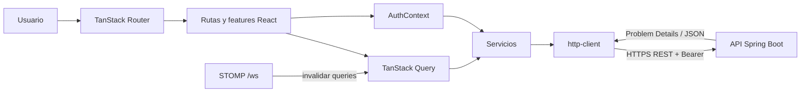
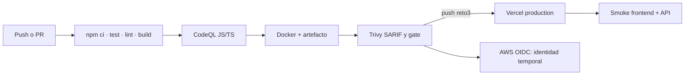

<div align="center">

# LISource Frontend

### Portal responsive para inventario y reservas del Laboratorio Integrado de Sistemas · Reto 3

[](https://lisource-1021805193.vercel.app)
[](lisource-frontend/package.json)
[](lisource-frontend/package.json)
[](.github/workflows/frontend-ci.yml)

</div>

Interfaz web de LISource para consultar equipos, conocer su disponibilidad, crear o cancelar reservas y administrar inventario según el rol activo. Consume exclusivamente la API Spring Boot del Reto 2: **el navegador no accede directamente a tablas de PostgreSQL/Supabase**.

**Estado:** aplicación funcional, responsive e internacionalizada, con despliegue y pipeline independientes.

## Aplicación desplegada

| Servicio | Enlace | Estado o propósito |
|---|---|---|
| Aplicación web | [Abrir LISource](https://lisource-1021805193.vercel.app) | Frontend desplegado en Vercel |
| API REST | [Abrir API REST](https://technical-test-2026-2-v96h.onrender.com/) | Backend desplegado en Render |
| Swagger UI | [Abrir documentación interactiva](https://technical-test-2026-2-v96h.onrender.com/swagger-ui/index.html) | Probar los endpoints desde el navegador |
| OpenAPI JSON | [Consultar contrato OpenAPI](https://technical-test-2026-2-v96h.onrender.com/v3/api-docs) | Contrato técnico de la API |
| Health check | [Consultar estado del backend](https://technical-test-2026-2-v96h.onrender.com/actuator/health) | Verificar que el servicio está activo |

> El primer acceso al backend en Render puede tardar algunos segundos debido al arranque en frío del servicio.

Vercel aloja el frontend, Render aloja el backend y Supabase proporciona PostgreSQL y los servicios asociados implementados. AWS se utiliza únicamente para OIDC/IAM de GitHub Actions, según la infraestructura existente.

## Índice

- [Aplicación desplegada](#aplicación-desplegada)
- [Entendimiento del reto](#entendimiento-del-reto)
- [Cumplimiento de requisitos](#cumplimiento-de-requisitos)
- [Arquitectura](#arquitectura)
- [Tecnologías](#tecnologías)
- [Requisitos previos](#requisitos-previos)
- [Variables de entorno](#variables-de-entorno)
- [Ejecución local](#ejecución-local)
- [Ejecutar LISource completo](#ejecutar-lisource-completo)
- [Usuarios de prueba](#usuarios-de-prueba)
- [Guía funcional](#guía-funcional)
- [Estados de interfaz](#estados-de-interfaz)
- [Pruebas y calidad](#pruebas-y-calidad)
- [CI/CD con GitHub Actions](#cicd-con-github-actions)
- [Infraestructura y despliegue](#infraestructura-y-despliegue)
- [Seguridad](#seguridad)
- [Decisiones arquitectónicas](#decisiones-arquitectónicas)
- [Estructura de carpetas](#estructura-de-carpetas)
- [Solución de problemas](#solución-de-problemas)
- [Documentación complementaria](#documentación-complementaria)

## Entendimiento del reto

LISource responde a la necesidad de administrar el inventario del laboratorio —equipos, categorías, ubicaciones y estados— y, especialmente, impedir que dos personas reserven el mismo recurso en intervalos superpuestos. La solución permite buscar, filtrar y paginar equipos; crear, consultar y cancelar reservas con fecha y hora de inicio y fin; autenticarse con identidad institucional; autorizar por rol; consultar estadísticas y auditoría; y usar la interfaz de forma responsive en español o inglés. El proyecto amplía ese alcance con cuatro idiomas adicionales.

El flujo principal es:

1. El usuario inicia sesión y, cuando tiene más de un rol, selecciona el rol activo.
2. Consulta el catálogo de equipos, aplica filtros y revisa el estado y los intervalos ocupados.
3. Selecciona fecha y hora de inicio y fin, y envía la reserva.
4. El backend autentica, valida y vuelve a consultar solapamientos dentro de una transacción.
5. La API responde `201 Created` si persiste la reserva o `409 Conflict` con código `RESERVATION_CONFLICT` si la franja ya no está disponible.
6. El frontend actualiza los datos o conserva el formulario y presenta el conflicto con una explicación accionable.

La información del navegador ayuda a elegir una franja, pero **la verificación definitiva ocurre en el backend**. Así se evita confiar en datos que pueden quedar obsoletos entre la consulta y el envío.

## Cumplimiento de requisitos

### Obligatorios del Reto 3

| Requisito de la prueba | Implementación | Ruta o componente | Endpoint principal | Prueba o evidencia |
|---|---|---|---|---|
| React y tecnologías reales | React 19, TypeScript, TanStack Start/Router/Query y Vite | `src/router.tsx`, `src/routes` | — | `package.json`, build del pipeline |
| Diseño responsive | Layout móvil primero, navegación en panel, cards en anchos estrechos y tablas donde caben | `AppShell`, `EquipmentList`, administración | — | [Auditoría responsive](lisource-frontend/docs/03-responsive-y-accesibilidad.md) e [imágenes reales](lisource-frontend/docs/14-evidencias.md) |
| Dashboard de equipos | Resumen operacional y vista inicial de inventario | `/` | `GET /api/v1/dashboard/summary`, `GET /api/v1/equipment` | `routes/index.tsx` |
| Estados visuales | Etiqueta, icono y texto para disponible, reservado, mantenimiento, fuera de servicio y retirado | `StatusBadge` | datos de equipos | `status-badge.tsx`; no depende solo del color |
| Filtros dinámicos | Búsqueda, categoría y estado visual | `/equipos` | `GET /api/v1/equipment?search=&category=&status=` | `equipment-filters.tsx`, `equipment.service.ts` |
| Paginación real | Controles anterior/siguiente y estado de página sobre respuesta paginada | `/equipos` | `GET /api/v1/equipment?page=&pageSize=` | `equipment-list.tsx` |
| Creación de reservas | Formulario de intervalo, equipo y notas; invalidación de queries al crear | detalle de equipo | `POST /api/v1/reservations` | `reservation-dialog.tsx` |
| Cancelación | Confirmación y motivo opcional | `/reservas` | `POST /api/v1/reservations/{id}/cancel` | `routes/reservas.tsx` |
| Visualización de reservas | Lista de reservas propias y estado derivado | `/reservas` | `GET /api/v1/reservations/me` | `routes/reservas.tsx` |
| Tratamiento amigable del `409` | Convierte Problem Details en `ApiError`, conserva el contexto y pide ajustar franja/equipo | diálogo de reserva | `409 RESERVATION_CONFLICT` | `api-error.test.ts`, [flujo](lisource-frontend/docs/06-reservas.md) |
| Autenticación | Login local, Google Identity, recuperación y restablecimiento | `/ingreso`, `/recuperar`, `/reset-password` | `/api/v1/auth/*` | `auth.service.ts`, tests de auth |
| Selección y cambio de rol | Selección tras login y cambio desde el shell; mapea `ADMINISTRADOR` a `ADMIN` en UI | ingreso y menú de usuario | `POST /api/v1/auth/select-role`, `POST /api/v1/auth/switch-role` | `auth.service.ts`, `app-shell.tsx` |
| Vista administrativa | Alta, edición, estado e imagen de equipos; protegida para rol administrador | `/administracion/equipos` | `/api/v1/equipment` y subrecursos | `administracion.equipos.tsx` |
| Perfil y sesiones | Consulta/edición de perfil, listado y revocación de sesiones | `/perfil` | `GET/PUT /api/v1/profile`, `/api/v1/sessions` | `routes/perfil.tsx` |
| Estadísticas | Ranking Top 5 | `/estadisticas` | `GET /api/v1/statistics/top-equipment` | `routes/estadisticas.tsx` |
| Estados de carga, vacío y error | Skeletons, estado vacío con acción y error con reintento; conflicto separado | componentes comunes y vistas | según módulo | `states.tsx`, rutas y features |

### Bonus

| Requisito | Implementación | Evidencia |
|---|---|---|
| Español e inglés | Catálogos centralizados con `i18next`/`react-i18next` y preferencia persistida | `src/locales/es.json`, `en.json`, tests de paridad |
| Internacionalización ampliada | También francés, portugués, alemán e italiano | [Guía i18n](lisource-frontend/docs/07-internacionalizacion.md) |

### Funcionalidades adicionales del proyecto

Estas capacidades amplían el reto y no se presentan como requisitos mínimos originales:

- Google SSO, recuperación de contraseña, rol activo y gestión de sesiones.
- Actualizaciones mediante STOMP que invalidan queries y vuelven a consultar el estado autoritativo.
- Administración de imágenes de equipo y modo mock seleccionable para desarrollo.
- Perfil editable, Top 5, Docker, pipeline DevSecOps y despliegue Vercel.

El backend expone además administración de usuarios, roles, categorías, ubicaciones, configuración y auditoría. **El frontend actual solo implementa pantalla administrativa de equipos**; categorías y ubicaciones se consumen como catálogos, pero no existen rutas visuales separadas para los otros dominios.

## Arquitectura



La aplicación separa composición de páginas (`routes`), casos de interfaz (`features`), componentes reutilizables, servicios remotos/mock, contexto de autenticación, tipos e internacionalización. TanStack Query administra estado remoto; el estado de formularios y overlays permanece local. El frontend **no replica autorización ni reglas de reserva**: el backend las vuelve a aplicar.

Consulte los diagramas de [navegación, componentes, datos, autenticación, reserva/409, responsive, i18n y estados](lisource-frontend/docs/02-arquitectura-frontend.md).

## Tecnologías

<p>
  
  
  
  
  
  
  
  
  
</p>

| Área | Tecnologías confirmadas | Fuente |
|---|---|---|
| Runtime y navegación | React 19.2, React DOM, TanStack Start/Router, TypeScript 5.8, Vite 8.2 | `package.json`, `vite.config.ts` |
| Estado y formularios | TanStack Query, React Hook Form, Zod | `package.json`, `src/features` |
| UI | Tailwind CSS 4, Radix UI, Lucide, Sonner | `package.json`, `src/components` |
| Integración | REST, STOMP, Google Identity | `src/services`, `src/lib/google.ts` |
| Calidad | Vitest, Testing Library, ESLint, Prettier, CodeQL y Trivy | scripts y workflow |
| Entrega | Node.js 22 en CI, npm, Docker, Vercel | workflow, Dockerfile |

Recharts existe como dependencia y componente base, pero la vista activa Top 5 usa barras CSS; no se atribuye una tecnología a una funcionalidad que no la utiliza.

## Requisitos previos

| Clasificación | Herramienta | Uso | Comprobación |
|---|---|---|---|
| Obligatorio | Git | clonar ambas ramas | `git --version` |
| Obligatorio | Node.js 22 y npm | instalar, probar, compilar y ejecutar frontend | `node --version`, `npm --version` |
| Obligatorio | Navegador moderno | usar y evaluar la aplicación | abrir Chrome, Edge o Firefox |
| Sistema completo | Java 21 y Maven Wrapper | ejecutar backend; no se instala Maven global | `java --version` |
| Sistema completo | acceso a Supabase | preparar PostgreSQL desde SQL Editor | acceso al proyecto entregado |
| Opcional | Docker | construir/ejecutar contenedor | `docker --version` |
| Opcional | Postman | explorar y probar API | abrir Postman |
| Solo infraestructura | Terraform y AWS CLI | validar o aplicar OIDC/IAM | `terraform version`, `aws --version` |

Instalación paso a paso: [Windows/PowerShell](lisource-frontend/docs/08-instalacion-windows.md) · [Linux/Bash](lisource-frontend/docs/09-instalacion-linux.md).

## Variables de entorno

### Archivos privados para evaluación

[Acceder a los archivos privados de configuración en Google Drive](https://drive.google.com/drive/folders/1acpvFdobQNkvmGB5Q5b15UoR8ZOfqfgI?usp=sharing)

- Descargue `backend.txt`, renómbrelo como `.env` y ubíquelo en la raíz real del backend: `lisource-backend/.env`.
- Descargue `frontend.txt`, renómbrelo como `.env` y ubíquelo en la raíz real del frontend: `lisource-frontend/.env`.
- En Windows active las extensiones de archivo y compruebe que no hayan quedado como `.env.txt`.
- Ambos archivos contienen información sensible: no los copie a documentación ni los suba a GitHub.
- Cada `.env.example` es únicamente una plantilla sin secretos para comparar nombres de variables.
- Ejecute `git status --short` y confirme que los archivos `.env` no aparecen.
- No añada secretos a variables `VITE_*`: Vite las incorpora al bundle del navegador.

El ejemplo público contiene únicamente:

```dotenv
VITE_API_URL=http://localhost:8080/api/v1
VITE_DATA_MODE=api
VITE_GOOGLE_CLIENT_ID=
```

La contraseña de evaluación y las variables privadas se encuentran en la carpeta de Drive entregada junto con la prueba. Nunca suba `frontend.txt`, `.env`, cookies o tokens a GitHub.

## Ejecución local

```powershell
git clone --branch 1021805193-reto3 https://github.com/lisudea/technical-test-2026-2.git lisource-frontend-reto3
cd lisource-frontend-reto3\lisource-frontend
# Coloque aquí frontend.txt renombrado como .env
npm ci
npm run dev
```

En Linux cambie `\` por `/`. Vite escucha en `http://localhost:3000`; mantenga esa terminal abierta. Comandos disponibles: `npm test`, `npm run lint`, `npm run build`, `npm run preview` y `npm run format`.

## Ejecutar LISource completo

Backend y frontend viven en ramas diferentes; use **dos carpetas o worktrees** para mantener ambos procesos disponibles.

Antes de configurar las variables, [descargue `backend.txt` y `frontend.txt` desde la carpeta privada de Google Drive](https://drive.google.com/drive/folders/1acpvFdobQNkvmGB5Q5b15UoR8ZOfqfgI?usp=sharing). Renombre cada archivo como `.env` únicamente en la raíz correspondiente.

### 1. Backend y base de datos

```powershell
git clone --branch 1021805193-reto2 https://github.com/lisudea/technical-test-2026-2.git lisource-backend-reto2
cd lisource-backend-reto2\lisource-backend
# Coloque aquí backend.txt renombrado como .env
```

Desde Supabase SQL Editor ejecute, en orden, los archivos de esa rama:

1. `lisource-backend/src/main/resources/db/01-estructura.sql` — recrea la estructura; es destructivo sobre esas tablas.
2. `lisource-backend/src/main/resources/db/02-semilla.sql` — catálogos y configuración base; usa operaciones idempotentes.
3. `lisource-backend/src/main/resources/db/03-pruebas.sql` — datos demo; ejecútelo después de reconstruir con 01 y 02.

Arranque el backend y deje abierta esta terminal:

```powershell
.\mvnw.cmd spring-boot:run
```

En Linux use `./mvnw spring-boot:run`. Verifique [health local](http://localhost:8080/actuator/health) y [Swagger local](http://localhost:8080/swagger-ui/index.html).

### 2. Frontend

Abra una segunda terminal:

```powershell
git clone --branch 1021805193-reto3 https://github.com/lisudea/technical-test-2026-2.git lisource-frontend-reto3
cd lisource-frontend-reto3\lisource-frontend
# Coloque aquí frontend.txt renombrado como .env
npm ci
npm run dev
```

Abra `http://localhost:3000`, inicie sesión, consulte un equipo y cree una reserva futura. Para demostrar el conflicto, intente reservar nuevamente el mismo equipo en una franja superpuesta: la segunda solicitud debe producir `409` y un mensaje comprensible.

### Lista de comprobación

- [ ] Base de datos preparada con 01 → 02 → 03.
- [ ] Backend responde en `8080` y su terminal permanece abierta.
- [ ] Swagger es accesible.
- [ ] Frontend carga en `3000` y su terminal permanece abierta.
- [ ] Login funcional y, si aplica, rol seleccionado.
- [ ] Catálogo visible con filtros y paginación.
- [ ] Reserva creada con `201`.
- [ ] Conflicto superpuesto mostrado correctamente como `409`.

## Usuarios de prueba

Los siguientes escenarios se verificaron en `03-pruebas.sql`. No se publican contraseñas.

| Usuario | Estado | Rol o escenario | Uso recomendado |
|---|---|---|---|
| `admin.demo@udea.edu.co` | Activo, autenticación local | Administrador y usuario | gestión de equipos y cambio de rol |
| `usuario.demo@udea.edu.co` | Activo, autenticación local | Usuario | catálogo y reserva estándar |
| `reservas.demo@udea.edu.co` | Activo, autenticación local | Usuario con datos de reserva | reservas, historial y estadísticas |
| `dual.demo@udea.edu.co` | Activo, local y vinculado a Google | Usuario y administrador | selección y cambio de rol |
| `inactivo.demo@udea.edu.co` | Inactivo, autenticación local | rechazo de acceso | comprobar respuesta segura sin entrar a la aplicación |
| `google.demo@udea.edu.co` | Activo, sin contraseña local | Referencia de vínculo Google, usuario | inspeccionar el escenario SSO; no usar como login local |

La contraseña de evaluación y las variables privadas se encuentran en la carpeta de Drive entregada junto con la prueba. Google SSO requiere una cuenta institucional real `@udea.edu.co` autorizada; que un seed tenga `google_sub` no significa que pueda iniciar sesión en Google durante la evaluación.

## Guía funcional

| Ruta o módulo | Rol | Función | Endpoint principal |
|---|---|---|---|
| `/ingreso` | Público | login local/Google, selección inicial de rol | `POST /api/v1/auth/login`, `/auth/google`, `/auth/select-role` |
| `/recuperar` | Público | solicitar recuperación | `POST /api/v1/auth/forgot-password` |
| `/reset-password` | Público | establecer contraseña con token | `POST /api/v1/auth/reset-password` |
| `/` | Usuario autenticado | dashboard y resumen del inventario | `GET /api/v1/dashboard/summary`, `/equipment` |
| `/equipos` | Usuario autenticado | búsqueda, filtros y paginación | `GET /api/v1/equipment` |
| `/equipos/:equipmentId` | Usuario autenticado | detalle, intervalos ocupados y acceso a reserva | `GET /api/v1/equipment/{id}`, `/{id}/busy-slots` |
| `/reservas` | Usuario autenticado | reservas propias y cancelación | `GET /api/v1/reservations/me`, `POST /{id}/cancel` |
| `/estadisticas` | Usuario autenticado | Top 5 de equipos | `GET /api/v1/statistics/top-equipment` |
| `/perfil` | Usuario autenticado | perfil, idioma y sesiones | `GET/PUT /api/v1/profile`, `/sessions` |
| `/administracion/equipos` | Administrador | crear, editar, cambiar estado e imagen | `/api/v1/equipment` y subrecursos |

El menú muestra u oculta opciones según el rol para mejorar la experiencia. Esto **no reemplaza** la autorización del backend: escribir una URL manualmente o alterar el cliente no concede permisos.

## Estados de interfaz

- **Disponible, reservado, mantenimiento, fuera de servicio y retirado:** `StatusBadge` combina texto traducido e iconos (`CheckCircle`, calendario, herramienta, advertencia o archivo) además del color.
- **Reservas:** las etiquetas distinguen próxima, en curso, finalizada y cancelada mediante texto; el color es apoyo secundario.
- **Carga:** skeletons y botones con indicador evitan presentar contenido falso.
- **Vacío:** icono, título, descripción y, cuando corresponde, acción para cambiar filtros o navegar.
- **Error:** bloque con rol de alerta y reintento; los mensajes conocidos se traducen.
- **Conflicto `409`:** mensaje específico, formulario conservado y opción de cambiar horario o equipo.

La estrategia responsive y la accesibilidad básica —labels, foco visible, componentes Radix, iconos decorativos ocultos a lectores y estados textuales— están detalladas en [Responsive y accesibilidad](lisource-frontend/docs/03-responsive-y-accesibilidad.md).

## Pruebas y calidad

```powershell
npm ci
npm test
npm run lint
npm run build
```

En la validación anterior, previa a este cambio exclusivamente documental, se registraron **29 pruebas aprobadas en 10 archivos**, ESLint aprobado, build de cliente/SSR/Nitro aprobado y **0 vulnerabilidades reportadas por aquella ejecución de `npm ci`**. Esos resultados no se presentan como una nueva ejecución. [Alcance y pruebas](lisource-frontend/docs/10-testing.md).

## CI/CD con GitHub Actions

`.github/workflows/frontend-ci.yml` se activa para cambios relevantes en PR y push; el despliegue solo corre en push a `1021805193-reto3`.



El workflow declara permisos limitados para contenidos, `security-events` e `id-token` según el job. Requiere variables/secretos de Vercel y configuración de build; no los documenta ni imprime. Un run exitoso demuestra instalación reproducible, pruebas/lint/build, análisis y los smokes definidos; no equivale a pentest, auditoría manual integral ni prueba E2E de todos los flujos. [Detalle por job](lisource-frontend/docs/11-devsecops.md).

## Infraestructura y despliegue

> **AWS no aloja LISource. La aplicación utiliza Vercel para el frontend, Render para el backend y Supabase para datos y servicios asociados. AWS se utiliza para la integración segura de identidad de CI/CD, de acuerdo con la infraestructura Terraform del repositorio.**

La infraestructura Terraform compartida, versionada en la rama `1021805193-reto2` bajo `infra/aws-oidc`, crea el proveedor OIDC de GitHub y dos roles IAM con condiciones de audiencia/rama. GitHub Actions solicita una identidad temporal a STS; esto evita una access key permanente. El workflow frontend no ejecuta `terraform apply` ni despliega la aplicación en AWS.

- `terraform init`: instala proveedor e inicializa el directorio.
- `terraform validate`: valida estructura y referencias.
- `terraform plan`: calcula cambios sin aplicarlos.
- `terraform apply`: crea o actualiza recursos tras revisión del plan.

No suba `.terraform/`, `*.tfstate*`, `tfplan`, credenciales ni valores privados. [Despliegue](lisource-frontend/docs/12-deployment.md) · [evidencia existente](lisource-frontend/docs/14-evidencias.md#cloud-compartido).

## Seguridad

- Access token únicamente en memoria; refresh token gestionado por cookie HttpOnly del backend.
- Reintento de refresh una sola vez y limpieza de sesión al fallar.
- Google SSO restringido definitivamente por el backend al dominio institucional.
- Errores remotos normalizados desde Problem Details sin exponer detalles internos.
- No se considera secreto ningún control visual: roles y reglas se validan otra vez en API.
- `VITE_*` es público en el bundle; secretos y contraseñas nunca deben colocarse allí.
- STOMP invalida queries y la aplicación recupera el estado autoritativo.

## Decisiones arquitectónicas

React/TanStack permite componer rutas, features y estado remoto tipado; una interfaz estática no cubría autenticación, mutaciones ni actualización de datos. El cliente HTTP central evita duplicar Bearer/refresh/Problem Details. TanStack Query separa estado remoto del estado local, i18next centraliza textos y Vercel entrega el frontend sin afirmar que AWS lo hospeda.

Las alternativas, consecuencias, limitaciones y evolución de cada decisión están en [Decisiones arquitectónicas](lisource-frontend/docs/15-decisiones-arquitectonicas.md).

## Estructura de carpetas

```text
lisource-frontend/
├── public/                 # activos públicos
├── src/
│   ├── components/         # shell, estados y primitives UI
│   ├── features/           # auth, equipos y reservas
│   ├── hooks/              # hooks compartidos
│   ├── i18n/ y locales/    # configuración y seis catálogos
│   ├── lib/                # errores, formato, Google y utilidades
│   ├── routes/             # diez rutas reales
│   ├── services/           # adaptadores API/mock y realtime
│   └── types/              # contratos TypeScript
├── docs/                   # guías y evidencia real
├── Dockerfile
├── package.json
└── vite.config.ts
```

## Solución de problemas

| Síntoma | Comprobación |
|---|---|
| La aplicación no abre en `3000` | revise salida de `npm run dev` y que el puerto esté libre |
| Error de red/CORS | confirme backend en `8080`, `VITE_API_URL` con `/api/v1` y origen permitido |
| Login vuelve a ingreso | confirme cookie/HTTPS, hora del sistema y variables del backend |
| Google no inicia | valide client ID público, origen autorizado y cuenta institucional real |
| Catálogo vacío | quite filtros, revise estado vacío y consulte la API desde Swagger |
| Reserva devuelve `409` | elija otra franja/equipo; es conflicto de dominio esperado |
| `.env` no surte efecto | confirme ubicación, reinicie Vite y descarte que sea `.env.txt` |
| Deep link falla en producción | verifique configuración Vercel/TanStack Start |

Más casos: [Troubleshooting](lisource-frontend/docs/13-troubleshooting.md).

## Documentación complementaria

- [Requerimientos y alcance](lisource-frontend/docs/01-requerimientos.md) · [Arquitectura y diagramas](lisource-frontend/docs/02-arquitectura-frontend.md)
- [Responsive y accesibilidad](lisource-frontend/docs/03-responsive-y-accesibilidad.md) · [API y estado remoto](lisource-frontend/docs/04-api-y-estado-remoto.md)
- [Autenticación](lisource-frontend/docs/05-autenticacion.md) · [Reservas y 409](lisource-frontend/docs/06-reservas.md) · [Internacionalización](lisource-frontend/docs/07-internacionalizacion.md)
- [Windows](lisource-frontend/docs/08-instalacion-windows.md) · [Linux](lisource-frontend/docs/09-instalacion-linux.md)
- [Testing](lisource-frontend/docs/10-testing.md) · [DevSecOps](lisource-frontend/docs/11-devsecops.md) · [Deployment](lisource-frontend/docs/12-deployment.md)
- [Troubleshooting](lisource-frontend/docs/13-troubleshooting.md) · [Evidencias reales](lisource-frontend/docs/14-evidencias.md) · [Decisiones](lisource-frontend/docs/15-decisiones-arquitectonicas.md)
