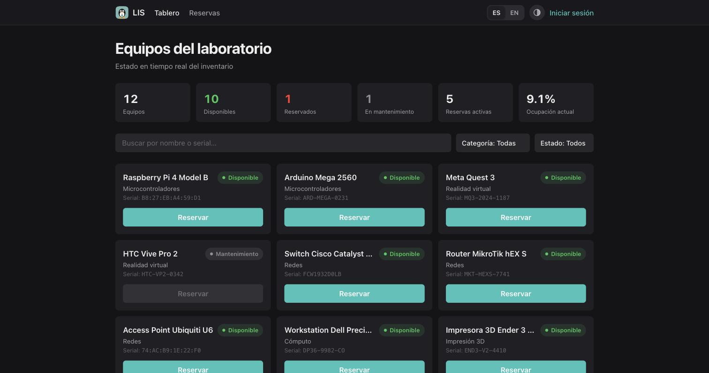
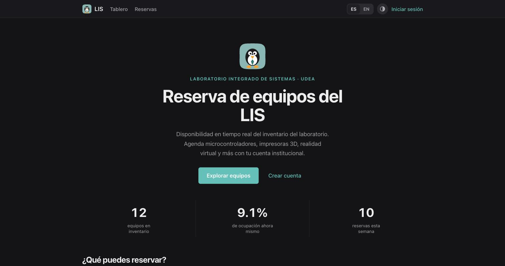
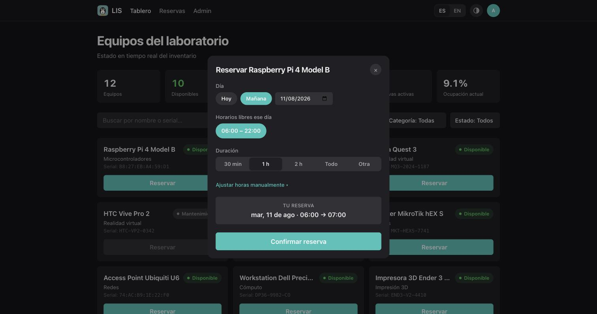
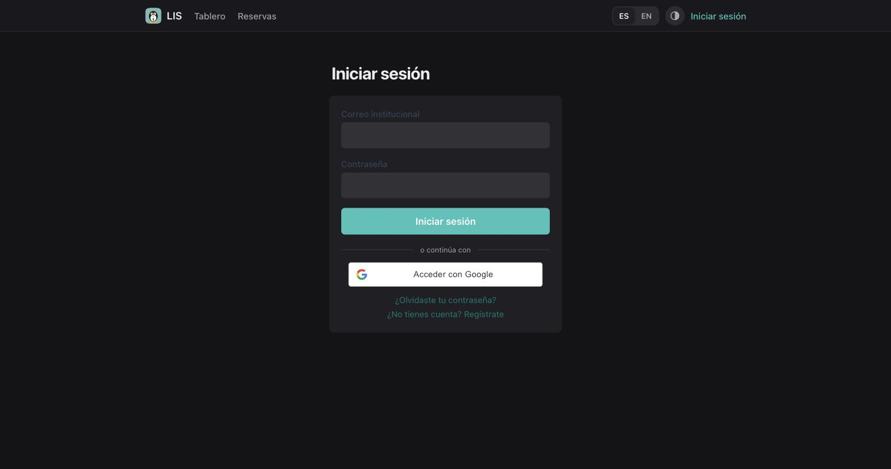
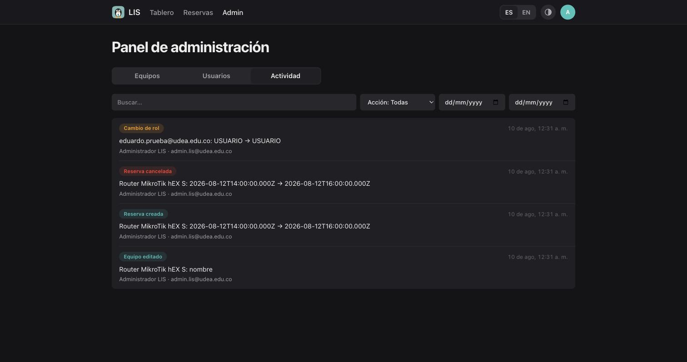

# LIS Dashboard — Monitoreo de Recursos

Frontend del sistema de gestión y reservas de equipos del Laboratorio Integrado de Sistemas. Consume la REST API del Reto 2.

**Stack:** React 19 · TypeScript · Vite · Tailwind CSS · TanStack Query · react-i18next

> 🌐 **En producción:** [lis-reservas.vercel.app](https://lis-reservas.vercel.app) — frontend en Vercel, API en Render, datos en Neon.



## Quick Start

Requiere la API del Reto 2 corriendo (rama `1137975774-reto2`, `docker compose up -d`).

```bash
npm install
cp .env.example .env     # apunta a http://localhost:3000 por defecto
npm run dev
```

La aplicación queda en `http://localhost:5173`.

## Funcionalidades

- **Tablero de monitoreo**: KPIs del laboratorio (equipos por estado, reservas activas, % de ocupación) y listado de equipos en tarjetas, consumiendo los endpoints de la API.
- **Indicadores de estado**: cada equipo muestra su estado con color e ícono — verde (disponible), rojo (reservado), gris (mantenimiento) — siempre acompañado de la etiqueta de texto.
- **Filtros dinámicos**: búsqueda por nombre/serial y filtros por categoría y estado, sin recargar la página. Listado paginado.
- **Reservas**: flujo guiado desde la tarjeta del equipo — día, horarios libres sugeridos y duración (requiere sesión) — más historial con paginación y cancelación.
- **Manejo de errores**: los errores del backend se muestran como alertas amigables — por ejemplo, intentar reservar una franja ocupada muestra el mensaje del conflicto (409) sin romper la interfaz.
- **Autenticación**: registro y login con correo institucional, login con Google (botón oficial de Google Identity Services), recuperación y restablecimiento de contraseña. La sesión se renueva sola: si el access token vence, el cliente usa el refresh token y reintenta la petición de forma transparente.
- **Internacionalización (bonus)**: 4 idiomas (español, inglés, portugués y francés) con cambio dinámico sin recargar — ES/EN en el header y los cuatro en Perfil. Textos centralizados en `src/i18n/*.json`; agregar un idioma es un JSON nuevo.
- **Responsive**: tab bar inferior en móvil, tablas que se convierten en tarjetas apiladas y formularios como bottom sheets. Tema claro/oscuro automático o manual.
- **Recordatorio de calendario**: al confirmar una reserva se puede descargar el evento `.ics` (con alarma 30 min antes) o abrirlo pre-llenado en Google Calendar.
- **Sesiones activas**: en Perfil se listan los dispositivos con acceso a la cuenta (con navegador y fecha) y se puede revocar cualquiera — la revocación invalida el refresh token en el servidor.
- **Lis 🐧**: la mascota del laboratorio. Llega contando una historia (una "sesión sospechosa" desde la sala 18-210 que resulta ser él) y propone misiones — primera reserva, cancelar con anticipación, probar el modo oscuro… — que le dan XP y lo hacen evolucionar hasta su forma final: el logo del LIS.

## Capturas

| | |
|---|---|
|  |  |
| Landing pública con datos vivos | Reserva guiada: día, horarios libres y duración |
|  |  |
| Login con correo institucional o Google | Panel admin: registro de actividad con filtros |

## Cuentas de prueba

| Rol | Correo | Contraseña |
|-----|--------|------------|
| Administrador | `admin.lis@udea.edu.co` | `lisadmin2026` |
| Estudiante | regístrate con cualquier correo `@udea.edu.co` | — |

**Recorrido sugerido para evaluar (5 min):** entrar a [lis-reservas.vercel.app](https://lis-reservas.vercel.app) → crear una cuenta (o usar la de admin) → seguir la alerta de "actividad inusual" hasta conocer a Lis 🐧 → reservar un equipo con los horarios sugeridos → intentar reservar la misma franja para ver el manejo del conflicto (409) → cambiar idioma y tema desde el header → con la cuenta admin: panel de administración (equipos, usuarios, actividad). En móvil, la interfaz cambia a tab bar inferior y bottom sheets.

## Estructura

```
src/
├── api/            cliente HTTP (auto-refresh de sesión en 401), servicios y tipos
├── auth/           contexto de sesión (usuario actual, login/logout)
├── componentes/    Layout, EstadoBadge, Paginacion, ModalReserva, Alerta, BotonGoogle…
├── i18n/           configuración y diccionarios es/en
└── paginas/        Dashboard, Reservas, Login, Registro, recuperación de contraseña
```

## Sistema de diseño

La interfaz se construye sobre una capa de **tokens semánticos** (`src/index.css`) inspirada en las Human Interface Guidelines: colores por función (`label`, `slabel`, `separator`, `fillc`, `accent`, más `good`/`warn`/`bad` para estados), tres radios (`--radius-control`, `--radius-card`, `--radius-sheet`) y una curva de animación única (`transicion-spring`). El tema claro/oscuro se resuelve a nivel de token, así que ningún componente conoce el tema.

Sobre esos tokens hay una base de componentes reutilizables pensada para que el sistema crezca sin romper la línea visual:

| Componente | Uso |
|------------|-----|
| `TituloGrande` | Encabezado de página con título colapsable hacia la barra superior |
| `EstadoBadge` | Estado de un equipo (punto de color + etiqueta, nunca color solo) |
| `Alerta` | Mensajes de error/éxito con cierre |
| `Paginacion` | Navegación de listados paginados |
| `ModalReserva` / `SheetIntruso` | Patrón de bottom sheet móvil / modal centrado en escritorio |
| `IconoCategoria`, `MascotaLis` | Iconografía SVG de línea propia |
| `claseCampo`, `claseBoton`, `claseEtiqueta` | Primitivas de formulario compartidas (`TarjetaAuth`) |

La regla para nuevas pantallas: componer con estas piezas y los tokens — no introducir colores, radios ni tipografías fuera del sistema.

## Variables de entorno

| Variable | Descripción | Default |
|----------|-------------|---------|
| `VITE_API_URL` | URL de la API del Reto 2 | `http://localhost:3000` |
| `VITE_GOOGLE_CLIENT_ID` | Client ID de OAuth (el mismo de la API). Vacío = el botón de Google se oculta | vacío |

## Decisiones técnicas

- **TanStack Query** para el estado del servidor: cache por clave de filtros, invalidación tras crear/cancelar reservas (el tablero se actualiza solo) y estados de carga/error uniformes.
- **Renovación de sesión transparente**: el cliente HTTP intercepta los `401`, ejecuta el refresh (una sola vez aunque haya peticiones concurrentes) y reintenta. El usuario activo nunca vuelve a ver el login.
- **i18n con `react-i18next`**: los componentes no tienen texto quemado; todo pasa por claves de traducción.
- **Tailwind CSS** para el responsive sin hojas de estilo paralelas.
