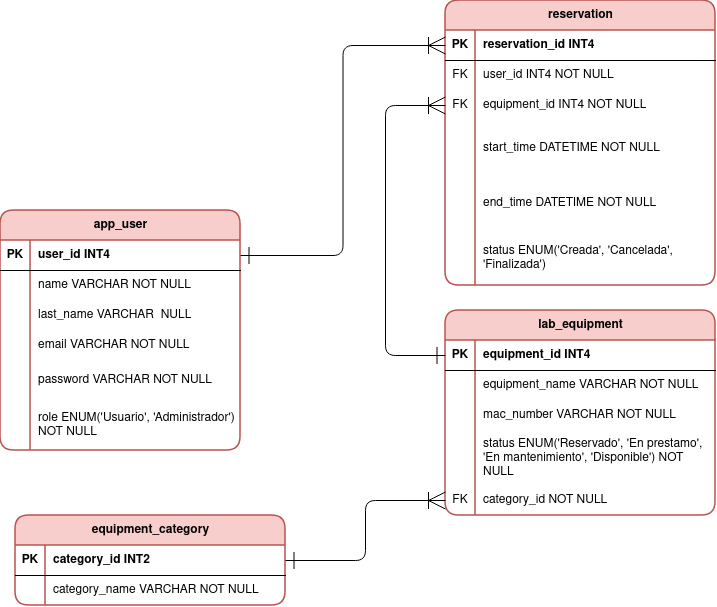

# API de Reservas de Equipos de Laboratorio de Sistemas

API REST Concepto para la gestion de equipos y reservas del laboratorio de sistemas de la Universidad de Antioquia (UdeA). Permite registrar usuarios institucionales, consultar equipos por categoria y estado, crear reservas con regla de no traslape de horario y administrar equipos y categorias bajo el rol `ADMINISTRADOR`. Hace uso de base de datos mediante archivo con H2 para pruebas de concepto rápidas y ligeras.

## Tabla de contenidos

- [Modelo entidad-relacion](#modelo-entidad-relacion)
- [Tecnologias usadas](#tecnologias-usadas)
- [Requisitos y ejecucion](#requisitos-y-ejecucion)
- [Autenticacion y roles](#autenticacion-y-roles)
- [Endpoints](#endpoints)
- [Logica de negocio](#logica-de-negocio)
- [Documentacion interactiva](#documentacion-interactiva)

## Modelo entidad-relacion

El modelo de datos se compone de cuatro entidades principales, cuyo diagrama se muestra en la siguiente imagen:



- **User** (`app_user`): usuario institucional que reserva equipos. Tiene nombre, apellido, correo unico, contraseña (hash) y `role` (`USUARIO` o `ADMINISTRADOR`). Un usuario puede tener muchas reservas (`1..N`).
- **EquipmentCategory** (`equipment_category`): categoria a la que pertenecen los equipos (ej. Computacion, Electronica, Redes). Una categoria agrupa muchos equipos (`1..N`).
- **LabEquipment** (`lab_equipment`): equipo del laboratorio con nombre, numero MAC y `status` (`Disponible`, `Reservado`, `En prestamo`, `En mantenimiento`). Cada equipo pertenece a una categoria (relacion `N..1`) y puede tener muchas reservas (`1..N`).
- **Reservation** (`reservation`): reserva de un equipo por un usuario en un rango de fechas (`start_time` - `end_time`) con `status` (`Creada`, `Cancelada`, `Finalizada`). Relaciona `User` y `LabEquipment` mediante claves foraneas `user_id` y `equipment_id` (ambas `N..1`).

## Tecnologias usadas

| Tecnologia | Version |
|---|---|
| Java | 21 |
| Spring Boot | 3.3.5 |
| Spring Web (Servlet/Tomcat) | 3.3.5 |
| Spring Data JPA (Hibernate) | 3.3.5 |
| Spring Security | 3.3.5 |
| Spring Validation | 3.3.5 |
| Spring HATEOAS | 3.3.5 |
| Spring Actuator | 3.3.5 |
| JJWT (io.jsonwebtoken) | 0.12.6 |
| google-auth-library-oauth2-http | 1.23.0 |
| springdoc-openapi (Swagger UI) | 2.6.0 |
| H2 (base de datos embebida en archivo) | runtime |
| Lombok | - |

La base de datos es H2 en modo archivo (`./data/labreservas`) con compatibilidad MySQL. La aplicación usa JWT para autenticacion sin estado (stateless) y versiona sus artefactos bajo el groupId `com.udea`, artifactId `api-reservas-laboratorio`.

## Requisitos y ejecucion

- JDK 21 y Maven.
- Definir las variables de entorno:
  - `GOOGLE_CLIENT_ID`: credencial cliente OAuth2 de Google (para el login con Google). Sin esta, solo funciona el registro/login por contraseña. 
  - `JWT_SECRET`: clave (>= 256 bits) para firmar los JWT.
  - `JWT_EXPIRATION_MS`: vigencia del token en milisegundos (por defecto `3600000` = 1 hora).
  - `RESERVATION_FINALIZE_CRON`: expresion cron del proceso que finaliza reservas (por defecto `0 0 0 * * *`, medianoche en `America/Bogota`).

```bash
mvn spring-boot:run
```

Al iniciar, un `DataInitializer` siembra datos de ejemplo si la base de datos esta vacia:

- **Categorias**: Computacion, Electronica, Redes y comunicaciones, Sistemas embebidos.
- **Equipos**: ThinkPad T470 (en mantenimiento), MacBook Pro 14, Osciloscopio Rigol, Multimetro Fluke 87V, Router Cisco 2901, Switch HP 2450 (en prestamo), Raspberry Pi 4.
- **Usuarios**: `admin@udea.edu.co` / `Admin1234` (rol `ADMINISTRADOR`) y `estudiante@udea.edu.co` / `Usuario1234` (rol `USUARIO`).

## Autenticación y roles

- El registro/login solo admite correos del dominio institucional `@udea.edu.co`.
- Los endpoints `POST /api/auth/register`, `POST /api/auth/login` y `POST /api/auth/google` son públicos. El resto exige un JWT valido en el header `Authorization: Bearer <token>`.
- El token JWT transporta el correo y el rol; un filtro lo valida en cada petición y construye la autenticación del contexto de seguridad.
- Endpoints de escritura de equipos y categorias, y la consulta de usuarios, requieren el rol `ROLE_ADMINISTRADOR` (controlado con `@PreAuthorize`).

## Endpoints

### Autenticacion — `/api/auth`

| Metodo | Ruta | Acceso | Descripcion |
|---|---|---|---|
| POST | `/api/auth/register` | Publico | Registra un usuario con correo `@udea.edu.co` y devuelve un JWT. `201 Created`. |
| POST | `/api/auth/login` | Publico | Inicia sesion con correo y contrasena y devuelve un JWT. |
| POST | `/api/auth/google` | Publico | Valida un ID token de Google (preferiblemente enviado en el cuerpo del JSON y con scope `openid email profile`) y registra o inicia sesion devolviendo un JWT. |
| GET | `/api/auth/me` | Autenticado | Devuelve el perfil (`UserDTO`) del usuario autenticado a partir del token. |

### Usuarios — `/api/users`

| Metodo | Ruta | Acceso | Descripcion |
|---|---|---|---|
| GET | `/api/users?page=&size=` | Solo `ADMINISTRADOR` | Lista paginada de todos los usuarios ordenados por `userId`. |

### Categorias — `/api/categories`

| Metodo | Ruta | Acceso | Descripcion |
|---|---|---|---|
| GET | `/api/categories` | Autenticado | Lista todas las categorias de equipos. |
| GET | `/api/categories/{id}` | Autenticado | Consulta una categoria por id (`404` si no existe). |
| POST | `/api/categories` | Solo `ADMINISTRADOR` | Crea una categoria; rechaza con `409` si ya existe una con el mismo nombre. `201 Created`. |

### Equipos — `/api/equipment`

| Metodo | Ruta | Acceso | Descripcion |
|---|---|---|---|
| GET | `/api/equipment?page=&size=&categoryId=&status=` | Autenticado | Lista paginada de equipos con filtros opcionales por categoria y estado. Respuesta HATEOAS (`PagedModel`). |
| GET | `/api/equipment/{id}` | Autenticado | Consulta un equipo por id. Respuesta HATEOAS (`EntityModel`). |
| POST | `/api/equipment` | Solo `ADMINISTRADOR` | Registra un equipo nuevo (si no se indica estado, queda `Disponible`). `201 Created`. |
| PUT | `/api/equipment/{id}` | Solo `ADMINISTRADOR` | Actualiza parcialmente nombre, numero MAC, estado y/o categoria. |
| DELETE | `/api/equipment/{id}` | Solo `ADMINISTRADOR` | Elimina un equipo solo si no tiene reservas activas (`Creada`); si las tiene responde `404` con mensaje de negocio. `204 No Content`. |

### Reservas — `/api/reservations`

| Metodo | Ruta | Acceso | Descripcion |
|---|---|---|---|
| POST | `/api/reservations` | Autenticado | Crea una reserva para el usuario autenticado. `201 Created`. |
| GET | `/api/reservations?page=&size=` | Autenticado | Lista paginada de las reservas del usuario autenticado. |
| GET | `/api/reservations/all?page=&size=` | Solo `ADMINISTRADOR` | Lista paginada de todas las reservas. |
| GET | `/api/reservations/{id}` | Autenticado | Consulta una reserva por id; solo el propietario o un administrador pueden verla. |
| DELETE | `/api/reservations/{id}` | Autenticado | Cancela una reserva; solo el propietario o un administrador pueden hacerlo. `204 No Content`. |

## Logica de negocio

### Registro e inicio de sesion
- El correo se normaliza (minusculas y sin espacios) y debe pertenecer exclusivamente al dominio `@udea.edu.co` (`EmailDomainNotAllowedException` en caso contrario).
- El registro rechaza con `409` si el correo ya existe; la contraseña se almacena hasheada con BCrypt (`PasswordEncoder`).
- El login valida la contraseña con `passwordEncoder.matches` y responde `401` si las credenciales son incorrectas.
- Con Google, el backend verifica la firma, el emisor (`https://accounts.google.com`) y la audiencia (el `client-id` configurado) del ID token. Si el correo pertenece al dominio institucional, registra al usuario automáticamente (con una contraseña aleatoria) o lo autentica si ya existe.

### Estados de equipo y reservas
- `EquipmentStatus` puede ser `Disponible`, `Reservado`, `En prestamo` o `En mantenimiento`.
- `ReservationStatus` puede ser `Creada`, `Cancelada` o `Finalizada`.

### Creacion de reserva con regla de no traslape
1. Se valida que `startTime` sea anterior a `endTime` (`400` en caso contrario).
2. El equipo debe existir y **no estar en mantenimiento** (si lo esta, `409` `EquipmentNotAvailableException`).
3. Se cuenta con una consulta JPQL de las reservas activas (`Creada`) del equipo cuyo horario se traslapa con el solicitado (`startTime < endTime solicitado` y `endTime > startTime solicitado`). Si hay alguna, la reserva se rechaza con `409 ReservationConflictException`.
4. Si no hay conflicto y el equipo estaba `Disponible`, su estado pasa a `Reservado`. Si ya estaba en prestamo, se mantiene (se permite reservarlo igualmente).

### Cancelacion
- Solo el propietario de la reserva o un `ADMINISTRADOR` pueden cancelarla.
- No se permite cancelar una reserva `Finalizada` ni una que ya esta `Cancelada`.
- Al cancelar se recalcula la disponibilidad del equipo: si ya no quedan reservas activas, el equipo vuelve a `Disponible`.

### Finalizacion automatica de reservas
- Un `ReservationScheduler` programado con cron (por defecto, cada medianoche en zona `America/Bogota`) ejecuta `markFinishedReservations`: marca como `Finalizada` todas las reservas `Creada` cuyo `endTime` ya paso y libera los equipos asociados (los deja `Disponible` si no tienen mas reservas activas).

### Consultas restringidas
- La consulta de usuarios, la creacion de categorias y todas las operaciones de escritura/eliminacion de equipos estan restringidas al rol `ADMINISTRADOR` mediante `@PreAuthorize("hasAuthority('ROLE_ADMINISTRADOR')")`.
- La consulta de una reserva exige ser el propietario o administrador; en caso contrario se lanza `403` `ForbiddenOperationException`.
- Los equipos se consultan con filtros combinables por `categoryId` y `status` mediante `Specification` de Spring Data JPA.

### Eliminacion de equipos
- Un equipo solo se puede eliminar si no tiene reservas activas (`Creada`); de lo contrario la operacion se rechaza para preservar la integridad referencial de las reservas.

### Manejo de errores
- Un `GlobalExceptionHandler` (`@RestControllerAdvice`) centraliza las respuestas de error con un cuerpo `ApiError` (timestamp, codigo HTTP, mensaje y URI). Cubre errores de validacion (`400`), cuerpos mal formados (`400`), parametros invalidos (`400`), recursos no encontrados (`404`), permisos denegados (`403`) y errores internos (`500`, con detalle solo en dev).
- Las excepciones de negocio (`BusinessException` y derivadas) llevan su propio codigo HTTP (por ejemplo, `409` para conflictos y duplicados).

## Documentacion interactiva

- Swagger UI: `http://localhost:8080/swagger-ui.html`
- OpenAPI JSON: `http://localhost:8080/v3/api-docs`
- Consola H2: `http://localhost:8080/h2-console`
- Health check: `http://localhost:8080/actuator/health`