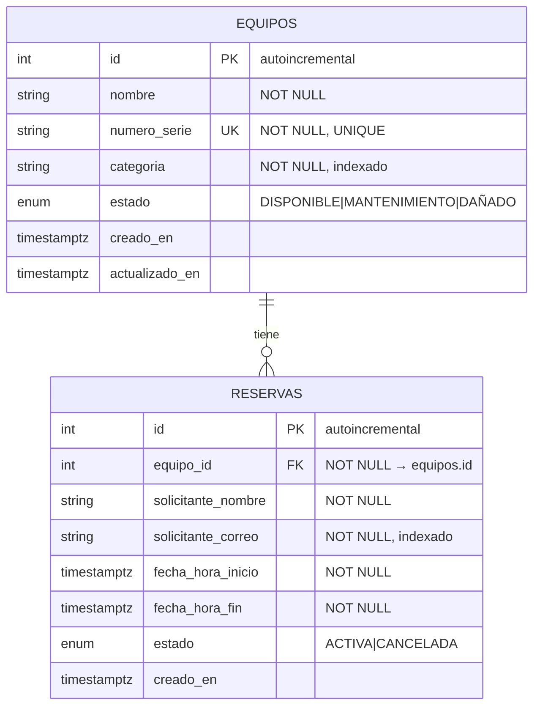

# Plan técnico — Sistema de Gestión y Reservas de Equipos del LIS

> **Fase 2 de SDD.** Este documento define **CÓMO** se construye lo que
> [`spec.md`](spec.md) definió que había que construir. El desglose en tareas
> ejecutables está en [`tasks.md`](tasks.md).

**Estado:** pendiente de aprobación · **Rama:** `1067961907-Reto2`

---

## 0. Principio rector de este plan

El criterio de diseño **no** es "que parezca código de empresa", es **que se
pueda leer de arriba a abajo y sustentar sin titubear**. Por eso:

- Se usa la estructura más plana que cumpla los requerimientos.
- **No** hay capa de repositorios, ni de servicios, ni interfaces, ni
  inyección de dependencias más allá de la que FastAPI trae de fábrica.
- Cada vez que se elige entre "lo simple" y "lo correcto pero complejo", se
  documenta la alternativa descartada y por qué.
- La única excepción a la simplicidad es la **regla crítica RN-03**
  (§7), donde sí se aplica una solución robusta — porque es el corazón del
  enunciado y porque cuesta apenas unas líneas.

## 1. Estructura de archivos

```
backend/
├── app/                      ← todo el código de la aplicación
│   ├── __init__.py            (marca la carpeta como paquete de Python)
│   ├── main.py                 Crea la app FastAPI y engancha los routers
│   ├── database.py              Conexión a PostgreSQL: motor, sesión y Base
│   ├── models.py                 Las 2 tablas: Equipo y Reserva
│   ├── schemas.py                 Formularios de entrada/salida (Pydantic)
│   └── routers/                    Los endpoints, agrupados por tema
│       ├── __init__.py
│       ├── equipos.py               CU-01 a CU-04
│       ├── reservas.py               CU-05 a CU-07 (+ la regla RN-03)
│       └── estadisticas.py            CU-08 (Top 5)
├── alembic/                   ← migraciones (historial de cambios de la BD)
│   ├── env.py
│   └── versions/
├── tests/                     ← pruebas automáticas
│   ├── conftest.py             Preparación compartida por todas las pruebas
│   ├── test_equipos.py
│   └── test_reservas.py         Incluye todos los casos de solapamiento
├── docs/                      ← spec.md, plan.md, tasks.md
├── alembic.ini
├── requirements.txt            Lista de librerías necesarias
├── Dockerfile                   Receta de la "caja" donde corre la API
├── docker-compose.yml            Levanta API + PostgreSQL juntos
├── .env.example                   Variables de entorno de ejemplo
└── README.md                       Guía de uso del proyecto
```

**Total: 8 archivos de código.** `models.py` y `schemas.py` son **un solo
archivo cada uno**, no carpetas, porque solo hay dos entidades: partirlos en
`models/equipo.py` + `models/reserva.py` solo añadiría saltos entre archivos
para leer 60 líneas.

### Decisiones de estructura

**P-1 — Existe una carpeta `app/`, no todo suelto en la raíz.**
*Alternativa descartada:* `main.py`, `models.py`, etc. directamente en
`backend/`. *Por qué se descarta:* tanto Alembic como pytest necesitan
importar el código (`from app.models import Equipo`); sin un paquete con
nombre, esos imports se vuelven frágiles y dependen de desde dónde se
ejecute el comando. Un solo nivel de carpeta resuelve eso de forma
definitiva.

**P-2 — No hay `config.py` ni librería de configuración.** La única variable
que el proyecto necesita es la dirección de la base de datos, y se lee
directamente en `database.py` con `os.getenv("DATABASE_URL", <valor por
defecto>)`. *Alternativa descartada:* una clase `Settings` con
`pydantic-settings`. *Por qué se descarta:* es una dependencia y un archivo
más para gestionar **un** valor. Si algún día hacen falta cinco o seis
variables, ese será el momento de introducirla.

**P-3 — La lógica de negocio vive en los routers, no en una capa aparte.**
*Alternativa descartada:* carpetas `crud/` o `services/` que separen "hablar
con la base de datos" de "responder peticiones HTTP". *Por qué se descarta:*
con dos entidades, esa capa serían funciones de tres líneas que solo
reenvían llamadas — más archivos para leer, cero beneficio. La única lógica
que no es un CRUD directo es la comprobación de solapamiento, y va en una
función con nombre propio y documentada dentro de `routers/reservas.py`,
donde cualquiera la encuentra sin buscar.

## 2. Librerías y para qué sirve cada una

| Librería | Qué es | Para qué la usamos aquí |
|---|---|---|
| **FastAPI** | Framework web: convierte funciones de Python en endpoints HTTP. | Define todas las rutas y genera sola la documentación Swagger. |
| **Uvicorn** | Servidor que ejecuta la aplicación y escucha peticiones. | Es el proceso que mantiene la API viva en el puerto 8000. |
| **Pydantic v2** | Valida datos según los tipos que declaras. | Comprueba que lo que llega tenga la forma correcta (RN-02, correos válidos) y define la forma de las respuestas. Ya viene con FastAPI. |
| **email-validator** | Complemento de Pydantic. | Hace que el tipo `EmailStr` verifique de verdad el formato del correo (CA-18). |
| **SQLAlchemy 2.0** | ORM: *Object-Relational Mapper*, traduce entre clases de Python y tablas de la base de datos. | Define `Equipo` y `Reserva` como clases y genera el SQL por debajo. |
| **psycopg2-binary** | Driver: el "cable" concreto que conecta Python con PostgreSQL. | SQLAlchemy lo usa por debajo; no se escribe código contra él. |
| **Alembic** | Herramienta de migraciones. | Crea y versiona la estructura de las tablas (§4). |
| **PostgreSQL 16** | Motor de base de datos. | Guarda los datos de verdad. Se elige por encima de otros porque su tipo `tstzrange` y las restricciones `EXCLUDE` resuelven RN-03 de forma exacta (§7). |
| **pytest** | Framework de pruebas automáticas. | Ejecuta las pruebas de §6. |
| **httpx** | Cliente HTTP. | Lo usa el `TestClient` de FastAPI para llamar a la API dentro de las pruebas. |
| **Docker + Docker Compose** | Empaquetado y orquestación. | Levantan API + base de datos con un solo comando (CA-25). |

### Por qué SQLAlchemy 2.0 + Pydantic y no SQLModel

Con SQLModel una misma clase hace de tabla y de formulario, lo que ahorra
líneas. Se descarta porque separar ambas cosas **es una ventaja, no un
estorbo**: `models.py` describe *lo que se guarda en el disco* y
`schemas.py` *lo que viaja por la red*, y no siempre coinciden (el `id` y
las marcas de tiempo se guardan pero no se reciben; los filtros se reciben
pero no se guardan). Además SQLAlchemy tiene mucha más documentación y
respuestas en internet cuando algo falla, que es lo que importa cuando se
está aprendiendo con el reloj corriendo.

## 3. Modelo de datos

### 3.1 Diagrama



**PK** = clave primaria (identifica la fila). **FK** = clave foránea (apunta
a la fila de otra tabla). **UK** = clave única (no puede repetirse).

### 3.2 Restricciones a nivel de base de datos

| Restricción | Tabla | Qué garantiza | Regla |
|---|---|---|---|
| `PRIMARY KEY (id)` | ambas | Cada fila es identificable. | — |
| `UNIQUE (numero_serie)` | equipos | No hay dos equipos con el mismo código. | RN-01 |
| `FOREIGN KEY (equipo_id)` | reservas | No se puede reservar un equipo inexistente. | RN-05 |
| `CHECK (fecha_hora_fin > fecha_hora_inicio)` | reservas | Ninguna fila puede tener un rango invertido. | RN-02 |
| `EXCLUDE ... WHERE (estado = 'ACTIVA')` | reservas | **Es físicamente imposible guardar dos reservas activas solapadas.** | RN-03 |
| Índices en `categoria`, `estado`, `equipo_id`, `solicitante_correo` | ambas | Que los filtros del listado sean rápidos. | CU-04, CU-07 |

### 3.3 Decisiones del modelo

**P-4 — Los identificadores son enteros autoincrementales (1, 2, 3…), no UUID.**
*Alternativa descartada:* UUID (`be2b77d1-196d-4df6-...`).
*Por qué se descarta:* el UUID solo aporta en sistemas distribuidos o cuando
se quiere ocultar cuántos registros hay — nada de eso aplica aquí. En cambio
sí tiene un costo real: para probar la API a mano en Swagger hay que copiar y
pegar cadenas de 36 caracteres en cada llamada. Con enteros, probar una
reserva es escribir `1`.

**P-5 — Los estados se guardan como tipo `ENUM` nativo de PostgreSQL.**
*Alternativa descartada:* guardarlos como texto libre y validar solo en
Python. *Por qué se descarta:* con `ENUM`, la propia base de datos rechaza un
valor inventado aunque alguien la modifique por fuera de la API, y Swagger
muestra automáticamente los valores permitidos en un desplegable (CA-04).

**P-6 — Las fechas se guardan con zona horaria (`TIMESTAMPTZ`).**
*Alternativa descartada:* guardar fechas "sin zona". *Por qué se descarta:*
comparar franjas horarias sin saber a qué huso pertenecen es la fuente
clásica de reservas que se solapan "en el papel" pero no en la realidad.
Con `TIMESTAMPTZ` PostgreSQL normaliza todo internamente a UTC y las
comparaciones de RN-03 son siempre correctas.

## 4. Estrategia de migraciones

> Una **migración** es un archivo que describe un cambio en la estructura de
> la base de datos (crear una tabla, añadir una columna). Tenerlas
> versionadas significa que cualquiera puede reconstruir la base de datos
> desde cero ejecutando la lista de cambios en orden, y que se sabe
> exactamente qué cambió y cuándo.

- **Una sola migración inicial** que crea las dos tablas, sus índices y sus
  restricciones. No hace falta más para este alcance.
- Se genera con `alembic revision --autogenerate`, que compara `models.py`
  contra la base de datos y escribe el archivo casi solo.
- Ese archivo se **edita a mano** para añadir dos cosas que Alembic no puede
  deducir de los modelos: la activación de la extensión `btree_gist` y la
  restricción `EXCLUDE` de §7.
- **Se ejecutan solas al arrancar**: el `docker-compose.yml` lanza
  `alembic upgrade head` antes de encender el servidor, así que quien clone
  el repositorio no tiene que ejecutar ningún paso manual (CA-25).

*Alternativa descartada:* usar `Base.metadata.create_all()`, que crea las
tablas directamente sin Alembic. *Por qué se descarta:* no deja historial, no
permite evolucionar el esquema sin borrar datos, y no puede expresar la
restricción `EXCLUDE` que sostiene la regla crítica.

## 5. Manejo de errores y códigos HTTP

Un **código de estado HTTP** es un número que acompaña cada respuesta e
indica cómo fue. La API usa este mapa, sin inventar códigos propios:

| Código | Significado | Cuándo se usa aquí |
|---|---|---|
| `200 OK` | Salió bien. | Consultas, actualizaciones y cancelaciones. |
| `201 Created` | Se creó algo nuevo. | Registrar equipo (CU-01), crear reserva (CU-05). |
| `404 Not Found` | Lo que pediste no existe. | Equipo o reserva inexistente (CA-06, CA-16). |
| `409 Conflict` | La petición es válida, pero **choca con el estado actual del sistema**. | Serie duplicada (RN-01), solapamiento (RN-03), equipo no disponible (RN-06), reserva ya cancelada (RN-07). |
| `422 Unprocessable Entity` | Los datos enviados están mal formados. | Falta un campo, correo inválido, `fecha_fin` ≤ `fecha_inicio`, estado inexistente. Lo genera **FastAPI solo**, sin escribir código. |

**Estrategia de implementación:** en cada router se lanza
`HTTPException(status_code=..., detail="mensaje claro en español")` en el
punto exacto donde se detecta el problema.

*Alternativa descartada:* una jerarquía de excepciones propias
(`EquipoNoEncontrado`, `ReservaSolapada`…) con manejadores globales
registrados en `main.py`. *Por qué se descarta:* son dos archivos y ~8 clases
extra para lograr exactamente el mismo JSON de respuesta. Tiene sentido
cuando la misma excepción se lanza desde muchos sitios; aquí cada error se
lanza desde un único lugar.

**Por qué `409` y no `400` para el solapamiento:** `400`/`422` significan
"lo que enviaste está mal escrito"; una reserva solapada está *perfectamente
bien escrita*, lo que ocurre es que choca con otra que ya existe. Esa
distinción es justamente lo que expresa `409 Conflict`, y es el código que
el enunciado pide como "código de estado HTTP adecuado".

## 6. Estrategia de pruebas

**Contra PostgreSQL real, no contra SQLite.** Es una decisión deliberada: la
garantía más importante del sistema (§7) es una característica exclusiva de
PostgreSQL. Probar contra SQLite daría pruebas en verde mientras el
comportamiento real queda sin verificar.

- Las pruebas usan una base de datos aparte (`lis_test`) dentro del mismo
  contenedor de PostgreSQL, para no ensuciar los datos de trabajo.
- `conftest.py` crea las tablas antes de las pruebas, las borra al terminar,
  y sustituye la conexión de la app por la de pruebas (usando
  `dependency_overrides`, el mecanismo que FastAPI ya trae para esto).
- Se ejecutan con `docker compose exec api pytest`.

### Qué se prueba

| Archivo | Casos cubiertos |
|---|---|
| `test_equipos.py` | CA-01 (crear), CA-02 (serie duplicada → 409), CA-05 (actualización parcial), CA-06 (404), CA-07 (paginación), CA-08/09 (filtros combinados), CA-10 (filtro sin resultados). |
| `test_reservas.py` | **CA-12: los cinco casos de solapamiento A–E → 409**, **CA-13: los dos casos adyacentes F–G → 201**, CA-14 (una reserva cancelada no bloquea), CA-15 (rango invertido → 422), CA-16 (equipo inexistente → 404), CA-17 (equipo en mantenimiento → 409), CA-19/20 (cancelar y recancelar), CA-23/24 (Top 5). |

Los siete casos del diagrama de solapamiento de `spec.md` §5.1 se escriben
como una prueba parametrizada: una sola función que recibe las siete franjas
y el resultado esperado. Así la prueba se lee **igual** que la
especificación, y si mañana cambia el criterio de los extremos (D-2) solo se
toca una línea.

## 7. La regla crítica RN-03: cómo se garantiza de verdad

Esta sección responde a la pregunta central del enunciado.

### 7.1 La comprobación obvia (y por qué no basta)

Lo natural es, antes de insertar, preguntar si ya hay algo que estorbe:

```sql
SELECT 1 FROM reservas
WHERE equipo_id = :equipo
  AND estado = 'ACTIVA'
  AND fecha_hora_inicio < :nueva_fin      -- ┐ las dos condiciones
  AND fecha_hora_fin    > :nueva_inicio   -- ┘ de spec.md §5.1
LIMIT 1;
```

Si devuelve algo → `409`. Esto cubre el uso normal y produce un mensaje de
error claro.

**Pero tiene un agujero: la condición de carrera** (CA-22). Si dos personas
piden el mismo equipo a la misma hora, en el mismo instante:

```
   Persona A                         Persona B
      │                                 │
   1. SELECT → "está libre"             │
      │                             2. SELECT → "está libre"   ← ¡aún no ve a A!
   3. INSERT ✅                          │
      │                             4. INSERT ✅  ← se guardan DOS reservas solapadas
```

Ambas consultaron antes de que la otra insertara. La comprobación en Python
**no puede** cerrar esa ventana por sí sola, por muy bien escrita que esté.

### 7.2 La garantía real: restricción `EXCLUDE` en PostgreSQL

PostgreSQL permite declarar que **ciertas filas no pueden coexistir**. Es
como un `UNIQUE`, pero en vez de exigir "que no se repita un valor", exige
"que no se solapen dos rangos":

```sql
CREATE EXTENSION IF NOT EXISTS btree_gist;

ALTER TABLE reservas ADD CONSTRAINT reservas_sin_solape
EXCLUDE USING gist (
    equipo_id WITH =,                                        -- mismo equipo
    tstzrange(fecha_hora_inicio, fecha_hora_fin) WITH &&     -- rangos que se tocan
) WHERE (estado = 'ACTIVA');                                 -- solo entre activas
```

Se lee así: *"no pueden existir dos filas activas que tengan el **mismo**
`equipo_id` **y** cuyos rangos de tiempo **se solapen** (`&&`)"*.

Tres detalles que hacen que encaje exactamente con la especificación:

1. **`tstzrange(inicio, fin)` es semiabierto `[inicio, fin)` por defecto** —
   incluye el instante inicial pero no el final. Es *literalmente* la
   decisión D-2 de `spec.md`: por eso 09:00–11:00 y 11:00–13:00 conviven sin
   conflicto, sin escribir ni una línea extra.
2. **`WHERE (estado = 'ACTIVA')`** implementa RN-04: las reservas canceladas
   quedan fuera de la restricción y liberan su franja al instante.
3. **`btree_gist`** es una extensión estándar (viene en la imagen oficial de
   PostgreSQL) que permite mezclar en un mismo índice una comparación de
   igualdad (`equipo_id WITH =`) con una de solapamiento.

Con esto, el escenario de la carrera termina así:

```
   Persona A                         Persona B
   3. INSERT ✅                     4. INSERT ❌ ← PostgreSQL lo rechaza
                                          └─ la API lo traduce a 409
```

La base de datos **no puede** contener datos inválidos, sin importar cuántas
peticiones simultáneas lleguen ni si alguien inserta filas por fuera de la
API.

### 7.2.1 Verificación previa (ya realizada)

Antes de aprobar este plan se levantó un PostgreSQL 16 limpio y se probó la
restricción contra los siete casos del diagrama de `spec.md` §5.1. Resultado:

| Caso | Franja sobre una reserva existente 09:00–11:00 | Resultado real |
|---|---|---|
| A | 10:00–12:00 empieza dentro | ❌ rechazada por `reservas_sin_solape` |
| B | 08:00–10:00 termina dentro | ❌ rechazada |
| C | 09:30–10:30 contenida | ❌ rechazada |
| D | 08:00–12:00 la contiene | ❌ rechazada |
| E | 09:00–11:00 idéntica | ❌ rechazada |
| F | 11:00–13:00 justo después | ✅ aceptada |
| G | 07:00–09:00 justo antes | ✅ aceptada |
| H | Otro equipo, misma franja | ✅ aceptada |
| RN-04 | Misma franja tras cancelar la existente | ✅ aceptada |

Los tres tramos consecutivos del equipo 1 (07:00–09:00, 09:00–11:00,
11:00–13:00) conviven en la tabla, confirmando la decisión D-2. La extensión
`btree_gist` estaba disponible en `postgres:16-alpine` sin instalar nada.

**Conclusión: el mecanismo que sostiene la regla crítica está comprobado
antes de escribir una línea del proyecto.** Estos mismos casos se
convertirán en la prueba parametrizada de §6.

### 7.3 Cómo conviven las dos capas

| Capa | Qué aporta | Qué pasa si actúa |
|---|---|---|
| Comprobación en Python (§7.1) | Un mensaje de error claro y útil en el 99.9% de los casos. | Responde `409` explicando que el equipo ya está reservado en esa franja. |
| Restricción `EXCLUDE` (§7.2) | La garantía absoluta, incluso con peticiones simultáneas. | El `INSERT` falla con un `IntegrityError`, que se captura y se traduce **al mismo `409`**. |

El usuario de la API ve exactamente la misma respuesta en ambos casos. La
segunda capa es una red de seguridad, no un camino alternativo.

*Alternativa descartada:* bloquear la fila del equipo con `SELECT ... FOR
UPDATE` antes de comprobar, obligando a que las reservas del mismo equipo se
procesen en fila india. *Por qué se descarta:* funciona, pero la corrección
depende de que **todo** el código futuro recuerde pedir el bloqueo antes de
insertar; si alguien añade mañana otra ruta que crea reservas y lo olvida, el
agujero vuelve en silencio. La restricción `EXCLUDE` la aplica el motor a
toda inserción, venga de donde venga, y cuesta 6 líneas escritas una sola vez.

## 8. Contrato de la API

Ruta base: `http://localhost:8000`. Documentación interactiva en `/docs`.

| Método | Ruta | Caso de uso | Éxito | Errores posibles |
|---|---|---|---|---|
| `POST` | `/equipos` | CU-01 | `201` | `409` serie duplicada · `422` datos inválidos |
| `GET` | `/equipos` | CU-04 | `200` | — |
| `GET` | `/equipos/{id}` | CU-03 | `200` | `404` |
| `PATCH` | `/equipos/{id}` | CU-02 | `200` | `404` · `409` · `422` |
| `POST` | `/reservas` | CU-05 | `201` | `404` equipo · `409` solape/no disponible · `422` |
| `GET` | `/reservas` | CU-07 | `200` | — |
| `POST` | `/reservas/{id}/cancelar` | CU-06 | `200` | `404` · `409` ya cancelada |
| `GET` | `/estadisticas/top-equipos` | CU-08 | `200` | — |
| `GET` | `/salud` | — | `200` | — |

**P-7 — Para actualizar se usa `PATCH`, no `PUT`.** CA-05 exige que enviar
solo el estado no borre los demás campos. `PUT` significa "reemplaza el
recurso completo"; `PATCH` significa "modifica solo estos campos", que es
exactamente el comportamiento pedido.

**P-8 — Cancelar es `POST /reservas/{id}/cancelar`, no `DELETE`.** La reserva
no se borra: cambia de estado y sigue apareciendo en los listados (CA-19).
Usar `DELETE` para algo que no elimina nada confundiría a quien lea la API.
*Alternativa descartada:* `DELETE /reservas/{id}`. *Por qué se descarta:* es
más corto pero miente sobre lo que hace.

### Forma de las respuestas paginadas

```json
{
  "items": [ ... ],
  "total": 12,
  "page": 1,
  "size": 10,
  "total_pages": 2
}
```

Parámetros: `page` (empieza en 1) y `size` (por defecto 10, máximo 100),
más los filtros propios de cada listado.

## 9. Cómo se levanta todo

`docker-compose.yml` define dos servicios:

| Servicio | Imagen | Qué hace |
|---|---|---|
| `db` | `postgres:16-alpine` | Base de datos. Guarda los datos en un volumen para que sobrevivan a reinicios (CA-29). Tiene *healthcheck*: avisa cuándo está lista de verdad. |
| `api` | Construida con el `Dockerfile` | Espera a que `db` esté sana, ejecuta `alembic upgrade head` y arranca Uvicorn. |

Un solo comando: `docker compose up --build` (CA-25).

## 10. Trazabilidad: cada requisito tiene dueño

| Requisito | Dónde se resuelve |
|---|---|
| RN-01 serie única | `UNIQUE` en BD + captura de `IntegrityError` → 409 |
| RN-02 rango válido | Validador de Pydantic en `schemas.py` + `CHECK` en BD |
| **RN-03 no solape** | **Consulta previa en `routers/reservas.py` + `EXCLUDE` en BD (§7)** |
| RN-04 canceladas liberan | Cláusula `WHERE (estado='ACTIVA')` en ambas capas |
| RN-05 equipo existe | `FOREIGN KEY` + comprobación explícita → 404 |
| RN-06 solo equipos disponibles | Comprobación en `routers/reservas.py` → 409 |
| RN-07 no recancelar | Comprobación en `routers/reservas.py` → 409 |
| CU-04 paginación y filtros | Parámetros de consulta en `routers/equipos.py` |
| CU-08 Top 5 | Consulta con `GROUP BY` + `COUNT` en `routers/estadisticas.py` |
| CA-27 documentación | Docstrings en todo el código + `summary`/`description` en cada endpoint |

## 11. Riesgos y cómo se mitigan

| Riesgo | Mitigación |
|---|---|
| La extensión `btree_gist` no está disponible. | **Riesgo cerrado:** ya se comprobó sobre `postgres:16-alpine` que está disponible y que la restricción se comporta exactamente como especifica §5.1 de `spec.md` (ver §7.2.1). |
| Alembic no genera la restricción `EXCLUDE` automáticamente. | Está previsto: la migración se edita a mano (§4) y hay una prueba que verifica que la restricción existe y funciona. |
| Zonas horarias mezcladas al comparar franjas. | `TIMESTAMPTZ` en todas las columnas de fecha (P-6). |
| Queda poco tiempo para la entrega. | El orden de `tasks.md` deja funcionando primero lo obligatorio; el Top 5, los tests adicionales y el pulido de documentación van al final y son descartables sin romper nada. |

---

## Qué falta definir (Fase 3)

Al aprobar este plan se escribe [`tasks.md`](tasks.md): el desglose en tareas
pequeñas y ordenadas, cada una indicando qué archivos toca y cómo se
comprueba que quedó bien. Solo después de eso se escribe código.
