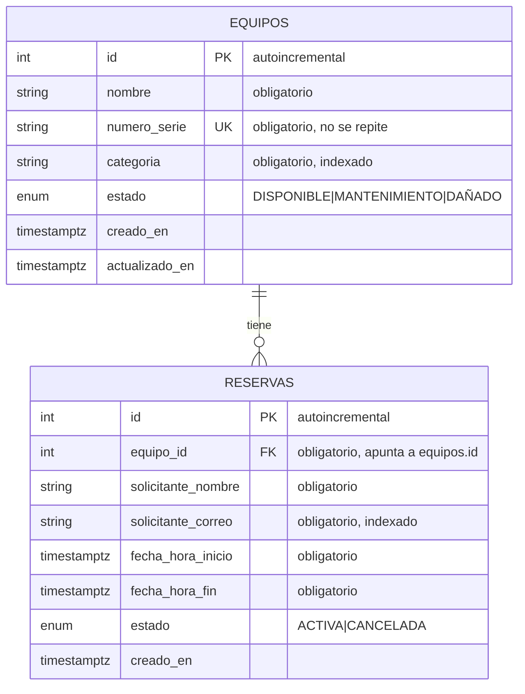

# Por qué está construido así (plan técnico)

> **Qué es este documento.** [`spec.md`](spec.md) dice **qué** tiene que hacer
> el programa. Este dice **cómo** se construye y, sobre todo, **por qué se
> eligió cada cosa** en vez de las alternativas.
>
> Aquí sí se habla de herramientas, pero **cada término se explica la primera
> vez que aparece**. Si quieres entender el funcionamiento interno paso a
> paso, con dibujos, ve a [`como-funciona.md`](como-funciona.md).

**Estado:** aprobado · **Rama:** `1067961907-Reto2`

---

## 0. La idea que guía todas las decisiones

El criterio **no** es "que parezca código de una empresa grande". Es:

> **Que se pueda leer de arriba a abajo y explicar sin titubear.**

De ahí salen tres normas que se aplican en todo el proyecto:

1. **La estructura más sencilla que cumpla lo pedido.** Nada de capas
   intermedias que solo pasan mensajes de un sitio a otro.
2. **Cada vez que se elige entre "lo simple" y "lo correcto pero
   complicado", se escribe qué se descartó y por qué.**
3. **Una sola excepción a la simplicidad**: la regla estrella del enunciado
   (§7), donde sí se usa una solución potente — porque es el corazón de la
   prueba y porque cuesta apenas seis líneas.

---

## 1. Los archivos y por qué son tan pocos

```
backend/
├── app/                       ← el código de la aplicación
│   ├── main.py                  Recibe las peticiones y las reparte
│   ├── database.py               La conexión con la base de datos
│   ├── models.py                  Las 2 tablas: Equipo y Reserva
│   ├── schemas.py                  Qué datos se aceptan y cuáles se devuelven
│   ├── datos_ejemplo.py             Carga inventario de prueba
│   └── routers/                      Las operaciones, agrupadas por tema
│       ├── equipos.py                 Inventario
│       ├── reservas.py                 Reservas + la regla estrella
│       └── estadisticas.py              El ranking
├── alembic/                   ← instrucciones para construir la base de datos
├── tests/                     ← las pruebas automáticas
├── docs/                      ← esta documentación
├── alembic.ini
├── requirements.txt           ← lista de librerías necesarias
├── Dockerfile                 ← receta de la "caja" del programa
├── docker-compose.yml         ← enciende programa + base de datos juntos
├── .env.example               ← plantilla de configuración
└── README.md
```

**Ocho archivos de código en total.**

`models.py` y `schemas.py` son **archivos sueltos, no carpetas**. Solo hay dos
tipos de ficha en todo el sistema: partirlos en `models/equipo.py` +
`models/reserva.py` obligaría a saltar entre ventanas para leer unas 60
líneas, sin ninguna ventaja.

### Decisión P-1 — existe una carpeta `app/`, no está todo suelto

- **Lo que se descartó:** poner `main.py`, `models.py`, etc. directamente en
  `backend/`.
- **Por qué se descartó:** tanto las migraciones como las pruebas necesitan
  **importar** el código (escribir `from app.models import Equipo`, que
  significa "tráeme la ficha Equipo de ese archivo"). Sin una carpeta con
  nombre propio, esos "tráeme" se vuelven frágiles y dependen de desde qué
  sitio se ejecute el comando. Un solo nivel de carpeta lo resuelve para
  siempre.

### Decisión P-2 — no hay archivo de configuración

El proyecto necesita **un solo dato** configurable: la dirección de la base de
datos. Se lee directamente en `database.py`.

- **Lo que se descartó:** una clase de ajustes con una librería dedicada
  (`pydantic-settings`).
- **Por qué se descartó:** sería un archivo más y una librería más para
  gestionar **un** valor. Si algún día hicieran falta cinco o seis ajustes,
  ese será el momento de crearla.

### Decisión P-3 — las reglas viven junto a las operaciones

- **Lo que se descartó:** crear carpetas `crud/` o `services/` que separen
  "hablar con la base de datos" de "atender peticiones". Es lo que hacen
  muchos proyectos.
- **Por qué se descartó:** con dos tipos de ficha, esa capa serían funciones
  de tres líneas que solo reenvían la llamada a otro sitio. Más archivos que
  abrir para seguir una operación, ningún beneficio real.
- **La excepción:** la comprobación de horarios cruzados **sí** está en una
  función con nombre propio (`hay_solapamiento`) dentro de
  `routers/reservas.py`, porque es lo que cualquiera va a querer leer primero
  y lo que las pruebas necesitan verificar por separado.

---

## 2. Las herramientas y para qué sirve cada una

| Herramienta | Qué es, en cristiano | Para qué se usa aquí |
|---|---|---|
| **Python** | Un lenguaje de programación conocido por ser fácil de leer. | Todo el código está escrito en él. |
| **FastAPI** | Un *framework*: un conjunto de piezas ya hechas para construir programas web sin empezar de cero. | Convierte funciones normales de Python en operaciones que se pueden pedir por internet, y **genera sola** la página de documentación. |
| **Uvicorn** | El *servidor*: el proceso que se queda encendido esperando peticiones. | Es lo que mantiene el programa vivo escuchando en el puerto 8000. |
| **Pydantic** | Una librería que comprueba que los datos tengan la forma correcta. | Es el "portero": revisa que no falte nada, que el correo sea un correo y que la hora de fin sea posterior a la de inicio. Viene incluida con FastAPI. |
| **email-validator** | Un complemento del anterior. | Hace que la comprobación del correo sea de verdad y no solo "que tenga una arroba". |
| **SQLAlchemy** | Un *ORM*, ver explicación abajo. | Permite trabajar con las tablas como si fueran objetos de Python. |
| **psycopg2** | El *driver*: el cable concreto que conecta Python con PostgreSQL. | Trabaja por debajo; no se escribe código contra él. |
| **Alembic** | La herramienta de *migraciones*, ver §4. | Construye y actualiza la estructura de la base de datos. |
| **PostgreSQL 16** | La base de datos: donde se guardan las fichas de verdad. | Se eligió **por una razón concreta**: es capaz de hacer cumplir la regla estrella por sí misma (§7). |
| **pytest** | La herramienta de pruebas automáticas. | Ejecuta las 36 pruebas. |
| **httpx** | Un cliente que sabe hacer peticiones web. | Lo usan las pruebas para llamar a la API como lo haría una persona. |
| **Docker** | Una "caja" que lleva dentro el programa y todo lo que necesita. | Hace que funcione igual en cualquier computador sin instalar nada. |

### ¿Qué es un ORM?

Las bases de datos hablan un idioma llamado **SQL**. Para pedir los equipos
disponibles habría que escribir:

```sql
SELECT * FROM equipos WHERE estado = 'DISPONIBLE';
```

Un **ORM** (*mapeador entre objetos y tablas*) es un traductor: tú escribes
Python normal y él genera ese SQL por debajo:

```python
select(Equipo).where(Equipo.estado == EstadoEquipo.DISPONIBLE)
```

**La ventaja:** un solo lenguaje en todo el proyecto, y el editor te avisa si
escribes mal un nombre de columna (con SQL en texto plano, el error solo
aparecería al ejecutarlo).

### Por qué SQLAlchemy y no SQLModel

Existe otra opción llamada **SQLModel**, hecha por el mismo autor de FastAPI,
en la que **una sola clase** hace de tabla y de formulario a la vez. Ahorra
líneas.

**Se descartó**, por dos razones:

1. **Separar las dos cosas es una ventaja, no un estorbo.** `models.py`
   describe *lo que se guarda en el disco* y `schemas.py` *lo que viaja por la
   red*, y **no siempre coinciden**: el identificador y las fechas se guardan
   pero no se reciben; los filtros se reciben pero no se guardan. Ver
   [`como-funciona.md`](como-funciona.md) §5.
2. **Hay muchísima más documentación** de SQLAlchemy en internet. Cuando algo
   falla y quedan pocas horas, eso importa más que ahorrar quince líneas.

---

## 3. Cómo se diseñaron las tablas

### 3.1 El dibujo



Las siglas del dibujo:

| Sigla | Significa | En cristiano |
|---|---|---|
| **PK** | *Primary Key* (clave primaria) | El número que identifica a esa fila. Como la cédula de una persona. |
| **FK** | *Foreign Key* (clave foránea) | Una columna que **apunta** a una fila de otra tabla. Como escribir la cédula de tu papá en tu formulario. |
| **UK** | *Unique Key* (clave única) | Una columna cuyo valor **no puede repetirse** entre filas. |

### 3.2 Las reglas que vigila la propia base de datos

Además del código, la base de datos tiene sus propias defensas. Esto importa:
son reglas que se cumplen **aunque alguien modifique los datos sin pasar por
la API**.

| Defensa | En qué tabla | Qué garantiza | Regla |
|---|---|---|---|
| Clave primaria | ambas | Cada fila se puede identificar. | — |
| `UNIQUE` en el número de serie | equipos | No hay dos equipos con el mismo código. | RN-01 |
| Clave foránea | reservas | No se puede reservar un equipo inexistente. | RN-05 |
| `CHECK` de fechas | reservas | Ninguna fila puede tener el fin antes del inicio. | RN-02 |
| **`EXCLUDE`** | reservas | **Es imposible guardar dos reservas activas que se crucen.** | **RN-03** |
| Índices | ambas | Que los filtros sean rápidos. | CU-04, CU-07 |

> **¿Qué es un índice?** Es como el índice alfabético al final de un libro:
> en vez de leer las 500 páginas para encontrar una palabra, vas al índice y
> saltas directo. Sin índices, la base de datos revisaría fila por fila cada
> vez que filtras por categoría.

### 3.3 Las cuatro decisiones del modelo

#### P-4 — los identificadores son números normales (1, 2, 3…), no UUID

Un **UUID** es un identificador larguísimo del estilo
`be2b77d1-196d-4df6-9ecf-21381fad0769`. Es lo que usan muchos proyectos.

- **Por qué se descartó:** el UUID sirve cuando hay muchos servidores creando
  fichas a la vez, o cuando quieres ocultar cuántos registros tienes. **Nada
  de eso aplica aquí.** En cambio, sí tiene un coste real y diario: para
  probar la API a mano habría que copiar y pegar cadenas de 36 caracteres en
  cada llamada. Con números, reservar el equipo 1 es escribir `1`.

> **Efecto secundario que verás:** los identificadores tienen huecos (1, 3,
> 4…). Es normal y está explicado en [`como-funciona.md`](como-funciona.md)
> §12.

#### P-5 — los estados se guardan como una lista cerrada de valores

La columna `estado` no admite cualquier texto: PostgreSQL crea un tipo de dato
propio (un `ENUM`) que solo acepta los tres valores permitidos.

- **Lo que se descartó:** guardarlos como texto libre y comprobarlos solo en
  Python.
- **Por qué se descartó:** así es **la base de datos** la que rechaza un valor
  inventado, aunque alguien la modifique por fuera de la API. Y como ventaja
  añadida, la página de documentación muestra sola un desplegable con los
  valores válidos.

#### P-6 — las fechas guardan la zona horaria

- **Lo que se descartó:** guardar fechas "a secas", sin huso horario.
- **Por qué se descartó:** comparar horarios sin saber de qué país son es la
  causa clásica de reservas que **no se cruzan en el papel pero sí en la
  realidad**. Si una dice "9:00" en Colombia y otra "9:00" en España, no son
  la misma hora. Guardando la zona, PostgreSQL lo normaliza todo por dentro y
  las comparaciones de la regla estrella siempre son correctas.

---

## 4. Cómo se construye la base de datos: las migraciones

> **¿Qué es una migración?** Un archivo que describe **un cambio en la
> estructura** de la base de datos (crear una tabla, añadir una columna). Se
> guardan numeradas y en orden.
>
> **La analogía:** son las **instrucciones de montaje de un mueble**.
> Cualquiera que las siga en orden acaba con el mueble idéntico. Y si mañana
> el mueble lleva un cajón más, no rehaces el mueble: añades la hoja nº 2.

El plan es:

- **Una sola migración inicial** que crea las dos tablas, sus índices y todas
  sus defensas. Para este alcance no hace falta más.
- Se genera **casi sola** con un comando (`alembic revision --autogenerate`),
  que compara `models.py` contra la base de datos y escribe el archivo.
- Ese archivo se **edita a mano** para añadir dos cosas que el comando no
  puede adivinar mirando los modelos: activar la extensión `btree_gist` y
  crear la restricción `EXCLUDE` de §7.
- **Se ejecutan solas al encender el proyecto**: `docker-compose.yml` lanza
  `alembic upgrade head` antes de arrancar el servidor. Por eso quien clone el
  repositorio no tiene que ejecutar ningún paso manual.

**Lo que se descartó:** usar `create_all()`, una función que crea las tablas
directamente sin Alembic.
**Por qué:** no deja historial, no permite cambiar la estructura sin borrar
los datos, y **no puede expresar la restricción `EXCLUDE`** que sostiene la
regla estrella.

---

## 5. Cómo se responden los errores

Un **código de estado** es el número que acompaña cada respuesta e indica cómo
fue. Se usan los estándar, sin inventar ninguno:

| Código | Cuándo se usa aquí |
|---|---|
| `200 OK` | Consultas, actualizaciones y cancelaciones que salieron bien. |
| `201 Created` | Se registró un equipo o se creó una reserva. |
| `404 Not Found` | El equipo o la reserva que pediste no existe. |
| `409 Conflict` | La petición está bien escrita, **pero choca con la realidad**: número de serie repetido, horario ya ocupado, equipo no disponible, reserva ya cancelada. |
| `422 Unprocessable` | Los datos están **mal escritos**: falta un campo, el correo no es válido, la hora de fin es anterior a la de inicio. **Lo genera FastAPI solo**, sin escribir código. |

**Cómo se implementa:** en cada operación se lanza el error justo en el punto
donde se detecta, con un mensaje claro en español.

- **Lo que se descartó:** crear una familia de errores propios
  (`EquipoNoEncontrado`, `ReservaSolapada`…) con manejadores centralizados.
- **Por qué se descartó:** serían dos archivos y unas ocho clases más para
  producir exactamente la misma respuesta. Tiene sentido cuando el mismo error
  se lanza desde muchos sitios; aquí cada uno se lanza desde un único lugar.

### Por qué el conflicto de horarios es `409` y no `400`

`400` y `422` significan *"lo que enviaste está mal escrito"*. Una reserva que
se cruza con otra está **perfectamente bien escrita**: el problema es que
choca con algo que ya existe.

Esa distinción es exactamente lo que expresa `409 Conflict`, y es el código
que el enunciado pide cuando habla de "un código de estado HTTP adecuado".

---

## 6. Cómo se prueba

**Contra PostgreSQL de verdad, no contra SQLite.**

> **¿Qué es SQLite?** Una base de datos diminuta que no necesita instalación y
> que mucha gente usa para pruebas porque es más cómoda.

Es una decisión deliberada: la garantía más importante del sistema (§7) es una
característica que **solo existe en PostgreSQL**. Probar contra SQLite daría
una lista de pruebas en verde sin haber comprobado lo que de verdad importa —
tranquilidad sin seguridad, que es peor que no tener pruebas.

Cómo funciona:

- Las pruebas usan una base de datos **aparte** (`lis_test`) dentro del mismo
  contenedor, para no ensuciar los datos de trabajo.
- Antes de cada prueba se **vacían las tablas**, de modo que cada una empieza
  desde cero y no depende de las anteriores. Sin esto, cambiar el orden de las
  pruebas cambiaría los resultados.
- Se ejecutan con `docker compose exec api pytest`.

### Qué se prueba

| Archivo | Qué cubre |
|---|---|
| `test_equipos.py` | Crear, número de serie repetido, campos que faltan, estado inventado, actualización parcial, equipo inexistente, paginación, filtros combinados y filtro sin resultados. |
| `test_reservas.py` | **Los siete casos de horarios cruzados**, equipos distintos a la misma hora, reserva cancelada que libera la franja, rangos imposibles, correo inválido, equipo en mantenimiento, cancelar y recancelar, filtros del listado y el ranking. |

Los siete casos del dibujo de `spec.md` §5.1 se escriben como **una sola
prueba parametrizada**: una función que recibe los siete horarios y el
resultado esperado. Así la prueba **se lee igual que la especificación**, y si
mañana cambiara el criterio de los extremos (decisión D-2), solo habría que
tocar una línea.

---

## 7. La regla estrella: cómo se garantiza de verdad

Esta sección responde a la pregunta central del enunciado. Está explicada aquí
en resumen; la versión larga, paso a paso y con dibujos, está en
[`como-funciona.md`](como-funciona.md) §8 y §9.

### 7.1 La comprobación obvia, y por qué no basta

Lo natural es preguntar antes de guardar: *"¿hay ya alguna reserva activa de
este equipo que se cruce con este horario?"*. Si la hay → `409`.

Eso funciona en el uso normal y permite dar un mensaje de error claro.

**Pero tiene un agujero.** Si dos personas pulsan "Reservar" en el mismo
instante:

```
   ANA                                  BETO
   ────                                 ────
   1. ¿Está libre?  → SÍ
                                        2. ¿Está libre?  → SÍ
                                              ↑ Ana todavía no ha guardado
   3. Guarda ✓
                                        4. Guarda ✓   ← ¡DOS reservas cruzadas!
```

Las dos preguntaron antes de que la otra guardara. Ese hueco entre "pregunto"
y "guardo" **existe siempre**, por muy rápido que sea el programa, y no se
puede cerrar desde el código de la aplicación.

### 7.2 La garantía real: una regla dentro de la base de datos

PostgreSQL permite declarar que **ciertas filas no pueden coexistir**. Es como
un `UNIQUE`, pero en vez de exigir "que no se repita un valor", exige "que no
se crucen dos horarios":

```sql
CREATE EXTENSION IF NOT EXISTS btree_gist;

ALTER TABLE reservas ADD CONSTRAINT reservas_sin_solape
EXCLUDE USING gist (
    equipo_id WITH =,                                        -- mismo equipo
    tstzrange(fecha_hora_inicio, fecha_hora_fin) WITH &&     -- horarios que se cruzan
) WHERE (estado = 'ACTIVA');                                 -- solo entre activas
```

Se lee: *"no pueden existir dos filas activas con el **mismo** equipo **y**
cuyos horarios **se crucen**"*.

Tres detalles hacen que encaje exactamente con lo especificado:

1. **El tipo `tstzrange` es semiabierto por defecto**: incluye el instante de
   inicio pero **no** el de fin. Eso es *literalmente* la decisión D-2 de la
   especificación — 9:00–11:00 y 11:00–13:00 conviven — **sin escribir una
   sola línea extra**.
2. **`WHERE (estado = 'ACTIVA')`** implementa la regla RN-04: las canceladas
   quedan fuera y liberan su horario al instante.
3. **`btree_gist`** es una extensión estándar (viene incluida en la imagen
   oficial de PostgreSQL) que permite mezclar en un mismo índice una
   comparación de igualdad con una de solapamiento.

Con esto, el escenario de Ana y Beto acaba así: la segunda inserción **la
rechaza el motor**, y la API la traduce al mismo `409` de siempre.

### 7.3 Las dos capas, y qué aporta cada una

| Capa | Qué aporta | Cuándo actúa |
|---|---|---|
| Comprobación en el código | Un mensaje de error claro y útil. | Siempre, en el uso normal. |
| Restricción `EXCLUDE` | La garantía absoluta, pase lo que pase. | Solo cuando dos peticiones coinciden (muy raro). |

Quien usa la API ve **exactamente la misma respuesta** en ambos casos: la
segunda capa es una red de seguridad, no un camino alternativo.

**Lo que se descartó:** bloquear la fila del equipo antes de comprobar
(`SELECT ... FOR UPDATE`), obligando a que las reservas del mismo equipo se
procesen en fila india.
**Por qué se descartó:** funciona, pero su corrección depende de que **todo el
código futuro se acuerde** de pedir el bloqueo antes de insertar. Si alguien
añade mañana otra forma de crear reservas y lo olvida, el agujero vuelve en
silencio. La restricción `EXCLUDE`, en cambio, la aplica el motor a **toda**
inserción, venga de donde venga, y se escribe **una sola vez**.

### 7.4 Comprobado antes de construir nada

Antes de aprobar este plan se levantó un PostgreSQL 16 limpio y se probó la
restricción contra los siete casos del dibujo:

| Caso | Horario sobre una reserva de 09:00–11:00 | Resultado real |
|---|---|---|
| A | 10:00–12:00, empieza en medio | ❌ rechazada |
| B | 08:00–10:00, termina en medio | ❌ rechazada |
| C | 09:30–10:30, cabe dentro | ❌ rechazada |
| D | 08:00–12:00, la contiene | ❌ rechazada |
| E | 09:00–11:00, idéntica | ❌ rechazada |
| F | 11:00–13:00, justo después | ✅ aceptada |
| G | 07:00–09:00, justo antes | ✅ aceptada |
| H | Otro equipo, mismo horario | ✅ aceptada |
| RN-04 | Mismo horario tras cancelar la anterior | ✅ aceptada |

Los tres tramos consecutivos del equipo 1 (07:00–09:00, 09:00–11:00,
11:00–13:00) quedaron conviviendo en la tabla, confirmando la decisión D-2.

**El riesgo más grande del proyecto se cerró antes de escribir una línea de
código.**

---

## 8. Las operaciones que expone la API

Dirección base: `http://localhost:8000`. Documentación en `/docs`.

| Acción | Dirección | Para qué | Si va bien | Errores posibles |
|---|---|---|---|---|
| `POST` | `/equipos` | Registrar equipo | `201` | `409` serie repetida · `422` datos inválidos |
| `GET` | `/equipos` | Listar con páginas y filtros | `200` | — |
| `GET` | `/equipos/{id}` | Ver un equipo | `200` | `404` |
| `PATCH` | `/equipos/{id}` | Actualizar | `200` | `404` · `409` · `422` |
| `POST` | `/reservas` | Reservar | `201` | `404` equipo · `409` conflicto · `422` |
| `GET` | `/reservas` | Listar con páginas y filtros | `200` | — |
| `POST` | `/reservas/{id}/cancelar` | Cancelar | `200` | `404` · `409` ya cancelada |
| `GET` | `/estadisticas/top-equipos` | Ranking | `200` | — |
| `GET` | `/salud` | Comprobar que responde | `200` | — |

### P-7 — para actualizar se usa `PATCH`, no `PUT`

- `PUT` significa *"reemplaza el equipo entero por esto"*. Si enviaras solo el
  estado, el nombre y la categoría **se borrarían**.
- `PATCH` significa *"cambia solo estos campos"*.

El criterio CA-05 exige justamente lo segundo.

### P-8 — cancelar es `POST .../cancelar`, no `DELETE`

La reserva **no se borra**: cambia de estado y sigue apareciendo en los
listados.

- **Lo que se descartó:** `DELETE /reservas/{id}`.
- **Por qué se descartó:** es más corto, pero **miente sobre lo que hace**.
  Quien lea la API esperaría que la reserva desapareciera.

### La forma de las listas con páginas

```json
{
  "items": [ ... ],
  "total": 23,          ← cuántos hay en total, ya aplicados los filtros
  "page": 1,             ← qué página es esta
  "size": 10,             ← cuántos caben por página
  "total_pages": 3         ← cuántas páginas hay
}
```

Parámetros: `page` (empieza en 1) y `size` (por defecto 10, máximo 100), más
los filtros propios de cada listado.

---

## 9. Cómo se enciende todo junto

El archivo `docker-compose.yml` describe dos "cajas" que se encienden juntas:

| Caja | Qué lleva dentro | Qué hace |
|---|---|---|
| `db` | PostgreSQL 16 | La base de datos. Guarda los datos en un almacén que **sobrevive a los reinicios** (criterio CA-29). Avisa cuándo está lista de verdad. |
| `api` | El programa | Espera a que la base esté lista, construye las tablas si hace falta y enciende el servidor. |

Un solo comando: `docker compose up --build` (criterio CA-25).

---

## 10. Cada requisito, y dónde se resuelve

| Requisito | Dónde se cumple |
|---|---|
| RN-01 · serie única | `UNIQUE` en la base de datos + traducción del error a `409` |
| RN-02 · horario válido | Comprobación en `schemas.py` + `CHECK` en la base de datos |
| **RN-03 · sin cruces** | **Comprobación en `routers/reservas.py` + restricción `EXCLUDE` (§7)** |
| RN-04 · canceladas liberan | La condición `estado = 'ACTIVA'` en ambas capas |
| RN-05 · el equipo existe | Clave foránea + comprobación explícita → `404` |
| RN-06 · solo equipos disponibles | Comprobación en `routers/reservas.py` → `409` |
| RN-07 · no recancelar | Comprobación en `routers/reservas.py` → `409` |
| CU-04 · páginas y filtros | Parámetros en `routers/equipos.py` |
| CU-08 · ranking | Consulta con agrupación y conteo en `routers/estadisticas.py` |
| CA-27 · documentación | Explicación en todo el código + descripciones en cada operación |

---

## 11. Riesgos y cómo se manejaron

| Riesgo | Qué se hizo |
|---|---|
| Que la extensión `btree_gist` no esté disponible. | **Cerrado antes de empezar:** se comprobó sobre la imagen oficial que está incluida y que la restricción se comporta exactamente como especifica `spec.md` §5.1 (ver §7.4). |
| Que la generación automática de la migración no incluya la restricción. | Estaba previsto: la migración se edita a mano, y hay una prueba que verifica que la restricción existe y funciona. |
| Zonas horarias mezcladas al comparar horarios. | Todas las fechas guardan su zona horaria (P-6). |
| Que se acabe el tiempo de entrega. | El orden de [`tasks.md`](tasks.md) deja funcionando primero todo lo obligatorio; el ranking, las pruebas y el pulido van al final y **se pueden recortar sin romper nada**. |
