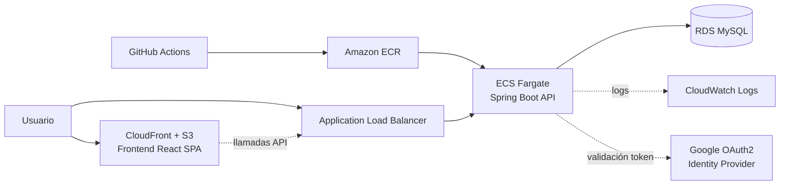

# Spec 01 — Arquitectura en AWS

## Resumen de la decisión
Arquitectura de contenedores gestionados (**ECS Fargate**) en vez de Kubernetes/EKS
(demasiado overhead operativo y de costo para 15 usuarios) y en vez de un único EC2
monolítico (menos representativo de prácticas cloud-native actuales, aunque se documenta
como alternativa de bajo costo en la sección de presupuesto).

## Componentes y justificación

| Componente | Servicio AWS | Por qué |
|---|---|---|
| Frontend (SPA) | S3 + CloudFront | Estático tras el build de Vite. No necesita servidor: más barato y más simple que contenerizarlo en producción. HTTPS y CDN gratis/casi gratis a este volumen. |
| API backend | ECS Fargate | Serverless de contenedores: no se administran instancias EC2. Escala horizontalmente cambiando el número de tareas — punto de partida natural para "pensado para escalar". |
| Balanceo | Application Load Balancer | Termina TLS, enruta a las tareas de Fargate, healthchecks. Necesario para exponer Fargate de forma estándar. |
| Base de datos | RDS MySQL (Single-AZ, db.t3.micro) | Gestionado: backups automáticos, parches, snapshots. Single-AZ es suficiente para una demo; Multi-AZ queda documentado como paso de escalado. |
| Registro de imágenes | Amazon ECR | Almacena las imágenes construidas en CI (compatibles con Podman/OCI) antes de desplegarlas. |
| Infra as Code | Terraform | Reproducible, versionado, y es la herramienta más pedida en el mercado (relevante para el objetivo del portafolio). |
| CI/CD | GitHub Actions | Build, test, construcción de imagen y despliegue automatizado en cada merge a la rama del reto. |
| Secretos | AWS Secrets Manager (o SSM Parameter Store para reducir costo) | Credenciales de RDS, `client_secret` de Google OAuth y clave de firma JWT fuera del código y de las variables de entorno planas. |
| Identity Provider externo | Google OAuth 2.0 (bonus) | El backend valida el `id_token` de Google, verifica el dominio `@udea.edu.co` y emite su propio JWT. No se administra almacén de contraseñas propio. |

## Decisión de red: sin NAT Gateway

Un NAT Gateway cuesta ~32 USD/mes fijos solo por existir, más cargos por GB procesado —
con 200 USD de crédito total, es el error de presupuesto más común y evitable.

**Decisión**: las tareas de Fargate corren en **subred pública** con IP pública asignada,
pero el Security Group solo permite tráfico entrante desde el Security Group del ALB
(nunca desde internet directamente). RDS permanece en subred privada, solo accesible
desde el Security Group de las tareas del backend. Esto evita el NAT Gateway sin exponer
la base de datos ni el backend directamente a internet.

| Alternativa descartada | Motivo |
|---|---|
| Fargate en subred privada + NAT Gateway | +32 USD/mes fijos, no aporta seguridad adicional relevante a esta escala frente a Security Groups bien definidos |
| VPC Endpoints para ECR/S3 en vez de NAT | Válido, pero cada Interface Endpoint (~7 USD/mes) no compensa frente al costo de la IP pública (~3.6 USD/mes) a este volumen |

## Estimación de costos (us-east-1, on-demand)

| Recurso | Configuración | Costo aprox./mes |
|---|---|---|
| ECS Fargate | 1 tarea, 0.5 vCPU / 1 GB, 24/7 | ~18 USD |
| Application Load Balancer | 1 ALB, tráfico bajo | ~20 USD |
| IP pública de la tarea | 1 ENI pública | ~3.6 USD |
| RDS MySQL | db.t3.micro, Single-AZ, 20 GB | ~14 USD |
| S3 + CloudFront | <1 GB almacenamiento, tráfico bajo | ~2 USD |
| ECR | <1 GB de imágenes | ~1 USD |
| CloudWatch Logs | Retención 7 días | ~2 USD |
| **Total corriendo 24/7** | | **~60 USD/mes** |

Con 200 USD de crédito, esto da ~3.3 meses corriendo permanentemente. Recomendación
práctica: **detener el servicio de ECS (0 tareas) y detener la instancia RDS** cuando no
se esté demostrando activamente (RDS admite detención hasta 7 días seguidos). Esto reduce
el consumo a prácticamente el costo de almacenamiento (RDS + S3 + ECR ≈ 3-4 USD/mes),
estirando el crédito varios meses. Documentar y automatizar este apagado/encendido con
un script o workflow es en sí mismo una buena práctica de FinOps para mencionar en el
proceso de selección.

## Entornos
Dado el presupuesto, un solo entorno (`prod`, usado también como demo). El entorno local
con Podman cumple el rol de `dev`. Si el proyecto crece, el siguiente paso natural es
duplicar el módulo de Terraform con un `terraform.tfvars` distinto para `staging`.

## Camino de escalado (documentado, no implementado en esta fase)
- RDS: Single-AZ → Multi-AZ, y luego réplica de lectura si el reporting crece
- ECS: ajustar `desired_count` y añadir Application Auto Scaling por CPU/memoria
- CloudFront: ya está listo para más tráfico sin cambios
- Cache: añadir ElastiCache (Redis) si aparecen consultas repetitivas costosas
  (ej. Top 5 de equipos más reservados con TTL de minutos)
