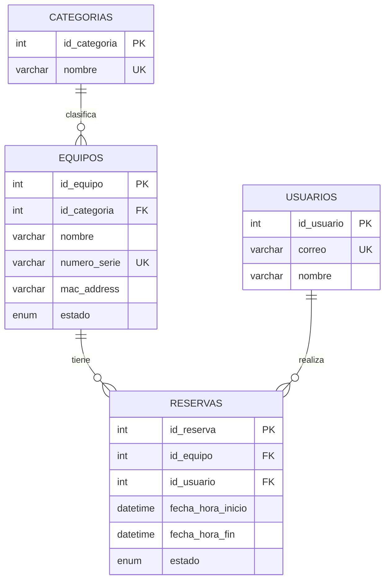

# Spec 04 — Base de datos

## Esquema
El modelo entidad-relación completo (tablas, tipos, relaciones, índices) está
definido y versionado en [`schema_reservas_lis.sql`](../../schema_reservas_lis.sql).
Este documento cubre cómo se **gestiona el ciclo de vida** del esquema, no su
estructura tabla por tabla.

## Tablas del módulo de administración y auxiliar

Añadidas en `V8`–`V10`:

| Objeto | Migración | Notas |
|---|---|---|
| `usuarios.rol` | `V8` | `ENUM('ESTUDIANTE','AUXILIAR','ADMIN') NOT NULL DEFAULT 'ESTUDIANTE'` + `idx_usuarios_rol`. El mínimo privilegio es el valor por defecto: el privilegio se otorga, nunca se hereda. |
| `sanciones` | `V9` | Ventana de validez (`fecha_inicio`, `fecha_fin`), `estado ACTIVA/LEVANTADA`, `origen MANUAL/AUTOMATICA`, autoría de creación y de levantamiento. Índice `idx_sanciones_vigencia (id_usuario, estado, fecha_fin)`, en el orden exacto del predicado que corre en cada intento de reserva. |
| `reservas.estado_prestamo` | `V10` | `ENUM('PENDIENTE','ENTREGADO','DEVUELTO','NO_RECLAMADO')` más fechas y responsables de entrega y devolución. Índice `idx_reservas_agenda`. |

**La vigencia de una sanción no se almacena**: se deriva con
`estado = 'ACTIVA' AND fecha_fin > NOW()`. No hay estado `EXPIRADA` ni job de
expiración que pueda dejar de correr. Ver
[ADR 0007](../adr/0007-sanciones-como-filas-con-vigencia-derivada.md).

**`estado_prestamo` es una columna aparte de `estado`**, no un valor más de
aquel `ENUM`. `reservas.estado` es lo que leen la consulta de solape, la view
`estadisticas_equipos_top` y el índice `idx_reservas_conflicto`; ampliarlo
habría hecho que esas consultas dejaran de ver filas **en silencio**. Ver
[ADR 0006](../adr/0006-prestamo-en-columna-aparte-de-la-reserva.md).

## Modelo de dominio: resumen conceptual


**Principios de diseño**:
- **Simplicidad**: solo 4 tablas de dominio + 1 opcional de auditoría. El
  enunciado no exige unidades físicas individuales, sanciones, mantenimientos ni
  auxiliares — modelarlas sería sobre-ingeniería.
- **Correo como identidad**: el usuario se identifica por `correo` UNIQUE. Al
  crear una reserva, si el correo no existe se crea el registro; si existe, se
  reutiliza. En el bonus con Google SSO, el correo llega verificado por Google.
- **Estado en el equipo, no en cada unidad**: `equipos.estado` refleja si el
  equipo está fuera de servicio (`mantenimiento`/`baja`). La ocupación puntual
  se deriva de las reservas activas cuya franja incluye "ahora", no de un
  campo persistido — así se evita mantener sincronización manual entre tabla y
  reservas.
- **Reserva cancelada no se borra**: se marca `estado='cancelada'` para
  preservar historial (auditoría + estadísticas honestas).

## Validación de conflicto: a nivel de aplicación, no de base
MySQL 8 no soporta constraints de exclusión temporal (como `EXCLUDE USING GIST`
de PostgreSQL). La validación de solape se hace en la capa de servicio, dentro
de una transacción, con `SELECT ... FOR UPDATE` sobre las reservas activas del
equipo — bloquea a otros escritores hasta el commit y previene la condición de
carrera. El índice compuesto `(id_equipo, estado, fecha_hora_inicio, fecha_hora_fin)`
hace esta consulta barata.

Se descartó PostgreSQL (que sí ofrece constraint nativa de no-solape) para
mantener coherencia con el resto del stack ya elegido (RDS MySQL económico y
familiar). Queda documentado como opción si en el futuro la lógica de solape se
vuelve crítica en volumen.

## Migraciones versionadas: Flyway

> **Una migración aplicada es inmutable.** Editar un `V*.sql` ya ejecutado
> rompe su checksum y el arranque falla con `Validate failed`. Los datos
> nuevos van siempre en una versión nueva; `V7` existe justamente porque `V5`
> se había editado a mano después de aplicarse.

Se elige Flyway sobre Liquibase por su integración directa y sin fricción con
Spring Boot (`spring-boot-starter-flyway` aplica migraciones al arrancar) y
porque el esquema se escribe en SQL puro, que es exactamente el formato en el
que ya está diseñado.

```
src/main/resources/db/migration/
├── V1__init_categorias_equipos.sql
├── V2__init_usuarios.sql
├── V3__init_reservas.sql
├── V4__indices_conflicto_y_top.sql
└── V5__seed_datos_iniciales.sql
```

Regla de oro: **una migración aplicada nunca se edita**, solo se agregan nuevas
(`V6__`, `V7__`...). Corregir un error de una migración ya aplicada en
producción se hace con una migración nueva, nunca reescribiendo el archivo
histórico — esto es lo que hace que Flyway sea confiable en equipo.

## Índices críticos
- `equipos(id_categoria)` y `equipos(estado)` — filtros del listado
- `reservas(id_equipo, estado, fecha_hora_inicio, fecha_hora_fin)` — validación
  de solape y filtros por rango de fechas
- `reservas(id_usuario)` — vista "Mis reservas"
- `reservas(id_equipo, estado)` — Top 5 más reservados
- `usuarios(correo)` — UNIQUE + lookup por correo

## Entornos
Dado el presupuesto, hay una sola instancia RDS ("producción/demo"). El entorno
local usa un contenedor MySQL (Podman) con las mismas migraciones de Flyway,
garantizando que lo que se prueba en local es exactamente lo que corre en AWS.

| Entorno | Motor | Datos |
|---|---|---|
| Local (Podman) | MySQL 8 en contenedor | Seed de prueba (`V5__seed_datos_iniciales.sql`) |
| AWS (RDS) | MySQL 8, db.t3.micro | Mismo seed para la demo |

## Backups
RDS con backups automáticos diarios (retención 7 días). Antes de cualquier
migración nueva en producción, se toma un snapshot manual adicional.

## Pool de conexiones
HikariCP (por defecto en Spring Boot) con `maximum-pool-size` bajo (5–10) —
suficiente para 15 usuarios concurrentes y evita agotar las conexiones
disponibles de un `db.t3.micro`, que son limitadas.

## Datos semilla para la demo
`V5__seed_datos_iniciales.sql` crea:
- Categorías: *Microcontroladores*, *VR*, *Redes*, *Impresión 3D*
- ~10 equipos repartidos entre las categorías, con estados variados
- 2–3 usuarios de ejemplo con correo `@udea.edu.co`
- 3–5 reservas de ejemplo (algunas pasadas, alguna futura, alguna cancelada)
  para que las estadísticas y filtros tengan algo que mostrar
