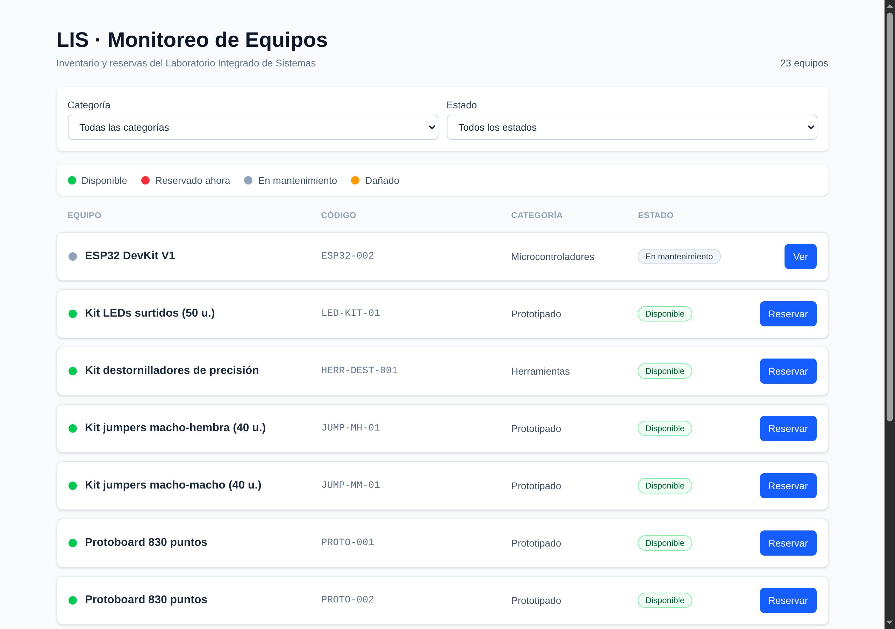
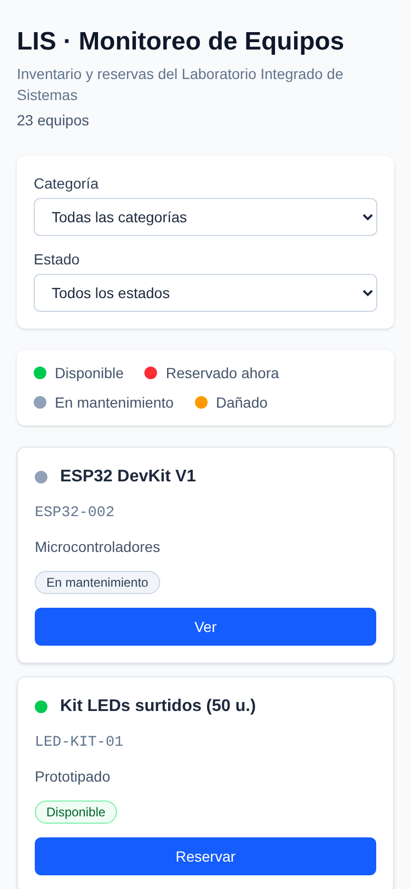
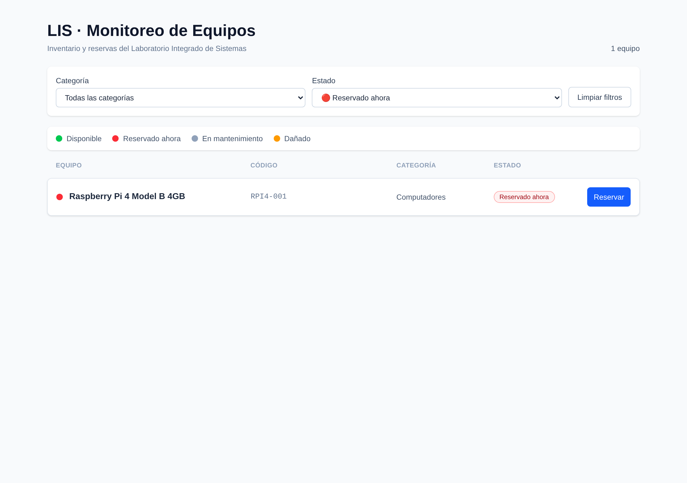
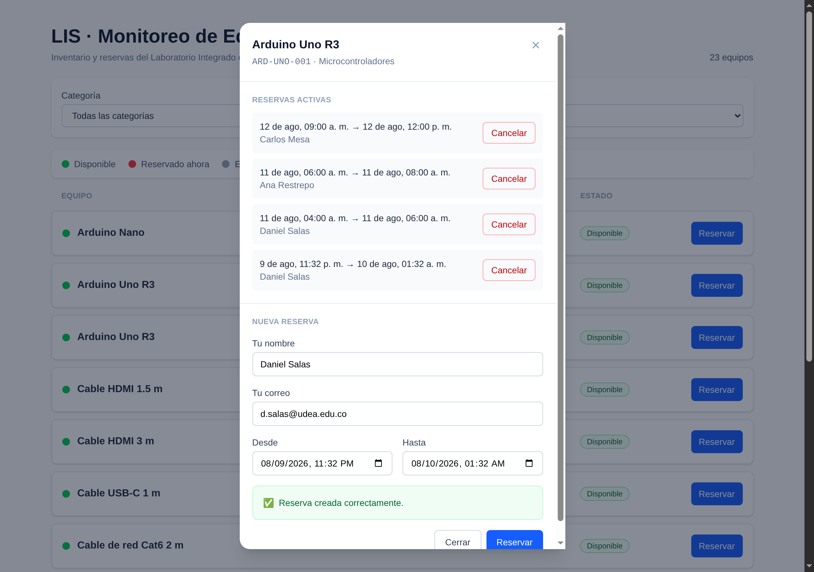

# LIS · Tablero de Monitoreo de Equipos

## ¿Qué es esto?

Una página web que muestra, de un vistazo, **qué equipos tiene el laboratorio
y cuáles están libres ahora mismo**: Arduinos, ESP32, Raspberry Pi,
protoboards, kits de jumpers, cables, crimpadoras, destornilladores y testers.
Además permite **reservar** un equipo durante un horario y **cancelar**
reservas.

Es la cara visible de la API construida en el Reto 2: esta página no guarda
nada por su cuenta, solo muestra y envía.

Entrega del **Reto 3** de la prueba técnica.

> **¿Nunca has visto un proyecto de frontend?** No hace falta. Este README te
> lleva de la mano paso a paso, y **explica cada término la primera vez que
> aparece**.

---

## Cómo se ve

### En computador



Se ve una **tabla**: el título con el número total de equipos, los filtros en
una fila, la leyenda de colores, y cada equipo en una línea con su punto de
color, nombre, código, categoría, estado y botón.

Fíjate en el segundo equipo: el ESP32-002 tiene el punto **gris** y su botón
dice *"Ver"* en vez de *"Reservar"*, porque está en mantenimiento.

### En celular



La misma información **cambia de forma**: cada equipo pasa a ser una tarjeta
apilada, los filtros se ponen uno debajo de otro y los botones ocupan todo el
ancho para poder tocarlos con el dedo.

No es la misma tabla encogida: es una disposición distinta, pensada para una
pantalla estrecha.

### Filtrar por color



El desplegable de estado ofrece **los cuatro colores de la leyenda**, así que
filtrar es tan intuitivo como mirar la pantalla: si ves puntos rojos, pides
"solo los rojos". Aquí se ve el filtro *Reservado ahora* dejando únicamente la
Raspberry Pi, con el contador ajustado a "1 equipo".

### El panel de reservas (y el manejo de errores)



Al pulsar el botón de un equipo se abre este panel, que muestra sus reservas
activas (con su botón de cancelar) y un formulario para crear una nueva.

En la captura se ve **lo más importante del proyecto**: alguien pidió un
horario que ya estaba ocupado, y en vez de un error técnico o una pantalla
rota aparece un aviso rojo que dice qué pasó y qué hacer:

> ⚠️ *Ese horario ya está ocupado. Elige otro o revisa las reservas activas
> del equipo.*

---

## Ponerlo en marcha

### Antes de empezar necesitas dos cosas

**1. Node.js** — el programa que permite ejecutar JavaScript fuera del
navegador. Para saber si ya lo tienes, abre una terminal y escribe:

```bash
node --version
```

Si responde algo como `v26.2.0`, ya lo tienes. Si dice "command not found",
descárgalo de <https://nodejs.org> (la versión "LTS").

**2. El backend del Reto 2 encendido.** Esta página no tiene datos propios:
se los pide a la API. Si el backend está apagado, verás un mensaje claro
diciéndolo (no una pantalla en blanco), pero no habrá equipos que mostrar.

Para encenderlo, desde la carpeta del backend:

```bash
docker compose up -d
docker compose exec api python -m app.datos_ejemplo   # carga equipos de ejemplo
```

### Los tres pasos

```bash
# 1. Entrar en la carpeta e instalar las dependencias
cd frontend
npm install

# 2. Encender el proyecto
npm run dev

# 3. Abrir en el navegador
#    http://localhost:5173
```

Sabrás que está listo cuando la terminal muestre:

```
  VITE v8.2.1  ready in 116 ms
  ➜  Local:   http://localhost:5173/
```

**Deja esa terminal abierta**: ahí es donde el proyecto está corriendo. Para
apagarlo, `Ctrl + C`.

> **¿Qué hace `npm install`?** Descarga las librerías que el proyecto necesita
> (React, Tailwind…) en una carpeta llamada `node_modules`. Solo hay que
> hacerlo la primera vez. Esa carpeta no se sube al repositorio porque pesa
> mucho y se puede regenerar con ese mismo comando.

---

## Probarlo en 2 minutos

1. **Mira los colores.** Ve a la página 2 con el botón *Siguiente*. Verás un
   ESP32 en **gris** (mantenimiento) y un tester en **ámbar** (dañado).

2. **Filtra.** Elige *Herramientas* en el desplegable de categoría. La lista
   se reduce **al instante, sin que la página se recargue**, y el contador de
   arriba pasa de 24 a 5.

   Prueba también el filtro de estado *🔴 Reservado ahora*: deja solo los
   equipos que alguien tiene ocupados en este preciso momento.

3. **Reserva un equipo.** Pulsa *Reservar* en cualquier equipo verde, rellena
   tu nombre y correo, deja el horario que viene sugerido y pulsa *Reservar*.
   Debe salir un aviso **verde** de confirmación.

4. **Provoca el error a propósito.** Vuelve a pulsar *Reservar* en el **mismo**
   equipo y pide **el mismo horario** que acabas de reservar. Ahora debe salir
   un aviso **rojo** explicando que ese horario está ocupado. *Este es el
   requisito 6 del enunciado.*

5. **Cancela.** Pulsa *Cancelar* junto a esa reserva y acepta. Desaparece de
   la lista y su horario queda libre otra vez.

---

## Los cuatro colores

| Color | Significa | Cuándo aparece |
|---|---|---|
| 🟢 Verde | Disponible | Está operativo y libre en este momento |
| 🔴 Rojo | Reservado ahora | Alguien lo tiene reservado **en este instante** |
| ⚪ Gris | En mantenimiento | Lo están revisando; no se presta |
| 🟠 Ámbar | Dañado | Está averiado; no se presta |

### El detalle interesante: el rojo se calcula

La API **no guarda** un estado "reservado". Solo guarda tres: `DISPONIBLE`,
`MANTENIMIENTO` y `DAÑADO`.

¿Por qué? Porque si "reservado" fuera un dato guardado, alguien tendría que
acordarse de cambiarlo **cuando empieza cada reserva y cuando termina**. En
cuanto se olvidara una vez, el sistema estaría mintiendo: un equipo marcado
como reservado cuya reserva terminó hace tres días.

Así que esta página lo **deduce**: pide la lista de reservas activas y marca
en rojo los equipos que tengan una reserva cuyo horario incluya este preciso
instante. De ese modo el dato nunca puede quedar desactualizado.

**El orden de prioridad importa** (gana el primero que se cumple):

```
   1. ¿está en mantenimiento?      → ⚪ Gris
   2. ¿está dañado?                 → 🟠 Ámbar
   3. ¿tiene reserva ahora mismo?    → 🔴 Rojo
   4. si no                           → 🟢 Verde
```

El estado físico **manda sobre** las reservas: si un equipo se rompió, se
muestra dañado aunque alguien lo hubiera reservado antes. Pintarlo de rojo
haría pensar que se lo llevó una persona, cuando en realidad está averiado en
un cajón.

> **Detalle honesto:** el color no se refresca solo con el paso del tiempo. Se
> recalcula cada vez que se piden datos: al abrir la página, al filtrar, al
> cambiar de página y después de reservar o cancelar.

---

## Configuración

**No hace falta configurar nada** para el uso normal.

| Ajuste | Para qué sirve | Valor por defecto |
|---|---|---|
| `VITE_API_URL` | La dirección a la que se le piden los datos | `/api` |

Está en [`.env.example`](.env.example). Solo hay que crear un archivo `.env`
propio si quieres apuntar a un backend distinto.

### Por qué la dirección es `/api` y no `http://localhost:8000`

Aquí hay un problema real que conviene entender.

Los navegadores tienen una regla de seguridad llamada **CORS** que impide que
una página cargada desde una dirección llame a un servidor de **otra**
dirección, salvo que ese servidor lo autorice explícitamente.

Nuestra página vive en `localhost:5173` y la API en `localhost:8000`:
direcciones distintas. El navegador **bloquearía todas las llamadas**.

La solución está en [`vite.config.js`](vite.config.js): un **proxy**. Le
decimos a Vite que todo lo que empiece por `/api` lo reenvíe él mismo al
backend.

```
   SIN proxy (bloqueado)          CON proxy (funciona)
   ─────────────────────          ────────────────────
   navegador ──✗──► :8000         navegador ──► :5173 ──► :8000
             CORS                        (misma dirección)  (lo reenvía Vite,
                                                             que no es un
                                                             navegador y no
                                                             aplica CORS)
```

Para el navegador **todo viene de la misma dirección**, así que no hay nada
que bloquear.

Se eligió así porque es solo configuración del frontend y **no obliga a tocar
el backend del Reto 2**, que ya estaba terminado. Para un despliegue real, lo
correcto sería añadir el permiso CORS en el backend (unas 3 líneas).

---

## Estructura de carpetas

```
frontend/
├── src/                       ← todo el código
│   ├── main.jsx                 Enciende la aplicación (3 líneas)
│   ├── App.jsx                   Arma la página
│   ├── index.css                  Estilos base de Tailwind
│   ├── api.js                      TODAS las llamadas al backend
│   ├── estado.jsx                   Los datos compartidos entre componentes
│   └── componentes/
│       ├── Tablero.jsx               La pantalla principal
│       ├── PanelFiltros.jsx           Los desplegables de filtro
│       ├── ListaEquipos.jsx            La lista y los botones de página
│       ├── TarjetaEquipo.jsx            UN equipo con su color
│       ├── ModalReserva.jsx              El panel emergente
│       └── Aviso.jsx                      Mensajes de error/éxito/carga
├── docs/                      ← especificación, plan, tareas y capturas
├── index.html                 ← la página vacía donde React se dibuja
├── vite.config.js             ← configuración, incluye el puente al backend
├── package.json               ← dependencias y comandos
└── .env.example               ← plantilla de configuración
```

**Seis componentes y dos archivos de apoyo.** Cada nombre dice lo que hace.

> **¿Qué es un componente?** Una pieza de la pantalla escrita como una
> función, con su aspecto y su comportamiento juntos. Como una pieza de LEGO:
> `TarjetaEquipo` sabe dibujar *un* equipo, y se reutiliza doce veces para
> dibujar los doce equipos de la página.

**Por qué tan pocos:** el proyecto tiene una sola pantalla. Repartir el código
en más capas obligaría a abrir cinco archivos para seguir una acción de diez
líneas.

---

## Qué herramientas usa y por qué

| Herramienta | Qué es | Por qué esta y no otra |
|---|---|---|
| **React** | Librería para construir interfaces por piezas | Pedida por el enunciado |
| **Vite** | Prepara el proyecto y levanta el servidor de desarrollo | Create React App, la alternativa clásica, está **oficialmente descontinuada** y reconstruía el proyecto entero en cada cambio |
| **Tailwind CSS** | Estilos escribiendo clases pequeñas en el propio HTML | El diseño adaptable se escribe en la misma línea (`md:` = "a partir de pantalla mediana"), sin saltar a otro archivo |
| **`fetch`** | La función del navegador para pedir datos por red | Se descartó `axios`: el proyecto hace **cuatro** llamadas, y una librería para eso es desproporcionada. Además `fetch` deja a la vista un detalle que conviene entender (abajo) |
| **`useState` / `useContext`** | La memoria y los datos compartidos, que ya trae React | Se descartaron Redux y Zustand: resuelven el problema de compartir datos entre docenas de pantallas, y aquí hay **una** |

---

## Las dos cosas difíciles, explicadas

### 1. La trampa de `fetch`

> **`fetch` NO considera un error que el servidor responda 404, 409 o 422.**

Para `fetch`, "el servidor me contestó" ya cuenta como éxito, **aunque la
respuesta sea un rechazo rotundo**. Solo falla de verdad si no pudo hablar con
el servidor (está apagado, no hay red).

```js
const respuesta = await fetch('/api/reservas', { method: 'POST', ... })
// Si el backend respondió 409, AQUÍ NO PASA NADA. El programa sigue
// tan tranquilo como si todo hubiera ido bien.

if (!respuesta.ok) {   // ← hay que comprobarlo A MANO
  ...
}
```

Si esto se olvida, el programa cree que la reserva se creó, muestra la
confirmación y actualiza la lista... **cuando el backend la rechazó**. Es un
fallo silencioso y desconcertante.

Por eso **todas** las llamadas pasan por una única función en
[`src/api.js`](src/api.js), para que sea imposible olvidarlo en alguna.

### 2. El viaje completo de un error 409

Así llega el rechazo del backend hasta el ojo del usuario:

```
  ① EL BACKEND rechaza la reserva
     HTTP 409  { "detail": "El equipo ya tiene una reserva activa que se
                            cruza con esa franja horaria..." }
                        │
                        ▼
  ② api.js  · comprueba respuesta.ok → es false
             · lee el "detail"
             · LANZA un error propio que lleva dentro el número 409
                        │
                        ▼
  ③ ModalReserva  · tenía la llamada dentro de un try/catch
                   · el catch lo atrapa (sin esto, la página se colgaría)
                        │
                        ▼
  ④ mensajeAmigable(error)  · mira el número y elige el texto:
                               409 → "Ese horario ya está ocupado…"
                               422 → "Revisa los datos…"
                               404 → "No encontramos ese elemento…"
                               sin respuesta → "No pudimos conectar…"
                        │
                        ▼
  ⑤ Aviso  · dibuja el recuadro rojo dentro del panel
```

> **`try/catch`** significa *"intenta esto; si algo sale mal, no revientes:
> haz esto otro"*. Sin él, un error dejaría la página congelada o en blanco,
> que es justo lo que el enunciado prohíbe.

**Un detalle real que hay que manejar:** el backend devuelve el campo `detail`
de **dos formas distintas**:

| Error | Forma de `detail` |
|---|---|
| 404 y 409 | Un **texto** |
| 422 (datos mal escritos) | Una **lista** de objetos, uno por cada campo |

Si se diera por hecho que siempre es un texto, al llegar un 422 la pantalla
mostraría literalmente `[object Object]`.

**Y los mensajes se traducen, no se copian.** El backend dice *"El equipo ya
tiene una reserva activa que se cruza con esa franja horaria"* — correcto pero
técnico. La pantalla muestra *"Ese horario ya está ocupado. Elige otro o
revisa las reservas activas del equipo"*, que además dice **qué hacer**.

### 3. Filtrar por un estado que la API no conoce

El desplegable ofrece los cuatro colores, pero la API solo guarda tres
estados: para ella "disponible" y "reservado ahora" son **lo mismo**. Eso
obliga a dos caminos distintos:

| Filtro elegido | Cómo se resuelve |
|---|---|
| Ninguno, *En mantenimiento* o *Dañado* | La API hace todo el trabajo, **incluida la paginación**. Es el camino normal. |
| *Disponible* o *Reservado ahora* | La API no los distingue, así que se le piden **todos** los que ella considera disponibles y aquí se separan en dos grupos comparándolos con las reservas activas. Como ya no puede paginar por nosotros, la paginación se hace en el navegador. |

**Limitación aceptada:** ese segundo camino pide hasta 100 equipos de una vez
(el máximo de la API). Si el laboratorio superara los 100 equipos disponibles,
esos dos filtros solo considerarían los primeros 100. Con 24 va muy holgado, y
resolverlo del todo obligaría a recorrer varias páginas en cada carga.

---

## Documentación del proceso

El proyecto se construyó con **SDD**: primero se definió qué se iba a
construir, luego cómo, y solo entonces se escribió código.

| Documento | Qué contiene |
|---|---|
| [`docs/spec.md`](docs/spec.md) | **Qué** hace: las pantallas, los flujos, la regla de colores y 23 criterios para saber si está bien hecho |
| [`docs/plan.md`](docs/plan.md) | **Cómo** se construye: componentes, estado compartido, manejo de errores y estilos adaptables |
| [`docs/tasks.md`](docs/tasks.md) | Las 10 tareas, cada una con qué deberías ver en el navegador |

El historial de commits sigue esas tareas una por una.

---

## Qué incluye y qué no

**Incluido:** tablero con el inventario, indicadores de color, filtros por
categoría y por los cuatro estados de color (incluido "reservado ahora") sin
recargar la página, paginación, crear y cancelar reservas, manejo de errores
amigable y diseño adaptable a celular.

**No incluido:**

- **El cambio de idioma** (era un punto opcional). Quedó fuera por tiempo: la
  entrega era a mediodía y se priorizó dejar todo lo obligatorio terminado,
  verificado y documentado. Todos los textos están en español.
- **Registrar o editar equipos.** El enunciado pide *visualizar* el inventario
  y gestionar reservas. Dar de alta equipos es tarea del auxiliar y esa
  operación ya existe en la API.
- **Inicio de sesión**, porque la API tampoco lo tiene: cualquiera puede
  reservar indicando un nombre y un correo. Es una limitación heredada del
  Reto 2 y está documentada allí.
