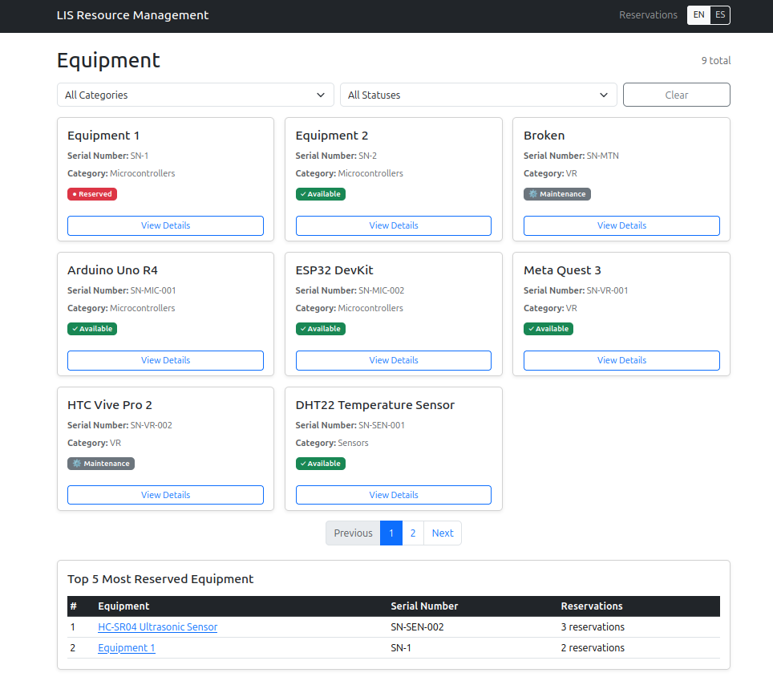

# LIS Resource Monitoring Dashboard

Frontend application for managing laboratory equipment and reservations at the LIS (Laboratorio Integrado de Sistemas). Consumes the Spring Boot REST API for inventory and reservation management.

## Technologies

| Category | Technology |
|---|---|
| Framework | Vue 3 |
| Language | TypeScript |
| Build Tool | Vite |
| HTTP Client | Axios |
| Routing | Vue Router 4 |
| Styling | Bootstrap 5 |
| i18n | vue-i18n (Spanish / English) |
| Package Manager | pnpm |

## Requirements

- **Node.js 22+**
- **pnpm** (`npm install -g pnpm`)

## Backend Dependency

The **Spring Boot backend must be running** at `http://localhost:8080` before starting the frontend. Start it with:

```bash
# From the project root
docker compose up -d
```

## Installation

```bash
pnpm install
```

## Environment Variables

Copy the example environment file:

```bash
cp .env.example .env
```

| Variable | Default | Description |
|---|---|---|
| `VITE_API_URL` | `http://localhost:8080/api` | Backend API base URL |

The default works out of the box if the backend runs on port 8080.

## Development

```bash
pnpm dev
```

Opens at `http://localhost:5173`. Hot-reload enabled.

## Production Build

```bash
pnpm build
```

Output goes to `dist/`. Serve the `dist/` directory with any static file server (nginx, `serve`, etc.).

### Docker Setup

When running via Docker Compose (`docker compose up -d` from the project root), the frontend is built and served differently:

- The [Dockerfile](./Dockerfile) builds the app with `VITE_API_URL=/api` — the root-relative path means all API calls stay same-origin.
- An **Nginx** container serves the built files and proxies `/api/*` requests to the backend service (`http://backend:8080`).
- The frontend is exposed on the host port configured in `docker-compose.yml` (default **8081**).

In this mode the `.env` file and `VITE_API_URL` variable are not needed — everything is wired through Nginx.

## Features

### Equipment Dashboard
- Browse all laboratory equipment in responsive cards
- Color-coded status badges (green=Available, red=Reserved, gray=Maintenance)
- Filter by category and status with no page reload
- Paginated results with previous/next navigation

### Equipment Detail
- Full equipment information (name, serial number, MAC address, category, status, timestamps)
- View all reservations for the selected equipment
- Create new reservations directly from the detail page

### Reservations
- Create reservations with client-side validation (required fields, email format, start < end)
- Automatic user creation — enter name and email, the system creates or finds your account
- Conflict detection — user-friendly message when equipment is already booked (HTTP 409)
- List all reservations across all equipment
- Cancel reservations with confirmation dialog
- Logical cancellation (status changes to CANCELLED)

### Internationalization
- Full Spanish and English support
- Switch languages dynamically without page reload
- Language preference saved to localStorage
- All user-facing text centralized in JSON translation files
- Ready to add more languages — just create a new JSON file

### Responsive Design
- Works on desktop, tablet, and mobile
- Collapsible navigation bar
- Stacked cards on small screens
- Scroll-friendly tables

## Project Structure

```
frontend/
├── public/
├── src/
│   ├── components/
│   │   ├── EquipmentCard.vue
│   │   ├── EquipmentFilters.vue
│   │   ├── EquipmentStatusBadge.vue
│   │   ├── EmptyState.vue
│   │   ├── ErrorAlert.vue
│   │   ├── LoadingState.vue
│   │   ├── Pagination.vue
│   │   ├── ReservationForm.vue
│   │   └── ReservationList.vue
│   ├── views/
│   │   ├── DashboardView.vue
│   │   ├── EquipmentDetailView.vue
│   │   └── ReservationsView.vue
│   ├── services/
│   │   ├── api.ts
│   │   ├── equipmentService.ts
│   │   ├── reservationService.ts
│   │   └── userService.ts
│   ├── types/
│   │   ├── equipment.ts
│   │   ├── reservation.ts
│   │   ├── user.ts
│   │   └── api.ts
│   ├── i18n/
│   │   ├── en.json
│   │   ├── es.json
│   │   └── index.ts
│   ├── router/
│   │   └── index.ts
│   ├── App.vue
│   ├── main.ts
│   └── vite-env.d.ts
├── .env.example
├── package.json
└── vite.config.ts
```
