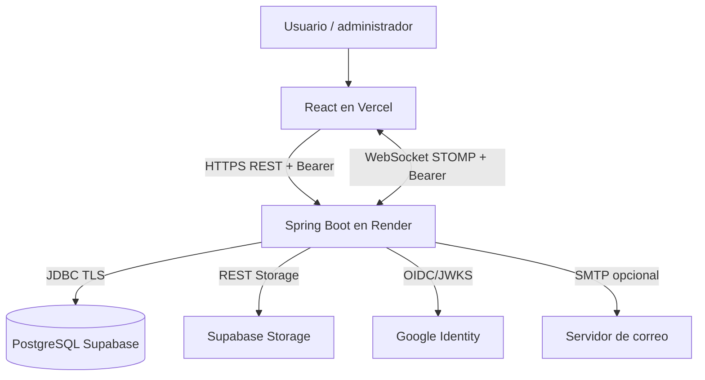
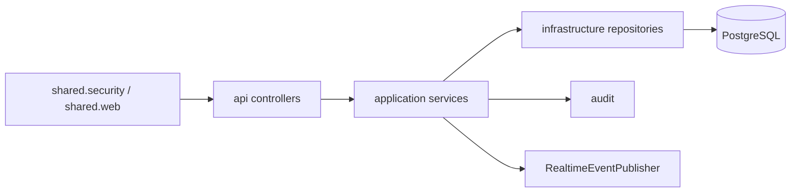
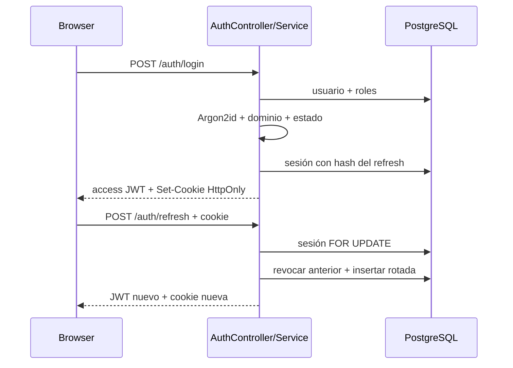
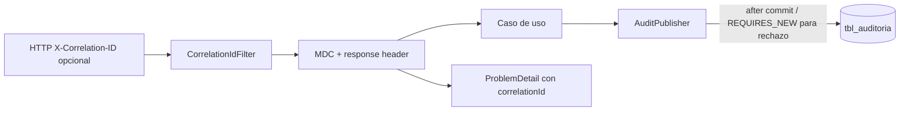
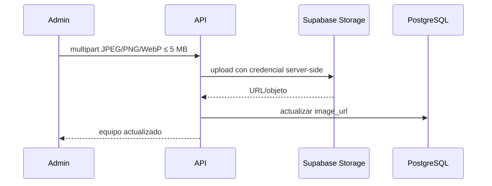
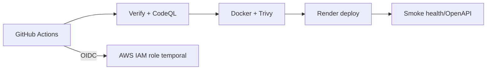
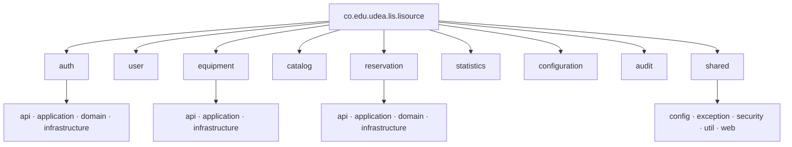
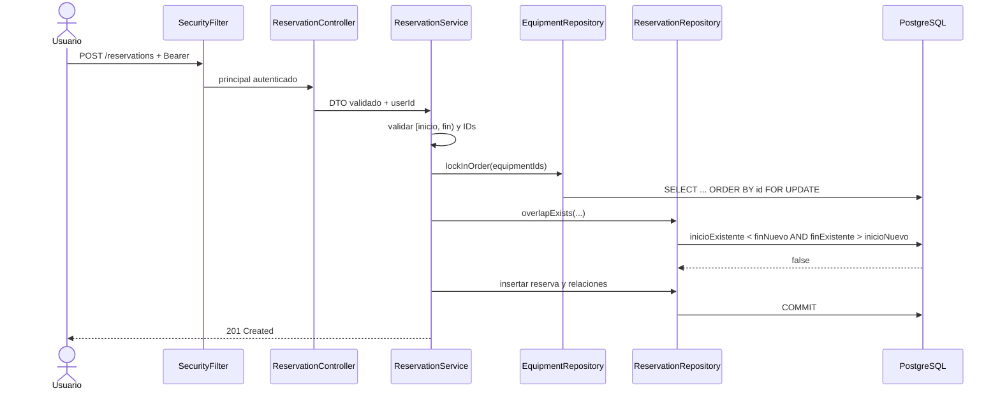
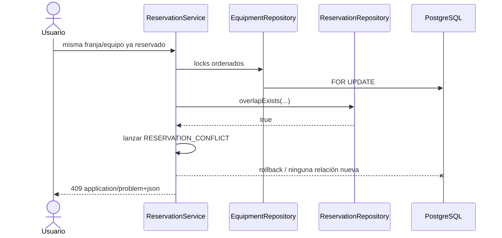
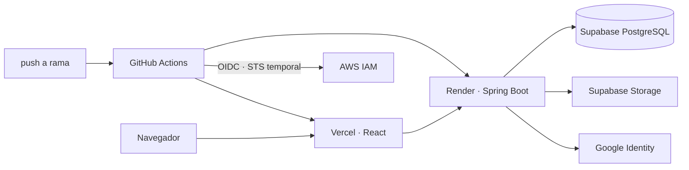

# Arquitectura backend

[← Volver al README](../../README.md)

## Contexto y contenedores

## Componentes y paquetes

Features reales: `auth`, `user`, `equipment`, `catalog`, `reservation`, `statistics`, `configuration`, `audit` y `shared`. `api` traduce HTTP/DTO; `application` coordina reglas/transacciones; `domain` contiene agregados donde son útiles; `infrastructure` ejecuta JDBC o integra proveedores.

## Mapeo conceptual a puertos y adaptadores

| Concepto | Correspondencia | Límite |
|---|---|---|
| Adaptador de entrada | Controllers REST y handshake STOMP | dependen de Spring MVC/Security |
| Casos de uso | Services de `application` | varios reciben repositorios concretos, no interfaces |
| Dominio | `UserAccount`, `ReservationAggregate`, `SessionRecord` | no todos los módulos requieren objetos de dominio |
| Adaptador de salida | repositorios `JdbcClient`, `GoogleIdTokenVerifier`, notifiers, Storage | algunos puertos sí son interfaces (`GoogleTokenVerifier`, `PasswordRecoveryNotifier`, `EquipmentImageStorage`) |

Por eso se describe como monolito modular con separación inspirada en Clean/ports-and-adapters, no como hexagonal pura.

## Login, refresh y Google

Google sustituye la comprobación Argon2 por validación de ID token (issuer, audience, firma, expiración, `email_verified`) y luego aplica dominio, roles y sesión interna.

## Auditoría y correlation ID

## Imagen, deployment y CI/CD

Decisiones y alternativas: [ADR](adr/README.md).

## Paquetes Java reales

`shared` concentra infraestructura transversal, no reglas específicas de reservas o inventario. `audit` recibe eventos desde casos de uso; `statistics` consulta agregados; `catalog` y `configuration` administran referencias. Esta organización limita acoplamiento sin introducir la operación distribuida de microservicios.

## Crear una reserva

## Rechazar una reserva conflictiva

## Despliegue real

AWS solo valida identidad federada de CI; Terraform no crea hosting, red ni base de datos. La evolución a hexagonal pura requeriría puertos de repositorio/integración definidos fuera de `infrastructure`, inyección solo por interfaces y pruebas de aplicación sin Spring/JDBC.
