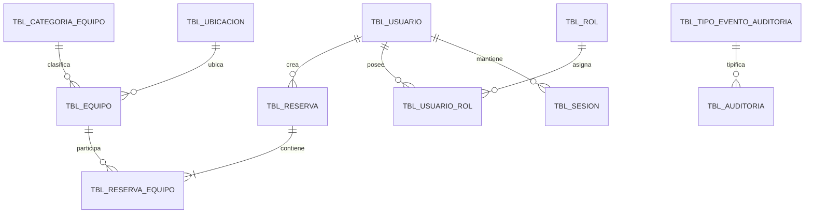

# Base de datos PostgreSQL

[← Volver al README](../../README.md)

> [!CAUTION]
> `01-estructura.sql` elimina y reconstruye objetos. No lo ejecute contra una base con información que deba conservarse.

## Orden obligatorio

1. `src/main/resources/db/01-estructura.sql`: estructura, PK/FK, `CHECK`, índices y RLS.
2. `02-semilla.sql`: estados, roles, idiomas, configuración y taxonomía de auditoría.
3. `03-pruebas.sql`: datos QA/demostración; no es una migración de producción.

| Script | Resultado esperado | Reejecución | Verificación segura |
|---|---|---|---|
| `01-estructura.sql` | recrea las 20 tablas, constraints, índices y habilita RLS | destructiva; repetir solo sobre base descartable | la consulta final lista exactamente las tablas LISource |
| `02-semilla.sql` | deja operativos 12 grupos de catálogos/configuración base | idempotente: usa `ON CONFLICT ... DO UPDATE` | revisar el resumen final por elemento |
| `03-pruebas.sql` | 12 usuarios, 30 equipos, 40 reservas y datos de seguridad/auditoría | no es idempotente de forma aislada; ejecutar después de reconstruir | resumen final y `Solapamientos confirmados: 0` |

Los tres archivos abren/cierra una transacción. En Supabase SQL Editor pegue el script completo y use **Run**; si dispone de `psql`, ejecute el mismo orden contra una base nueva. Un error provoca rollback de ese script: corrija la causa antes de continuar, no ejecute 02/03 sobre un 01 incompleto.

## Modelo conceptual

La imagen muestra identidad y roles, inventario/catálogos, reservas multi-equipo, configuración tipada y auditoría. `tbl_usuario_rol` y `tbl_reserva_equipo` resuelven relaciones N:M. Estados se normalizan en catálogos para conservar historia y evitar valores libres.

## Modelo lógico de 20 tablas

| Área | Tablas | Relaciones relevantes |
|---|---|---|
| Estados | `tbl_estado_registro`, `tbl_estado_usuario`, `tbl_estado_equipo`, `tbl_estado_reserva` | referenciadas por entidades con ciclo de vida |
| Identidad | `tbl_rol`, `tbl_idioma`, `tbl_usuario`, `tbl_usuario_rol` | usuario–rol N:M; idioma preferido |
| Credenciales | `tbl_sesion`, `tbl_recuperacion_password` | usuario 1:N; hashes, expiración y revocación |
| Inventario | `tbl_categoria_equipo`, `tbl_ubicacion`, `tbl_equipo` | categoría 1:N equipo; ubicación opcional |
| Reservas | `tbl_reserva`, `tbl_reserva_equipo` | usuario 1:N reserva; reserva–equipo N:M |
| Configuración | `tbl_categoria_configuracion`, `tbl_configuracion` | valores JSONB validados por aplicación |
| Auditoría | `tbl_nivel_auditoria`, `tbl_tipo_evento_auditoria`, `tbl_auditoria` | tipo→nivel y actor/correlation ID |

La normalización separa catálogos y relaciones; JSONB se limita a configuración y detalle de auditoría, donde la forma varía. PK numéricas, códigos únicos y FK aseguran identidad; índices cubren filtros, fechas, estados y correlation ID. RLS queda habilitado y el backend se conecta con un rol server-side adecuado: el frontend nunca posee credenciales PostgreSQL.

## Reservas

`tbl_reserva` conserva ventana, propietario, estado y cancelación. `tbl_reserva_equipo` permite reservar varios equipos. La regla de overlap se ejecuta en la transacción de aplicación tras bloquear filas de `tbl_equipo`; no depende de una lectura eventual.

Este diagrama resume relaciones centrales; la [imagen real](assets/database/modelo-relacional.png) y `01-estructura.sql` son la referencia completa de las 20 tablas.
