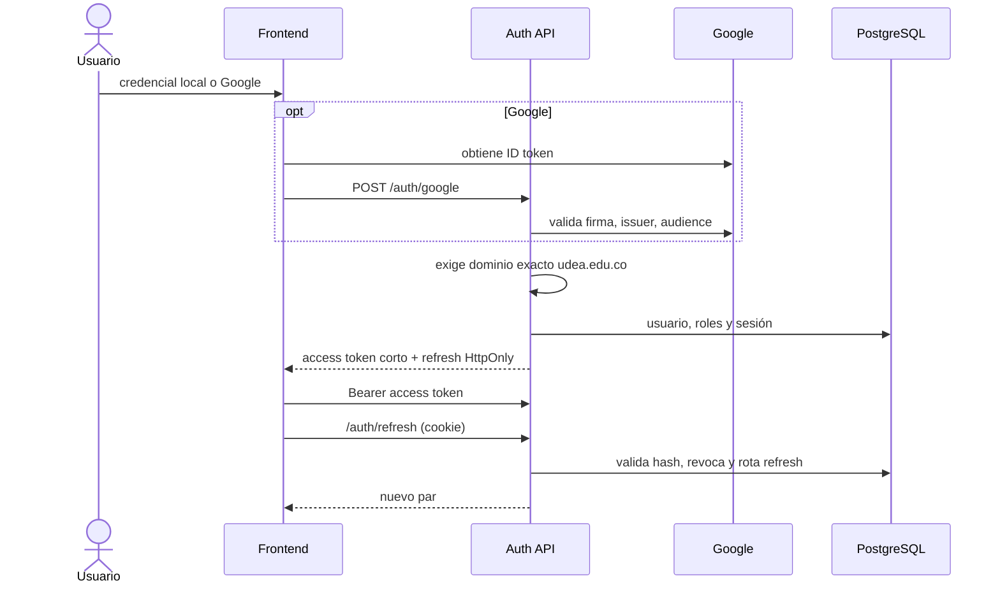

# Autenticación y seguridad

[Inicio](../../README.md) · [API](04-api-rest.md) · [ADR](adr/README.md)

## Modelo real

- Access JWT HS256: issuer configurado, `tokenUse`, `sid`, roles y rol activo; duración normal 15 minutos. El token para seleccionar rol dura 5 minutos.
- Refresh: valor opaco en cookie `HttpOnly`, `Secure` y `SameSite` configurables, restringida a `/api/v1/auth`; solo se persiste su hash y se rota al usarla.
- Contraseñas: Argon2. El correo debe pertenecer al dominio exacto `udea.edu.co`, no solo terminar en una cadena parecida.
- Autorización: Spring Security y `@PreAuthorize`; el backend decide, nunca la visibilidad del botón frontend.
- Entrada/salida: Bean Validation, SQL parametrizado, CORS allowlist, Problem Details y correlation ID. Imágenes se validan antes de enviarse a Storage.

## Logout sin afirmaciones falsas

`logout`, `logout-all`, revocación de sesión y rotación invalidan refresh tokens/sesiones. No existe blacklist de access tokens: un access JWT ya emitido sigue siendo criptográficamente válido hasta su expiración corta. Para acciones sensibles se combina vida corta, sesión identificada y autorización server-side; una revocación inmediata de access requeriría lista de denegación o introspección, con costo de estado/latencia.

## Threat model resumido

| Riesgo | Control implementado | Riesgo residual / operación |
|---|---|---|
| Robo de contraseña | Argon2, respuestas de recuperación no enumerativas | phishing y endpoint abuse requieren monitoreo/rate limit perimetral |
| XSS y robo de token | refresh HttpOnly; access solo en memoria del frontend | un XSS activo puede operar mientras la página está abierta; CSP es defensa recomendada |
| CSRF sobre refresh | SameSite, Secure en producción, path restringido, CORS/origin | mantener allowlist y proxy HTTPS correctos |
| Replay de refresh | hash persistido, rotación y revocación de sesión | investigar reuso/anomalías en auditoría |
| Escalada de privilegio | roles firmados, rol activo, `@PreAuthorize` y ownership | revisar nuevos endpoints por defecto-denegado |
| SQL injection | `JdbcClient`, parámetros y whitelist de ordenamiento | no concatenar filtros futuros |
| Doble reserva | transacción, locks ordenados y consulta de overlap | DB debe ser PostgreSQL y toda escritura pasar por el servicio |
| Archivo malicioso | validación de tipo/tamaño y Storage externo | antivirus/CDR sería endurecimiento adicional |
| Fuga de secretos | `.env` ignorado, GitHub OIDC sin keys AWS permanentes | rotar secretos externos y usar secret managers del proveedor |

## Configuración segura

Genere `JWT_SECRET_BASE64` con al menos 32 bytes aleatorios; no lo copie a documentación, Postman ni Git. En producción use HTTPS, `COOKIE_SECURE=true`, una allowlist CORS exacta, credenciales DB con mínimo privilegio y secretos administrados por Render/Supabase. El archivo `.env.example` solo contiene nombres y placeholders.

## Verificación

Las pruebas cubren política de dominio, Google, emisión/claims, RBAC, aislamiento por propietario, rotación/revocación y respuestas de error. Para controles operativos, pruebe además expiración, cookie en navegador, origen no permitido y revocación desde dos sesiones.
