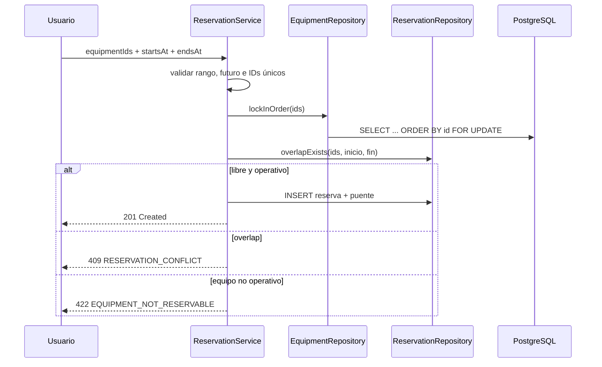

# Reservas y concurrencia

[← Volver al README](../../README.md)

## Semántica temporal

Los intervalos son `[inicio, fin)`: incluyen el inicio y excluyen el fin. La consulta usa:

```sql
r.fecha_inicio < :endsAt AND r.fecha_fin > :startsAt
```

Así `10:00–11:00` y `11:00–12:00` no se solapan; una ventana con `10:30–11:30` sí.

## Secuencia transaccional



El orden de locks reduce deadlocks. Una segunda transacción espera; cuando obtiene el lock observa la reserva confirmada por la primera. Para una reserva multi-equipo, cualquier conflicto lanza excepción y Spring revierte cabecera y relaciones: no queda persistencia parcial.

## Evidencia automática

- `ReservationServiceTest.rejectsEndEqualToOrBeforeStart` valida rango.
- `acceptsHalfOpenAdjacentRange` prueba adyacencia.
- `allowsAdjacentIntervalsAndRejectsOverlap` usa PostgreSQL real.
- `concurrentRequestsProduceExactlyOneSuccessAndOneConflict` exige un `201` y un `409`.
- `multiEquipmentConflictRollsBackAtomicallyAndCancelledDoesNotBlock` comprueba atomicidad y que canceladas no bloqueen.

El error `409` usa `application/problem+json`, código estable `RESERVATION_CONFLICT` y correlation ID.

