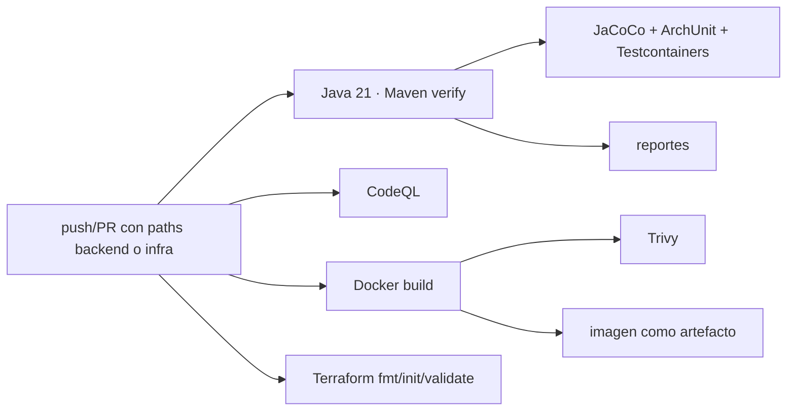

# DevSecOps backend

[Inicio](../../README.md) · [Cloud](12-cloud-y-deployment.md) · [Evidencias](14-evidencias.md)

El workflow `.github/workflows/backend-ci.yml` separa calidad, análisis, contenedor, seguridad, infraestructura y despliegue. Los path filters evitan gastar CI cuando solo cambia el frontend. CodeQL analiza Java; Trivy inspecciona filesystem/imagen según el job real; el build multi-stage demuestra reproducibilidad. Los artefactos se conservan para inspección sin publicar una imagen accidentalmente.

Terraform se valida con `fmt`, `init -backend=false` y `validate`; CI no ejecuta `apply`. El despliegue usa secretos del repositorio/proveedor y GitHub OIDC para credenciales AWS temporales donde aplica. No se documenta ningún CVE concreto sin un run verificable.

