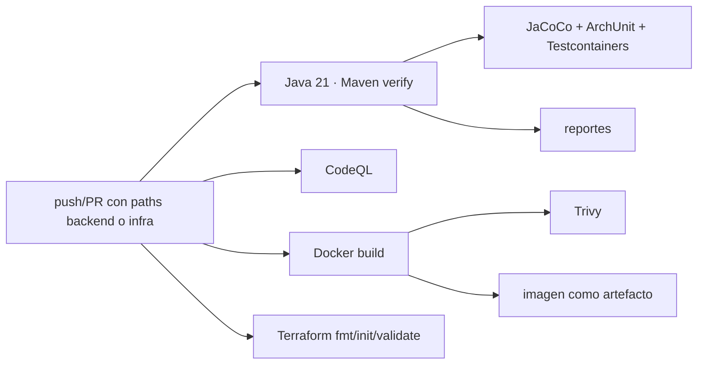

# DevSecOps backend

[Inicio](../../README.md) · [Cloud](12-cloud-y-deployment.md) · [Evidencias](14-evidencias.md)

El workflow `.github/workflows/backend-ci.yml` separa calidad, análisis, contenedor, seguridad, infraestructura y despliegue. Los path filters evitan ejecutar este pipeline cuando solo cambia el frontend.

| Job | Dependencia | Qué ejecuta | Qué demuestra / límite |
|---|---|---|---|
| Quality Gate | — | Java 21 + `./mvnw -B clean verify` | unitarias, integración, ArchUnit y JaCoCo; no publica porcentaje en README |
| CodeQL Java | Quality | análisis SAST Java | hallazgos del run; no equivale a pentest |
| Container | CodeQL | `docker build`, exporta imagen | Dockerfile reproducible; artefacto por un día |
| Trivy | Container | SARIF HIGH/CRITICAL + gate CRITICAL corregible | seguridad de la imagen concreta |
| Terraform Validate | Trivy | `fmt -check`, `init -backend=false`, `validate` | sintaxis/consistencia; **no ejecuta `plan` ni `apply`** |
| Render Deploy | Terraform | deploy hook en push a Reto 2 | solicita despliegue; depende del proveedor |
| Production Smoke | Deploy | health + OpenAPI con reintentos | comprueba disponibilidad básica e inventario en contrato |
| AWS OIDC Identity | Terraform | `AssumeRoleWithWebIdentity` y verificación STS | credenciales temporales; no despliega en AWS |

Los artefactos `lisource-backend-test-reports` y `lisource-backend-image` permiten inspeccionar la salida del run sin publicar una imagen accidentalmente. No se documenta ningún CVE concreto sin un run verificable.

## Activación, permisos y alcance

- `push`/`pull_request` apuntan a `1021805193-reto2` y filtran backend, `infra/aws-oidc` y workflow; `workflow_dispatch` es manual.
- Permiso global: `contents: read`. CodeQL/Trivy usan `security-events: write`; solo OIDC usa `id-token: write`.
- Render usa un deploy hook protegido. AWS recibe un JWT OIDC efímero y variables con ARN/región, no access keys persistentes.
- Deploy y smoke solo corren en push a la rama objetivo; un PR valida sin publicar producción.

Un run verde demuestra los gates configurados para ese commit y, cuando aplica, health/OpenAPI durante el smoke. No demuestra disponibilidad futura, cobertura exhaustiva, pentest ni `terraform apply`.
