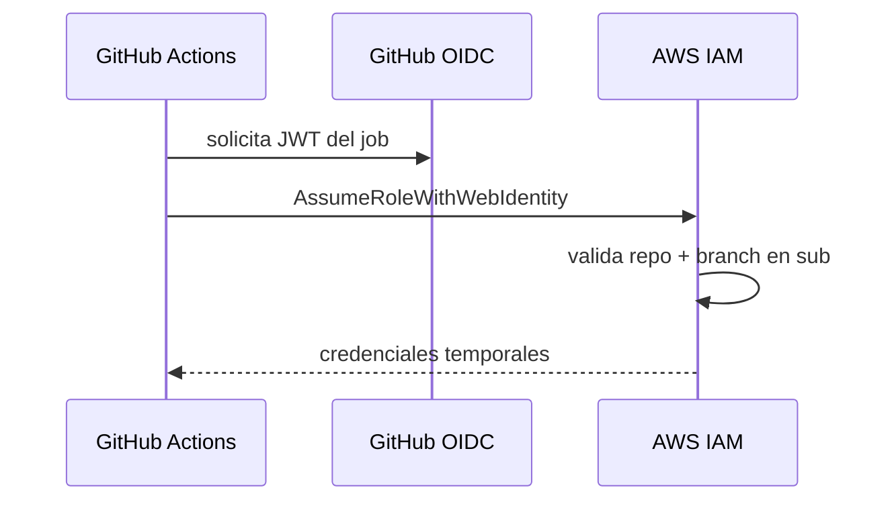

# Cloud y deployment

[Inicio](../../README.md) · [DevSecOps](11-devsecops.md) · [Evidencias](14-evidencias.md)

## Producción actual

| Componente | Proveedor | Función |
|---|---|---|
| React | Vercel | frontend y CDN |
| Spring Boot | Render | API/health/OpenAPI |
| PostgreSQL y Storage | Supabase | datos relacionales e imágenes |
| AWS IAM | AWS | demostración segura de identidad federada CI/CD; no aloja toda la app |

El frontend solo llama a la API. La API usa PostgreSQL/Storage; nunca se exponen credenciales DB al navegador.

`infra/aws-oidc/` administra provider y roles `lisource-github-oidc-reto2`/`lisource-github-oidc-reto3`, restringidos por repositorio/rama. Está versionado una sola vez en Reto 2 porque el mismo stack gobierna ambos componentes; duplicarlo crearía drift. No usa access keys AWS permanentes.

## Provisionamiento y despliegue

Primero `terraform fmt -check`, `terraform init`, `terraform validate`, después un `plan` revisado y `apply` manual controlado. `*.tfstate*` y `tfplan` están ignorados. Render recibe variables del backend y ejecuta la imagen/JAR; Supabase requiere scripts SQL en orden; Vercel recibe las variables `VITE_*` al construir. Tras desplegar, verifique health, OpenAPI, CORS desde el dominio Vercel, login, listado y una reserva.

