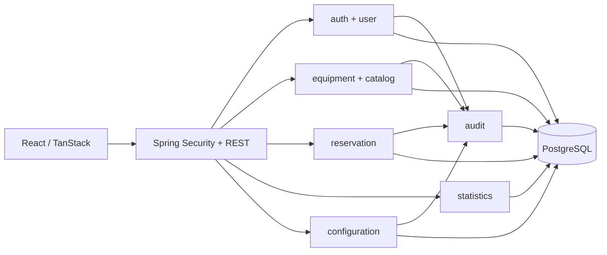
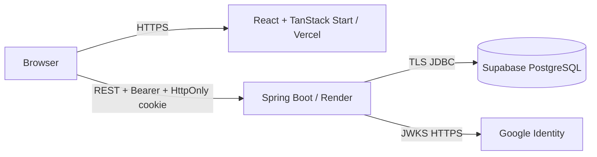
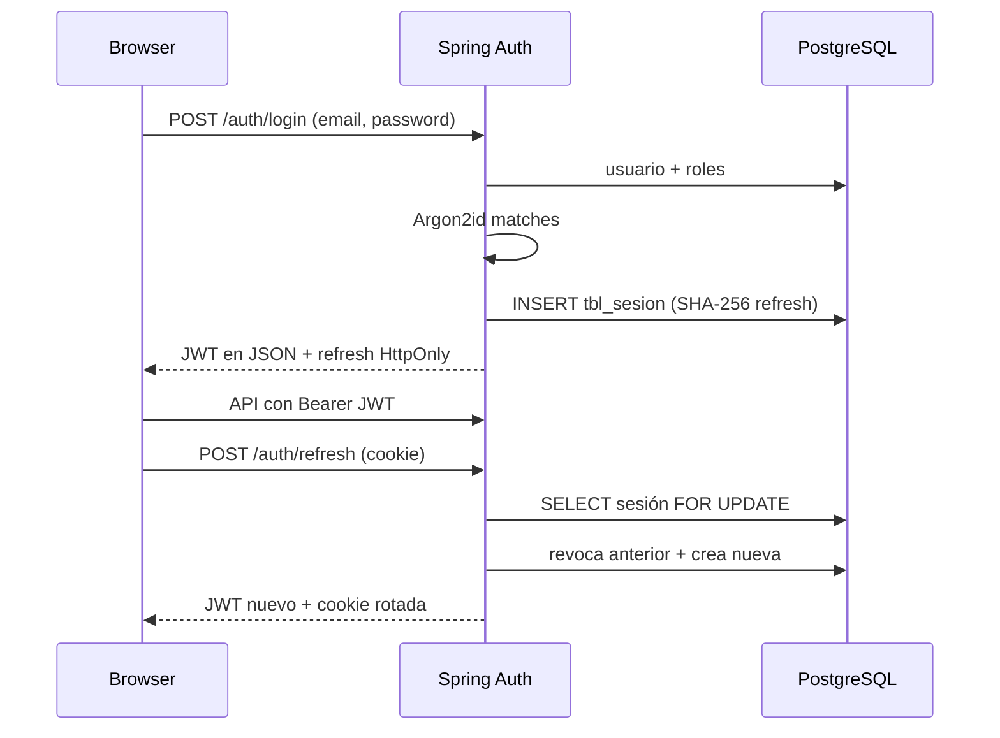
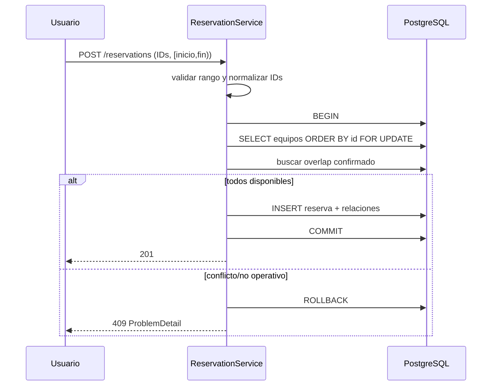
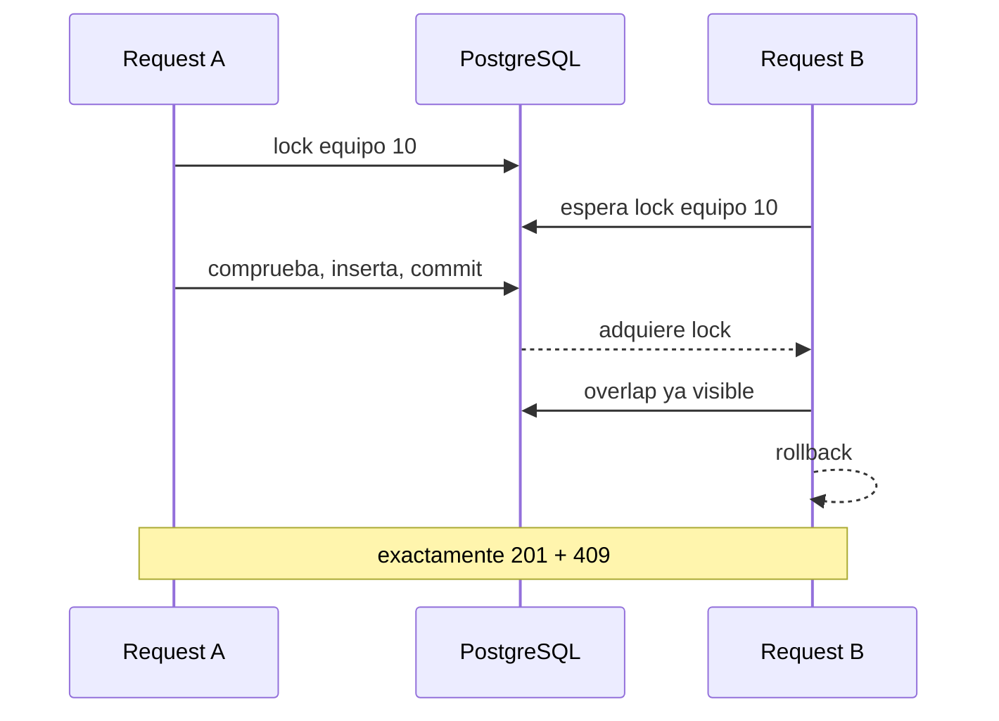

# Arquitectura de LISource

## Objetivo y decisiones

LISource protege el inventario del LIS y garantiza reservas consistentes aun cuando dos usuarios compiten por el mismo equipo. Se eligió un monolito modular porque el dominio, el equipo académico y el despliegue son únicos: ofrece una transacción PostgreSQL real y una operación sencilla sin introducir consistencia distribuida.

Cada feature separa API, aplicación, dominio e infraestructura (Clean/hexagonal ligera). No se fuerza una abstracción cuando no agrega valor: las consultas que dependen de PostgreSQL se expresan explícitamente con `JdbcClient`; JPA documenta y valida el mapping de las 20 tablas. El frontend nunca usa credenciales ni APIs directas de Supabase: Spring concentra autorización, reglas, auditoría y transacciones.

## Módulos

Los atributos prioritarios son modificabilidad (features aisladas), seguridad (JWT/RBAC), testabilidad (`Clock`, ports Google/notifier y Testcontainers), disponibilidad (Actuator), interoperabilidad (REST/OpenAPI) y rendimiento (paginación/aggregates server-side, sin N+1).

## Deployment

Vercel y Render son sitios distintos: producción usa cookie `Secure; SameSite=None`, CORS con origen explícito y validación de `Origin` para mutaciones de auth. Los secretos solo existen en variables Render/Supabase.

## Secuencia de login y refresh

Google reemplaza la verificación Argon2id por firma JWKS, issuer, audience, expiración, `email_verified` y dominio exacto. Después crea/vincula el usuario interno y sigue la misma emisión de sesión.

## Secuencia de reserva

## Conflicto concurrente

El orden ascendente de locks reduce deadlocks en reservas multi-equipo. La semántica semiabierta permite `fin A == inicio B`.

## Seguridad, persistencia y auditoría

- Access JWT corto HS256 con issuer, `sub`, email, roles, `iat`, `exp` y `jti`.
- Refresh/recovery opacos de 256 bits; PostgreSQL recibe solo SHA-256.
- Passwords Argon2id (`m=65536`, `t=3`, `p=4`), política 12–128 con mayúscula, minúscula y número.
- Stateless API, RBAC a nivel HTTP/método, DTO validation, query sort whitelist y error estable sin información interna.
- `ddl-auto=validate` y verificador exacto de esquema; no Flyway/DDL automático porque los SQL son autoridad.
- Auditoría after-commit para éxitos y transacción independiente para rechazos. Se eliminan claves/valores sensibles recursivamente antes de JSONB.

## Matriz del esquema

| Grupo | Tablas | Participación |
|---|---|---|
| Estados | `tbl_estado_registro`, `tbl_estado_usuario`, `tbl_estado_equipo`, `tbl_estado_reserva` | activación y máquinas de estado |
| Identidad | `tbl_rol`, `tbl_idioma`, `tbl_usuario`, `tbl_usuario_rol` | perfil, i18n, login y RBAC |
| Credenciales | `tbl_sesion`, `tbl_recuperacion_password` | refresh rotation y recovery one-time |
| Inventario | `tbl_categoria_equipo`, `tbl_ubicacion`, `tbl_equipo` | catálogo, filtros, CRUD y locks |
| Reservas | `tbl_reserva`, `tbl_reserva_equipo` | agregado transaccional multi-equipo |
| Parámetros | `tbl_categoria_configuracion`, `tbl_configuracion` | límites/duraciones/dominio tipados desde JSONB |
| Auditoría | `tbl_nivel_auditoria`, `tbl_tipo_evento_auditoria`, `tbl_auditoria` | severidad, taxonomía y trazabilidad |

Son exactamente 20 tablas; una divergencia detiene el arranque para no ejecutar sobre un esquema equivocado.

## Trade-offs

- JWT HS256 simplifica un único backend; una plataforma con múltiples emisores debería usar firma asimétrica y rotación de claves.
- El access token en memoria mejora exposición XSS frente a storage persistente, a cambio de un refresh al recargar.
- Los locks pesimistas priorizan corrección; para una carga mucho mayor podrían complementarse con exclusión de rangos PostgreSQL y reintentos medidos.
- La recuperación local solo registra el enlace en perfil `local`; producción incluye un port listo para un proveedor de correo, pero no inventa credenciales.
- Un monolito modular conserva atomicidad y despliegue barato. Microservicios añadirían fallos parciales, mensajería y observabilidad sin necesidad actual.
