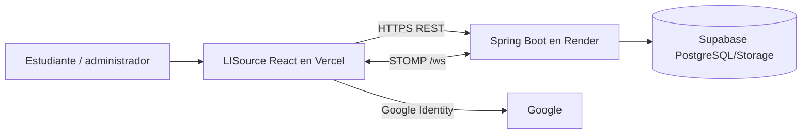
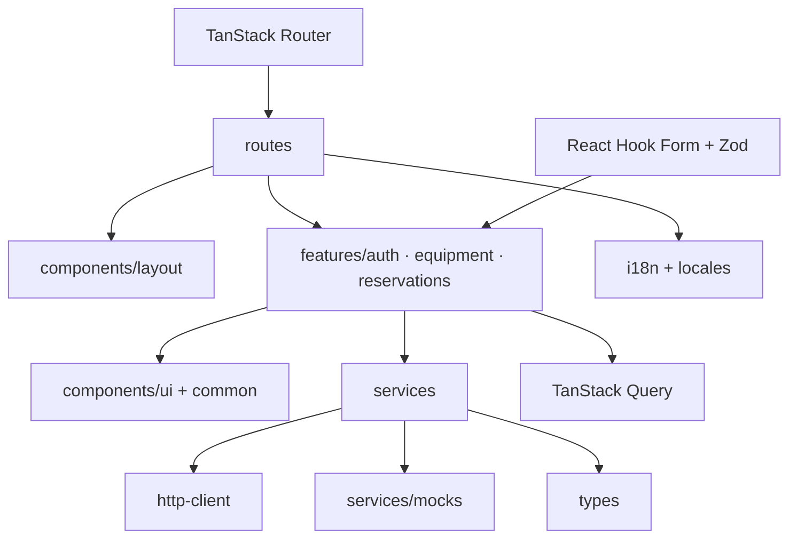
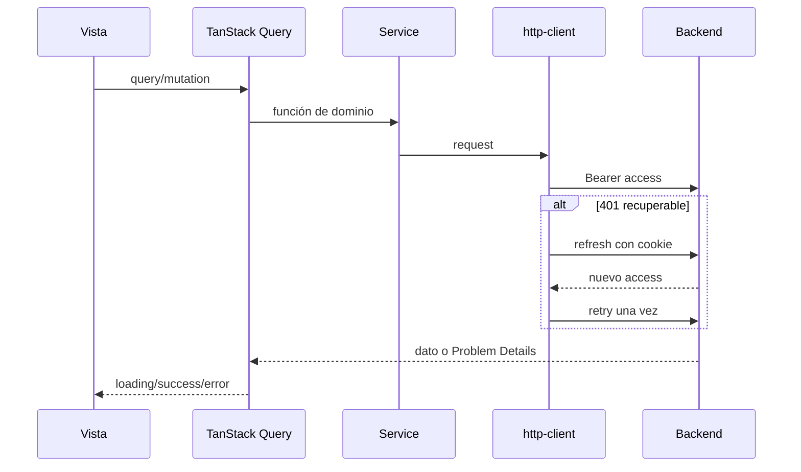
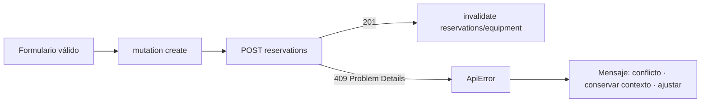

# Arquitectura frontend

[Inicio](../../README.md) · [API y estado](04-api-y-estado-remoto.md) · [Auth](05-autenticacion.md)

## Contexto y componentes





Responsabilidades reales: `routes` compone páginas/guards; `components` contiene shell, estados y primitives Radix; `features` encapsula auth/equipos/reservas y hooks de query; `hooks` contiene detección móvil; `services` selecciona API/mock y realtime; `lib` maneja errores, formato y Google; `i18n`/`locales` traducciones; `types` contratos compartidos. No existen carpetas separadas `schemas` o `queries`: los schemas/forms y hooks están junto a su feature.

## Routing

```mermaid
flowchart TD
  Root[__root] --> Public[/ingreso · /recuperar · /reset-password]
  Root --> Protected[/ dashboard]
  Protected --> Eq[/equipos · /equipos/:id]
  Protected --> Res[/reservas]
  Protected --> Stats[/estadisticas]
  Protected --> Profile[/perfil]
  Protected --> Admin[/administracion/equipos · administrador]
```

## Auth y datos



`AuthContext` conserva el access token en memoria. El refresh HttpOnly pertenece al backend/browser. `VITE_DATA_MODE` escoge adaptador API o mock. STOMP recibe cambios y provoca invalidación de queries, de modo que las vistas recuperan datos autoritativos en vez de fusionar eventos manualmente.

## Reservas y 409



## i18n, responsive, CI y deploy

Las claves semánticas son consumidas con `react-i18next`; el selector persiste la preferencia y los tests comprueban paridad de catálogos ES/EN/FR/PT/DE/IT. El layout parte de móvil, limita ancho, usa cards bajo `xl` y overlays acotados al viewport. GitHub Actions ejecuta quality → CodeQL → Docker → Trivy; en push despliega Vercel y hace smoke, mientras AWS OIDC valida identidad temporal.
