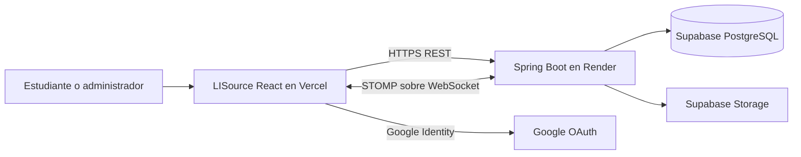
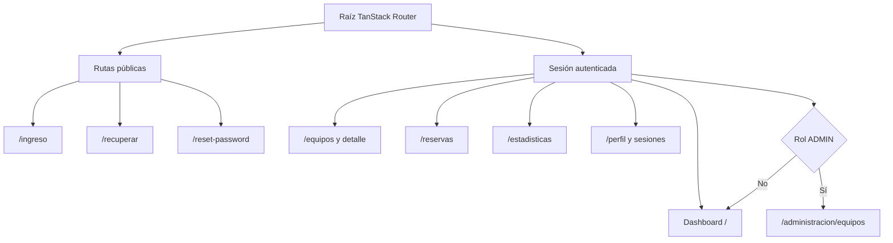
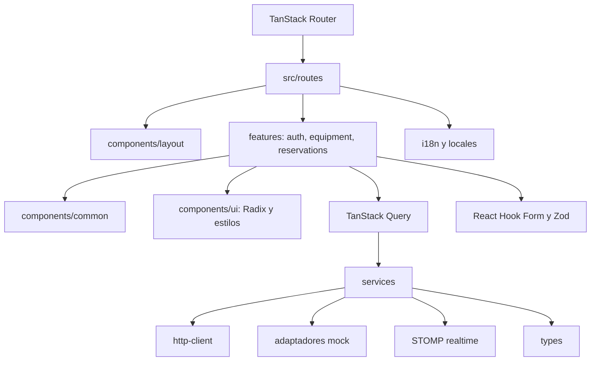
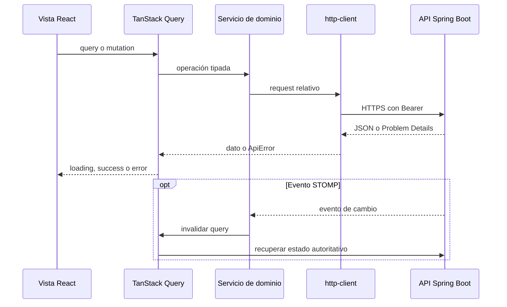
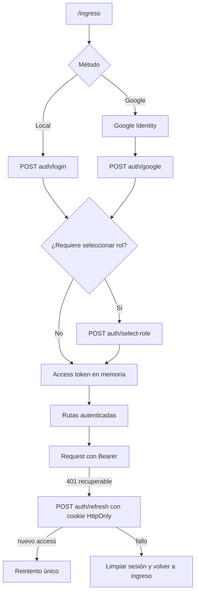
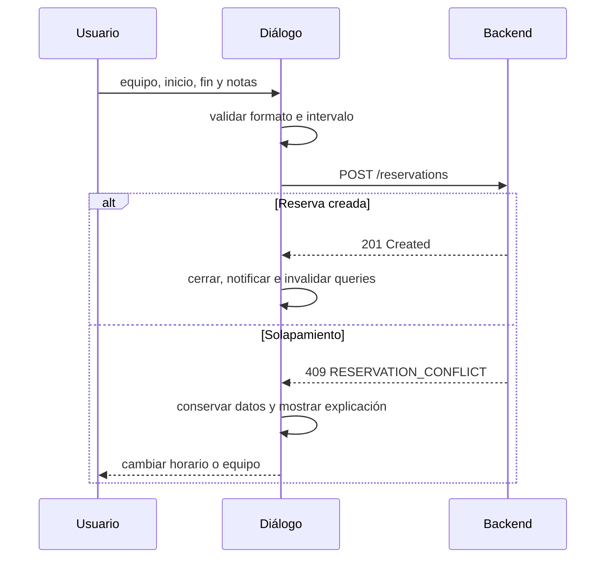
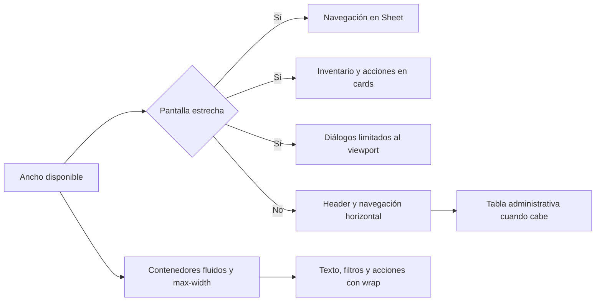
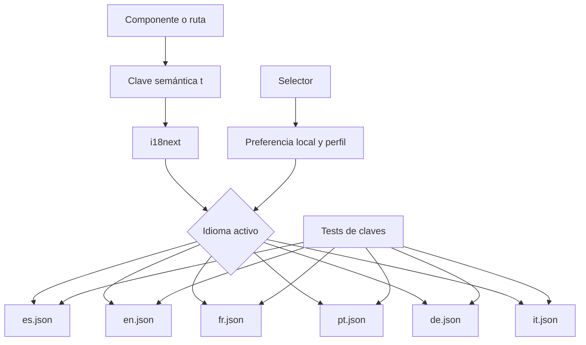
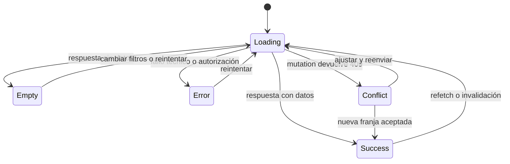

# Arquitectura frontend

[Inicio](../../README.md) · [API y estado](04-api-y-estado-remoto.md) · [Autenticación](05-autenticacion.md) · [Decisiones](15-decisiones-arquitectonicas.md)

## Contexto

El navegador solo se comunica con Google y con la API. PostgreSQL y Storage quedan detrás del backend; no hay conexión directa del frontend a las tablas de Supabase.

## Mapa de navegación y rutas

`AppShell` filtra el menú por rol y la ruta administrativa redirige a quien no sea `ADMIN`. Son medidas de experiencia y navegación; la autorización definitiva la aplica Spring Security.

## Arquitectura de componentes

`routes` compone páginas y navegación; `features` concentra casos de interfaz; `components` aporta shell, estados y primitives; `services` elige API o mock; `lib` normaliza errores y formato; `types` describe contratos. No se atribuyen carpetas `schemas` o `queries` inexistentes: schemas y hooks viven junto a sus features.

## Flujo de datos frontend → API → frontend

TanStack Query conserva cache, estados e invalidación. El formulario, el diálogo abierto y los filtros son estado local o derivado; no se persisten como si fueran datos del servidor.

## Autenticación y protección de rutas

El cliente mapea `ADMINISTRADOR` del backend a `ADMIN` para navegación. El refresh token nunca se lee desde JavaScript: pertenece a una cookie HttpOnly administrada por el backend y el navegador.

## Creación de reserva y tratamiento del 409

Los busy slots orientan al usuario, pero el `201/409` del backend es la decisión autoritativa.

## Estrategia responsive

El inventario mantiene cards hasta `xl`; administración usa cards bajo `md` y tabla desde ese breakpoint. Las imágenes reales documentan 320, 390, 768, 1024, 1280 y 1440 px, además de overlays y menús.

## Organización de internacionalización

Los textos propios de producto están centralizados en catálogos. Los tests comparan claves para reducir traducciones ausentes; las respuestas de API se traducen mediante códigos conocidos cuando existe una clave.

## Estados de interfaz

`Loading` utiliza skeletons o indicadores; `Empty` muestra texto y posible acción; `Error` usa alerta y reintento; `Conflict` mantiene el formulario y explica la corrección. Éxito y estados de equipo/reserva se comunican con texto, y cuando aplica con icono, no solo con color.

## Límites y evolución

- La UI administrativa actual cubre equipos, no todos los dominios administrativos de la API.
- El access token se pierde al recargar por diseño; la cookie refresh recupera la sesión cuando el backend lo permite.
- STOMP invalida y vuelve a consultar; no aplica deltas manuales. Es más simple y autoritativo, con el coste de un request adicional.
- Un SDK generado desde OpenAPI podría sustituir gradualmente tipos y servicios escritos a mano si el contrato crece.
