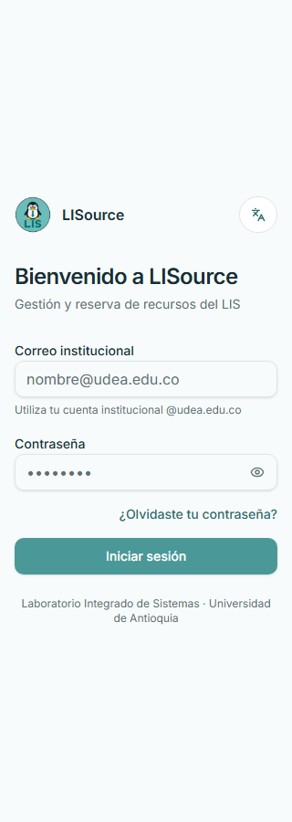

# Responsive y accesibilidad

[Inicio](../../README.md) · [Evidencias](14-evidencias.md)

## Auditoría ejecutada

Se recorrieron las 10 rutas reales en 320, 360, 375, 390, 414, 480, 640, 768, 1024, 1280 y 1440 px: 110 combinaciones. También se verificaron drawer móvil, selector de idioma, menú de usuario y diálogos de reserva/administración. La automatización inspeccionó `scrollWidth`, bounds de controles y apertura de overlays; las capturas clave se revisaron visualmente.

El primer barrido encontró que la tabla del inventario de equipos se activaba desde `md` y recortaba acciones a 768 px. Se elevó a `xl`: cards completas en tablet y tabla únicamente cuando caben todas las columnas. La vista Admin conserva su propia estrategia: cards bajo `md` y tabla desde `md`. El barrido final no reportó overflow horizontal.

## Estrategia aplicada

- `AppShell`: `min-w-0`, contención horizontal, padding/gaps progresivos, encabezado y acciones apilables.
- Inventario: cards hasta `xl` y tabla desde `xl`. Admin: cards bajo `md` y tabla desde `md`, con scroll controlado como defensa.
- Dialog/AlertDialog/Sheet/Dropdown/Select: ancho `calc(100% - 2rem)`, máximo por viewport, `max-height` con `dvh`, scroll interno y cierres táctiles.
- Formularios: inputs/selects/textareas capaces de encogerse; botones y footer a ancho completo en móvil.
- Texto: email, identificadores, nombres y metadatos rompen línea sin deformar el layout.
- Tabs/paginación: scroll o apilado intencional, no clipping accidental.
- Google button: `ResizeObserver` usa el ancho realmente disponible en vez de 384 px fijo.

## Accesibilidad

Radix aporta foco, roles, escape y trapping en overlays. Se preservan labels, estados de loading/error/empty, foco visible y targets táctiles mayores. El selector de idioma mantiene nombre accesible. La revisión automatizada no sustituye una auditoría WCAG formal con lector de pantalla, zoom 200/400 %, navegación completa por teclado y contraste medido.

## Evidencia representativa

