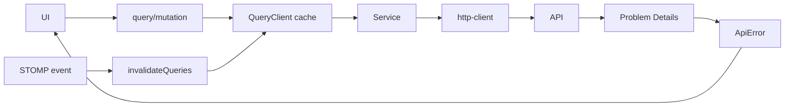

# API y estado remoto

[Inicio](../../README.md) · [Arquitectura](02-arquitectura-frontend.md) · [Reservas](06-reservas.md)

`services/http-client.ts` centraliza URL, JSON, Bearer, credenciales/cookie, refresh y normalización de Problem Details. Los servicios por dominio (`auth`, `equipment`, `category`, `reservation`, `statistics`) no exponen detalles de transporte a las vistas. `services/index.ts` selecciona implementación con `VITE_DATA_MODE=api|mock`.

TanStack Query es dueño del estado remoto: query keys identifican recursos, estados loading/error/empty se renderizan explícitamente y las mutaciones invalidan las keys afectadas. No se duplican respuestas remotas en Context. `use-equipment.ts` agrupa las queries del feature.

El cliente reintenta una solicitud una sola vez tras refresh exitoso; evita bucles marcando el intento. Si refresh falla, el contexto limpia la sesión. Un `409` conserva `status/detail` para que reservas muestre conflicto accionable. Abort, timeout y offline deben tratarse como fallos de transporte, no como reglas de negocio.

`VITE_API_URL` incluye `/api/v1`. Todo `VITE_*` es público en el bundle: solo admite URL, modo y Google client ID, nunca DB password, JWT secret ni service keys.
