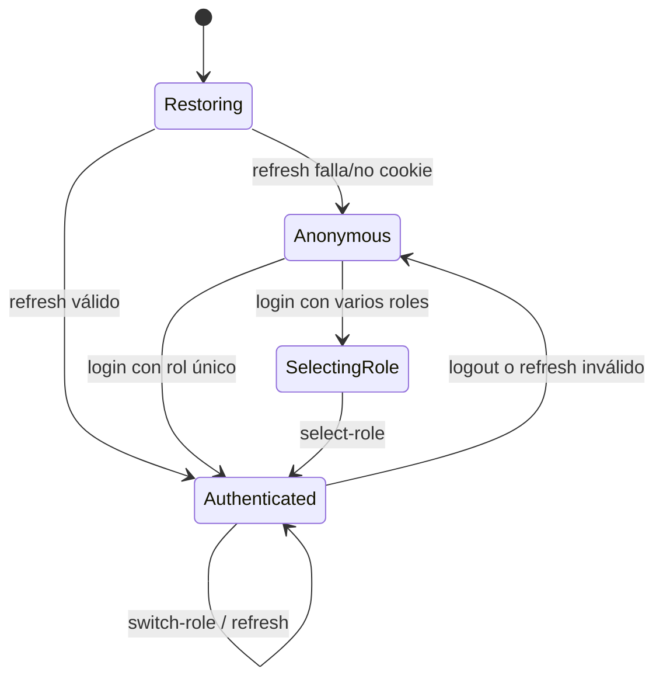

# Autenticación frontend

[Inicio](../../README.md) · [Arquitectura](02-arquitectura-frontend.md) · [API](04-api-y-estado-remoto.md)

`AuthContext` mantiene usuario, rol y access token en memoria. No persiste access token en `localStorage`. El navegador administra la cookie refresh HttpOnly sin que JavaScript pueda leerla. `http-client` adjunta Bearer y coordina un refresh/retry; logout usa el flujo centralizado y limpia Query cache/estado incluso si la red falla.

El login ofrece credencial local y Google Identity cuando `VITE_GOOGLE_CLIENT_ID` existe. El backend valida firma, audience y dominio institucional; la UI no sustituye esos controles. Recuperación/restablecimiento tienen rutas públicas. La navegación Admin se muestra por rol, pero seguridad final siempre es `403` server-side.

Amenazas frontend: XSS se reduce evitando persistencia del token y secretos, pero requiere mantener dependencias/CSP y evitar HTML inseguro; CSRF sobre refresh se mitiga en backend con SameSite/Secure/origin; clickjacking/CSP son configuración de headers del hosting. Nunca registre tokens/cookies en telemetry ni capturas.
