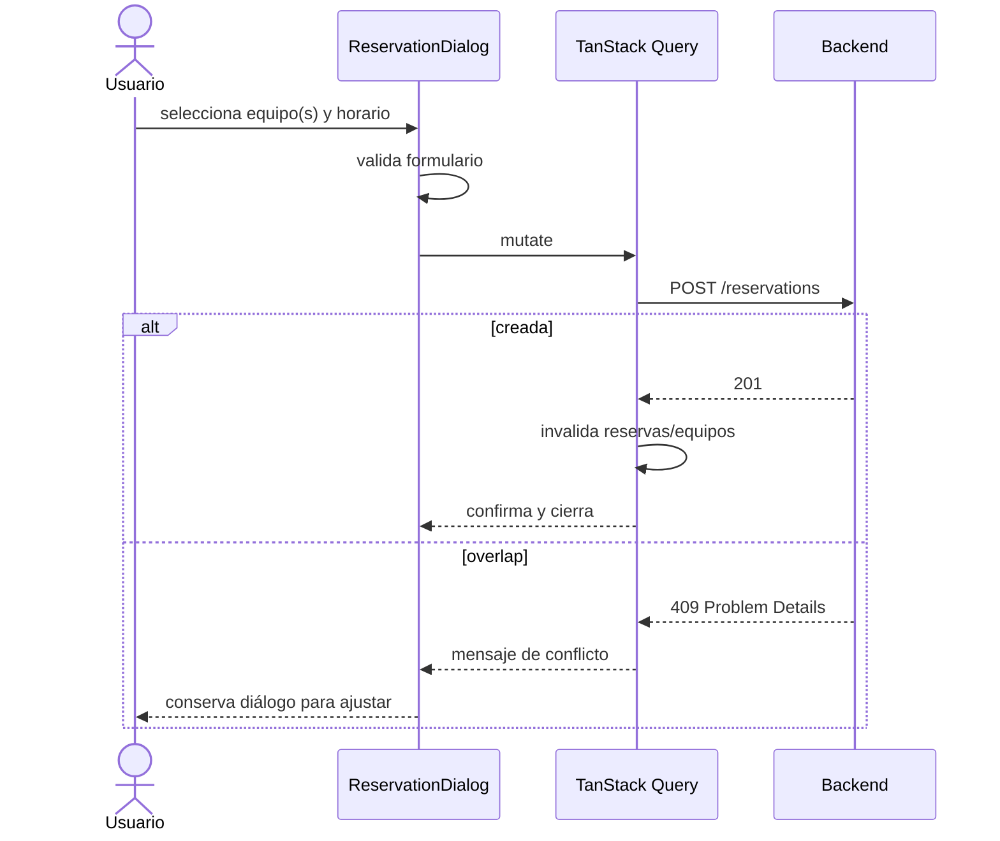

# Reservas y conflicto 409

[Inicio](../../README.md) · [Responsive](03-responsive-y-accesibilidad.md) · [API](04-api-y-estado-remoto.md)

El usuario selecciona uno o varios equipos, inicio y fin. El formulario exige fin posterior al inicio y envía ISO 8601. Backend decide disponibilidad dentro de una transacción; el frontend no intenta “reservar” con estado local optimista.

Intervalos son semiabiertos: `10:00–11:00` y `11:00–12:00` son adyacentes. En `409`, la UI no inventa disponibilidad ni reintenta automáticamente: muestra el detalle seguro, conserva contexto y permite cambiar horario/equipo. Cancelar conserva el registro histórico y luego invalida las queries relacionadas.

La vista `/reservas` separa estados mediante tabs que pueden desplazarse horizontalmente en pantallas estrechas; cards, metadatos y acciones rompen/apilan sin overflow.
