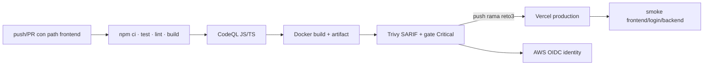

# DevSecOps frontend

[Inicio](../../README.md) · [Deployment](12-deployment.md) · [Evidencias](14-evidencias.md)

`.github/workflows/frontend-ci.yml` usa Node 22 y lockfile.

| Job | Dependencia | Qué ejecuta | Qué demuestra / límite |
|---|---|---|---|
| Quality Gate | — | `npm ci`, tests, lint y build | reproducibilidad desde lockfile y compilación de producción |
| CodeQL JS/TS | Quality | SAST JavaScript/TypeScript | hallazgos del run; no sustituye pentest |
| Container | CodeQL | `docker build` y export de imagen | Dockerfile multi-stage y runtime no root |
| Trivy | Container | SARIF HIGH/CRITICAL + gate CRITICAL corregible | vulnerabilidades de la imagen concreta |
| Vercel Deploy | Trivy | deploy producción en push a Reto 3 | publica frontend; no ejecuta en PR |
| Production Smoke | Deploy | `/`, `/ingreso`, health y OpenAPI | disponibilidad básica entre Vercel y Render |
| AWS OIDC Identity | Trivy | credenciales STS temporales y rol Reto 3 | identidad federada; no hosting ni despliegue AWS |

CodeQL requiere `security-events: write`; Trivy publica SARIF. La imagen `lisource-frontend-image` se conserva un día como artefacto inter-job. No se inventan CVEs: revise el run concreto.

Deploy y smoke solo corren en push a `1021805193-reto3`; PR valida sin publicar. El smoke comprueba `/`, `/ingreso`, health y OpenAPI. El job AWS obtiene credenciales temporales por OIDC y verifica que asumió `lisource-github-oidc-reto3`; no despliega la aplicación en AWS. Path filters evitan ejecutar este pipeline por cambios exclusivos de backend.
