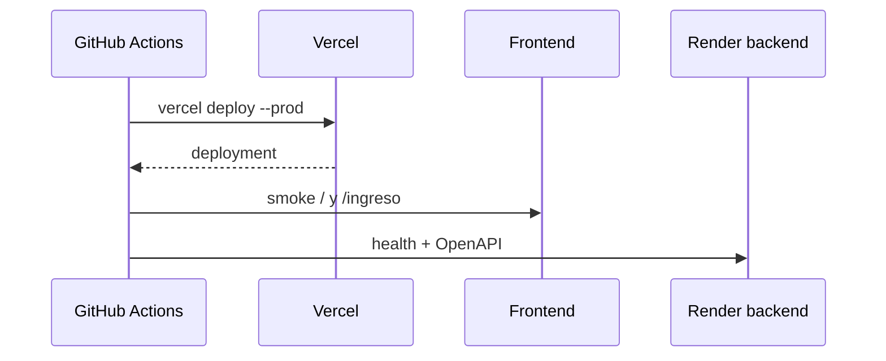

# Deployment frontend

[Inicio](../../README.md) · [DevSecOps](11-devsecops.md) · [Troubleshooting](13-troubleshooting.md)

Producción está en Vercel: `https://lisource-1021805193.vercel.app`. El workflow usa Vercel CLI con `VERCEL_ORG_ID`, `VERCEL_PROJECT_ID` y `VERCEL_TOKEN` administrados como vars/secrets de GitHub. Las variables `VITE_API_URL`, `VITE_DATA_MODE` y `VITE_GOOGLE_CLIENT_ID` deben estar configuradas en el ambiente de build; no son secretos.



El Dockerfile alternativo es multi-stage: Node 22 compila y una imagen Node sin npm/corepack ejecuta `dist/server/index.mjs` como usuario no root en puerto 3000.

```bash
docker build --build-arg VITE_API_URL=https://host/api/v1 --build-arg VITE_DATA_MODE=api -t lisource-frontend .
docker run --rm -p 3000:3000 lisource-frontend
```

Después del despliegue pruebe login, CORS/cookie con dominio real, listado, reserva/409, deep links y responsive. Un build exitoso no garantiza integración entre proveedores.
