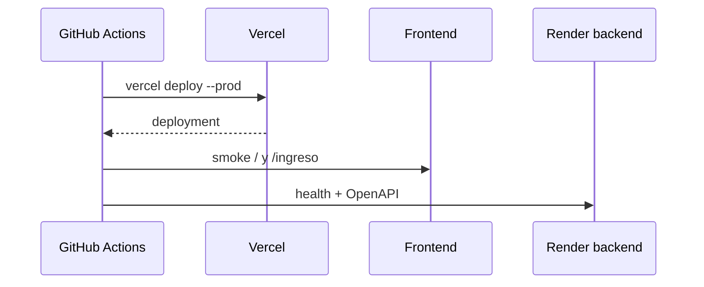

# Deployment frontend

[Inicio](../../README.md) · [DevSecOps](11-devsecops.md) · [Troubleshooting](13-troubleshooting.md)

> **AWS no aloja LISource. La aplicación utiliza Vercel para el frontend, Render para el backend y Supabase para datos y servicios asociados. AWS se utiliza para la integración segura de identidad de CI/CD, de acuerdo con la infraestructura Terraform del repositorio.**

Producción está en Vercel: `https://lisource-1021805193.vercel.app`. El workflow usa Vercel CLI con `VERCEL_ORG_ID`, `VERCEL_PROJECT_ID` y `VERCEL_TOKEN` administrados como vars/secrets de GitHub. Las variables `VITE_API_URL`, `VITE_DATA_MODE` y `VITE_GOOGLE_CLIENT_ID` se configuran en el ambiente de build y llegan al navegador; no deben contener secretos.



El Dockerfile alternativo es multi-stage: Node 22 compila y una imagen Node sin npm/corepack ejecuta `dist/server/index.mjs` como usuario no root en puerto 3000.

```bash
docker build --build-arg VITE_API_URL=https://host/api/v1 --build-arg VITE_DATA_MODE=api -t lisource-frontend .
docker run --rm -p 3000:3000 lisource-frontend
```

Después del despliegue pruebe login, CORS/cookie con dominio real, listado, reserva/409, deep links y responsive. Un build exitoso no garantiza integración entre proveedores.

## AWS OIDC/IAM y Terraform

La rama `1021805193-reto2` conserva la infraestructura compartida en `infra/aws-oidc`. Sus archivos declaran el proveedor OIDC de GitHub y dos roles —uno por rama— cuyo trust limita audiencia y `sub`. El rol frontend no contiene hosting de aplicación; el job solo solicita credenciales STS temporales y comprueba la identidad.

| Comando | Efecto |
|---|---|
| `terraform init` | inicializa el directorio y descarga el proveedor |
| `terraform validate` | valida sintaxis y referencias, sin crear recursos |
| `terraform plan` | calcula la diferencia contra el estado |
| `terraform apply` | aplica el plan tras revisión y autorización |

Las capturas existentes demuestran inicialización/validación y una aplicación de los roles en el momento capturado; no demuestran que AWS aloje frontend o backend. No suba `.terraform/`, `*.tfstate*`, `tfplan`, credenciales o secretos. El workflow frontend no ejecuta `plan` ni `apply`.
