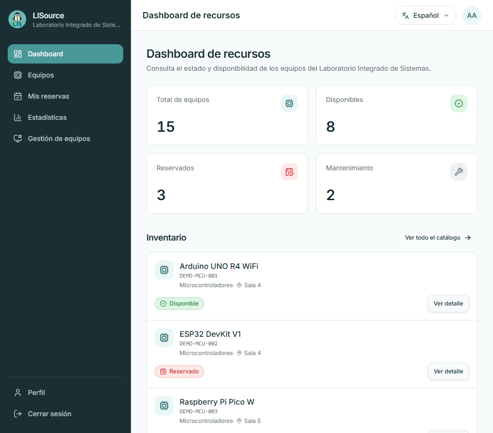

# Evidencias frontend

[Inicio](../../README.md) · [Responsive](03-responsive-y-accesibilidad.md)

## Responsive real

| Evidencia | Qué demuestra |
|---|---|
|  | formulario y Google ajustados al ancho mínimo |
|  | header, cards y navegación móvil sin clipping |
|  | estrategia tablet con cards completas |
|  | tabla/espaciado desktop |
|  | estado de carga y tabs sin clipping; **no demuestra datos ni cancelación** |
|  | administración convertida en cards móviles |
|  | formulario largo con viewport/scroll seguro |
|  | sheet y navegación accesibles |
|  | opciones ES, EN, FR, PT, DE e IT visibles sin recorte |

También se conservan `dashboard-390/768/1280`, `reservation-dialog-320`, `language-dropdown-320` y `user-dropdown-320`. Son salidas de la auditoría actual, no mockups decorativos.

## CI/CD

- **Qué se ve:** quality, CodeQL, contenedor, Trivy, deploy, smoke y AWS OIDC en verde.
- **Qué demuestra:** esos jobs finalizaron en el run capturado.
- **Requisito relacionado:** testing, DevSecOps y deployment.
- **Límite:** es evidencia histórica; el commit actual se confirma en Actions.

## Cloud compartido

Terraform vive en Reto 2 y gestiona identidad de ambos pipelines. Estas capturas demuestran validación/provisionamiento controlado, no hosting del frontend en AWS ni uso de keys permanentes.
