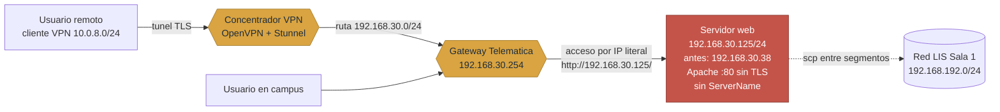
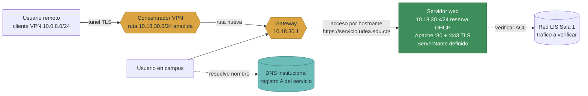

# Migración de servicios entre redes del LIS
### Propuesta técnica de migración de direccionamiento — `192.168.30.0/24` → `10.18.30.0/24`

**Isaac Mesa Gómez** — C.C. 1007239188
Facultad de Ingeniería · Departamento de Ingeniería de Sistemas
Universidad de Antioquia
Agosto de 2026

---

## Resumen ejecutivo

Este informe analiza la migración de una aplicación web del Laboratorio Integrado de
Sistemas desde el direccionamiento legado `192.168.30.0/24` (Red Telemática) hacia el
esquema institucional `10.18.30.0/24`.

A diferencia de un ejercicio hipotético, **la migración ya está en curso**, y este trabajo
la documenta con tres fuentes de evidencia independientes:

1. **Documental** — la guía oficial de acceso VPN del LIS, que contiene la tabla de
   direccionamiento legado y presenta ella misma señales de deriva por renumeraciones
   anteriores.
2. **Forense** — el historial de comandos del servidor de pruebas, que registra el
   servicio web operando sucesivamente en `192.168.30.38` y `192.168.30.125`, accedido
   siempre por IP directa y nunca por nombre.
3. **Operativa** — ese mismo servidor, diagnosticado en vivo, operando hoy en
   `10.18.29.37/24` con dependencias residuales hacia el esquema anterior.

Los riesgos de mayor impacto son: la **dependencia del acceso remoto respecto de las rutas
publicadas por la VPN**, que deben incluir el segmento destino o los usuarios externos
perderán el servicio aunque el servidor funcione; el **acceso histórico por dirección IP
en lugar de hostname**, que garantiza rotura de enlaces al renumerar; y una **dependencia
no documentada hacia `172.19.0.4`** inyectada por DHCP.

Se propone una migración en tres fases con criterio de éxito medible, reversión en orden
inverso y un checkpoint temporal explícito para decidir el rollback.

---

## 0. Contexto real del entorno

### 0.1 Topología de direccionamiento del LIS

La guía oficial *Instalación de OpenVPN* del laboratorio documenta las redes privadas del
LIS y Telemática:

| Descripción | Dirección de red |
|---|---|
| Red VPN | `10.0.8.0/24` |
| **Red Telemática** | **`192.168.30.0/24`** |
| Red LIS Sala 1 | `192.168.192.0/24` |
| Red LIS Sala 2 y 3 | `192.168.193.0/24` |
| Red LIS Sala 4 | `192.168.194.0/24` |
| Red Ingeniería | `172.21.0.0/16` |

El servicio objeto de esta migración reside en la **Red Telemática**, `192.168.30.0/24` —
exactamente el rango `192.168.x.x` planteado en el enunciado.

**Observación sobre la convención de numeración.** El esquema legado emplea el tercer
octeto como identificador de red (30 = Telemática; 192/193/194 = salas del LIS). El
segmento destino, `10.18.`**`30`**`.0/24`, preserva ese identificador. Esto sugiere que el
plan institucional mantiene la identidad lógica de cada red cambiando únicamente el
prefijo. **Debe confirmarse con el equipo de red**: si la correspondencia es sistemática,
permite anticipar el direccionamiento del resto de segmentos y planificar las migraciones
siguientes con el mismo patrón.

### 0.2 Evidencia de renumeración previa en la propia documentación

La guía de VPN presenta una inconsistencia interna significativa:

| Ubicación en la guía | Red que declara para el cliente VPN |
|---|---|
| Párrafo introductorio | `192.168.27.0/24` |
| Tabla "Direcciones de red" | `10.0.8.0/24` |
| Sección "Verificar dirección IP del equipo" | `10.0.8.0/24` |

Dos de las tres referencias coinciden en `10.0.8.0/24`; la del párrafo introductorio quedó
desactualizada. **Esto es deriva documental producida por una renumeración anterior**,
evidenciada en el documento oficial que los usuarios siguen para conectarse.

Su valor para la propuesta es directo: demuestra que en este entorno las renumeraciones se
han ejecutado **sin actualizar completamente la documentación asociada**, dejando
referencias obsoletas que inducen a error. La actualización documental debe tratarse como
un entregable de la migración, no como una tarea posterior opcional (§3.2, fase 3).

### 0.3 Acceso remoto: OpenVPN + Stunnel

El acceso a las redes del LIS desde el exterior se realiza mediante **OpenVPN encapsulado
en Stunnel** (perfil `tele2024-stunnel.ovpn`). El encapsulamiento TLS sugiere que el
tráfico OpenVPN nativo está filtrado en la ruta y debe presentarse como TLS convencional
para atravesarla.

La guía establece como verificación canónica de conectividad:

```
ping 192.168.30.254
```

acompañada de una ilustración de respuesta exitosa contra la Red Telemática.

> **Implicación crítica.** Si los usuarios alcanzan el servicio a través de la VPN, la
> conectividad no depende solo del servidor: depende de que **el perfil de OpenVPN publique
> una ruta hacia el segmento destino**. Un perfil que empuje `192.168.30.0/24` pero no
> `10.18.30.0/24` dejará el servicio inalcanzable para todos los usuarios remotos, aunque
> el servidor esté correctamente configurado y responda dentro del campus. Se desarrolla
> en §2.12.

### 0.4 Evidencia forense del direccionamiento anterior

Barrido de referencias a la red legada sobre el servidor de pruebas:

```bash
pruebat@pruebatecnica:~$ grep -r "192.168\." .
```

Resultados agregados (**identificadores personales de terceros redactados — ver §0.5**):

| Dirección hallada | Contexto de uso | Red según §0.1 |
|---|---|---|
| `192.168.30.38` | Destino `scp` hacia `/var/www/html/<nombre>/` | Telemática |
| `192.168.30.125` | Destino `scp` hacia `/var/www/html/<nombre>/` **y** URL de acceso `http://192.168.30.125/<nombre>/<archivo>.pdf` | Telemática |
| `192.168.30.254` | Destino recurrente de `ping` de verificación | Telemática |
| `192.168.192.4` | Destino `scp` hacia `~/Documentos/` de otro usuario | LIS Sala 1 |
| `192.168.1.37` | Destino `scp` hacia equipo personal | Externa, no institucional |

**Tres hallazgos de primer orden:**

1. **El servicio web ya fue renumerado al menos una vez dentro del esquema legado.** El
   mismo servidor —igual usuario `pruebat`, igual ruta `/var/www/html/<nombre>/`, igual
   flujo de entrega de archivos— aparece primero en `192.168.30.38` y posteriormente en
   `192.168.30.125`. La migración propuesta no es la primera: es la **tercera dirección
   conocida** de este servicio.

2. **El servicio se accede por dirección IP, nunca por nombre.** La URL registrada
   (`http://192.168.30.125/...`) confirma que los usuarios recibieron enlaces con IP
   literal. Esto explica el hallazgo del diagnóstico técnico de que Apache **no tiene
   `ServerName` definido** (§1.5): el servicio nunca se concibió con identidad de nombre.
   Es la causa raíz de que cada renumeración rompa todos los enlaces existentes.

3. **Existe dependencia cruzada entre redes del laboratorio.** La transferencia hacia
   `192.168.192.4` (Sala 1) desde un host de Telemática demuestra tráfico entre segmentos
   que debe seguir permitido tras la migración.

### 0.5 Nota sobre datos personales

El historial de comandos contiene **nombres completos y números de documento de otras
personas**, empleados como nombres de directorio y de archivo en `/var/www/html/`.

Este informe los redacta sistemáticamente (`<nombre>`, `<archivo>`) y no reproduce
ninguno. La evidencia se presenta en la forma mínima necesaria para sustentar el análisis.

Con independencia de la migración, esto constituye un **hallazgo de seguridad que debe
reportarse al administrador del laboratorio**:

- Documentos de identidad publicados en un servidor web sin control de acceso, en rutas
  predecibles derivadas del nombre de la persona.
- Historial de comandos legible por cualquier usuario del sistema, conservando rutas y
  datos personales de convocatorias anteriores.

**Recomendaciones:** depurar `/var/www/html/` de material de procesos concluidos, aplicar
`chmod 600` a los archivos de historial y sustituir el flujo de entrega por uno con
autenticación. La migración es el momento natural para ejecutarlo, ya que el servicio se
detiene de todos modos durante la ventana.

### 0.6 Estado actual: migración en curso

| Elemento | Estado |
|---|---|
| Host diagnosticado | `pruebatecnica` — VM Linux (interfaz `ens18`, nomenclatura virtio sobre Proxmox) |
| Dirección **anterior** | `192.168.30.38` → `192.168.30.125` (Red Telemática) |
| Dirección **actual** | `10.18.29.37/24` |
| Dirección **destino** (enunciado) | `10.18.30.x/24` |
| Segmento legado | **Red viva; servicio ya movido** — verificado en §0.7 |

El host ya no reside en `192.168.30.0/24`, pero su configuración, su historial y la
documentación de usuario siguen refiriéndose a ese esquema. Es precisamente el escenario
de riesgo que plantea el enunciado: **el cambio de dirección se ejecutó; la migración de
las dependencias, no**.

### 0.7 Verificación del estado del segmento legado

Ejecutada directamente sobre el host `pruebatecnica` (11 de agosto de 2026):

```
pruebat@pruebatecnica:~$ ping -c 4 192.168.30.254
64 bytes from 192.168.30.254: icmp_seq=1 ttl=64 time=0.234 ms
64 bytes from 192.168.30.254: icmp_seq=2 ttl=64 time=0.220 ms
64 bytes from 192.168.30.254: icmp_seq=3 ttl=64 time=0.254 ms
64 bytes from 192.168.30.254: icmp_seq=4 ttl=64 time=0.211 ms
4 packets transmitted, 4 received, 0% packet loss
rtt min/avg/max/mdev = 0.211/0.229/0.254/0.016 ms

pruebat@pruebatecnica:~$ ping -c 4 192.168.30.125
From 10.18.29.1 icmp_seq=1 Destination Host Unreachable
From 10.18.29.1 icmp_seq=2 Destination Host Unreachable
From 10.18.29.1 icmp_seq=3 Destination Host Unreachable
From 10.18.29.1 icmp_seq=4 Destination Host Unreachable
4 packets transmitted, 0 received, +4 errors, 100% packet loss

pruebat@pruebatecnica:~$ curl -I http://192.168.30.125/
curl: (7) Failed to connect to 192.168.30.125 port 80 after 3034 ms: No route to host
```

**Resultado: red viva, servicio ya movido.** Corresponde al escenario 3 previsto.

Desglose:

| Prueba | Resultado | Interpretación |
|---|---|---|
| `ping 192.168.30.254` | ✅ Responde — ttl=64, ~0.2 ms | Red Telemática **activa**, a un salto, en la misma infraestructura L2 (probablemente una VLAN en el mismo equipo de red). La latencia sub-milisegundo confirma adyacencia física |
| `ping 192.168.30.125` | ❌ `Destination Host Unreachable` **desde `10.18.29.1`** | El gateway **conoce la ruta** hacia `192.168.30.0/24` (si no, el error sería `Network Unreachable`), pero la dirección `.125` ya no tiene host asignado en ese segmento |
| `curl http://192.168.30.125/` | ❌ `No route to host` | El servicio web no existe en la dirección anterior |

**Consecuencias para la propuesta:**

- La **estrategia de doble conexión es plenamente viable** (§3.1): el gateway enruta entre
  `10.18.29.0/24` y `192.168.30.0/24`, y el segmento destino `10.18.30.0/24` se espera
  igualmente enrutado.
- La **dirección `192.168.30.125` está libre**: no hay riesgo de conflicto de IP durante
  una transición con la red legada, pero tampoco hay posibilidad de mantener servicio
  simultáneo en ambas direcciones como período de gracia. La redirección HTTP propuesta
  en §3.5 solo es viable si se asigna temporalmente la IP antigua a este host o a otro
  que la sirva.
- Todo enlace, marcador o instrucción que apunte a `http://192.168.30.125/` **ya está
  roto ahora mismo**, sin que haya habido comunicación formal. Esto refuerza la urgencia
  de crear el registro DNS (§2.3) antes de que la nueva dirección se distribuya por IP
  literal y el ciclo se repita.

### 0.8 Verificación DNS: confirmación de ausencia total de registros

```
pruebat@pruebatecnica:~$ dig -x 10.18.29.37 @10.18.29.254
;; ->>HEADER<<- opcode: QUERY, status: NXDOMAIN
;; QUESTION SECTION:
;37.29.18.10.in-addr.arpa.      IN      PTR
;; Query time: 71 msec
;; SERVER: 10.18.29.254#53

pruebat@pruebatecnica:~$ dig -x 192.168.30.125 @10.18.29.254
;; ->>HEADER<<- opcode: QUERY, status: NXDOMAIN
;; QUESTION SECTION:
;125.30.168.192.in-addr.arpa.   IN      PTR
;; Query time: 79 msec
;; SERVER: 10.18.29.254#53
```

**Ambas consultas devuelven `NXDOMAIN`.** No existe registro PTR para la dirección actual ni
para la anterior, consultando directamente al servidor DNS institucional (`10.18.29.254`).

Combinado con §0.4 (URLs con IP literal) y §1.5 (Apache sin `ServerName`), esto confirma
que **el servicio nunca ha tenido identidad DNS**: ni registro A, ni PTR, ni CNAME. Tres
direcciones distintas a lo largo de su historia, cero registros. Toda la distribución ha
dependido de comunicar la IP del momento a los usuarios.

La creación del registro (§2.3) no es una mejora: es la corrección de un defecto
estructural que ha causado la rotura de enlaces en cada renumeración anterior y que, según
§0.7, **ya causó la rotura actual** (los enlaces a `192.168.30.125` están rotos ahora
mismo, sin que se haya sustituido por nada)

---

## 1. Diagnóstico del entorno actual

Ejecutado sobre el host `pruebatecnica`, hoy en `10.18.29.37/24`.

### 1.1 Interfaces de red

```
1: lo: <LOOPBACK,UP,LOWER_UP> ...  inet 127.0.0.1/8 scope host lo
2: ens18: <BROADCAST,MULTICAST,UP,LOWER_UP> ...
     inet 10.18.29.37/24 metric 100 brd 10.18.29.255 scope global dynamic ens18
3: ens19: <BROADCAST,MULTICAST> state DOWN   (sin dirección asignada)
4: docker0: <BROADCAST,MULTICAST,UP,LOWER_UP> ... inet 172.17.0.1/16 brd 172.17.255.255
24: vethc772f34@if23: <...UP...> master docker0
```

| Interfaz | Estado | Dirección | Interpretación |
|---|---|---|---|
| `lo` | UP | `127.0.0.1/8` | Loopback |
| `ens18` | UP | `10.18.29.37/24` (dinámica, DHCP) | Interfaz principal del servicio |
| `ens19` | DOWN | — | Segunda interfaz presente, sin configurar |
| `docker0` | UP | `172.17.0.1/16` | Bridge por defecto de Docker |
| `vethc772f34@if23` | UP | — | Par veth de un contenedor en ejecución |

**Relevante:** `ens19` disponible habilita una **migración con doble conexión** —el host
operando en ambos segmentos durante la transición—, que reduce sustancialmente el riesgo
del corte (§3.1).

### 1.2 Direccionamiento IP y máscara

| Parámetro | Valor |
|---|---|
| IP actual | `10.18.29.37` |
| Máscara | `/24` → `255.255.255.0` |
| Red | `10.18.29.0/24` |
| Broadcast | `10.18.29.255` |
| Asignación | **Dinámica vía DHCP** |
| MAC de `ens18` | `bc:24:11:99:52:d2` |

**Hallazgo:** un servidor de aplicación con dirección puramente dinámica es frágil. Dado el
historial de renumeraciones de §0.4, fijar la dirección mediante reserva DHCP es una
corrección necesaria, no una preferencia.

### 1.3 Gateway y tabla de rutas

```
default via 10.18.29.1 dev ens18 proto dhcp src 10.18.29.37 metric 100
8.8.8.8 via 10.18.29.1 dev ens18 proto dhcp src 10.18.29.37 metric 100
10.18.29.0/24 dev ens18 proto kernel scope link src 10.18.29.37 metric 100
10.18.29.1 dev ens18 proto dhcp scope link src 10.18.29.37 metric 100
10.18.29.254 dev ens18 proto dhcp scope link src 10.18.29.37 metric 100
172.17.0.0/16 dev docker0 proto kernel scope link src 172.17.0.1
172.19.0.4 via 10.18.29.1 dev ens18 proto dhcp src 10.18.29.37 metric 100
```

**Hallazgos:**

1. **Gateway:** `10.18.29.1`, entregado por DHCP.

2. **Rutas estáticas inyectadas por DHCP.** Las rutas hacia `8.8.8.8`, `10.18.29.254` y
   `172.19.0.4` llevan marca `proto dhcp` sin derivar de la ruta por defecto: son **rutas
   estáticas sin clase** entregadas mediante la opción 121, definida en
   [RFC 3442](https://datatracker.ietf.org/doc/html/rfc3442). No están en ningún archivo
   local y **dependen íntegramente de la configuración del ámbito DHCP destino**.

3. **Ruta host hacia `172.19.0.4` vía gateway externo** — *hallazgo crítico*. El rango
   `172.19.0.0/16` es característico de redes creadas por Docker Compose, pero aquí no se
   enruta por interfaz local (`docker0` sirve `172.17.0.0/16`) sino por el gateway
   institucional: **dependencia hacia un servicio contenerizado en otro host**.

   Obsérvese que `172.19.0.0/16` **no figura en la tabla oficial de redes del LIS** (§0.1),
   lo que refuerza que se trata de infraestructura de contenedores no documentada.

   **Acción previa obligatoria:**
   ```bash
   nmap -p- -Pn 172.19.0.4
   nc -zv 172.19.0.4 <puerto>
   ```

4. **Nota comparativa.** La simetría entre `10.18.29.254` (DNS actual) y `192.168.30.254`
   (referencia de conectividad de la red legada, §0.3) sugiere que **`.254` es la convención
   del laboratorio para el equipo de servicios de cada segmento**. De confirmarse, el
   equivalente en el destino sería `10.18.30.254` — dato a validar antes del corte.

### 1.4 Resolución DNS

`/etc/resolv.conf`:
```
nameserver 127.0.0.53
options edns0 trust-ad
search udea.edu.co
```

El sistema usa **systemd-resolved en modo stub**: `/etc/resolv.conf` no revela el DNS real.
`resolvectl status`:

```
Link 2 (ens18)
    Current Scopes: DNS
    Current DNS Server: 10.18.29.254
    DNS Servers: 10.18.29.254 8.8.8.8
    DNS Domain: udea.edu.co
```

| Parámetro | Valor |
|---|---|
| DNS principal | `10.18.29.254` |
| DNS secundario | `8.8.8.8` |
| Dominio de búsqueda | `udea.edu.co` |
| Interfaz con ámbito DNS | `ens18` únicamente |

Verificación con `dig udea.edu.co`:
```
udea.edu.co.    IN    A    104.18.1.29
udea.edu.co.    IN    A    104.18.0.29
SERVER: 127.0.0.53#53
```

Dos precisiones necesarias:

- **`SERVER: 127.0.0.53#53` es el stub local, no el servidor ascendente.** Para probar el
  DNS real: `dig udea.edu.co @10.18.29.254`.
- **`104.18.x.x` corresponde a rangos de Cloudflare.** El dominio raíz institucional se
  sirve tras un CDN — normal para el sitio público, pero **no representativo** de cómo
  resolvería un host interno del LIS.

**Hallazgo articulado con §0.4 y §0.8:** el servicio se accedía históricamente por IP
literal (`http://192.168.30.125/...`), y la consulta PTR directa al DNS institucional
confirma que **no existe ni existió registro DNS** para este host — ni para la dirección
actual ni para la anterior (ambas devuelven `NXDOMAIN`). La acción no es *actualizar* el
registro sino **crearlo** — convirtiendo esta en la última migración que requiera comunicar
una dirección nueva a los usuarios.

### 1.5 Puertos y servicios en escucha

Salida de `sudo ss -tulnp`:

```
Netid  State   Recv-Q  Send-Q    Local Address:Port    Peer Address:Port   Process
udp    UNCONN  0       0         127.0.0.53%lo:53      0.0.0.0:*           systemd-resolve (pid=3856)
udp    UNCONN  0       0     10.18.29.37%ens18:68      0.0.0.0:*           systemd-network (pid=3850)
tcp    LISTEN  0       4096      127.0.0.53%lo:53      0.0.0.0:*           systemd-resolve (pid=3856)
tcp    LISTEN  0       128           0.0.0.0:22        0.0.0.0:*           sshd (pid=32898)
tcp    LISTEN  0       511                 *:80              *:*           apache2 (pid=150158,150157,74060)
tcp    LISTEN  0       128              [::]:22           [::]:*           sshd (pid=32898)
```

| Puerto | Proceso | Bind | Observación |
|---|---|---|---|
| 53/udp+tcp | `systemd-resolve` | `127.0.0.53` | Stub DNS local |
| 68/udp | `systemd-network` | `10.18.29.37%ens18` | Cliente DHCP — confirma asignación dinámica (§1.2) |
| 22/tcp | `sshd` | `0.0.0.0` + `[::]` | SSH en ambas familias; soporta el flujo `scp` de §0.4 |
| 80/tcp | `apache2` (3 workers) | **`*:80`** | **Bind en wildcard** — favorable: sobrevive al cambio de IP sin reconfigurar |
| 443/tcp | — | — | **Ausente: el servicio opera sin TLS** |
| 5432/tcp | — | — | **No expuesto al host** — el contenedor Postgres escucha solo dentro del bridge Docker (§1.6) |

`apache2ctl -S`:
```
*:80    127.0.1.1 (/etc/apache2/sites-enabled/000-default.conf:1)
ServerName: (no definido — fallback a 127.0.1.1)
```

**Hallazgo:** Apache carece de `ServerName` y recurre al fallback `127.0.1.1`. Ya no es una
conjetura: §0.4 documenta que el servicio se distribuía por URL con IP literal, y §0.8
confirma que nunca existió registro DNS. La ausencia de `ServerName` y el acceso por IP son
**el mismo problema visto desde dos ángulos**, y son la causa raíz de que cada
renumeración rompa todos los enlaces — como ya ocurrió con la migración actual (§0.7).

### 1.6 Contenedores

```
pruebat@pruebatecnica:~$ docker ps
CONTAINER ID  IMAGE                  COMMAND                 CREATED    STATUS    PORTS     NAMES
32ba12bb7c71  postgres:14.13-alpine  "docker-entrypoint.s…"  2 days ago Up 2 days 5432/tcp  8888888888

pruebat@pruebatecnica:~$ docker network ls
NETWORK ID    NAME    DRIVER  SCOPE
3b42def49e93  bridge  bridge  local
b846ebfcff67  host    host    local
d5157b0ba77e  none    null    local
```

Inspección de la red `bridge`:

```json
"Containers": {
    "32ba12bb7c71...": {
        "Name": "8888888888",
        "IPv4Address": "172.17.0.2/16"
    }
},
"IPAM": { "Config": [{ "Subnet": "172.17.0.0/16", "Gateway": "172.17.0.1" }] }
```

| Elemento | Valor | Observación |
|---|---|---|
| Imagen | `postgres:14.13-alpine` | Motor PostgreSQL |
| Nombre del contenedor | `8888888888` | Probable cédula de otro aspirante; no está relacionado con la aplicación web de Apache |
| Red | `bridge` (default) — `172.17.0.2/16` | Red estándar de Docker, **no** `172.19.x.x` |
| Puerto | `5432/tcp` expuesto internamente | **No mapeado al host** — no aparece en `ss -tulnp` |
| Redes custom | **Ninguna** | Solo `bridge`, `host`, `none` |

**Hallazgo clave: el contenedor local NO es la fuente de la dependencia hacia
`172.19.0.4`.** El Postgres local está en `172.17.0.2`, no en `172.19.x.x`, y no existe
ninguna red Docker en el rango `172.19.0.0/16` en este host. La ruta hacia `172.19.0.4` es
definitivamente un servicio **en otro host**, enrutado por el gateway e inyectado por DHCP.

Además, Apache sirve archivos estáticos desde `/var/www/html/` (§0.4) — no hay indicios de
que la aplicación web del reto dependa de una base de datos. El contenedor Postgres parece
pertenecer a la prueba técnica de otro aspirante, no al servicio que se está migrando.

**Consecuencia para la propuesta:** la sección §2.10 (Bases de datos) se reformula: no hay
dependencia local de BD que migrar. La dependencia hacia `172.19.0.4` sigue siendo el
riesgo abierto principal, pero ahora se sabe que es infraestructura ajena a este host, lo
que reduce las acciones necesarias a verificar alcance desde el segmento destino, sin
configuración local que modificar.

### 1.7 Firewall a nivel de host

```
$ sudo ufw status
Status: inactive

$ sudo iptables -L INPUT -n
Chain INPUT (policy ACCEPT)
```

Las únicas cadenas presentes son las generadas por Docker.

**Hallazgo:** **no hay filtrado a nivel de host.** El control de acceso reside íntegramente
en reglas perimetrales institucionales, invisibles desde este diagnóstico. No hay nada local
que respaldar ni migrar, pero **tampoco es validable localmente** — obliga a coordinación
explícita con el equipo de red (§2.4, §5).

Considerando §0.5 (documentos personales servidos sin autenticación), la ausencia total de
filtrado local merece revisión independiente de esta migración.

### 1.8 Dependencias con direccionamiento anterior

Consolidación de lo requerido explícitamente por el enunciado:

| Dependencia | Dirección legada | Evidencia | Acción |
|---|---|---|---|
| URL de acceso al servicio | `http://192.168.30.125/` | `.bash_history` (§0.4) | Crear registro DNS; comunicar el nombre, no la IP |
| Flujo de entrega por `scp` | `pruebat@192.168.30.38` / `.125` | `.bash_history` (§0.4) | Actualizar instrucciones a los usuarios |
| Verificación de conectividad VPN | `ping 192.168.30.254` | Guía OpenVPN (§0.3) | Actualizar la guía tras la migración |
| Rutas publicadas por la VPN | `192.168.30.0/24` | Guía OpenVPN (§0.1) | **Añadir `10.18.30.0/24` al perfil** (§2.12) |
| Red del cliente VPN | `192.168.27.0/24` (obsoleto) vs `10.0.8.0/24` | Inconsistencia interna de la guía (§0.2) | Corregir el párrafo desactualizado |
| Transferencias entre segmentos | `192.168.192.4` (Sala 1) | `.bash_history` (§0.4) | Verificar que el tráfico entre segmentos siga permitido |
| Dependencia de contenedor | `172.19.0.4` | `ip route` (§1.3) | Identificar servicio y validar alcance desde el destino |

### 1.9 Resumen de hallazgos

| # | Hallazgo | Impacto | Sección |
|---|---|---|---|
| 1 | Rutas de la VPN deben incluir el segmento destino o los usuarios remotos pierden acceso | **Crítico** | §0.3, §2.12 |
| 2 | Servicio accedido por IP literal; sin `ServerName`; probablemente sin registro DNS | **Crítico** | §0.4, §1.5 |
| 3 | Dependencia hacia `172.19.0.4` vía gateway externo, sin documentar | **Crítico** | §1.3 |
| 4 | Direccionamiento dinámico sin reserva, con historial de renumeraciones | Alto | §0.4, §1.2 |
| 5 | Rutas estáticas RFC 3442 inyectadas por DHCP | Alto | §1.3 |
| 6 | Sin firewall local; control de acceso 100 % perimetral | Alto | §1.7 |
| 7 | Documentos personales servidos sin autenticación | Alto *(fuera del alcance de la migración)* | §0.5 |
| 8 | Documentación de usuario con referencias obsoletas | Medio | §0.2 |
| 9 | Servicio solo en HTTP, sin TLS | Medio | §1.5 |
| 10 | Contenedor Docker activo sin inventariar | Medio | §1.6 |
| 11 | Dependencia entre segmentos hacia Sala 1 (`192.168.192.4`) | Medio | §0.4 |
| 12 | `ens19` disponible — habilita migración con doble conexión | Oportunidad | §1.1 |

---

## 2. Propuesta de migración

### 2.1 Direccionamiento y máscara

| Opción | Descripción | Valoración |
|---|---|---|
| **Reserva DHCP fija** | Atar la nueva IP a la MAC `bc:24:11:99:52:d2` en el DHCP institucional | **Recomendada** — dirección estable sin perder gestión centralizada; el ámbito sigue entregando rutas y DNS |
| IP estática local | Configuración fija en el host | Válida si la política lo exige; **requiere replicar manualmente** las rutas RFC 3442 (§2.2) |

Se mantiene máscara `/24`, coherente con todo el esquema legado (§0.1) y con el segmento
actual.

Dado el historial de tres direcciones distintas para el mismo servicio (§0.4), fijar la
dirección es una corrección de fondo, no una preferencia de configuración.

### 2.2 Rutas

1. **Rutas estáticas RFC 3442** — confirmar si el ámbito DHCP de `10.18.30.0/24` entrega las
   mismas rutas (`8.8.8.8`, `172.19.0.4`). Con IP estática deben configurarse manualmente.
2. **Alcance a `172.19.0.4`** — confirmar enrutamiento habilitado desde el segmento destino.
3. **Alcance a `192.168.192.4` (Sala 1)** — verificar que el tráfico entre segmentos siga
   permitido, especialmente si las ACL están escritas contra el bloque `192.168.0.0/16`
   (§2.4).

Verificable en el equipo de red — **Anexo B.2**.

### 2.3 DNS

| Acción | Detalle |
|---|---|
| **Crear el registro** | §0.4 y §1.5 indican que probablemente no existe: el servicio siempre se distribuyó por IP. La acción principal es **crearlo**, no actualizarlo |
| Confirmar servidores | Que `10.18.30.0/24` reciba configuración DNS equivalente. Verificar si `10.18.30.254` es el servidor del segmento (§1.3, hallazgo 4) |
| Bajar el TTL | A 300 s con 24–48 h de antelación, si el registro ya existe |
| Restaurar el TTL | Tras estabilizar la migración |
| Registro PTR | Crear también el inverso, útil para logs y diagnóstico |

> **Beneficio estructural.** Publicar el servicio por nombre convierte esta en la **última
> migración que obligue a comunicar una dirección nueva a los usuarios**. Dado que ya van
> tres direcciones (§0.4), es el cambio de mayor retorno de toda la propuesta.

### 2.4 Firewall y ACL

No hay firewall a nivel de host (§1.7). El trabajo es de coordinación:

- Solicitar el inventario de reglas perimetrales que referencien `10.18.29.37`,
  `192.168.30.125` y `192.168.30.38`.
- Acordar su actualización **durante** la ventana de corte.
- Solicitar el uso de objetos o grupos nombrados en lugar de IPs literales, para que futuras
  migraciones no exijan editar cada regla.

> **Punto específico de este entorno.** Todo el esquema legado del LIS vive en
> `192.168.0.0/16` (§0.1). Es altamente probable que existan ACL que traten ese bloque
> completo como "red interna confiable". Al migrar a `10.18.30.x` **esas reglas dejan de
> cubrir al host**, aunque no mencionen su IP específica. Deben revisarse todas las reglas
> que referencien el bloque agregado, no solo las que citen la dirección.

### 2.5 NAT

No se detectó NAT a nivel de host más allá del **masquerading automático de Docker** sobre
`172.17.0.0/16`, que es local y no depende de la dirección del host.

A nivel institucional deben revisarse:

| Escenario | Qué revisar |
|---|---|
| **DNAT / port forwarding entrante** | Si el servicio se publica mediante redirección hacia `10.18.29.37:80`, debe reapuntarse. Punto de fallo silencioso: el servidor funciona pero nadie lo alcanza |
| **SNAT / masquerade saliente** | Si el segmento origen sale con una IP traducida distinta a la del destino, cualquier sistema que filtre por IP de origen dejará de reconocer al host |
| **Traducción hacia la VPN** | Verificar cómo se traduce el tráfico entre `10.0.8.0/24` (clientes VPN) y el segmento destino (§2.12) |

### 2.6 Reverse proxy

Apache sirve el puerto 80 directamente, sin proxy independiente en este host.

- **`<VirtualHost>`:** el bind es `*:80` — **favorable**, arranca sin cambios tras la
  migración. Confirmar que ningún vhost adicional esté atado a IP.
- **`ServerName`:** hoy sin definir (§1.5). Definirlo con el hostname real es un cambio **sin
  riesgo, ejecutable antes del corte**, y prerequisito para TLS (§2.7).
- **`mod_proxy`:** si Apache proxya hacia un backend, revisar `ProxyPass`/`ProxyPassReverse`
  por IPs literales, especialmente hacia `172.19.0.4`.

> Esto descarta un reverse proxy **en este host**. Un proxy a nivel de campus debe
> confirmarse con el equipo de red.

### 2.7 Certificados TLS

El puerto 443 no está en escucha. Debe decidirse explícitamente:

| Opción | Cuándo es aceptable | Implicaciones |
|---|---|---|
| Mantener sin TLS | Solo con acceso restringido a red interna y sin datos sensibles | **Descartable en este caso**: §0.5 documenta documentos de identidad servidos sin autenticación |
| Incorporar HTTPS | **Recomendado** | Certbot/Let's Encrypt si es alcanzable públicamente; certificado institucional en caso contrario |

**Punto clave:** el certificado debe emitirse para el **hostname**, nunca para la IP. Un
certificado atado a nombre sobrevive intacto a la renumeración; refuerza §2.3 y §2.6.

### 2.8 CORS y orígenes permitidos

Si la aplicación expone una API consumida desde otro origen:

| Riesgo | Detalle |
|---|---|
| Whitelist por IP | Con `http://192.168.30.125` o `http://10.18.29.37` declarados, el navegador bloqueará las peticiones. **El fallo aparece solo en navegador**: `curl` seguirá funcionando, lo que confunde el diagnóstico |
| Configuración quemada | Si está en código y no en configuración externa, exige recompilar durante la ventana |

**Acción:** sustituir orígenes por hostnames. Nunca usar `*` como atajo. Referencia:
[MDN — CORS](https://developer.mozilla.org/en-US/docs/Web/HTTP/CORS).

### 2.9 Variables de entorno y configuración

Barrido antes del corte, ampliado con todos los rangos del LIS (§0.1):

```bash
grep -rnE '192\.168\.(27|30|19[234])\.[0-9]+|172\.21\.|10\.18\.29\.[0-9]+|10\.0\.8\.' \
     /var/www /opt /etc/apache2 /home /usr/local \
     --include='*.{env,yml,yaml,json,conf,properties,xml,js,ts,java,py,sh,html,md}'

# Historiales de shell (donde apareció la evidencia de §0.4)
grep -rnE '192\.168\.' /home/*/.bash_history /root/.bash_history 2>/dev/null

# Tareas programadas
crontab -l; sudo ls -la /etc/cron.*/ ; systemctl list-timers --all

# Variables del proceso en ejecución
sudo tr '\0' '\n' < /proc/$(pgrep -f apache2 | head -1)/environ

# Variables dentro del contenedor
docker inspect <contenedor> --format '{{range .Config.Env}}{{println .}}{{end}}'
```

Puntos habituales: archivos `.env`, cadenas de conexión, URLs base de API,
`allowedOrigins`, `extra_hosts` de Compose, `cron`, scripts de respaldo y **enlaces
embebidos en el propio contenido HTML servido**.

**Criterio general:** sustituir IPs por nombres DNS. Es lo que convierte esta en la última
migración que requiera tocar configuración de aplicación.

### 2.10 Bases de datos

La dependencia hacia `172.19.0.4` (§1.3) es probablemente un motor de datos en otro host.

| Elemento | Riesgo |
|---|---|
| **Cadena de conexión** | Si apunta a IP en lugar de hostname, requiere actualización |
| **Permisos por host** | MySQL/MariaDB otorgan privilegios por par usuario–host (`'app'@'192.168.30.%'`). Con la nueva subred **dejan de aplicar**: *access denied* con la red funcionando perfectamente. Es el fallo más frecuente y desconcertante de este tipo de migración |
| **`pg_hba.conf`** | Filtra por rango CIDR; requiere agregar `10.18.30.0/24` |
| **`bind-address`** | Revisar que el motor acepte conexiones desde el nuevo rango |

**Acción previa:** solicitar al DBA que **agregue** las concesiones para el nuevo rango
**antes** del corte, conservando las anteriores durante el período de gracia. Agregar
primero y revocar después convierte un fallo bloqueante en un paso reversible.

### 2.11 Contenedores

- **IPs fijas en Compose:** revisar `ipv4_address`, `subnet` declaradas y `extra_hosts`.
- **Colisión de rangos:** si una red Compose usa `172.19.0.0/16`, el tráfico hacia
  `172.19.0.4` **nunca sale del host**. Fallo especialmente difícil de diagnosticar.
- **Reinicio limpio:** `docker compose down && docker compose up -d` en lugar de reiniciar,
  para regenerar reglas de NAT y rutas. Ver
  [Docker networking](https://docs.docker.com/network/).
- **Persistencia:** confirmar volúmenes con nombre, no rutas dependientes del entorno.

### 2.12 Acceso remoto: rutas de la VPN

**Sección crítica derivada de §0.3.** Si los usuarios acceden por VPN, la migración no
termina en el servidor.

| Elemento | Acción |
|---|---|
| **Rutas publicadas** | El perfil OpenVPN debe empujar una ruta hacia `10.18.30.0/24`. Si solo publica `192.168.30.0/24`, **todos los usuarios remotos pierden el servicio** aunque el servidor funcione |
| **Perfil `.ovpn`** | Actualizar `tele2024-stunnel.ovpn` y redistribuirlo, o publicar la ruta desde el servidor con `push "route ..."` para no requerir acción del usuario |
| **Directiva `push`** | Preferible a redistribuir perfiles: se aplica automáticamente al reconectar |
| **ACL del concentrador** | Verificar que el firewall del extremo VPN permita `10.0.8.0/24` → `10.18.30.0/24` |
| **Guía de usuario** | Actualizar la verificación `ping 192.168.30.254` al equivalente del segmento destino, y corregir la inconsistencia `192.168.27.0/24` vs `10.0.8.0/24` (§0.2) |

**Verificación desde un cliente VPN, tras la migración:**
```bash
ip route | grep -E '10\.18\.30|192\.168\.30'   # ¿se publica la ruta nueva?
ping -c 4 10.18.30.<nueva-ip>
traceroute 10.18.30.<nueva-ip>
```

> Se subraya porque es un modo de fallo que **no se detecta desde el servidor**: dentro del
> campus todo funciona, y solo los usuarios remotos quedan sin servicio. Sin esta
> comprobación explícita, el fallo se descubre por reportes de usuarios días después.

---

## 3. Plan de ejecución y reversión

### 3.1 Estrategia de corte

| Estrategia | Descripción | Valoración |
|---|---|---|
| **Corte directo** | Reconfigurar `ens18` al segmento destino | Simple; implica indisponibilidad y rollback más lento |
| **Doble conexión transitoria** | Configurar `ens19` en `10.18.30.0/24` manteniendo `ens18`; validar con el host en ambos segmentos; retirar `ens18` al final | **Recomendada.** Permite validar conectividad, DNS y dependencias **antes** de perder el camino de vuelta. El rollback se reduce a bajar `ens19` |

La doble conexión exige **una sola ruta por defecto**, con métrica explícita, para evitar
enrutamiento asimétrico.

> La estrategia definitiva depende de §0.7: si el segmento legado sigue activo, la doble
> conexión es plenamente viable. Si ya fue retirado, el corte directo es la única opción y el
> snapshot de la VM cobra mayor importancia.

### 3.2 Orden de los cambios

**Fase 1 — Preparación (sin afectar el servicio)**

1. **Ejecutar las verificaciones de §0.7** para determinar el estado del segmento legado.
   *Bloqueante: condiciona la estrategia.*
2. Confirmar con el equipo de red: IP reservada, máscara, gateway, DNS y rutas del ámbito
   destino.
3. **Identificar el servicio en `172.19.0.4`** (`nmap -p- -Pn`) y confirmar alcance desde el
   destino. *Bloqueante.*
4. **Verificar que el perfil VPN publique ruta hacia `10.18.30.0/24`** (§2.12). *Bloqueante
   para usuarios remotos.*
5. **Crear el registro DNS** apuntando aún a la dirección actual, y comenzar a difundir el
   nombre en lugar de la IP.
6. Ejecutar el barrido de IPs quemadas (§2.9) y corregir lo que no tenga impacto.
7. Definir `ServerName` en Apache (cambio sin riesgo, §2.6).
8. Solicitar inventario de reglas perimetrales y NAT que referencien las direcciones
   histórica y actual.
9. Solicitar al DBA **agregar** concesiones para `10.18.30.0/24`, conservando las anteriores.
10. Inventariar contenedores y respaldar `docker-compose.yml`.
11. **Depurar `/var/www/html/` de material personal de procesos concluidos** (§0.5).
12. Tomar snapshot de la VM.

**Fase 2 — Corte (ventana de mantenimiento)**

13. Aplicar la nueva configuración de red; verificar con `ip addr` e `ip route`.
14. Confirmar entrega de rutas RFC 3442; agregarlas manualmente si faltan.
15. Recrear los contenedores.
16. Actualizar el registro DNS hacia la nueva IP.
17. Coordinar actualización de reglas perimetrales y NAT.
18. Aplicar la ruta nueva en el concentrador VPN.
19. **No se requiere tocar Apache** — el vhost `*:80` no depende de la IP.

**Fase 3 — Verificación y cierre**

20. Ejecutar la batería completa de §4, **incluida la validación desde un cliente VPN**.
21. Mantener el segmento anterior accesible durante el período de gracia (§3.5).
22. **Actualizar la guía de OpenVPN**: verificación de conectividad, tabla de redes y la
    inconsistencia de §0.2.
23. **Comunicar el nombre DNS a los usuarios**, no la nueva IP.
24. Restaurar el TTL y solicitar revocación de concesiones de BD del rango antiguo.

### 3.3 Respaldos y precauciones previas

| Elemento | Método | Estado |
|---|---|---|
| Configuración de red actual | `ip addr`, `ip route`, `resolvectl status` — §1 | ✅ Documentado |
| Direccionamiento histórico | Guía VPN + `.bash_history` — §0.1, §0.4 | ✅ Documentado |
| Configuración de Apache | Copia de `/etc/apache2/` | Pendiente |
| Snapshot de la VM | Snapshot en el hipervisor | Pendiente |
| Perfil `.ovpn` vigente | Copia antes de modificar rutas | Pendiente |
| Configuración de contenedores | `docker-compose.yml` + `docker inspect` | Pendiente |
| Reglas perimetrales vigentes | Entregadas por el equipo de red | Pendiente |

### 3.4 Criterio de éxito

- [ ] El servicio responde HTTP 200 en `curl http://<hostname>/` **desde el nombre DNS**, no
      desde la IP.
- [ ] El registro DNS resuelve a la nueva dirección desde un cliente externo.
- [ ] **Un cliente conectado por VPN alcanza el servicio** (§2.12).
- [ ] La dependencia en `172.19.0.4` responde desde el nuevo segmento.
- [ ] La aplicación conecta a su base de datos sin errores de autenticación por host.
- [ ] El tráfico hacia otros segmentos del LIS (`192.168.192.x`) sigue permitido.
- [ ] El equipo de red confirma reglas perimetrales y NAT actualizadas.
- [ ] Los contenedores están activos y alcanzan sus dependencias.
- [ ] Sin errores nuevos en `/var/log/apache2/error.log` tras 30 minutos.
- [ ] Si hay frontend separado: sin errores CORS en consola del navegador.

### 3.5 Procedimiento de rollback

**Checkpoint explícito:** si a los **30 minutos** del corte no se cumple el criterio de
éxito, se revierte. La decisión no se deja al criterio del momento.

**Orden inverso al de aplicación:**

1. **DNS primero** — reapuntar a la dirección anterior (mayor latencia de propagación).
2. **Rutas de la VPN** — restaurar la publicación anterior.
3. **Reglas perimetrales y NAT** — coordinar con el equipo de red.
4. **Configuración de red del host** — restaurar `ens18`, o bajar `ens19` si se usó doble
   conexión.
5. **Contenedores** — recrear.

*No hay paso de Apache que revertir.*

**Rollback de emergencia:** restaurar el snapshot de la VM. Recupera el estado completo en
minutos, a costa de perder datos generados desde el snapshot.

**Período de gracia:** mantener el host alcanzable en la dirección anterior al menos 48 h.
Dado el historial de enlaces distribuidos por IP (§0.4), conviene extenderlo y **añadir una
redirección HTTP** desde la dirección antigua hacia el nuevo nombre mientras siga activa:

```apache
# En la dirección anterior, durante el período de gracia
Redirect permanent / http://<hostname-del-servicio>.udea.edu.co/
```

Esto rescata a los usuarios con enlaces antiguos y les enseña el nombre nuevo.

---

## 4. Validación posterior

| # | Qué se valida | Comandos | Qué confirma |
|---|---|---|---|
| 1 | **Conectividad L3** | `ping -c 4 10.18.30.1`<br>`traceroute 10.18.30.1` | Host y gateway alcanzables, ruta esperada |
| 2 | **Configuración aplicada** | `ip addr show ens18`<br>`ip route`<br>`ip -br addr` | IP, máscara, gateway y rutas RFC 3442 según lo acordado. Comparar con §1 |
| 3 | **Resolución DNS** | `dig <hostname> +short`<br>`dig <hostname> @10.18.30.254`<br>`dig -x <IP_NUEVA>`<br>`resolvectl flush-caches` | Que el registro resuelve a la IP nueva consultando **directo al DNS institucional**, descartando caché del stub |
| 4 | **Puertos** | `sudo ss -tulnp`<br>`nc -zv <IP_NUEVA> 80`<br>`nc -zv <IP_NUEVA> 22` | Mismos puertos que en el diagnóstico, sin binding huérfano |
| 5 | **Servicio web por nombre** | `curl -I http://<hostname>/`<br>`curl -v http://<hostname>/` | Que responde 200 **por nombre DNS**, y que el contenido no contiene enlaces con IP literal |
| 6 | **⚠️ Dependencias externas** | `nc -zv 172.19.0.4 <puerto>`<br>`traceroute 172.19.0.4` | Que la app sigue alcanzando la dependencia de §1.3 |
| 7 | **⚠️ Acceso por VPN** | Desde cliente VPN:<br>`ip route \| grep 10.18.30`<br>`ping -c 4 <IP_NUEVA>`<br>`curl -I http://<hostname>/` | **Modo de fallo invisible desde el servidor** (§2.12). Dentro del campus todo funciona; solo los remotos quedan sin servicio |
| 8 | **Base de datos** | `mysql -h <host> -u <user> -p -e 'SELECT 1'` | Que las concesiones por host aceptan el nuevo rango (§2.10) |
| 9 | **Tráfico entre segmentos** | `nc -zv 192.168.192.4 22`<br>`traceroute 192.168.192.4` | Que la comunicación con otras salas del LIS sigue permitida (§0.4) |
| 10 | **Contenedores** | `docker ps`<br>`docker exec <c> ping -c2 <dep>`<br>`docker logs --since 10m <c>` | Activos tras el cambio y alcanzando sus dependencias |
| 11 | **Exposición externa** | `nmap -p 22,80,443 -Pn <IP_NUEVA>` | Solo los puertos previstos; ningún puerto interno de Docker accesible |
| 12 | **Frontend / CORS** | Consola del navegador (F12) | Sin orígenes bloqueados. **`curl` no detecta fallos CORS** (§2.8) |

El criterio de éxito (§3.4) se considera cumplido **solo cuando todas las filas pasen**. Las
filas 6 y 7 son las de mayor riesgo: corresponden a los dos modos de fallo que no se
manifiestan desde el propio servidor.

---

## 5. Riesgos y puntos críticos

| # | Riesgo | Prob. | Impacto | Por qué ocurre | Mitigación |
|---|---|---|---|---|---|
| 1 | **Usuarios remotos sin acceso por rutas de VPN** | **Alta** | **Crítico** | El perfil publica `192.168.30.0/24` pero no `10.18.30.0/24` (§0.3). El servidor funciona; solo falla desde fuera del campus, y **no se detecta desde el servidor** | Actualizar la publicación de rutas **antes** del corte y validar desde un cliente VPN real (§4, fila 7) |
| 2 | **Enlaces existentes rotos** | **Alta** | Alto | El servicio se distribuyó siempre por IP literal (§0.4). Todo enlace, marcador o instrucción previa apunta a `192.168.30.125` | Crear registro DNS y difundir el nombre **antes** del corte; mantener redirección HTTP desde la dirección antigua durante el período de gracia (§3.5) |
| 3 | **Acceso a base de datos denegado por host** | **Alta** | Alto | Privilegios otorgados por par usuario–host (`'app'@'192.168.30.%'`). Con la nueva subred dejan de aplicar: *access denied* con la red funcionando | Agregar concesiones para el nuevo rango **antes** del corte, conservando las anteriores (§2.10) |
| 4 | **ACL contra el bloque `192.168.0.0/16`** | **Alta** | Alto | Todo el esquema legado del LIS vive en ese bloque (§0.1). Reglas que lo traten como "interno confiable" dejan de cubrir al host tras migrar, aunque no citen su IP | Revisar **todas** las reglas que referencien el bloque agregado, no solo las que mencionen la dirección (§2.4) |
| 5 | **Reglas perimetrales sin actualizar** | Alta | Alto | No hay firewall local (§1.7): el control real es perimetral e invisible desde el host | Coordinación explícita con el equipo de red antes del corte. No validable localmente |
| 6 | **Dependencia hacia `172.19.0.4` inalcanzable** | Media | **Crítico** | La ruta la inyecta el DHCP del segmento actual (§1.3). Si el ámbito destino no la entrega, se pierde sin aviso | Identificar el servicio y validar alcance desde el destino **antes** del corte (§3.2, paso 3 — bloqueante) |
| 7 | **Caché DNS desactualizada** | Alta | Medio | Resolutores intermedios —incluido el stub `127.0.0.53` (§1.4)— conservan la resolución anterior hasta expirar el TTL | Bajar el TTL 24–48 h antes; validar con `dig @<dns>` y `resolvectl flush-caches`; período de gracia de 48 h (§3.5) |
| 8 | **IPs quemadas en configuración y contenido** | Media | Alto | Confirmado en `.bash_history` y en URLs de acceso (§0.4). Apache sin `ServerName` (§1.5) evidencia que el servicio nunca tuvo identidad de nombre | Barrido `grep -rnE` ampliado a todos los rangos del LIS, incluyendo el HTML servido (§2.9) |
| 9 | **Documentación de usuario obsoleta** | **Alta** | Medio | La guía de VPN ya arrastra una inconsistencia de una renumeración anterior (§0.2). Sin actualizarla, se repite el patrón | Tratar la actualización documental como entregable de la migración (§3.2, paso 22) |
| 10 | **Rutas RFC 3442 no replicadas** | Media | Medio | No están en ningún archivo local: las inyecta el DHCP (§1.3) | Verificar el ámbito destino en el equipo de red antes del corte (Anexo B.2) |
| 11 | **Errores CORS** | Media | Medio | Whitelist por IP. **`curl` no lo detecta** — el backend parece sano | Migrar la whitelist a hostnames; validar desde navegador (§4, fila 12) |
| 12 | **NAT/DNAT apuntando a la dirección anterior** | Media | Alto | El servidor funciona pero nadie lo alcanza desde fuera | Inventariar y actualizar reglas NAT durante el corte (§2.5) |
| 13 | **Colisión `172.19.0.0/16` Docker vs. ruta externa** | Baja | Alto | Si una red Compose usa ese rango, el tráfico nunca sale del host | `docker network ls`/`inspect` en preparación; reasignar la subred si colisiona |
| 14 | **Gateway o máscara mal configurados** | Baja | Alto | Error de digitación o de reserva DHCP | Verificar con `ip addr`/`ip route` inmediatamente tras el cambio (§4, fila 2) |

---

## 6. Referencias

| # | Fuente | Decisión que respalda |
|---|---|---|
| 1 | *Guía de instalación de OpenVPN* — Laboratorio Integrado de Sistemas, U. de A. (documento interno) | Tabla de direccionamiento del LIS, procedimiento de acceso remoto, verificación canónica de conectividad e inconsistencia documental (§0.1, §0.2, §0.3, §2.12) |
| 2 | [RFC 3442 — The Classless Static Route Option for DHCPv4](https://datatracker.ietf.org/doc/html/rfc3442) | Interpretación de las rutas `proto dhcp` hacia `8.8.8.8` y `172.19.0.4` como rutas inyectadas por DHCP, no configuradas localmente (§1.3, §2.2, riesgo 10) |
| 3 | [RFC 2131 — Dynamic Host Configuration Protocol](https://datatracker.ietf.org/doc/html/rfc2131) | Recomendación de reserva DHCP por MAC frente a asignación dinámica (§2.1) |
| 4 | [RFC 1918 — Address Allocation for Private Internets](https://datatracker.ietf.org/doc/html/rfc1918) | Distinción entre `192.168.0.0/16` y `10.0.0.0/8`, e implicación en ACL escritas contra el bloque completo (§2.4, riesgo 4) |
| 5 | [OpenVPN — Reference manual for OpenVPN 2.6](https://openvpn.net/community-resources/reference-manual-for-openvpn-2-6/) | Publicación de rutas hacia el segmento destino mediante directiva `push` en lugar de redistribuir perfiles (§2.12) |
| 6 | [stunnel — documentación oficial](https://www.stunnel.org/docs.html) | Comprensión del encapsulamiento TLS del túnel OpenVPN y su relevancia en la ruta de acceso remoto (§0.3) |
| 7 | [systemd-resolved — manual oficial](https://www.freedesktop.org/software/systemd/man/systemd-resolved.service.html) | Explicación del stub `127.0.0.53` y de por qué `/etc/resolv.conf` no revela el DNS ascendente; uso de `resolvectl` (§1.4, §4) |
| 8 | [Apache HTTP Server — Name-based Virtual Hosts](https://httpd.apache.org/docs/2.4/vhosts/name-based.html) | Por qué `<VirtualHost *:80>` sobrevive al cambio de IP y necesidad de definir `ServerName` (§1.5, §2.6) |
| 9 | [Apache HTTP Server — `mod_alias`](https://httpd.apache.org/docs/2.4/mod/mod_alias.html) | Redirección desde la dirección anterior durante el período de gracia (§3.5) |
| 10 | [Docker — Networking overview](https://docs.docker.com/network/) | Comportamiento de `docker0`, pares veth, masquerading y recreación de contenedores tras el cambio de red (§1.1, §2.5, §2.11) |
| 11 | [MDN Web Docs — Cross-Origin Resource Sharing (CORS)](https://developer.mozilla.org/en-US/docs/Web/HTTP/CORS) | Riesgo de whitelist por IP y necesidad de validar desde navegador (§2.8, §4 fila 12) |
| 12 | [MySQL Reference Manual — Access Control](https://dev.mysql.com/doc/refman/8.0/en/connection-access.html) | Denegación de acceso por cambio de subred: privilegios por par usuario–host (§2.10, riesgo 3) |
| 13 | [MikroTik — RouterOS documentation](https://help.mikrotik.com/docs/) | Comandos de verificación de rutas, ámbito DHCP, ARP, firewall y NAT en el equipo de red (Anexo B.2) |
| 14 | [man ip-route(8) — Linux manual pages](https://man7.org/linux/man-pages/man8/ip-route.8.html) | Interpretación de la tabla de rutas: campos `proto`, `scope`, `metric`, `src` (§1.3) |
| 15 | [Nmap Reference Guide](https://nmap.org/book/man.html) | Uso de `-Pn` y `-p-` para descubrir el puerto de `172.19.0.4` y auditar la exposición tras migrar (§1.3, §4 fila 11) |
| 16 | [Certbot — User Guide (EFF)](https://eff-certbot.readthedocs.io/) | Incorporación de TLS y requisito de emitir el certificado contra hostname, no contra IP (§2.7) |

---

## Anexo A — Diagrama de red antes / después

### A.1 Estado anterior — Red Telemática `192.168.30.0/24`

<p align="center">
  
</p>



### A.2 Estado propuesto — `10.18.30.0/24`

<p align="center">
  
</p>



### A.3 Tabla comparativa

| Elemento | Antes | Después |
|---|---|---|
| Segmento | `192.168.30.0/24` (Telemática) | `10.18.30.0/24` |
| IP del servidor | `192.168.30.125` → `10.18.29.37` (dinámicas) | `10.18.30.x` (reserva DHCP por MAC) |
| Gateway / servicios | `192.168.30.254` | `10.18.30.1` / `10.18.30.254` *(a confirmar)* |
| **Forma de acceso** | **IP literal** — `http://192.168.30.125/` | **Hostname** — `https://servicio.udea.edu.co/` |
| Registro DNS | Inexistente | Registro `A` + `PTR` |
| `ServerName` Apache | Sin definir (fallback `127.0.1.1`) | Hostname real |
| Protocolo | HTTP :80 | HTTP :80 (redirección) + HTTPS :443 |
| Ruta publicada por VPN | `192.168.30.0/24` | `192.168.30.0/24` + `10.18.30.0/24` |
| Ruta a `172.19.0.4` | Entregada por DHCP (RFC 3442) | **A confirmar** en el ámbito destino |
| Reglas perimetrales / NAT | Referencian la dirección anterior | Referencian la nueva |
| Acceso a base de datos | Concesiones `'app'@'192.168.30.%'` | Concesiones `'app'@'10.18.30.%'` |
| Guía de usuario | `ping 192.168.30.254`; red VPN inconsistente | Actualizada y consistente |

---

## Anexo B — Comandos de verificación

### B.1 Snapshot del host Linux

```bash
#!/usr/bin/env bash
# diagnostico-red.sh — snapshot del estado de red del host
# Uso: sudo ./diagnostico-red.sh > snapshot-$(date +%F-%H%M).txt

echo "===== FECHA ====="; date -Is
echo "===== HOSTNAME ====="; hostnamectl
echo "===== INTERFACES ====="; ip -br addr; echo; ip addr
echo "===== RUTAS ====="; ip route; echo; ip -6 route
echo "===== DNS ====="; cat /etc/resolv.conf; echo; resolvectl status
echo "===== PUERTOS ====="; ss -tulnp
echo "===== FIREWALL ====="; ufw status verbose 2>/dev/null; iptables -L -n -v; iptables -t nat -L -n -v
echo "===== APACHE ====="; apache2ctl -S 2>&1; apache2ctl -M 2>&1 | head -30
echo "===== DOCKER ====="; docker ps -a; docker network ls
for c in $(docker ps -q); do
  echo "--- $c ---"
  docker inspect "$c" --format '{{.Name}} | {{range .NetworkSettings.Networks}}{{.IPAddress}} {{end}}'
  docker inspect "$c" --format '{{range .Config.Env}}{{println .}}{{end}}'
done
echo "===== REFERENCIAS A REDES LEGADAS ====="
grep -rnE '192\.168\.(27|30|19[234])\.[0-9]+|172\.21\.|10\.0\.8\.' \
     /etc/apache2 /var/www /opt 2>/dev/null | head -50
```

Ejecutar **antes** y **después** del corte, y comparar con `diff`.

### B.2 Equipo de red (RouterOS)

Se ejecutan en el gateway del segmento, **no en el host Linux**.

```routeros
# Direccionamiento e interfaces
/ip address print
/interface print

# Rutas: confirmar enrutamiento hacia el destino y las dependencias
/ip route print detail where dst-address~"10.18.30"
/ip route print detail where dst-address~"172.19"
/ip route print detail where dst-address~"192.168.30"

# --- CLAVE: ambito DHCP del segmento destino ---
# Muestra gateway, dns-server y rutas estaticas RFC 3442 (opcion 121).
# Responde si 8.8.8.8 y 172.19.0.4 se replican en 10.18.30.0/24.
/ip dhcp-server network print detail
/ip dhcp-server option print
/ip dhcp-server print

# Reserva DHCP por MAC para el nuevo segmento
/ip dhcp-server lease print where mac-address="BC:24:11:99:52:D2"
# /ip dhcp-server lease make-static <numero>

# Firewall y NAT: buscar reglas con las direcciones historica y actual
/ip firewall filter print where src-address~"192.168.30" or dst-address~"192.168.30"
/ip firewall filter print where src-address~"10.18.29.37" or dst-address~"10.18.29.37"
/ip firewall nat print where to-addresses~"10.18.29.37" or dst-address~"10.18.29.37"
/ip firewall address-list print

# Verificacion de alcance desde el equipo de red
/ip arp print where address~"10.18.29.37"
/ping 172.19.0.4 count=4
/tool traceroute 172.19.0.4
```

> `/ip dhcp-server network print detail` cierra el hallazgo más importante del diagnóstico:
> muestra exactamente qué rutas estáticas, gateway y DNS entrega cada ámbito, permitiendo
> confirmar **antes del corte** si `10.18.30.0/24` replica las rutas hacia `8.8.8.8` y
> `172.19.0.4` (§1.3, riesgos 6 y 10).

### B.3 Cliente VPN — validación de acceso remoto

Ejecutar **con la VPN establecida**, desde un equipo fuera del campus.

```bash
# Estado del tunel y rutas publicadas
ip addr show tun0
ip route | grep -E '10\.18\.30|192\.168\.30|10\.0\.8'

# Estado del segmento legado (resuelve la pregunta abierta de §0.7)
ping -c 4 192.168.30.254
ping -c 4 192.168.30.125
curl -I http://192.168.30.125/

# Servicio migrado
ping -c 4 <IP_NUEVA>
curl -I http://<hostname-del-servicio>.udea.edu.co/
traceroute <IP_NUEVA>
```

> **Es la validación que no se puede sustituir por ninguna otra.** Un servidor perfectamente
> migrado sigue siendo inalcanzable para los usuarios remotos si el concentrador VPN no
> publica la ruta hacia el nuevo segmento (§2.12, riesgo 1).
