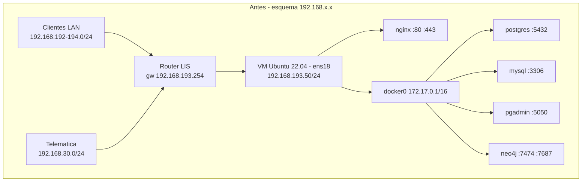
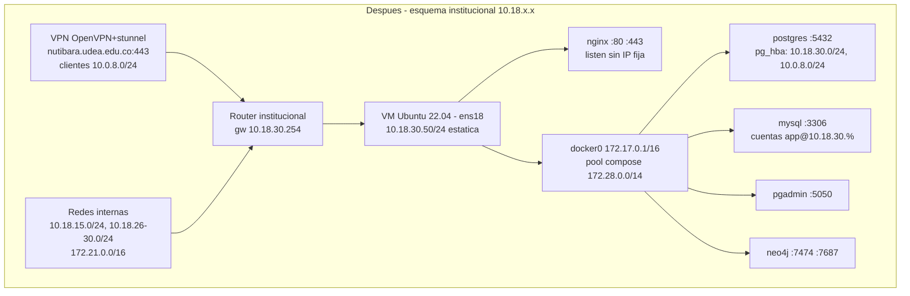

# Reto 4 — Informe de migración de red: 192.168.x.x → 10.18.30.x

Informe de investigación para la migración de una aplicación web del Laboratorio
Integrado de Sistemas (LIS) desde el direccionamiento privado antiguo
(192.168.x.x) hacia el nuevo direccionamiento institucional (10.18.30.x).

Para aterrizar la propuesta usamos como referencia el entorno real del
laboratorio, al que nos conectamos por la VPN institucional (OpenVPN sobre
stunnel contra `nutibara.udea.edu.co:443`). Lo que observamos allí:

| Elemento | Valor observado |
|---|---|
| Redes internas actuales | 10.18.15.0/24, 10.18.26.0/24 a 10.18.30.0/24, 172.21.0.0/16 |
| Redes antiguas del LIS | 192.168.192.0/24, 192.168.193.0/24, 192.168.194.0/24 |
| Red antigua de Telemática | 192.168.30.0/24 |
| Máquina tipo del lab | Ubuntu 22.04, interfaz `ens18`, 10.18.29.37/24 por DHCP |
| Gateway de la red destino | 10.18.30.254 |
| Docker en el host | `docker0` en 172.17.0.1/16; contenedores postgres, mysql, pgadmin, neo4j |

El escenario que asumimos es el típico del laboratorio: una VM Ubuntu 22.04
(la interfaz `ens18` delata virtio/KVM, muy probablemente Proxmox) que sirve
una aplicación web detrás de nginx, con el backend y las bases de datos en
contenedores Docker. La máquina vive hoy en una de las redes antiguas —
digamos `192.168.193.50/24` con gateway `192.168.193.254` — y debe quedar en
`10.18.30.50/24` con gateway `10.18.30.254`. Los valores concretos se ajustan
el día de la migración, pero el procedimiento es el mismo.

Tanto el rango antiguo como el nuevo son direccionamiento privado según
RFC 1918 (bloques 192.168.0.0/16 y 10.0.0.0/8), así que la migración no cambia
nada de cara a Internet: el impacto es interno, en todo lo que tenga la IP
vieja escrita en alguna parte.

---

## 1. Diagnóstico del entorno actual

Antes de tocar nada hay que levantar un inventario completo de cómo está la
máquina y qué cosas dependen de la IP actual. Todo el diagnóstico es de solo
lectura, se puede hacer sin ventana de mantenimiento y conviene guardar la
salida de cada comando en un archivo de evidencia (`comando | tee
diagnostico/comando.txt`) para comparar contra el estado posterior.

### 1.1 Direccionamiento e interfaz

```bash
ip addr show
ip -br addr          # resumen por interfaz
```

Qué buscar: el nombre de la interfaz física (`ens18` en las VMs del lab), la
IP con su prefijo (`192.168.193.50/24`), si la dirección es `dynamic` (DHCP) o
estática, y qué otras interfaces existen (`docker0` en 172.17.0.1/16, los
`veth*` de los contenedores, `br-*` si hay redes de compose). En la máquina
tipo que revisamos, `ens18` obtiene la dirección por DHCP; eso importa porque
si la nueva red también entrega DHCP con reservas por MAC, parte de la
migración se resuelve en el servidor DHCP y no en el host.

Cómo se configuró la red actual:

```bash
ls /etc/netplan/
cat /etc/netplan/*.yaml
```

Qué buscar: si el YAML dice `dhcp4: true` o si tiene `addresses`, `routes` y
`nameservers` fijos con valores 192.168.x.x. Ese archivo es el que vamos a
reemplazar (y respaldar antes).

### 1.2 Rutas y gateway

```bash
ip route
ip route get 8.8.8.8      # por dónde sale el tráfico a Internet
ip route get 10.18.29.37  # por dónde se alcanza otra máquina del lab
```

Qué buscar: la ruta `default via 192.168.193.254 dev ens18`, rutas estáticas
adicionales (por ejemplo hacia 192.168.192.0/24 o 192.168.30.0/24 vía otro
router), y las rutas que Docker instala solo (172.17.0.0/16 vía `docker0`).
Cualquier ruta estática hacia redes 192.168.x.x hay que anotarla: o desaparece
porque la red destino también migró, o hay que reescribirla contra el nuevo
gateway.

### 1.3 DNS

```bash
resolvectl status
resolvectl dns
cat /etc/resolv.conf      # en 22.04 apunta al stub 127.0.0.53
cat /etc/hosts
```

Qué buscar: qué servidores DNS está usando la interfaz (si vienen del DHCP o
están fijos en netplan), el dominio de búsqueda, y — muy importante — entradas
manuales en `/etc/hosts` que mapeen nombres a direcciones 192.168.x.x. El
`/etc/hosts` es un clásico: alguien lo editó hace dos años para un apuro y
nadie se acuerda.

También conviene resolver el nombre público de la aplicación y anotar el TTL:

```bash
dig app.lis.udea.edu.co A +noall +answer
```

Si el registro apunta a una IP que cambia con la migración, el TTL actual
define cuánto tarda el mundo en enterarse del cambio (ver sección 5).

### 1.4 Puertos y servicios en escucha

```bash
ss -tulpn
```

Qué buscar: cada línea dice protocolo, dirección local de escucha y proceso.
Interesan dos cosas. Primera, el inventario de puertos que la nueva red debe
permitir; en la máquina tipo del lab esperamos algo así:

| Puerto | Servicio | Escucha típica |
|---|---|---|
| 22/tcp | sshd | 0.0.0.0 |
| 80, 443/tcp | nginx | 0.0.0.0 |
| 5432/tcp | postgres (contenedor) | 0.0.0.0 vía docker-proxy |
| 3306/tcp | mysql (contenedor) | 0.0.0.0 vía docker-proxy |
| 5050/tcp | pgadmin (contenedor) | 0.0.0.0 vía docker-proxy |
| 7474, 7687/tcp | neo4j (contenedor) | 0.0.0.0 vía docker-proxy |

Segunda, y más delicada: si algún servicio escucha en una IP concreta
(`192.168.193.50:443` en vez de `0.0.0.0:443`), ese servicio dejará de
arrancar o de recibir tráfico cuando la IP desaparezca. Cada uno de esos hay
que rastrearlo hasta su archivo de configuración.

### 1.5 Búsqueda de dependencias con 192.168.x.x

Esta es la parte del diagnóstico que más sorpresas da. Buscamos la cadena
`192.168.` en todos los lugares donde puede estar escrita una IP:

```bash
# configuración del sistema y de servicios
grep -rn --exclude-dir={.git,node_modules} "192\.168\." /etc/ 2>/dev/null

# código y configuración de la aplicación
grep -rn --exclude-dir={.git,node_modules,dist,build} "192\.168\." /opt/app/ /var/www/ 2>/dev/null

# variables de entorno de la aplicación
grep -rn "192\.168\." /opt/app/.env* /opt/app/docker-compose*.yml 2>/dev/null

# unidades systemd propias y tareas programadas
grep -rn "192\.168\." /etc/systemd/system/ /etc/cron.d/ /var/spool/cron/ 2>/dev/null
crontab -l | grep "192\.168\."
```

En `/etc/` los sospechosos habituales son `nginx/sites-enabled/*` (directivas
`listen`, `allow`, `proxy_pass`, `upstream`), `hosts`, reglas de ufw en
`/etc/ufw/user.rules`, y exports NFS o configuración de monitoreo si existen.

Del lado de Docker:

```bash
docker ps -a
docker network ls
docker network inspect bridge $(docker network ls -q --filter type=custom)
docker inspect --format '{{.Name}} {{json .NetworkSettings.Networks}}' $(docker ps -aq)
docker inspect --format '{{.Name}} {{json .Config.Env}}' $(docker ps -aq) | grep -i "192\.168\|HOST\|URL"
```

Qué buscar: redes de Docker con subred en 192.168.x.x (Docker las asigna de
su pool por defecto, que incluye 192.168.0.0/16, así que pueden existir aunque
nadie las haya pedido), contenedores con `ipv4_address` fija, y variables de
entorno tipo `DATABASE_URL`, `API_URL` o `CORS_ORIGIN` con la IP vieja. Si los
contenedores se levantan con compose, revisar también los YAML fuente, que es
donde se corrige.

Dentro de las bases de datos:

```bash
# postgres: reglas de acceso por red
docker exec postgres cat /var/lib/postgresql/data/pg_hba.conf | grep -v "^#"
# mysql: a qué IP se ata y qué cuentas dependen de la red de origen
docker exec mysql mysql -uroot -p -e "SELECT @@bind_address; SELECT user, host FROM mysql.user WHERE host LIKE '192.168%';"
```

Qué buscar: en `pg_hba.conf`, líneas `host ... 192.168.193.0/24 ...` que dejan
de aceptar clientes cuando estos migren; en MySQL, cuentas creadas como
`'usuario'@'192.168.193.%'`, que son un GRANT atado a la red vieja y hay que
recrear.

Por último, el inverso: preguntarse quién nos apunta a nosotros. Otros
servicios del lab (monitoreo, backups, apps de otros semestres) pueden tener
`192.168.193.50` en su configuración. Eso no se ve desde esta máquina; se ve
en el registro de conexiones entrantes (`ss -tn state established`, logs de
nginx y de las BD) y preguntando a los administradores del laboratorio.

El resultado del diagnóstico es una tabla: cada aparición de 192.168.x.x, en
qué archivo/servicio está, quién la usa y cuál es su valor nuevo. Esa tabla es
la lista de tareas de la sección 2.

---

## 2. Propuesta de migración

### 2.1 Direccionamiento del host (netplan)

Proponemos dejar la IP estática, no por DHCP: es un servidor con servicios
publicados y reglas de firewall que dependen de su dirección. Si el
laboratorio prefiere DHCP con reserva por MAC (como opera hoy la máquina en
10.18.29.37), el cambio se coordina con quien administra el servidor DHCP y el
netplan queda en `dhcp4: true`; el resto del informe aplica igual.

Ubuntu 22.04 configura red con netplan. Nuevo archivo
`/etc/netplan/01-lis.yaml` (respaldando antes el existente):

```yaml
network:
  version: 2
  ethernets:
    ens18:
      dhcp4: false
      addresses:
        - 10.18.30.50/24
      routes:
        - to: default
          via: 10.18.30.254
      nameservers:
        addresses: [<DNS institucional 1>, <DNS institucional 2>]
        search: [udea.edu.co]
```

Los servidores DNS se toman de lo que hoy entrega el DHCP institucional
(`resolvectl dns` en la máquina en 10.18.29.x los muestra); no los inventamos
aquí. La sintaxis `routes: [{to: default, via: ...}]` es la forma actual de
declarar el gateway; la clave `gateway4` está deprecada.

Para aplicar sin quedarse por fuera de la máquina:

```bash
sudo cp /etc/netplan/*.yaml /root/respaldo-netplan/
sudo netplan try --timeout 120
```

`netplan try` aplica la configuración y la revierte solo si no confirmamos en
el tiempo dado. Aun así, como la IP cambia, la sesión SSH vieja se cae sí o
sí: la confirmación se hace desde la consola de la VM (Proxmox) o entrando de
nuevo por la IP nueva. Trabajar desde la consola de la VM durante este paso es
lo sensato.

Existe la opción de una transición con doble dirección (la vieja y la nueva a
la vez en `addresses`), que discutimos en la sección 5; para una sola VM con
ventana de mantenimiento preferimos el corte limpio.

### 2.2 Rutas

Con el gateway nuevo en la misma subred (10.18.30.254) la ruta por defecto
queda resuelta en el netplan. Las rutas estáticas del inventario (1.2) se
migran caso por caso: las que apuntaban a otras redes antiguas del lab
desaparecen si esas redes también migraron a 10.18.x.x y las alcanza el
gateway por defecto; si queda alguna red legada viva durante la transición, se
declara en netplan:

```yaml
      routes:
        - to: default
          via: 10.18.30.254
        - to: 192.168.192.0/24
          via: 10.18.30.254
```

(solo si el router del lab efectivamente enruta hacia allá; hay que
confirmarlo con los administradores). Los clientes de la VPN llegan desde
10.0.8.x, tráfico que enruta el concentrador y no requiere rutas locales
adicionales.

### 2.3 Firewall (ufw / iptables)

Si el host usa ufw, las reglas con origen 192.168.x.x quedan muertas tras la
migración: no bloquean por error, pero dejan por fuera a los clientes nuevos.
Se listan numeradas, se agregan las nuevas y luego se borran las viejas:

```bash
sudo ufw status numbered
sudo ufw allow from 10.18.0.0/16 to any port 22 proto tcp
sudo ufw allow from 10.18.0.0/16 to any port 443 proto tcp
sudo ufw allow from 10.0.8.0/24 to any port 443 proto tcp   # clientes VPN
sudo ufw delete <número de la regla con 192.168.x.x>
```

Usamos 10.18.0.0/16 como origen para cubrir todas las subredes internas
actuales (10.18.15, 10.18.26–30); si la política del lab es más restrictiva,
se enumeran las /24 concretas. Ojo con el orden: primero permitir lo nuevo,
después borrar lo viejo, y nunca tocar la regla de SSH sin tener consola
alternativa.

Advertencia conocida: los puertos publicados por Docker (`-p 5432:5432`)
esquivan a ufw, porque Docker inserta sus reglas DNAT en iptables antes de la
cadena de ufw. Si se necesita restringir el acceso a los puertos de las BD por
red de origen, las reglas van en la cadena `DOCKER-USER`:

```bash
sudo iptables -I DOCKER-USER -i ens18 ! -s 10.18.0.0/16 -p tcp --dport 5432 -j DROP
```

Cualquier regla equivalente que exista hoy con `-s 192.168.0.0/16` se
reescribe. Y si hay reglas persistidas (`iptables-save` en
`/etc/iptables/rules.v4` o similar), se actualizan ahí también, no solo en
memoria.

### 2.4 NAT

En el host el único NAT es el de Docker (MASQUERADE de 172.17.0.0/16 hacia
`ens18`), que Docker regenera solo al reiniciar el demonio; no requiere
cambios porque las redes internas de contenedores no se tocan.

El NAT que sí hay que revisar está en el borde: si el router del laboratorio
tenía reglas DNAT (port-forwarding) publicando `192.168.193.50:443` hacia
afuera, esa regla debe reescribirse hacia `10.18.30.50:443` en el equipo nuevo
que atienda la red 10.18.30.0/24. Eso es tarea del administrador de red del
LIS y va en el plan de la sección 3 como dependencia externa: sin ese cambio,
la app queda sana pero inalcanzable desde fuera.

### 2.5 Reverse proxy (nginx)

Del inventario de 1.5 salen los archivos de `/etc/nginx/sites-enabled/` a
tocar. Los casos concretos:

```nginx
# antes
server {
    listen 192.168.193.50:443 ssl;
    server_name app.lis.udea.edu.co;
    allow 192.168.192.0/24;
    allow 192.168.193.0/24;
    deny all;
    location /api/ { proxy_pass http://127.0.0.1:8000; }
}

# después
server {
    listen 443 ssl;
    server_name app.lis.udea.edu.co;
    allow 10.18.0.0/16;
    allow 10.0.8.0/24;
    deny all;
    location /api/ { proxy_pass http://127.0.0.1:8000; }
}
```

La lección de fondo: `listen` sin IP (solo puerto) hace que nginx escuche en
todas las direcciones y sobreviva a futuros cambios de IP. Los `proxy_pass`
hacia contenedores conviene dejarlos contra `127.0.0.1:puerto` o contra el
nombre del servicio si nginx corre también en Docker; nunca contra la IP del
host. Validar y recargar sin cortar conexiones:

```bash
sudo nginx -t && sudo systemctl reload nginx
```

### 2.6 Certificados TLS

Si el certificado está emitido para el nombre DNS (`app.lis.udea.edu.co`), el
cambio de IP no lo afecta: TLS valida nombres, no direcciones. Hay dos
excepciones que revisar en el diagnóstico:

```bash
openssl x509 -in /etc/ssl/certs/app.pem -noout -text | grep -A1 "Subject Alternative Name"
```

Primera: certificados con la IP vieja como SAN (práctica que a veces aparece
en entornos internos); hay que reemitirlos con el nombre o con la IP nueva.
Segunda: si el certificado es de Let's Encrypt con validación HTTP-01, la
renovación exige que `app.lis.udea.edu.co` resuelva ya a donde el tráfico del
puerto 80 llegue a esta máquina; es decir, el registro DNS y el DNAT del borde
deben estar actualizados antes de la próxima renovación (certbot renueva solo,
con margen de 30 días, así que no es urgente el día D pero sí esa semana).
Prueba en frío: `sudo certbot renew --dry-run`.

### 2.7 CORS y orígenes permitidos

Si el frontend se sirve y consume la API por nombre de dominio, CORS no
cambia. El problema aparece cuando los orígenes permitidos del backend
contienen IPs:

```
# .env — antes
CORS_ORIGINS=http://192.168.193.50,http://192.168.193.50:3000
# después
CORS_ORIGINS=https://app.lis.udea.edu.co,http://10.18.30.50:3000
```

Recomendamos aprovechar la migración para dejar solo nombres en los orígenes
y en las URLs que el frontend tiene compiladas (`VITE_API_URL` o equivalente:
si el build del frontend lleva la IP vieja incrustada, hay que reconstruirlo).
El navegador compara el origen textualmente, así que `http://IP` y
`https://nombre` son orígenes distintos aunque apunten al mismo servidor.

### 2.8 Variables de entorno

Todas las apariciones de 192.168.x.x encontradas en `.env`,
`docker-compose.yml` (sección `environment`), unidades systemd
(`Environment=`) y perfiles de shell se reescriben. Regla práctica: donde la
IP vieja era "la IP de esta misma máquina", el valor nuevo debería ser
`localhost`, el nombre DNS o el nombre de servicio de compose, no la IP nueva;
así la próxima migración no repite este trabajo. Tras cambiar variables:
`docker compose up -d` recrea los contenedores afectados y
`sudo systemctl daemon-reload && sudo systemctl restart <servicio>` recarga
las unidades.

### 2.9 Bases de datos

PostgreSQL. `listen_addresses` en la imagen oficial ya es `*`, así que el
punto crítico es `pg_hba.conf`: las líneas que autorizaban la red vieja se
reemplazan por la nueva y se recarga la configuración (no hace falta
reiniciar):

```
# antes
host    all    all    192.168.193.0/24    scram-sha-256
# después
host    all    all    10.18.30.0/24       scram-sha-256
host    all    all    10.0.8.0/24         scram-sha-256
```

```bash
docker exec postgres psql -U postgres -c "SELECT pg_reload_conf();"
```

Si solo se conecta el backend local (misma máquina o red Docker interna), lo
correcto es cerrar `pg_hba.conf` a `172.17.0.0/16` y no exponer el 5432 a la
LAN en absoluto.

MySQL. Verificar `bind_address` (si estaba atado a `192.168.193.50` el
servidor no arranca escuchando donde debe; en contenedor casi siempre es `*` y
no hay que tocarlo) y, sobre todo, las cuentas: en MySQL el host forma parte
de la identidad de la cuenta, así que `'app'@'192.168.193.%'` no es editable,
se crea la nueva y se elimina la vieja:

```sql
CREATE USER 'app'@'10.18.30.%' IDENTIFIED BY '...';
GRANT ... ON app.* TO 'app'@'10.18.30.%';
DROP USER 'app'@'192.168.193.%';
```

Neo4j. Confirmar que `server.default_listen_address` sea `0.0.0.0` (es lo
usual en la imagen oficial) y revisar en la app las URIs `bolt://` que
contengan la IP vieja.

pgAdmin. Sus "server definitions" guardadas pueden apuntar a la IP vieja del
host; se corrigen en la interfaz o se apunta al nombre del servicio de compose.

### 2.10 Docker y contenedores

Las redes internas de Docker no necesitan cambiar: `docker0` en 172.17.0.0/16
no choca ni con el esquema viejo ni con el nuevo. Lo que sí encontramos son
tres puntos de atención:

Primero, redes de compose con subred fija en 192.168.x.x (`ipam` con
`subnet: 192.168.100.0/24`, por ejemplo). Funcionarían igual tras la
migración, pero conviene moverlas fuera de 192.168 para que un `grep` futuro
de "192.168" dé limpio y porque el pool por defecto de Docker también reparte
192.168.0.0/16, fuente clásica de colisiones.

Segundo, y más serio: el laboratorio usa 172.21.0.0/16 como red interna real,
y ese bloque está dentro del pool por defecto de Docker (que asigna subredes
en 172.17–172.31). Si Docker llega a crear una red de compose en 172.21.x.x,
la máquina pierde conectividad con esa red del lab (la ruta local le gana a la
del gateway). Proponemos fijar el pool en `/etc/docker/daemon.json` a un rango
sin conflicto:

```json
{
  "default-address-pools": [
    { "base": "172.28.0.0/14", "size": 24 }
  ]
}
```

seguido de `sudo systemctl restart docker` (dentro de la ventana: reinicia
todos los contenedores). 172.28.0.0/14 cubre 172.28–172.31 y no pisa ni
172.21.0.0/16 ni 10.18.0.0/16.

Tercero, contenedores con `ipv4_address` fija dentro de redes de compose:
mientras esas IPs sean de redes internas de Docker no les afecta la migración,
pero si alguna configuración externa (nginx del host, monitoreo) apunta
directo a la IP de un contenedor, eso se cambia a puerto publicado en
localhost o a nombre de servicio, porque las IPs de contenedor no son
estables entre recreaciones salvo que se fijen, y fijarlas es justo el tipo de
acople que esta migración enseña a evitar.

### 2.11 Diagrama antes / después





---

## 3. Plan de ejecución y reversión

### 3.1 Prerrequisitos y coordinación

Antes de agendar la ventana deben estar confirmados con el administrador de
red del LIS: (a) la IP asignada en 10.18.30.0/24 y que esté libre
(`ping` y `arping` desde otra máquina de la red), (b) que el gateway
10.18.30.254 enruta hacia las redes que la app necesita, (c) el cambio del
DNAT del borde si existe, y (d) la actualización del registro DNS. Si el DNS
lo administran ellos, pedir con una semana de antelación que bajen el TTL del
registro a 300 segundos (ver 5).

### 3.2 Respaldos previos

En orden de importancia:

1. Snapshot de la VM en el hipervisor. Es el rollback total y tarda segundos
   en Proxmox; sin esto no empezamos.
2. Dumps de las bases de datos, por si el rollback de la VM llegara a pisar
   transacciones de último minuto:
   ```bash
   docker exec postgres pg_dumpall -U postgres > respaldo/pg_$(date +%F).sql
   docker exec mysql mysqldump -uroot -p --all-databases > respaldo/mysql_$(date +%F).sql
   ```
3. Copias de la configuración que vamos a editar:
   ```bash
   mkdir -p /root/respaldo-migracion
   cp -a /etc/netplan /etc/nginx /etc/hosts /etc/docker/daemon.json /root/respaldo-migracion/ 2>/dev/null
   sudo ufw status numbered > /root/respaldo-migracion/ufw.txt
   sudo iptables-save > /root/respaldo-migracion/iptables.txt
   docker exec postgres cat /var/lib/postgresql/data/pg_hba.conf > /root/respaldo-migracion/pg_hba.conf
   cp -a /opt/app/.env /opt/app/docker-compose.yml /root/respaldo-migracion/
   ```
4. La evidencia del diagnóstico de la sección 1, que sirve de línea base para
   comparar.

### 3.3 Ventana de mantenimiento

Proponemos una ventana de 2 horas en horario de baja actividad del laboratorio
(entre semana 6:00–8:00 o sábado en la mañana), con el trabajo real estimado
en 45–60 minutos y el resto de margen para validación y rollback. Se anuncia a
los usuarios del lab con al menos dos días, indicando hora de inicio, duración
y que las sesiones activas se perderán.

### 3.4 Orden de ejecución

El orden busca que cada paso deje el sistema en un estado verificable y que lo
irreversible (el cambio de IP) ocurra con todo lo demás ya preparado:

1. T-7 días: bajar TTL del DNS a 300 s. Confirmar prerrequisitos de 3.1.
2. T-1 día: repetir el `grep` del diagnóstico por si apareció algo nuevo.
   Preparar los archivos nuevos (netplan, nginx, .env, compose, daemon.json)
   en `/root/migracion-pendiente/`, sin aplicar.
3. Inicio de ventana: aviso de cierre, snapshot de la VM, dumps y copias
   (3.2). Detener la aplicación (no las BD todavía) para drenar sesiones.
4. Aplicar cambios que no dependen de la IP: pg_hba.conf + recarga, cuentas
   MySQL nuevas (sin borrar las viejas aún), nginx (`nginx -t` sin recargar),
   .env y compose editados, daemon.json.
5. Cambio de IP desde la consola de la VM: copiar el netplan nuevo,
   `netplan try --timeout 120`, confirmar. Verificar `ip addr` e `ip route`.
6. Firewall: agregar reglas nuevas de ufw/iptables, borrar las viejas.
7. Reiniciar Docker (aplica daemon.json) y levantar el stack:
   `docker compose up -d`. Recargar nginx.
8. Ejecutar la validación de la sección 4 (script `validar-migracion.sh`).
9. Avisar al administrador de red para que aplique DNAT y DNS nuevos, si no
   están. Validar desde fuera (otra máquina del lab y un cliente VPN).
10. Si todo pasa: borrar cuentas MySQL viejas, cerrar ventana, anunciar.
    Dejar el snapshot vivo 72 horas antes de eliminarlo.
11. T+7 días: restaurar el TTL del DNS a su valor normal y borrar de los
    respaldos locales cualquier credencial copiada.

### 3.5 Criterio de éxito

La migración se declara exitosa cuando: la VM responde en 10.18.30.50 con su
gateway y DNS correctos; la aplicación completa (frontend, API, las cuatro
BD) funciona accedida desde una máquina de la red 10.18.x.x y desde un cliente
VPN 10.0.8.x; el login y una operación de escritura en BD funcionan de punta a
punta; y no queda ningún servicio escuchando o apuntando a 192.168.x.x. Todo
eso lo cubre el checklist de la sección 4. Si a los 60 minutos de iniciada la
ejecución no se cumple el criterio y no hay causa identificada con arreglo a
la vista, se activa el rollback: es preferible repetir la ventana otro día que
alargar la degradación.

### 3.6 Rollback paso a paso

Caso A — falló el cambio de red (paso 5–6) y la máquina quedó inalcanzable o
sin salida:

1. Entrar por la consola del hipervisor (no depende de la red).
2. Restaurar netplan: `cp /root/respaldo-migracion/netplan/*.yaml
   /etc/netplan/ && netplan apply` (borrando antes el YAML nuevo).
3. Restaurar firewall: `iptables-restore < /root/respaldo-migracion/iptables.txt`
   y revisar `ufw status` contra `ufw.txt`.
4. Verificar `ip addr`, `ip route`, ping al gateway viejo y acceso SSH.

Caso B — la red quedó bien pero la aplicación no levanta (paso 7–8):

1. No revertir la red. Diagnosticar con `docker compose logs` y el checklist.
2. Si la causa es una config editada, restaurar el archivo puntual desde
   `/root/respaldo-migracion/` y recargar el servicio afectado.
3. Si en 30 minutos no hay causa clara, rollback completo: caso C.

Caso C — rollback total:

1. Apagar la VM y restaurar el snapshot desde el hipervisor.
2. Arrancar y verificar que la app funciona como antes de la ventana (misma
   línea base del diagnóstico).
3. Pedir la reversión del DNAT/DNS si ya se habían cambiado.
4. Documentar la causa del fallo antes de agendar el reintento.

El snapshot restaura también las BD al estado del inicio de la ventana; como
la app estuvo detenida durante toda la ventana, no se pierden datos. Si por
alguna razón hubo escrituras, los dumps del paso 3.2 permiten recuperarlas.

---

## 4. Validación posterior

Checklist en el orden en que conviene correrlo (de la capa de red hacia la
aplicación). El script `validar-migracion.sh` adjunto automatiza los puntos
marcados con (s).

Capa de red, en el host:

- [ ] (s) `ip -br addr show ens18` muestra 10.18.30.50/24 y estado UP, y no
      aparece ninguna dirección 192.168.x.x en `ip addr`.
- [ ] (s) `ip route` tiene `default via 10.18.30.254 dev ens18` y ninguna ruta
      hacia 192.168.x.x.
- [ ] (s) `ping -c 3 10.18.30.254` responde (gateway alcanzable).
- [ ] (s) `ping -c 3 10.18.29.37` responde (otra subred interna: el enrutado
      entre redes 10.18.x funciona).
- [ ] `traceroute 8.8.8.8` sale por 10.18.30.254 como primer salto y llega;
      `traceroute 10.18.15.1` no se desvía por rutas viejas.

DNS:

- [ ] (s) `resolvectl status` muestra los DNS institucionales en ens18.
- [ ] (s) `dig app.lis.udea.edu.co +short` resuelve, y a la IP correcta si el
      registro cambió.
- [ ] `dig -x 10.18.30.50 +short` devuelve el nombre esperado, si el lab
      mantiene zona inversa.

Servicios en el host:

- [ ] (s) `ss -tulpn` muestra sshd, nginx y los docker-proxy de 5432, 3306,
      5050, 7474/7687 en escucha, y ninguna línea con dirección local
      192.168.x.x.
- [ ] (s) `docker ps` muestra los cuatro contenedores Up (y healthy los que
      tengan healthcheck).
- [ ] (s) `curl -fsS -o /dev/null -w '%{http_code}' http://127.0.0.1/` retorna
      200 o 301 (nginx vivo).
- [ ] (s) `curl -fsSk -o /dev/null -w '%{http_code}' https://10.18.30.50/`
      retorna 200 (vhost y certificado cargan en la IP nueva).
- [ ] `curl -fsS https://app.lis.udea.edu.co/api/health` retorna el JSON de
      salud del backend (prueba de punta a punta con TLS y nombre).
- [ ] (s) Conexión real a cada BD:
      `docker exec postgres pg_isready -U postgres`,
      `docker exec mysql mysqladmin -uroot -p<...> ping`,
      `curl -fsS http://127.0.0.1:7474` (neo4j),
      `curl -fsS -o /dev/null http://127.0.0.1:5050` (pgadmin).

Desde un cliente externo (una máquina en 10.18.x.x y un cliente VPN en
10.0.8.x — validar desde ambos):

- [ ] `ping -c 3 10.18.30.50` responde.
- [ ] `nmap -Pn -p 22,80,443,5432,3306,5050,7474 10.18.30.50` muestra open
      exactamente en los puertos previstos y closed/filtered en el resto; si
      5432/3306 deben quedar restringidos por DOCKER-USER, deben verse
      filtered desde una red no autorizada.
- [ ] `curl -v https://app.lis.udea.edu.co/` completa el handshake TLS sin
      advertencias y carga el frontend.
- [ ] Flujo funcional completo en el navegador: login, una consulta que lea de
      BD y una operación que escriba.

Limpieza (confirmación de que no quedó nada del esquema viejo):

- [ ] (s) `grep -rn "192\.168\." /etc/nginx /etc/netplan /etc/hosts /opt/app`
      no devuelve resultados (o solo comentarios justificados).
- [ ] (s) `docker network inspect` de todas las redes no muestra subredes
      192.168.x.x ni 172.21.x.x.
- [ ] `docker exec postgres cat .../pg_hba.conf | grep 192.168` vacío; en
      MySQL, `SELECT user,host FROM mysql.user WHERE host LIKE '192.168%'`
      vacío.

Cualquier ítem que falle detiene el cierre de la ventana y se evalúa contra
los casos de rollback de 3.6.

---

## 5. Riesgos y puntos críticos

Caché y TTL de DNS. Si el nombre de la app cambia de IP, los clientes siguen
resolviendo la vieja hasta que expire el TTL, y a eso se suman las cachés
locales: systemd-resolved en los clientes Linux (`resolvectl flush-caches`),
la caché del navegador y la de resolvers intermedios. Por eso el plan baja el
TTL a 300 s una semana antes: acota la ventana de incoherencia a 5 minutos.
El riesgo residual son resolvers que ignoran TTLs bajos; se mitiga manteniendo
un aviso visible y, si fuera crítico, con el doble stack temporal.

IPs hardcodeadas en código. Es el riesgo más probable y el más difícil de
agotar: una IP incrustada en un build de frontend, en un script de cron, en la
configuración guardada de pgAdmin o en la base de datos misma (URLs absolutas
en contenido). El `grep` del diagnóstico cubre archivos, pero no binarios ni
datos; por eso la validación incluye el flujo funcional completo, que es donde
estas cosas revientan. Mitigación de fondo: la política de la sección 2.8
(nombres y localhost en lugar de IPs) para que la superficie del problema se
reduzca con cada cambio.

Gateway o máscara incorrectos. Un error de tipeo en el netplan (gateway fuera
de la subred, /16 en vez de /24) produce síntomas confusos: la máquina alcanza
su propia subred pero no sale, o alcanza de más y rompe el enrutado hacia
172.21.0.0/16. Mitigación: `netplan try` con timeout, trabajar desde la
consola de la VM y validar con `ip route get` contra destinos concretos antes
de continuar.

Dependencias internas de terceros. Otros sistemas del laboratorio que apuntan
a la IP vieja (monitoreo, respaldos, apps de otros grupos) fallan en silencio
después de la migración, porque no son parte de nuestra validación. Se mitiga
con el aviso previo, revisando quién se conectaba (logs y `ss` del
diagnóstico) y dejando registrado el cambio para que los responsables de esos
sistemas actualicen su lado.

Contenedores y redes Docker. Dos vertientes: contenedores con IP fija o
referenciados por su IP interna (frágil ante recreaciones, sección 2.10), y la
colisión del pool por defecto de Docker con redes reales — con 192.168.0.0/16
en el esquema viejo y con 172.21.0.0/16 en el actual. Esta última existe hoy
mismo, con o sin migración, y es el motivo de fijar `default-address-pools`.
El reinicio del demonio para aplicarla tumba todos los contenedores, así que
solo dentro de la ventana.

Sesiones activas. Al cambiar la IP se cortan las conexiones TCP establecidas:
sesiones SSH, transacciones de BD en curso, websockets del frontend. Se
mitiga deteniendo la aplicación al inicio de la ventana (drenaje ordenado, las
BD hacen checkpoint al parar los contenedores) y no confiando en que "nadie
está usando esto un sábado".

Doble stack temporal. Netplan permite dejar ambas direcciones en la interfaz
(`addresses: [10.18.30.50/24, 192.168.193.50/24]`) durante una transición,
útil si hay muchos clientes legados que no se pueden actualizar a la vez. Lo
consideramos y lo descartamos como opción por defecto: exige que la red física
siga transportando ambas subredes en el mismo segmento, solo puede haber una
ruta por defecto (las respuestas hacia la red vieja pueden salir asimétricas
por el gateway nuevo), duplica las reglas de firewall y, sobre todo, alarga la
vida de las referencias viejas que la migración quiere extinguir. Si el
administrador de red confirma que el segmento lo soporta, es una red de
seguridad válida por unos días, con fecha de retiro explícita.

Pérdida de acceso remoto durante el cambio. Riesgo operativo puro: el paso 5
corta el SSH sí o sí. Toda la sección de red se ejecuta desde la consola del
hipervisor; nunca desde una sesión SSH sobre la IP que se está cambiando.

---

## 6. Referencias

Todas las URLs fueron verificadas el 9 de agosto de 2026. Cada referencia se
lista junto a la decisión técnica que soporta.

1. Netplan — YAML configuration reference.
   <https://netplan.readthedocs.io/en/stable/netplan-yaml/>
   Sintaxis de `addresses`, `routes` (ruta por defecto en reemplazo de
   `gateway4` deprecado) y `nameservers` usada en la configuración de 2.1
   y 2.2.

2. PostgreSQL 16 — The pg_hba.conf File.
   <https://www.postgresql.org/docs/16/auth-pg-hba-conf.html>
   Formato de las reglas `host` con CIDR y métodos de autenticación; base del
   cambio de reglas de acceso en 2.9 y de su recarga con `pg_reload_conf()`.

3. MySQL 8.0 Reference Manual — Server System Variables (bind_address).
   <https://dev.mysql.com/doc/refman/8.0/en/server-system-variables.html>
   Comportamiento de `bind_address` (no dinámica, valor `*` por defecto) que
   determina la verificación de 2.9; la identidad usuario@host de las cuentas
   justifica recrear los GRANTs en lugar de editarlos.

4. nginx — Module ngx_http_proxy_module.
   <https://nginx.org/en/docs/http/ngx_http_proxy_module.html>
   Directivas `proxy_pass` y `proxy_set_header` de la configuración de 2.5 y
   la recomendación de apuntar upstreams a localhost/nombres.

5. Docker Docs — Networking overview.
   <https://docs.docker.com/engine/network/>
   Pools de direcciones por defecto de Docker (172.17.0.0/16 …,
   192.168.0.0/16), fundamento del riesgo de colisión con 172.21.0.0/16 y del
   ajuste de `default-address-pools` en 2.10.

6. Docker Docs — Compose file reference: networks (ipam).
   <https://docs.docker.com/reference/compose-file/networks/>
   Sintaxis `ipam`/`subnet` con la que se detectan y corrigen redes de compose
   con subredes fijas en 192.168.x.x (2.10).

7. RFC 1918 — Address Allocation for Private Internets.
   <https://datatracker.ietf.org/doc/html/rfc1918>
   Define los bloques 10.0.0.0/8 y 192.168.0.0/16; sustenta que la migración
   es entre rangos privados y no tiene efectos hacia Internet.

8. Ubuntu Manpage (jammy) — ufw(8).
   <https://manpages.ubuntu.com/manpages/jammy/man8/ufw.8.html>
   Sintaxis `allow from <subred>` y borrado de reglas por número usada en 2.3.

9. Ubuntu Manpage (jammy) — resolvectl(1).
   <https://manpages.ubuntu.com/manpages/jammy/man1/resolvectl.1.html>
   Subcomandos `status`, `dns` y `flush-caches` usados en el diagnóstico
   (1.3), la validación (4) y la mitigación de caché DNS (5).

10. Certbot — User Guide.
    <https://eff-certbot.readthedocs.io/en/stable/using.html>
    Renovación automática, plugin de nginx y `renew --dry-run`; sustenta el
    análisis de certificados de 2.6.

11. MDN Web Docs — Cross-Origin Resource Sharing (CORS).
    <https://developer.mozilla.org/en-US/docs/Web/HTTP/Guides/CORS>
    Semántica de `Access-Control-Allow-Origin` y comparación textual de
    orígenes que fundamenta los cambios de 2.7.

12. Nmap — Reference Guide.
    <https://nmap.org/book/man.html>
    Opciones de escaneo usadas en la validación externa de puertos (sección 4).
